## The scene

It is the day before Black Friday. The marketing team walks in.

> *"Tomorrow at 9 a.m. we drop BLACKFRI100. It gives 100 percent off our flagship product. Only the first 1,000 people can use it. We expect 10,000 users to click the redeem button in the same second."*
>
> *"Also, we are mailing a unique code to each of our 200,000 newsletter subscribers. Each one can be used only once. Each expires in 30 days. Build it today."*

They smile. The CTO looks at you.

This looks like a simple save-data-to-a-table problem. It is not. The hard parts are:

- How do you give the code to exactly the first 1,000 people? No more, no less.
- How do you stop the same person from using the same code 50 times in a row?
- What if your cache server crashes mid-redemption? Do two people get the last slot?
- What if someone figures out your code pattern and guesses them all?

Most people jump to: "Make a table. Mark each code used." That works when one person uses one code at a time. It breaks when 10,000 people show up in the same millisecond.

A good design names the race condition first, then fixes it.

We will start with the smallest version that works. Then we add one pressure at a time.

---

## Step 1: Picture one redemption

Before any boxes, picture what one redemption **is**. Alice has a code. She submits it. The system decides.

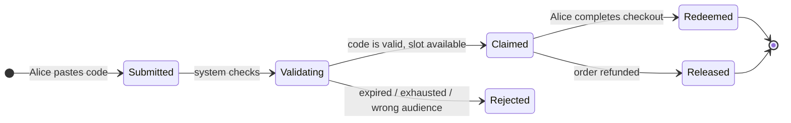

That is the whole product in one picture. Everything we add later (burst handling, fraud, multi-region) is a complication on top of this.

> **Take this with you.** A coupon system is a state machine with one nasty edge: two people hitting the last slot at the same instant. The whole architecture exists to resolve that race correctly.

---

## Step 2: Ask the right questions

Sit for two minutes before you draw anything. Write down what you need to know. Not twenty questions. Five good ones.

<details markdown="1">
<summary><b>Show: 5 questions that change the design</b></summary>

1. **Single-use or reusable?** Does each code work once (like a gift card)? Or does each code work many times up to a cap (like a public promo SAVE10)? *This is the biggest design fork. Single-use is one row, one redeem, done. Reusable means a counter and a per-user dedup check.*

2. **Which code patterns does the system need?** One shared code everyone types? One unique code per user mailed individually? Or a pre-generated pool where the first 1,000 to click each get one? *Three different storage shapes. You need to know before you draw the table.*

3. **Can codes be combined?** SAVE10 in the cart plus FREESHIP. Do percentages add up (10 + 50 = 60 percent) or multiply (1 - 0.10) × (1 - 0.50) = 55 percent)? *Stacking rules change the validate API.*

4. **What happens on refund?** Customer used BLACKFRI100. They cancel the order. Does the code go back into the pool? *Saying yes opens a new race. This is where many designs quietly break.*

5. **What abuse should we expect?** One person guessing every code? Codes shared on a deal forum? Bots scraping every possible combination? *Each one needs a different defense.*

A strong candidate also asks: *"Does the cart page show 'this code works' before checkout, or only at checkout?"* If yes, you need a separate validate endpoint. Good for UX. Risky because it leaks information to scrapers.

</details>

---

## Step 3: How big is this thing?

Two very different moments in the same day.

| Moment | Requests/sec | What is hot | The hard problem |
|--------|-------------|-------------|-----------------|
| **Steady state** | ~5 redeem, ~25 validate | Many campaigns, all warm | Cache hit rate |
| **Launch burst** | **10,000 in 1 second** | One campaign, one counter | Correct winner count |

<details markdown="1">
<summary><b>Show: how the numbers come out</b></summary>

**Launch burst.** 10,000 requests in 1 second = 10,000 QPS spike. It lasts seconds, not hours. Every single request needs a correct answer: 1,000 win, 9,000 lose, nobody gets two.

**Steady QPS.** 50,000 redemptions per day ÷ 86,400 seconds ≈ 0.6 per second. At peak hours maybe 5 per second. Validate runs about 5 times per redeem (users paste, bounce, come back), so steady validate QPS is roughly 3 per second.

**Storage.** 200 million codes × 200 bytes each ≈ 40 GB. Redemption log over 5 years ≈ 9 GB. Total around 50 GB. One Postgres instance.

**Hot working set during the launch.** One campaign. One counter. Maybe 100 KB of actively hot data.

**What the math tells you.** The system is small. Throughput is not the problem. Storage is not the problem. The architecture exists for two reasons only:

1. Surviving the 10,000 QPS burst on one hot key correctly.
2. Stopping abuse (brute force, leaked codes).

</details>

> **Take this with you.** Build for the burst, not the average. The 9,000 losers who need a fast "sold out" response are the design pressure, not the 1,000 winners.

---

## Step 4: The smallest thing that works

Forget the burst. We have 10 users. One campaign: WELCOME20, 20 percent off, unlimited. One table, one unique index.

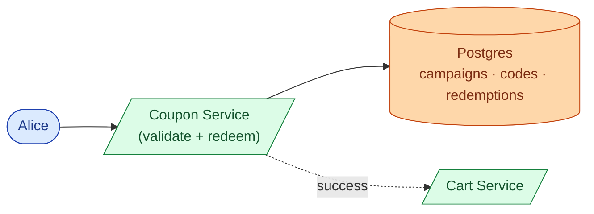

The end-to-end happy path.

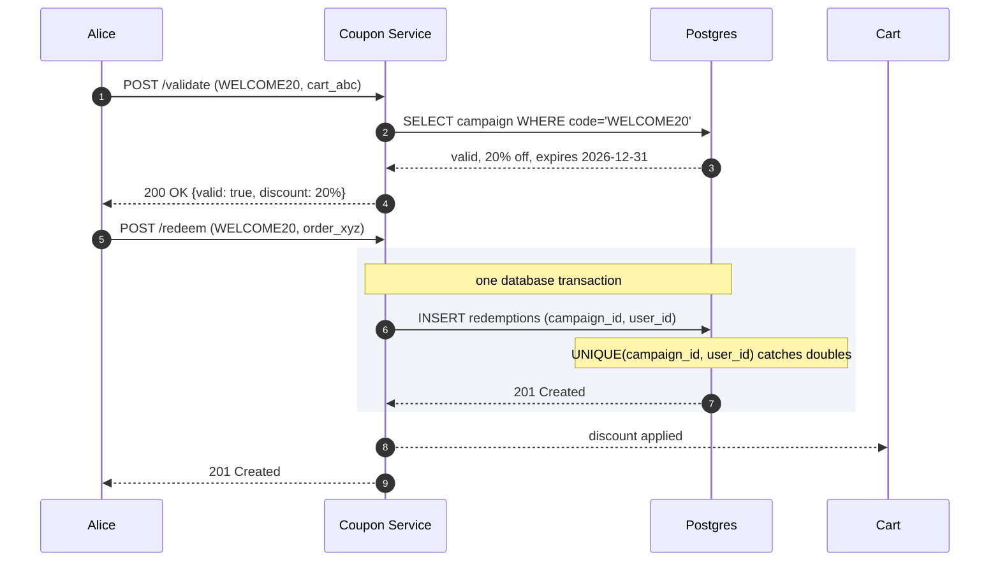

<details markdown="1">
<summary><b>Show: the three tables at this stage</b></summary>

```sql
CREATE TABLE campaigns (
    campaign_id   UUID PRIMARY KEY,
    code          TEXT UNIQUE NOT NULL,
    discount      JSONB NOT NULL,
    starts_at     TIMESTAMPTZ NOT NULL,
    ends_at       TIMESTAMPTZ NOT NULL,
    total_limit   INT,
    per_user_limit INT NOT NULL DEFAULT 1
);

CREATE TABLE redemptions (
    redemption_id UUID PRIMARY KEY,
    campaign_id   UUID NOT NULL REFERENCES campaigns,
    user_id       TEXT NOT NULL,
    order_id      TEXT NOT NULL,
    redeemed_at   TIMESTAMPTZ NOT NULL DEFAULT NOW()
);
CREATE UNIQUE INDEX idx_redemption_once
    ON redemptions (campaign_id, user_id);
```

The `UNIQUE(campaign_id, user_id)` index is load-bearing. Two browser tabs, two retries, a race: the database serializes them. First insert wins. Second fails with a unique-violation. The API returns 409. No special code required.

</details>

> **Take this with you.** The `UNIQUE(campaign_id, user_id)` index is the correctness story. Every layer we add later is performance on top of that guarantee.

---

## Step 5: The first crack

A marketing manager walks in: *"Can you run BLACKFRI100? 1,000 codes, gone when they're gone. We expect 10,000 attempts in the first second."*

You look at your code. `FOR UPDATE` on the campaign row. Every one of those 10,000 requests queues behind the same lock. The first request finishes in 5 ms. The 10,000th waits nearly a minute. Most time out.

This is the trap. **Stop serializing at the database row. Serialize in memory.**

The fix is a Redis Lua script that runs the "check and claim" atomically on a counter that lives entirely in Redis.

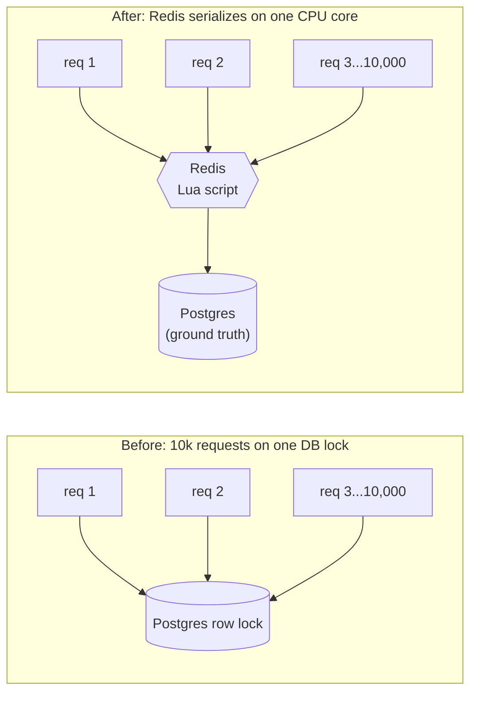

Redis is single-threaded. A Lua script inside Redis is atomic. All 10,000 requests still serialize, but they serialize on a sub-millisecond in-memory operation, not a 5 ms disk write under lock contention.

<details markdown="1">
<summary><b>Show: the Lua script</b></summary>

```lua
-- KEYS[1] = "campaign:{cid}:remaining"
-- KEYS[2] = "campaign:{cid}:users"
-- ARGV[1] = user_id

local remaining = tonumber(redis.call('GET', KEYS[1]))
if remaining == nil or remaining <= 0 then
  return {'err', 'exhausted'}
end
local already = redis.call('SISMEMBER', KEYS[2], ARGV[1])
if already == 1 then
  return {'err', 'already_redeemed'}
end
redis.call('DECR', KEYS[1])
redis.call('SADD', KEYS[2], ARGV[1])
return {'ok', 'claimed'}
```

Why a Lua script and not two separate Redis commands (GET then DECR)? Because two separate commands have a gap between them. In that gap, 1,000 other users can also GET and see the code is available. Then all 1,000 try to DECR. With a Lua script, the check and claim happen as one indivisible step. Only one wins each slot.

</details>

> **Take this with you.** Redis Lua for speed, Postgres for truth. The Lua script handles the burst in memory. The unique index in Postgres is the backstop that catches anything Redis misses.

---

## Step 6: Build the architecture, one layer at a time

We have the atomic claim. Now build the system around it.

### v1: just the service and the database

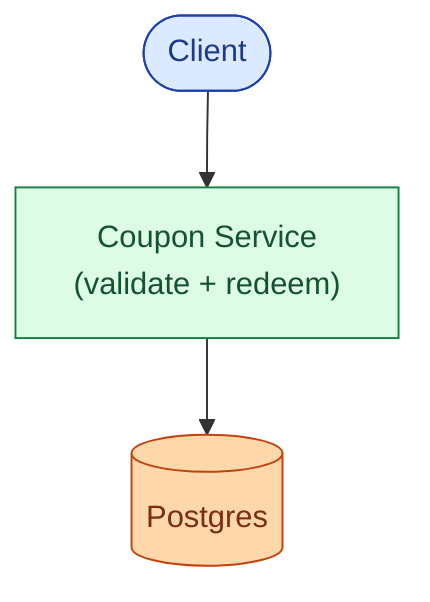

Fine for ten users and no bursts.

### v2: add the burst layer

The hot campaign counter lives in Redis. Lua handles the claim. Postgres is written to after Redis confirms.

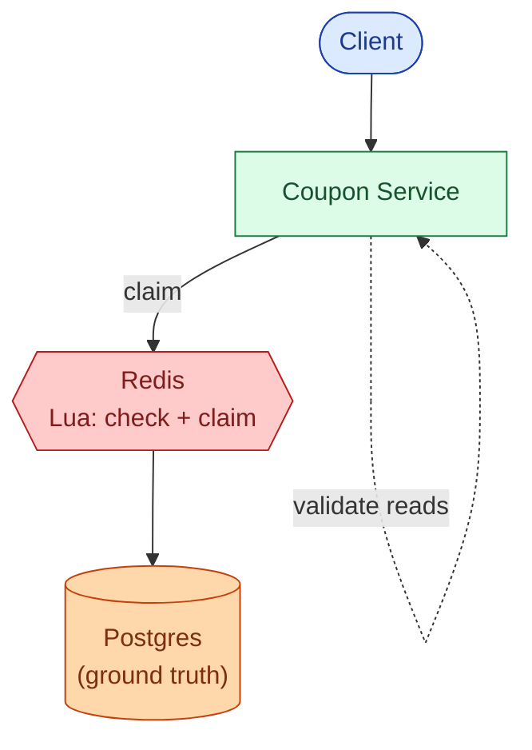

### v3: add the read path and abuse layer

Validate runs 5× more often than redeem. Cache campaign metadata. Put a Bloom filter in front to stop brute-force traffic before it touches the DB.

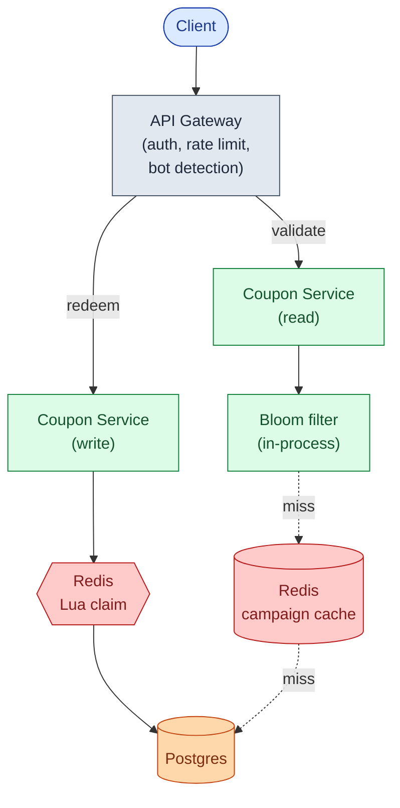

### v4: add async consumers

The cart needs to know a code was redeemed. Fraud needs a velocity signal. Finance needs a reconciliation record. None of these should slow down the redeem path. Add Kafka.

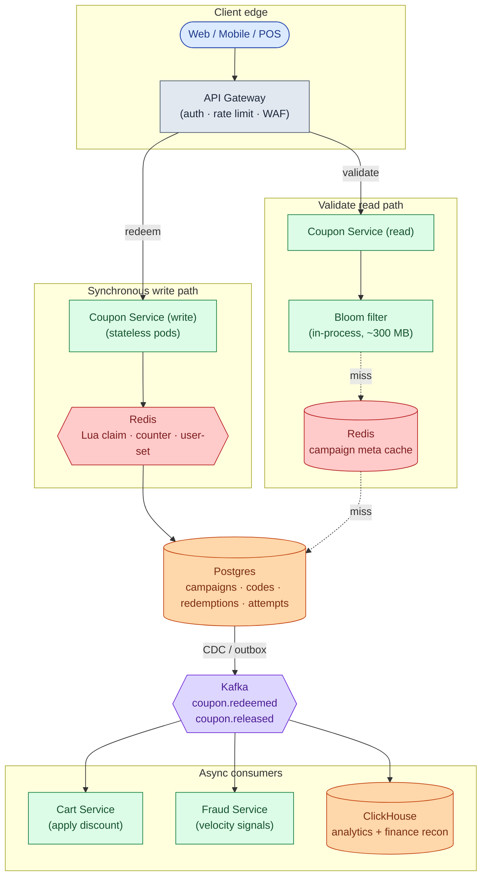

Each box, in one line:

| Box | What it does |
|-----|--------------|
| **API Gateway** | Authenticates, rate-limits per user and per IP, blocks bot patterns. |
| **Coupon Service (write)** | Runs the Lua claim, writes to Postgres, emits via outbox. Stateless. |
| **Coupon Service (read)** | Validates codes. Bloom filter first, then Redis cache, then Postgres. |
| **Bloom filter** | In-process. Rejects bogus codes in microseconds before touching the DB. |
| **Redis (claim)** | Holds the counter and the "claimed by" set for hot campaigns. |
| **Redis (cache)** | Holds campaign metadata for validate reads. 60s TTL. |
| **Postgres** | Source of truth. The unique index is the correctness guarantee. |
| **Kafka** | Carries events out. Cart, fraud, analytics consume from here, not from the write path. |

> **Take this with you.** If the cart service is down, redemptions still succeed. The discount catches up when the cart consumes from Kafka. Anything reactive lives after Kafka, not before.

---

## Step 7: One redeem, all the way through

Alice submits BLACKFRI100 during the launch burst. Watch what happens.

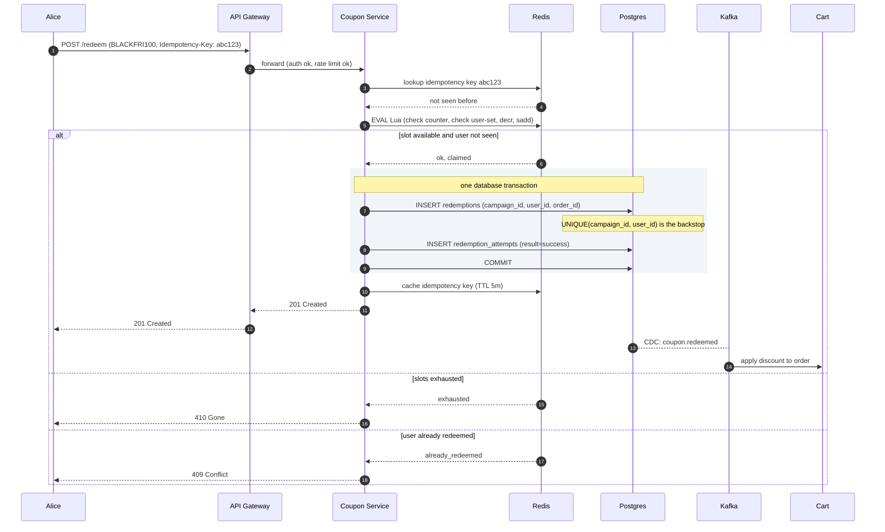

Three things worth pointing at:

1. The Redis Lua runs before Postgres. It is fast enough to handle 10,000 concurrent requests because Redis serializes them on one CPU core at sub-millisecond speed.
2. The Postgres write is synchronous, before returning success. If the service crashes after Redis claimed but before Postgres recorded, the user retries with the same `Idempotency-Key` and gets the cached response.
3. The cart is downstream of Kafka, not in the hot path. A cart outage does not block checkout.

---

## Step 8: Three code patterns, one engine

The same claim engine handles three different code shapes. The campaign's `type` field is the switch.

| Pattern | Example | Storage shape | Claim operation | Leak blast radius |
|---------|---------|--------------|----------------|-------------------|
| **Generic shared** | `SAVE10` | One row, counter on campaign | Lua DECR, unique index | High: one leaked code burns all slots |
| **Unique per-user** | `UID-7A2F-9B3C` | One row per (campaign, user) | UPDATE WHERE state='unused' | Low: one leaked code burns one slot |
| **Pre-generated pool** | `BLACKFRI-AB7K` | Many rows, each used once | LPOP from Redis list, SKIP LOCKED in Postgres | Medium: each leaked code burns one slot |

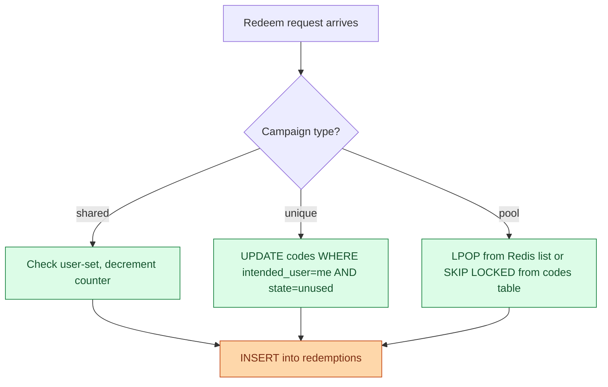

<details markdown="1">
<summary><b>Show: pool claim with SKIP LOCKED</b></summary>

For low-traffic campaigns, the pool claim can skip Redis entirely and use Postgres directly.

```sql
WITH next_code AS (
  SELECT code_id FROM codes
  WHERE campaign_id = $campaign_id AND state = 'unused'
  ORDER BY code_id
  FOR UPDATE SKIP LOCKED
  LIMIT 1
)
UPDATE codes c
SET state = 'used', claimed_by = $user_id, claimed_at = NOW()
FROM next_code nc
WHERE c.code_id = nc.code_id
RETURNING c.code_id, c.code;
```

`FOR UPDATE SKIP LOCKED` tells a concurrent transaction: "if this row is already locked, do not wait, skip it and try the next one." Ten parallel transactions each pick a different unused row. The 1,001st finds zero unused rows and returns nothing. Throughput is a few hundred claims per second, limited by row-level lock contention. For bursts above that, use the Redis list (`LPOP`) in front.

</details>

> **Take this with you.** One API, three patterns. The campaign `type` field decides the internal claim path. Callers do not need to know which one.

---

## Step 9: Stopping abuse

Two things will happen on launch day.

**Scenario 1.** A script fires 50 redeem attempts per second from one account. It is guessing codes: SAVE01, SAVE02, SAVE03. Most fail. Some hit. You see thousands of failed attempts per minute in your logs.

**Scenario 2.** Marketing mails BLACKFRI100 at 9 a.m. By 9:05 the code appears on a deal forum. By 9:10 random people are redeeming it. All 1,000 slots vanish in 30 seconds. The intended newsletter audience never got a chance.

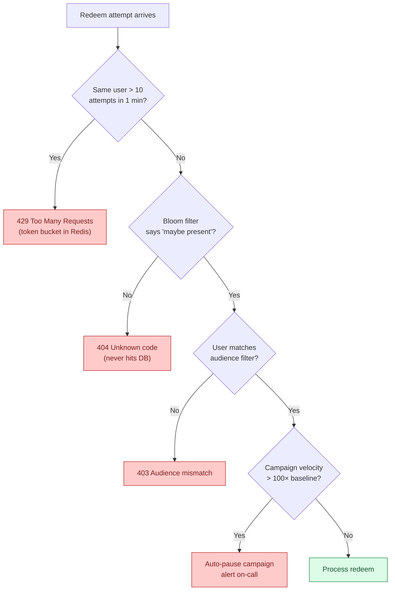

<details markdown="1">
<summary><b>Show: defenses for both scenarios</b></summary>

**Brute force (Scenario 1).**

No single defense is enough. Layer them.

Per-user rate limiting is the cheapest big win. Authenticated users get 10 validate attempts per minute and 5 redeem attempts per minute. Token bucket in Redis. Return 429 with `Retry-After` after the cap.

The Bloom filter is the killer move against namespace scraping. If the submitted code is not in the filter of all ever-issued codes, return 404 immediately. No DB hit. Brute-force load never reaches the real store. The filter lives in process memory (about 300 MB for 200 million codes at 0.1% false-positive rate). Rebuilt when a campaign is created.

After 5 failures from the same user, double the cooldown. After 10, ban for an hour.

**Leaked code (Scenario 2).**

Once a shared code leaks, you cannot undo it. You can mitigate.

Audience filter at validate time. Codes carry an `audience_filter`: "must be a newsletter subscriber as of date X." Validate fails if the user does not match, even if the code is correct. The forum poster shares the code, but most readers cannot use it.

Even better: mail unique per-user codes, not one shared code. Even if one code leaks, only that one user's slot is burnt.

Velocity-based auto-pause. If a campaign sees a 100× spike in redeem attempts in one minute over the trailing baseline, auto-pause and alert. Marketing reviews before all slots burn.

</details>

> **Take this with you.** The Bloom filter handles guessing. The audience filter handles leaking. Per-user rate limits handle both. Defense is layered.

---

## Follow-up questions

Try answering each in 2 or 3 sentences before opening the solution.

1. **Network failed mid-redeem.** A user submits BLACKFRI100. The request times out after Redis decremented the counter but before Postgres recorded the redemption. They retry. What does your system do?

2. **The cap got blown.** The campaign has 1,000 codes. After launch, 1,003 redemptions are recorded in Postgres. How did this happen? How do you detect it and prevent it?

3. **Stackable codes.** A cart has SAVE10 (10 percent off) and FREESHIP (free shipping). The user adds BLACKFRI100 (100 percent off). What does your validate endpoint return? Where does the stacking logic live?

4. **Refund flow.** An order with BLACKFRI100 is refunded the next day. Marketing wants the code released back into the pool so someone else can use it. Engineering hates this. What is the right answer?

5. **Expiration in the wrong time zone.** A code expires at "midnight on Dec 31". The user is in Tokyo. The code was issued in PST. What does the user see, what does the API return, and how do you avoid being yelled at on Twitter?

6. **Mass code update.** A campaign has 10 million per-user codes pre-generated. Marketing realizes the discount amount is wrong. They want to update all 10 million without invalidating already-redeemed ones. Can you?

7. **Multi-region.** Your e-commerce site has US and EU regions. A US-issued code is redeemed against the EU site. How do you guarantee single-use across regions?

8. **Bloom filter false negative.** Your Bloom filter says "code not present", but the code actually exists. Bloom filters do not have false negatives. Explain why, and what error they do have, and how that affects this design.

9. **The last slot race.** Reusable code SAVE10 has been used 9,999 times. The limit is 10,000. Twenty users hit redeem at the same instant. How do you give it to exactly one of them and tell the other nineteen "limit reached"?

10. **Unused expired code.** A code was generated, mailed to a user, but they never redeemed it before expiry. After expiry, can you reuse that code string for a new campaign? Why or why not?

---

## Related problems

- **[Approval Management (011)](../011-approval-management/question.md).** The audit trail, immutable record-keeping, and state machine patterns apply directly to the redemption log here.
- **[Shopping Cart (012)](../012-shopping-cart/question.md).** The cart consumes `coupon.redeemed` events and applies discounts. Cart idempotency is the other side of redemption idempotency.
- **[Rate Limiter (004)](../004-rate-limiter/question.md).** The per-user and per-IP rate limits in Step 9 are the standard algorithms. Pick one with intent.
- **[Distributed Cache (009)](../009-distributed-cache/question.md).** The Redis layer here is the same caching layer. Understand its eviction and replication story before depending on it for hot-burst correctness.
