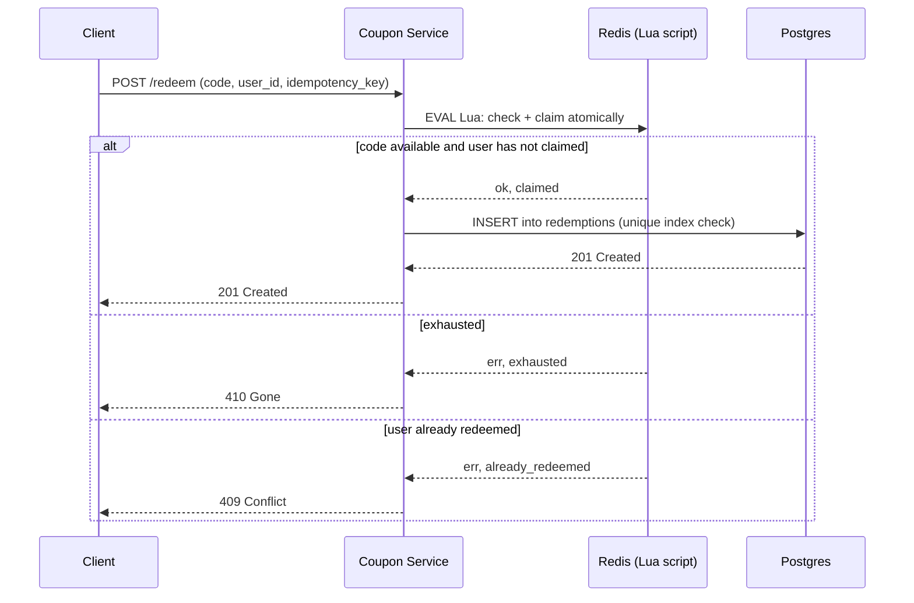
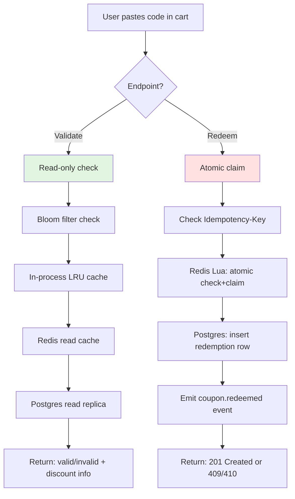
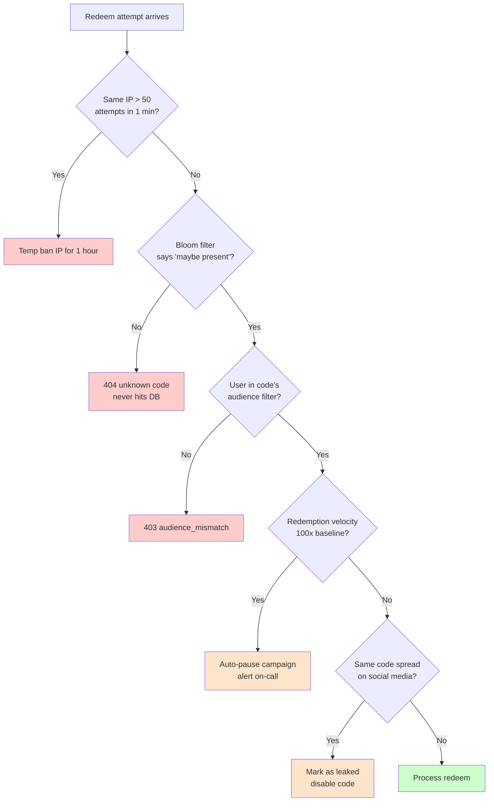

## The scene

It is the day before Black Friday. The marketing team walks in with a slide.

> *"Tomorrow at 9am we drop BLACKFRI100. It gives 100 percent off our flagship product. Only the first 1000 people can use it. We expect 10,000 users to click the redeem button in the same second. Also, we are mailing a unique code to each of our 200,000 newsletter subscribers. Each one can be used only once. Each expires in 30 days. Build it today."*

They smile. The CTO looks at you. You have one afternoon.

This looks like a basic save-data-to-a-table problem. It is not. The hard parts are:

- How do you give the code to *exactly* the first 1000 people? No more, no less.
- How do you stop the same person from using the same code 50 times in a row?
- What happens if your cache server crashes in the middle of a redemption? Do two people get the same code?
- What if someone figures out your code pattern and tries to guess them all?

Most people jump to: "Make a table. Mark each code used." That works fine when one person uses one code at a time. It breaks when 10,000 people show up in the same millisecond. A good design names the race condition first, then fixes it.

> **What is a race condition?** Two or more requests try to change the same thing at the same time. Whoever gets there first wins. The problem is, both requests can "read" the data before either one "writes" it. So both think they won. Two people get the last code. That is a race condition.

We will walk this from 10 users to 1 million users. At every step we will say what just broke, then add the smallest fix.

---

## Step 1: Ask the right questions

Sit for 5 minutes before you draw anything. Write down questions.

You do not need 20 questions. You need the small handful where a different answer would change the whole design.

<details markdown="1">
<summary><b>Show: 8 questions that matter</b></summary>

1. **Single-use or reusable?** Each code works once (like a gift card)? Or each code works many times, up to a limit (like a public promo SAVE10)? *(This is the biggest design fork. Single-use is one row, one redeem, done. Reusable means a counter and a per-user dedup check.)*

2. **Can the same user use a reusable code more than once?** SAVE10 once a day? Once ever? Unlimited? *(Without this answer, one user can drain the whole campaign. You need to know if you have to track which user used which code.)*

3. **Can codes be combined?** User has SAVE10 in the cart, also adds FREESHIP. Do they both apply? Do percentages add up (10 + 50 = 60 percent off) or multiply ((1 - 0.10) x (1 - 0.50) = 55 percent off)? *(Stacking rules change the API.)*

4. **When does a code expire?** Hard date like "Dec 31 midnight"? Or "24 hours after we mailed it to you"? Which timezone? *("Midnight" without a timezone has cost real companies money.)*

5. **What about offline stores?** Does a cash register in a shop need to accept codes when the internet is down and sync later? *(If yes, you need a different design. If no, you can refuse anything you cannot check live.)*

6. **What happens on refund?** Customer used BLACKFRI100. They cancel the order. Does the code come back to life so someone else can use it? *(Saying yes opens a brand-new race condition.)*

7. **What kind of codes?** One shared code like SAVE10 that everyone types? Or one unique code per user mailed individually? Or a pool of codes where the first 1000 to click each get one? *(Three different storage shapes. Pick one or design for all three.)*

8. **What abuse should we expect?** Same person guessing every code? Codes shared on a discount forum? Bots scraping every possible combination? *(Each one needs a different defense.)*

A senior candidate also asks: *"Does the cart page show 'this code works' before checkout? Or only at checkout?"* If yes, you need a separate validate endpoint. Good for UX. Risky because it leaks information to scrapers.

</details>

---

## Step 2: How big is this thing?

Marketing gives you the numbers. Do the math on paper before reading the answer.

- **Launch burst:** BLACKFRI100 drops at 9am. 10,000 redeem requests in the first second. 1000 win, 9000 must be told "sold out".
- **Steady traffic:** about 50,000 redemptions per day across normal promos.
- **Active campaigns:** about 50 at any time. Each has 10k to 10M codes.
- **Per-user codes total:** about 200M codes across all campaigns, kept for 5 years.
- **Validate vs redeem:** users click validate about 5 times before they click redeem (they paste, bounce, come back).

Try to compute:

1. Peak requests per second at launch
2. Steady requests per second across the day
3. Storage size for all codes
4. Hot working set during the launch

<details markdown="1">
<summary><b>Show: the math</b></summary>

**Peak QPS at launch.** 10,000 requests in 1 second = **10,000 QPS spike**. This is the pressure point. It lasts seconds, not hours. But every single request needs a correct answer. 1000 win. 9000 lose. Nobody gets a double. Nobody gets skipped.

**Steady QPS.** 50,000 / 86,400 seconds = about **0.6 redemptions per second**. At peak hours maybe 5 per second. Tiny.

**Validate QPS.** 5x redeem = 3 per second steady, 25 per second at peak. Also tiny. But the launch burst applies here too: 50,000 validate calls at 9am because users paste the code first, then click redeem.

**Storage.** 200M codes x 200 bytes each = about **40 GB**. Redemption log: 50k/day x 365 x 5 years x 100 bytes = about **9 GB**. Total around 50 GB. One machine.

**Hot working set during launch.** One campaign is hot. One counter. The pool of 1000 codes if you pre-generate them. Maybe 100 KB of actively-hot data.

**What the math tells you:**

The system is small. Throughput is not the problem. Storage is not the problem. The architecture exists for two reasons:

1. Surviving the **10,000 QPS burst on one hot key** correctly.
2. Stopping **abuse** (brute force, leaked codes).

That is it. Everything else is plumbing.

</details>

---

## Step 3: What does a "code" look like?

Before you draw boxes, decide what a code is. The format changes storage, lookup speed, guessability, and how you make them.

Three serious patterns:

| Pattern | Example | When to use |
|---------|---------|-------------|
| **Generic shared** | `SAVE10`, `WELCOME20` | Public promos. One code. Many people use it. Cap on total uses. |
| **Unique per-user** | `UID-7A2F-9B3C-1D4E` | Newsletter codes. Referral rewards. Gift cards. One code per person, mailed to them. |
| **Pre-generated pool** | `BLACKFRI-AB7K-2X9P` | "First 1000 get a code" drops. Many codes. Each one used once. People grab them in order. |

Try to fill in the comparison before reading the answer.

<details markdown="1">
<summary><b>Show: pattern comparison and when to pick which</b></summary>

| Pattern | Storage | Lookup | Hard to guess? | Race conditions |
|---------|---------|--------|---------------|----------------|
| **Generic shared** | One row per code. Counter for total uses. | O(1) by primary key. | Weak. SAVE10 is easy to guess. Rate limit per user is the only defense. | Atomic decrement on the counter. Per-user dedup via a `(code, user)` unique key. |
| **Unique per-user** | One row per (code, intended user). | O(1) by primary key. | Strong. `UID-7A2F-9B3C-1D4E` has about 10^14 possible values. Cannot guess. | Simple. One redemption ever. `UPDATE WHERE state = 'unused'`. |
| **Pre-generated pool** | One row per code. Plus an "unclaimed" index. | O(1) by primary key to check. Atomic pop from the pool to claim. | Strong if the code is long and random. | The hard race. Two users hit the same pool at the same instant. Only one can win each code. |

A few format rules apply to all three:

- Use 8 to 12 characters of **base32**. Skip 0/O, 1/I/L, U because humans confuse them. That gives about 10^15 codes. Plenty.
- Prefix with the campaign tag (`BLACKFRI-`). Helps route the request without a database join. Helps users spot typos.
- For typed-by-humans codes, add a small **checksum** at the end. Catches typos before the database lookup. For machine-mailed codes, skip it.
- Always **normalize to uppercase**. `save10` and `SAVE10` should match.

> **Pick all three patterns.** A mature system supports all three under one schema. Each campaign has a `type` field: `shared`, `unique`, or `pool`. The API looks the same. The internal data is slightly different per type.

</details>

---

## Step 4: Draw the system

You know what a code looks like. Now draw the boxes that run it.

Try to fill in the missing pieces. Five `[ ? ]` boxes. Think about: what stops abuse before it reaches your service, what holds the real truth, what makes the launch burst fast, what records what actually happened for finance, and what tells the cart "discount applies."

```
                Client (web, mobile, POS terminal)
                              |
                              v
                    +------------------+
                    |   [ ? ]          |  auth, per-user rate limit,
                    |                  |  bot detection
                    +--------+---------+
                             |
        validate path        |       redeem path
                             |
                +------------+------------+
                |                         |
                v                         v
        +-------------+            +-------------+
        | Coupon      |            | Coupon      |
        | Service     |            | Service     |
        | (read)      |            | (write)     |
        +------+------+            +--+---+------+
               |                      |   |
               v                      v   |
        +-------------+         +----------+
        |  [ ? ]      |         |  [ ? ]   |  atomic single-key ops
        |             |         |          |  for the launch burst
        +-------------+         +----+-----+
                                     |
                                     v
                              +--------------+
                              |  [ ? ]       |  source of truth:
                              |              |  campaigns + codes
                              |              |  + redemptions
                              +------+-------+
                                     |
                                     v
                              +--------------+
                              |  [ ? ]       |  tells cart / fraud /
                              |              |  finance that a code
                              |              |  was just redeemed
                              +--------------+
```

<details markdown="1">
<summary><b>Show: the full architecture</b></summary>

```
                Client (web, mobile, POS terminal)
                              |
                              v
                    +------------------+
                    |  API Gateway     |  auth, per-user + per-IP
                    |  + Rate Limiter  |  rate limit, WAF for
                    |                  |  bot patterns
                    +--------+---------+
                             |
        validate path        |       redeem path
                             |
                +------------+------------+
                |                         |
                v                         v
        +-------------+            +-------------+
        | Coupon      |            | Coupon      |
        | Service     |            | Service     |
        | (read)      |            | (write)     |
        +------+------+            +--+---+------+
               |                      |   |
               v                      v   |
        +-------------+         +--------------+
        |  Read Cache |         |  Redis +     |  Atomic claim via
        |  (Redis)    |         |  Lua scripts |  Lua. Sub-ms.
        |  + Bloom    |         |              |
        |  filter     |         +------+-------+
        +-------------+                |
                                       v
                              +--------------+
                              |  Postgres    |  Source of truth.
                              |              |  Tables:
                              |              |   campaigns
                              |              |   codes
                              |              |   redemptions
                              |              |   redemption_attempts
                              +------+-------+
                                     |
                                     v
                              +--------------+
                              |  Kafka       |  Topic: coupon.redeemed
                              |              |  Consumers: cart,
                              |              |  finance, analytics,
                              |              |  fraud
                              +--------------+
```

What each piece does, in one line:

- **API Gateway + Rate Limiter.** The first line of defense. Stops one user from sending 100 requests per second. Stops bot patterns. Without this, an attacker enumerates your whole namespace in hours.
- **Coupon Service (read).** Handles the "is this code valid?" check on the cart page. Reads from cache. Falls back to the database on a cache miss.
- **Coupon Service (write).** Handles the actual redeem. For slow campaigns it goes straight to Postgres. For hot campaigns it goes through Redis first.
- **Read Cache + Bloom filter.** Holds campaign metadata (discount, expiry, stacking rules). A Bloom filter sits in front: if the code is not in the filter, return 404 right away. Stops scrapers from hammering the database.
- **Redis + Lua scripts.** Holds the counter and the "claimed" set for hot campaigns. A Lua script makes "check, decrement, return" one atomic step. Sub-millisecond.
- **Postgres.** The source of truth. Campaigns, codes, redemptions, attempts. Has a unique index on `(campaign_id, user_id)` that catches double-redemptions at the database level, even when Redis already said yes.
- **Kafka.** Carries the `coupon.redeemed` event. The cart applies the discount. Fraud looks for patterns. Analytics counts. The coupon service does not care who consumes it.

> **What is a Bloom filter?** A tiny memory structure that answers one question: "have I ever seen this code before?" It can say "definitely not" (which is super useful: skip the database) or "maybe yes" (so you check the database to be sure). It uses very little memory. 200 million codes fit in about 300 MB. Great for stopping brute-force traffic.

</details>

---

## Step 5: The atomic single-use claim

This is the question the interviewer is actually testing.

> *Ten thousand users hit BLACKFRI100 in the same instant. Only 1000 codes exist. Give one to each of the first 1000. Do not give two to anyone. Do not skip any of the 1000 slots. Go.*

Take 10 minutes. Sketch at least two approaches. Compare them on: correctness, latency, what happens if a node dies mid-claim, and what if Redis dies.

Here is the flow you are trying to build:



<details markdown="1">
<summary><b>Show: three viable approaches</b></summary>

> **What is idempotency?** Calling the same operation twice has the same effect as calling it once. Safe to retry. If the network fails after the server processed the redeem, the client retries with the same `Idempotency-Key`, and the server returns the same answer it returned the first time. The user is not double-charged. No second code is used.

**Approach A: Postgres unique index, blocking insert.**

Pre-generate 1000 rows in a `codes` table, each marked `unused`. Redeem is an UPDATE with a special clause:

```sql
WITH claimed AS (
  UPDATE codes
  SET state = 'used', redeemed_by = $user_id, redeemed_at = NOW()
  WHERE code_id = (
    SELECT code_id FROM codes
    WHERE campaign_id = $campaign AND state = 'unused'
    ORDER BY code_id
    FOR UPDATE SKIP LOCKED
    LIMIT 1
  )
  RETURNING code_id
)
INSERT INTO redemptions (code_id, user_id, redeemed_at)
SELECT code_id, $user_id, NOW() FROM claimed
ON CONFLICT (code_id, user_id) DO NOTHING
RETURNING redemption_id;
```

> **What does `FOR UPDATE SKIP LOCKED` do?** Normally, if two transactions ask for the same row, the second one waits for the first to finish. `SKIP LOCKED` tells the second one: "if the row is locked, do not wait. Skip it and try the next one." So 10 parallel transactions each pick a different unused row. None of them wait. The 1001st request finds zero unused rows and returns nothing.

Latency: 5 to 20ms per redeem under modest load. Under 10,000 QPS on one campaign, even SKIP LOCKED queues up because row-level locks pile on. Do not run this against a single hot campaign at burst-scale without something in front.

If Postgres dies after the UPDATE commits but before the client sees the response, the user retries. The retry's `(campaign_id, user_id)` lookup finds the previous redemption and returns it. No double-claim.

**Approach B: Redis SETNX (or DECR) for the claim, Postgres for the record.**

The campaign has a counter in Redis: `campaign:blackfri:remaining = 1000`. Redeem runs a Lua script.

> **What is a Lua script in Redis?** A small program that runs *inside* Redis without anyone else touching the data. The whole thing is one atomic action. No other client can squeeze a command in between your check and your decrement. This is the only way to do "check then change" safely on Redis.

```lua
-- KEYS[1] = campaign:blackfri:remaining
-- KEYS[2] = campaign:blackfri:users (set of users who already redeemed)
-- ARGV[1] = user_id

local remaining = tonumber(redis.call("GET", KEYS[1]))
if remaining == nil or remaining <= 0 then
  return {err = "exhausted"}
end
local already = redis.call("SISMEMBER", KEYS[2], ARGV[1])
if already == 1 then
  return {err = "already_redeemed"}
end
redis.call("DECR", KEYS[1])
redis.call("SADD", KEYS[2], ARGV[1])
return {ok = redis.call("GET", KEYS[1])}
```

Latency: under 1ms. Redis is single-threaded, so a hot campaign's claims serialize on one CPU core. Fine for 10k QPS (Redis can handle hundreds of thousands of simple ops per second).

After Redis says yes, write to Postgres synchronously. The DB unique index on `(campaign_id, user_id)` is a backstop. If Redis and Postgres ever disagree (Redis lost state, replay happened), the DB rejects duplicates.

Sad path: Redis crashes after DECR but before the Postgres write. The counter went down by 1, but no redemption row exists. The fix is to write to Postgres before returning success. About 5ms extra. Worth it.

> **Why a Redis Lua script and not just two operations (check then claim)?** Because two operations have a tiny gap between them. In that gap, 1000 other users can also "check" and see the code is available. Then all 1000 try to "claim" it. With a Lua script, the check and claim happen as one indivisible step. Only one wins.

**Approach C: Token bucket pre-issued.**

Pre-generate 1000 single-use tokens at campaign creation. Push them all into a Redis list: `campaign:blackfri:tokens`. Redeem runs `LPOP`. If the list is empty, return exhausted. The popped token is the proof of claim.

Latency: sub-millisecond. List ops on Redis are O(1).

If Redis loses the list (failover with a stale replica), tokens vanish. Fix: also store the tokens in Postgres. On rebuild, mark tokens that were already popped (Postgres knows because the redemption hit it). Re-push the rest.

**Which to pick?**

- Approach A alone: fine up to a few hundred QPS on the hot key.
- Approach B (Redis Lua + Postgres backstop): the standard answer for a flash sale.
- Approach C: pick when the tokens are real artifacts the user holds (gift cards, lottery tickets).

The senior one-liner: *"Approach B for the hot path, with the unique index from Approach A as the ground truth. Approach C if marketing wants the codes to be meaningful artifacts."*

</details>

---

## Step 6: Validate vs Redeem (the split)

These look like two ways to do the same thing. They are not. Treat them as two endpoints.



**Why split them?**

- **Validate is cheap, read-only, cacheable.** Users paste codes 5 times for every 1 redeem. They bounce, come back, paste again. Caching the answer is huge.
- **Redeem is the atomic act.** It changes state. Once it succeeds, the code count goes down.

A POST that always consumes the code on click breaks the cart UX. The user wants to *see* the discount before they checkout. A GET that consumes breaks HTTP rules (GETs should not change state) and breaks browser pre-fetch.

Two endpoints. Clear separation.

---

## Step 7: Stopping abuse

Two real things that will happen on launch day.

**Scenario 1.** A user runs a script that fires 50 redeem attempts per second. They are guessing every code from `SAVE10` to `SAVE99`. Most fail. Some succeed. You see thousands of failed attempts on your dashboard.

**Scenario 2.** Marketing mails BLACKFRI100 to the newsletter at 9am. By 9:05am the code is posted on a deal forum. By 9:10am random people are redeeming it. All 1000 codes vanish in 30 seconds. The intended audience complains they never got a chance.

Sketch defenses. 5 minutes per scenario.



<details markdown="1">
<summary><b>Show: defenses for both</b></summary>

**Scenario 1: brute force.**

No single defense is enough. Layer them.

The cheapest big win is **per-user rate limiting**. Authenticated users get 10 attempts per minute, 50 per hour. Unauthenticated gets 5 per minute per IP. Token bucket in Redis. 429 with `Retry-After` after the cap.

Add **per-IP rate limiting** for unauthenticated traffic. 30 attempts per minute per IP catches sessionless requests.

The **Bloom filter prefilter** is the killer move. If the submitted code is not in the filter of issued codes, return 404 right away. No DB hit. Brute-force load never reaches your real store. The filter is in-memory at the service. Rebuilt when a new campaign is created. A 0.1% false-positive rate is fine: a tiny fraction of guesses leak through to a real lookup.

After 5 failures from the same user or IP, double the cooldown. After 10, ban for an hour. After 20, ban for a day. After 3 failed attempts in a minute, show a **CAPTCHA**. Slows automated tools to a crawl.

**Device fingerprint** as a signal: same browser fingerprint creating many accounts and each trying codes is suspicious. Combine with rate limits. Do not rely on fingerprint alone (bypassable).

**Scenario 2: leaked code.**

Once a shared code leaks, you cannot undo it. You can mitigate.

**Audience filter at validate time.** Codes carry an `audience_filter`: "must be a subscriber as of date X", "must have made a purchase in the last 90 days". Validate fails if the user does not match, even if the code is correct. The leaker posts the code, but most leakers' audiences cannot use it.

Even better: **mail unique per-user codes**, not one shared code. Even if a code leaks, only that one user's code is burnt.

If you insist on a shared code: **cap at a number that survives leakage**. 1000 codes vanish in seconds when leaked. 100,000 buys some grace.

**Velocity-based auto-pause.** If a campaign sees a 100x spike in attempts in 1 minute over the trailing baseline, auto-pause and alert. Marketing reviews and either confirms or kills the campaign before all slots burn.

**Honeypot codes.** Insert a fake code into the mailing that is not actually valid. Track who tries it. If a user uses a real code *and* the honeypot, you have a strong leak signal. With unique per-user mailings, each code is already a watermark.

The honest answer: defense is layered. The validate-side audience filter is the biggest win for leakage. Per-user rate limits and the Bloom filter are the biggest wins for brute force.

</details>

---

## Follow-up questions

Try answering each in 2 or 3 sentences before opening the solution.

1. **Network failed mid-redeem.** A user submits BLACKFRI100. The request times out *after* Redis decremented the counter but *before* Postgres recorded the redemption. They retry. What does your system do?

2. **The cap got blown.** The campaign has 1000 codes. After launch, 1003 redemptions are recorded in Postgres. How did this happen? How do you detect it and prevent it?

3. **Stackable codes.** A cart has SAVE10 (10 percent off) and FREESHIP (free shipping). The user adds BLACKFRI100 (100 percent off). What does your validate endpoint return? Where does the stacking logic live?

4. **Refund flow.** An order with BLACKFRI100 is refunded the next day. Marketing wants the code released back into the pool so someone else can use it. Engineering hates this. What is the right answer?

5. **Expiration in the wrong time zone.** A code expires at "midnight on Dec 31". The user is in Tokyo. The code was issued in PST. What does the user see, what does the API return, and how do you avoid being yelled at on Twitter?

6. **Mass code update.** A campaign has 10 million per-user codes pre-generated. Marketing realizes the discount amount is wrong. They want to update all 10M without invalidating any already-redeemed ones. Can you?

7. **Multi-region.** Your e-commerce site has US and EU regions. A US-issued code is redeemed against the EU site. How do you guarantee single-use across regions?

8. **Bloom filter false negative.** Your Bloom filter says "code not present", but the code actually exists. Wait, Bloom filters do not have false negatives. Explain why, and what error they *do* have, and how that affects this design.

9. **The last slot race.** Reusable code SAVE10 has been used 9999 times. Limit is 10000. Twenty users hit redeem at the same instant. How do you give it to exactly one of them and tell the other nineteen "limit reached"?

10. **Unused expired code.** A code was generated, mailed to a user, but they never redeemed it before expiry. After expiry, can you reuse that code string for a new campaign? Why or why not?

---

## Related problems

- **[Approval Management (011)](../011-approval-management/question.md).** The audit trail, immutable record-keeping, and state machine patterns apply directly to the redemption log here.
- **[Shopping Cart (012)](../012-shopping-cart/question.md).** The cart consumes `coupon.redeemed` events and applies discounts. Cart idempotency is the other side of redemption idempotency.
- **[Rate Limiter (004)](../004-rate-limiter/question.md).** The per-user and per-IP rate limits in Step 7 are the standard algorithms. Pick one with intent.
- **[Distributed Cache (009)](../009-distributed-cache/question.md).** The Redis layer here is the same caching layer. Understand its eviction and replication story before depending on it for hot-burst correctness.
