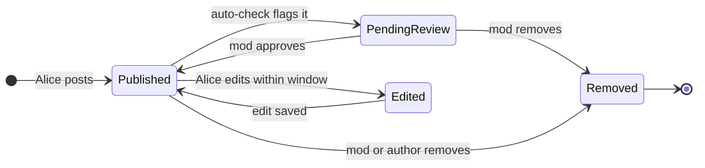
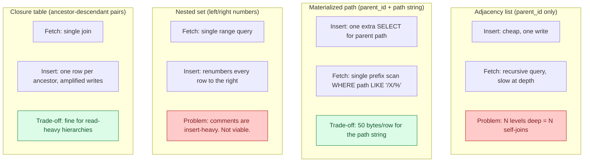
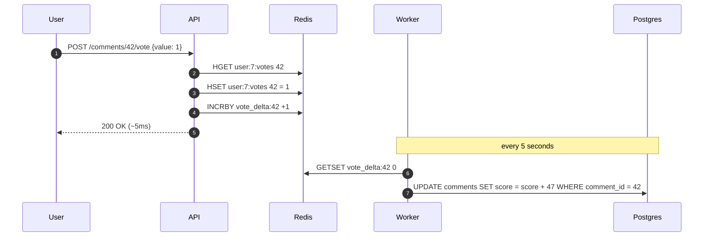
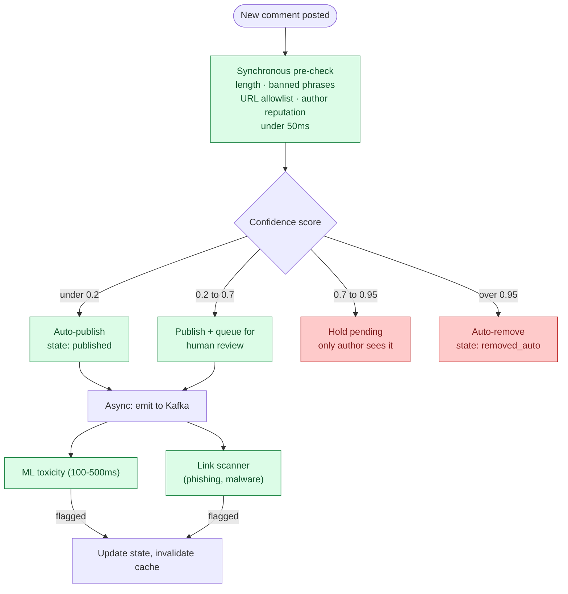
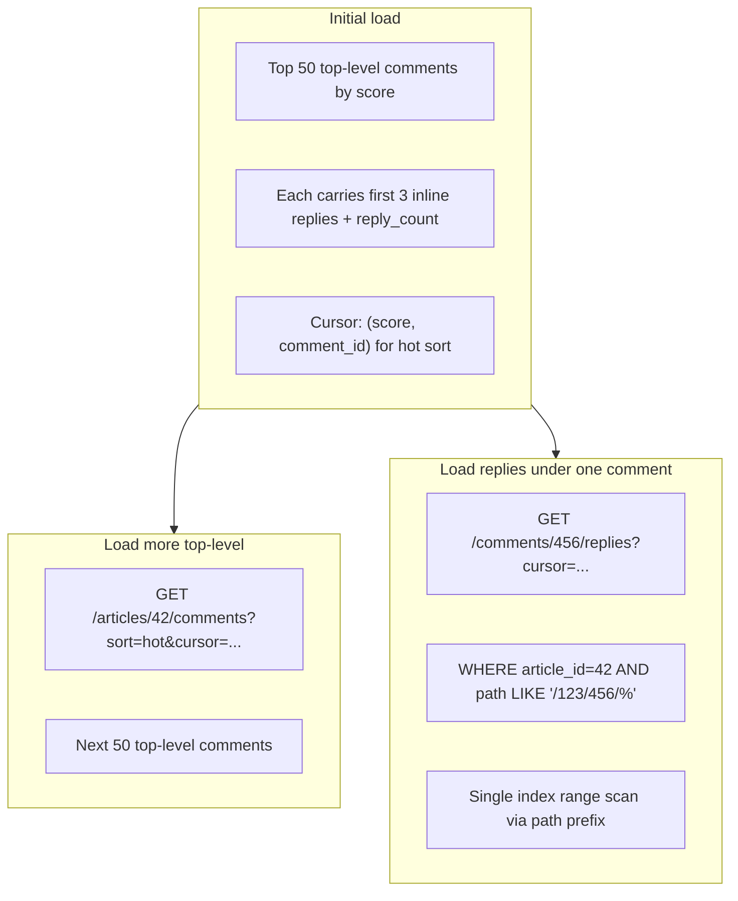
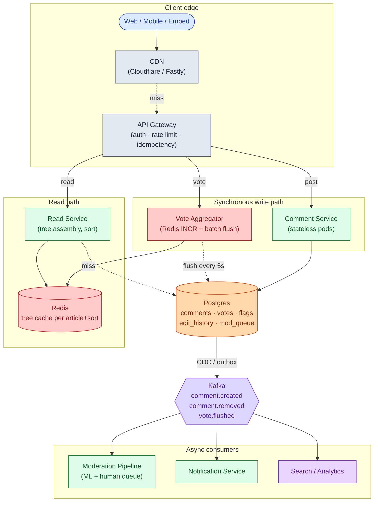
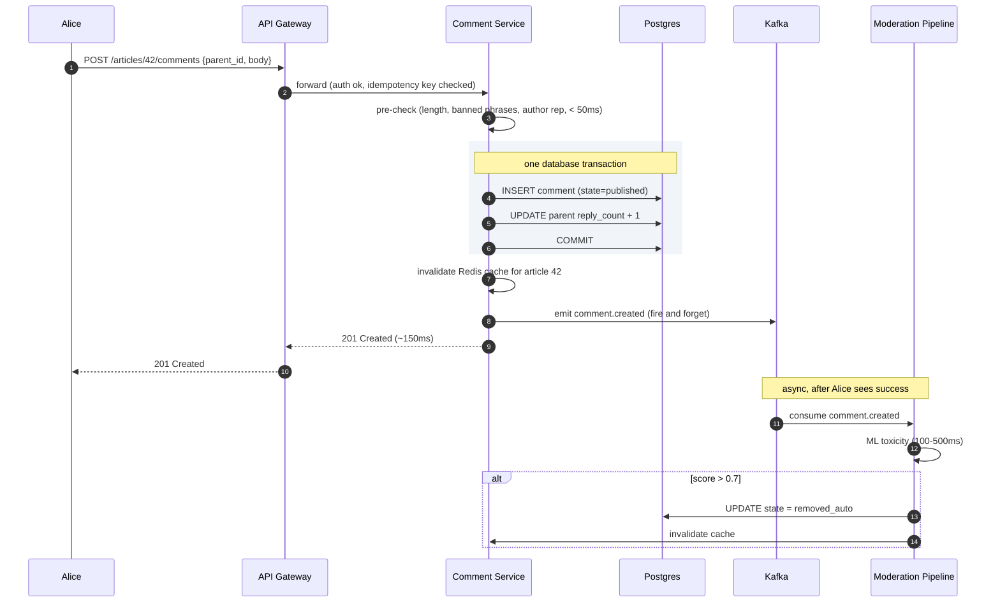
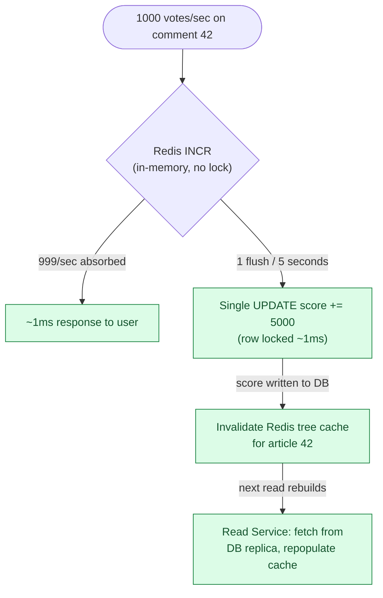
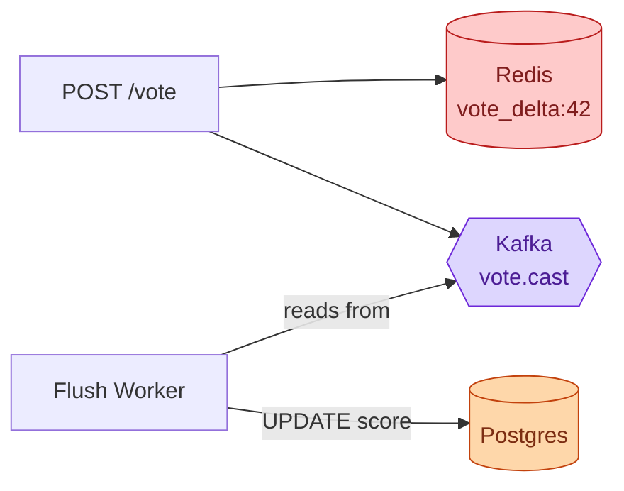

## What we are building

A comment system lets users post text replies on a piece of content, reply to each other in threads, and vote replies up or down. Think Reddit or YouTube comments. An article gets 50 top-level comments. Each comment can have replies, and those replies can have replies, up to 8 levels deep. The top comment on a viral post might receive 1,000 upvotes in 5 seconds. A moderator needs to hide a spam comment within seconds of it being flagged, not minutes.

That sounds like a CRUD app. It is not. There are five real problems hiding in this product:

1. **Threading model.** Storing a tree so you can fetch 800 nested comments in one query instead of 800 recursive database calls.
2. **Vote hot-row.** 1,000 concurrent `UPDATE score = score + 1` calls against one database row will serialize behind a lock and melt the database.
3. **Soft delete with structure.** Deleting a comment that has 200 replies must not orphan those replies. The tree must stay intact.
4. **Ranking.** Showing comments in "hot" order requires a score that decays with time. Sorting by raw vote count lets old viral comments dominate forever.
5. **Moderation at scale.** A human cannot review every comment. A confidence-routed pipeline (fast pre-check, async ML classifier, human queue) is the only way to keep spam out without blocking every post.

---

## The lifecycle of one comment



A comment spends nearly all its life in `Published`. The moderation transitions happen rarely but must be fast when they do. Everything else (threading, voting, ranking) exists to make the read path work at scale.

> **Take this with you.** A comment system is a state machine for small text objects, run millions of times, with a 1,000:1 read-to-write ratio. The architecture is built around the read path, not the write path.

---

## How big this gets

The same product lives at two very different scales.

| Input | Small blog | Viral site |
|-------|-----------|------------|
| Comments per day | 100 | 1,000,000 |
| Writes per second (steady) | ~0.001 | ~12 |
| Writes per second (peak) | ~0.01 | ~50 |
| Reads per second (peak) | ~1 | ~40,000 |
| Storage per year | ~7 MB | ~250 GB |

<details markdown="1">
<summary><b>Show: how the numbers come out</b></summary>

**Small blog:**
- 100 comments/day at ~200 bytes each = about 7 MB per year. One laptop handles this.
- 1,000:1 read-to-write ratio means roughly 1 read per second.

**Viral site:**
- 1,000,000 / 86,400 = ~12 writes per second steady. Peak is 3-5x, so 40-60 writes/sec.
- At 1,000:1 read ratio: ~12,000 reads/sec steady, ~40,000 at peak.
- 1M comments/day × 365 × 300 bytes = ~110 GB/year for text. Add votes, flags, edit history: ~250 GB/year.

The number that matters most: the top 1% of articles get 80% of the traffic. In a viral moment, one article drives 1,000 votes per second on a single comment row. That hot row is the central scaling problem, not average write throughput.

</details>

> **Take this with you.** Steady-state writes are small. The architecture exists to handle 40,000 reads per second and the burst behavior of one viral comment hammering one database row.

---

## The smallest version that works

A blog with 10 articles and 100 comments a day needs three boxes and nothing else.


Two endpoints carry the entire product.

| Endpoint | What it does |
|----------|--------------|
| `POST /articles/{id}/comments` | Accept body and optional parent_id, insert row, return 201 |
| `GET /articles/{id}/comments` | Return the full comment tree in one response |

<details markdown="1">
<summary><b>Show: the one table</b></summary>

```sql
CREATE TABLE comments (
    comment_id  BIGINT PRIMARY KEY,
    article_id  BIGINT NOT NULL,
    parent_id   BIGINT,
    path        TEXT NOT NULL,          -- "/123/456/789"
    depth       INT NOT NULL,
    author_id   BIGINT,
    body        TEXT NOT NULL,
    score       INT NOT NULL DEFAULT 0,
    state       SMALLINT NOT NULL DEFAULT 1,
    created_at  TIMESTAMPTZ NOT NULL DEFAULT NOW()
);

CREATE INDEX idx_comments_article ON comments (article_id, created_at DESC);
CREATE INDEX idx_comments_path    ON comments (article_id, path text_pattern_ops);
```

Two columns do the heavy lifting. `parent_id` keeps inserts cheap. `path` makes a full subtree fetch a single index prefix scan instead of a recursive query. They cannot drift because `path` is computed from the parent's path at insert time.

</details>

This handles the blog. The interesting questions start as the product grows.

---

## Decision 1: how do we store the tree?

The blog grows. One article gets 800 comments. The page takes 4 seconds. The query is a `WITH RECURSIVE` that joins the table to itself at each nesting level: 8 levels = 8 self-joins.

Four approaches exist. Each trades insert cost against read cost.



<details markdown="1">
<summary><b>Show: comparison table</b></summary>

| Approach | Insert | Fetch full thread | Fetch subtree | Extra storage |
|----------|--------|-------------------|---------------|---------------|
| Adjacency list | Cheap | Recursive query | Recursive | None |
| Materialized path | One extra read | Single prefix scan | Single prefix scan | ~50 bytes/row |
| Nested set | Very expensive | Single range | Single range | None |
| Closure table | Many writes | Single join | Single join | One row per ancestor pair |

Comments are insert-heavy. Nested sets are out. Closure tables amplify writes at scale. Adjacency list breaks at a few hundred comments per article.

The right answer: keep both `parent_id` and `path`. `parent_id` for writes. `path` for reads. 50 bytes per row is the cost; never running a recursive query on the hot read path is the payoff.

</details>

When Alice replies to a comment at `/123/456`, her path becomes `/123/456/789`. Fetching all descendants of comment 456 is:

```sql
SELECT * FROM comments
WHERE article_id = 42 AND path LIKE '/123/456/%'
ORDER BY path;
```

One index scan. No recursion. Pre-order traversal falls out of the ordering for free.

> **Take this with you.** `parent_id` for writes, `path` for reads. The 50-byte path string per row is the right trade. Never run a recursive query on the hot read path.

---

## Decision 2: how do we handle vote hot-rows?

A comment goes viral. 1,000 users upvote it in 5 seconds.

The naive path hits the same row 1,000 times:

```sql
UPDATE comments SET score = score + 1 WHERE comment_id = 42;
```

Every UPDATE takes a row-level lock. The 1,000 updates serialize. The database CPU spikes on one row. Every other comment on the same shard slows down.

The fix: Redis as a buffer between the click and the database.



Three parts:

1. `INCRBY vote_delta:42 +1` is a memory operation. Returns in under 1ms.
2. `HSET user:7:votes 42 = 1` tracks the user's current vote. If they switch from down (-1) to up (+1), the delta is +2 not +1, without double-counting.
3. Every 5 seconds, the worker snapshots all `vote_delta:*` keys and writes one UPDATE per comment. 1,000 votes become one database write.

The hot row disappears. The trade-off: scores lag actual votes by up to 5 seconds. Most users do not notice.

> **Take this with you.** Vote counts, like counts, view counts: anything that aggregates writes to a single row uses this pattern. INCR in Redis, batch flush to the database.

---

## Decision 3: how do we moderate fast without blocking writes?

An ML toxicity classifier takes 100-500ms per comment. A link scanner takes another 200ms. If these run synchronously, Alice waits over half a second before her comment appears. That is not acceptable.

But if nothing runs on the write path, spam posts live unchecked until a human sees it.

The answer is a tiered pipeline:



The synchronous pre-check runs cheap heuristics in under 50ms. Clear spam is rejected immediately. Obvious-good content is published immediately. The gray zone waits for the async ML classifier, which runs off Kafka after Alice has already seen "201 Created."

The confidence thresholds are tunable. Raise the 0.95 threshold to auto-remove more comments at the cost of more false positives.

**Shadow ban:** a spammer keeps creating accounts. Instead of banning and telling them, shadow-ban. Their comment looks published to them but is invisible to everyone else. The render logic checks: if the requesting user is the comment's author, show it regardless of state.

> **Take this with you.** Pre-publish review does not scale past a few hundred comments per day. Post-publish with fast async takedown is what every high-volume site uses. The synchronous pre-check catches the obvious cases in under 50ms.

---

## Decision 4: how do we paginate large threads?

A thread with 5,000 comments cannot go to the client all at once. Sending it all is ~1.5 MB of JSON plus the tree-assembly time on a cache miss.

Two separate pagination problems need solving:

1. How to page through top-level comments.
2. How to page through replies under one comment ("load more replies").



Cursor-based pagination, not offset. New comments posted while a user is scrolling would shift offset-based results. A cursor on `(score, comment_id)` is stable across inserts.

> **Take this with you.** The path prefix index that makes tree fetches fast is the same index that makes subtree pagination fast. These two features share one data structure.

---

## Decision 5: how do we rank comments?

Sorting by raw vote count lets old comments dominate forever. The first viral comment stays at the top. New comments cannot break in.

Reddit's "hot" formula applies a log scale to votes and adds a time component:

```
hot_score = sign(score) × log10(max(|score|, 1)) + seconds_since_epoch / 45000
```

Breaking it down:

| Factor | Effect |
|--------|--------|
| `log10(score)` | Diminishing returns: 10 votes = 1 unit, 100 votes = 2 units |
| `seconds / 45000` | ~12.5-hour half-life: a 12.5-hour-old comment needs 10x more votes to beat a fresh one |
| `sign` | Negative scores rank below zero |

The score is computed at read time for small threads. For large threads, pre-compute and store `hot_score` on the row. A background job re-runs the formula every few minutes as time decay changes the sort order even without new votes.

"Controversial" sort: `score = upvotes × downvotes / (upvotes + downvotes)^2`. Comments where both up and down votes are high bubble to the top.

> **Take this with you.** Any sort order that involves time decay requires periodic recomputation. A cached tree keyed by `(article_id, sort_order)` needs its own TTL tuned to how often the sort changes.

---

## The full architecture



Each component in one line:

| Component | Purpose |
|-----------|---------|
| CDN | Caches rendered comment trees at the edge. Most reads stop here. |
| API Gateway | Auth, per-user rate limit, idempotency key dedup. |
| Comment Service | Validates, inserts, emits events. Stateless pods. |
| Vote Aggregator | Redis INCR per click, batch flush to Postgres every 5 seconds. |
| Read Service | Assembles tree, applies sort, fills Redis cache. Falls back to replica on miss. |
| Postgres | Source of truth. Comments, votes, flags, edit history, mod queue. |
| Kafka | Carries events to async consumers without touching the write path. |
| Moderation Pipeline | Async ML toxicity classifier, link scanner, human review queue. |

Notice what is not on the synchronous path: ML classification, notification delivery, search indexing. If the notification service is down at 3 a.m., comments still post.

---

## Walk: a comment, end to end

Alice replies to a comment on article 42.



Three things to notice:

1. The INSERT and the `reply_count` increment are in one transaction. A crash rolls both back.
2. The ML classifier runs after Alice has already seen "201 Created." It does not block her.
3. If the classifier removes the comment, Alice sees the tombstone on her next page refresh. The write path never waited for moderation.

---

## The vote hot-row in depth

At 1,000 votes per second, even the 5-second batch flush produces a delta of 5,000 on one `UPDATE`. That single write still has to take a row lock.

The defense works in layers:



If Redis fails before a flush: score delta is lost. To prevent this, write votes to Kafka at the same time as Redis. The flush worker reads from Kafka instead of Redis. Kafka is the durable record. Redis is the fast counter.



Redis gives you speed. Kafka gives you durability. Together: every vote is fast and nothing is lost if a Redis pod restarts.

> **Take this with you.** The hot-row pattern (INCR in Redis, batch flush to DB) appears everywhere: view counts, like counts, rating aggregates. Learn it once. The Kafka-backed variant adds durability at the cost of slightly more infrastructure.

---

## Follow-up questions

Try answering each in 2-4 sentences before opening the solution.

1. **Soft delete of a popular comment.** A comment with 200 replies is deleted by its author. What happens to the replies? Walk through the data and the UI.

2. **Spam burst.** A user posts 1,000 comments in 10 seconds via a script. Where does this get caught? How do you avoid blocking a legitimate user who posts 5 comments in a minute during a hot discussion?

3. **Edit history.** A user edits their comment 3 hours after posting. The original said something they want to walk back. Should other users see "(edited)"? Should they see the original? What about for moderation?

4. **The "hot" sort algorithm.** Define Reddit's "hot" ranking. Why does it decay with time? What happens if you sort by score alone?

5. **Cache invalidation.** A new comment is posted. Your cached tree is now stale. Do you invalidate the whole cache key, do partial updates, or accept staleness? What is the trade-off?

6. **Report storm.** 50 users report the same comment within 5 minutes. Do you wait for a human, or auto-hide it? Where does the threshold come from?

7. **Real-time updates.** Someone wants the comment count and replies to update live on the article page. Sketch the WebSocket fan-out without melting the server when an article has 10,000 concurrent viewers.

8. **Pagination on a huge thread.** A 5,000-comment thread cannot ship to the client all at once. What is your paging strategy? How do you handle "load more replies" when one child has 80 sub-replies?

9. **Brigading.** A comment thread suddenly attracts a flood of accounts with no prior activity all downvoting one comment. How do you detect this and what do you do?

10. **GDPR delete.** A user requests deletion of all their comments. They have 4,000 comments going back 5 years, many with replies underneath. What happens?

---

## Related problems

- **[Approval Management (011)](../011-approval-management/question.md).** The moderation queue is a workflow engine with state-machine and role-routing patterns. The per-mod queue parallels the per-approver dashboard.
- **[Todo List Sharing (013)](../013-todo-list-sharing/question.md).** The soft-delete-with-tombstone pattern shows up in any system where deletes must preserve structure.
- **[Notification System (010)](../010-notification-system/question.md).** Replies and mentions fan out through this notification pipeline. The comment system emits events; the notification system delivers them.
- **[Write-Heavy System Patterns (018)](../018-write-heavy-patterns/question.md).** The vote aggregation and Kafka-first write pattern are textbook examples from this problem area.
