## The scene

You sit down. The interviewer leans forward.

> *"We run a news site. Every article has a comment section. People reply to each other, upvote, downvote. Sometimes a comment goes viral and gets 5,000 replies. Sometimes a comment is spam and a moderator removes it. Build the comment system. Think HackerNews or Reddit."*

That sounds like a CRUD app. It is not.

Comments are the smallest piece of user content you can imagine, and they pack in every hard problem at once:

- Nested data, a reply to a reply to a reply
- Heavy reads with bursty writes
- Voting that creates "hot rows" in the database
- Soft delete that has to keep the thread structure alive
- Ranking smarter than newest-first
- A moderation pipeline that has to outrun trolls

If you start with "comments table with a `parent_id`, done," you skip every interesting question. The real ones are:

- How do you fetch a 5,000-node thread without making 5,000 database calls?
- How do you count 1,000 upvotes in 5 seconds without locking one row for everyone else?
- How do you delete a comment that has 200 replies without breaking the thread?
- How does moderation work without a human reading every single comment?

We will walk from a tiny 10-article blog to a viral site doing 1 million comments a day. At every step we name what breaks first, then add the smallest fix.

---

## Step 1: Picture one comment

Before any boxes, picture what one comment lifecycle looks like. Alice posts. A moderator reviews. The comment either stays visible or gets removed.

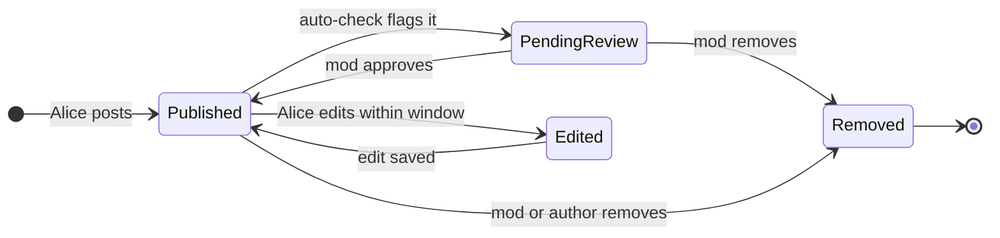

That is the whole lifecycle. Everything we add later (voting, threading, ranking, shadow-bans) is a detail on top of this state machine.

> **Take this with you.** A comment system is a state machine for small pieces of text, run millions of times, with one hard read-to-write ratio: 1,000 reads for every write.

---

## Step 2: Ask the right questions

In a real interview, sit quietly for two minutes and write down what you want to ask. Not twenty questions. Five good ones.

<details markdown="1">
<summary><b>Show: 5 questions that change the design</b></summary>

1. **Depth limit.** Can a reply to a reply go forever? Or is there a cap? Reddit caps visible nesting at about 10 levels. HackerNews stops indenting at 8. *Without a cap, one user can reply to themselves 200 times deep and break your fetch query.*

2. **Sort orders.** What sorts does the UI need? Newest, oldest, top, hot, controversial? *Each sort needs its own cache key. "Hot" requires periodic recomputation as time decays the score.*

3. **Moderation model.** Pre-publish review (every comment waits for a mod) or post-publish takedown (every comment goes live, mods react)? Auto-detection? User reports? *Pre-publish is a completely different system from post-publish. Every high-volume site picks post-publish.*

4. **Delete semantics.** When Alice deletes a comment with 50 replies, what happens to the replies? Do they orphan? *Almost always: soft delete with a tombstone so the thread structure survives.*

5. **Real-time updates.** When someone posts a reply, does my screen update live? *Live updates need a WebSocket fan-out, which is a different design entirely.*

The three questions that change the architecture most are depth limit, sort order, and moderation model. If you only ask "how many comments per day," you have already lost the interesting design space.

</details>

---

## Step 3: How big is this thing?

Same product, two very different sites.

| Site | Comments/day | Writes/sec | Reads/sec | Storage/year |
|------|--------------|------------|-----------|--------------|
| Small blog | 100 | ~0.001 | ~1 | ~7 MB |
| Viral site | 1,000,000 | ~12 steady, ~50 peak | ~12k steady, ~40k peak | ~250 GB |

<details markdown="1">
<summary><b>Show: how the numbers come out</b></summary>

**Small blog:**

- 100 comments/day at 200 bytes each = about 7 MB per year. A laptop handles this.
- 1,000:1 read-to-write ratio means about 1 read per second.

**Viral site:**

- 1,000,000 / 86,400 = ~12 writes per second steady. Peak is 3-5x: 40-60 writes/sec.
- At 1,000:1: ~12,000 reads/second steady, ~40,000 at peak.
- 1M comments/day × 365 × 300 bytes = ~110 GB/year for text alone. Add votes, flags, edit history: ~250 GB/year.

**The number that matters most:** the top 1% of articles get 80% of the comments. In a viral moment, one article drives 1,000 votes per second on a single popular comment row. That "hot row" is the central scaling problem, not average write throughput.

**Reads beat writes 1,000 to 1.** The entire architecture exists to serve the read path fast. Most candidates design for writes and get this exactly backwards.

</details>

> **Take this with you.** Steady-state write throughput is small. The architecture is built around the 40,000 reads/second and the burst behavior of one viral comment producing 100x load on one database row.

---

## Step 4: The smallest thing that works

Forget viral scale. We are a small blog with 10 articles and 100 comments a day. Three boxes. Nothing else.

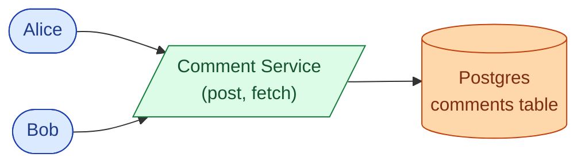

The end-to-end flow is a single table and a handful of endpoints.

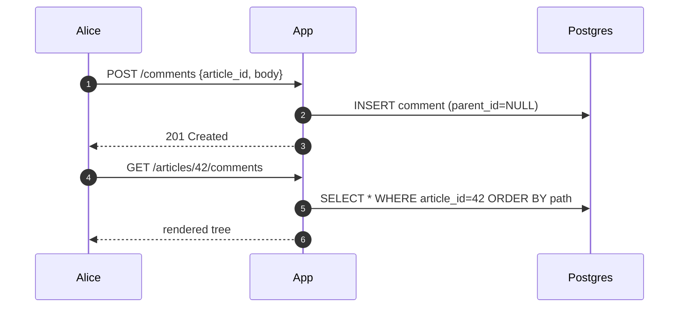

<details markdown="1">
<summary><b>Show: the one table</b></summary>

```sql
CREATE TABLE comments (
    comment_id  BIGINT PRIMARY KEY,
    article_id  BIGINT NOT NULL,
    parent_id   BIGINT,             -- NULL = top-level
    path        TEXT NOT NULL,      -- "/123/456/789"
    depth       INT NOT NULL,
    author_id   BIGINT,
    body        TEXT NOT NULL,
    score       INT NOT NULL DEFAULT 0,
    state       SMALLINT NOT NULL DEFAULT 1,  -- 1=published, 5=removed_self
    created_at  TIMESTAMPTZ NOT NULL DEFAULT NOW()
);

CREATE INDEX idx_comments_article ON comments (article_id, created_at DESC);
CREATE INDEX idx_comments_path    ON comments (article_id, path text_pattern_ops);
```

Two columns do the heavy lifting. `parent_id` keeps inserts simple. `path` makes subtree reads a single index scan instead of a recursive query. They cannot drift apart because `path` is computed from the parent's path at insert time.

</details>

> **Take this with you.** Always start from the smallest thing that works. The interesting part of the interview is what happens next.

---

## Step 5: The first crack - storing the tree

The blog grows. One article gets 800 comments. The page takes 4 seconds to load.

You look at your database query. It is a recursive `WITH RECURSIVE` that joins the table to itself at each level of nesting. Eight levels deep means eight joins.

This is the tree-storage problem. You need four things to work well:

1. Insert a new comment cheaply. This is the hot write path.
2. Fetch a whole article's thread in one query. This is the hot read path.
3. Delete a subtree without orphaning children.
4. Cap depth to stop abuse.

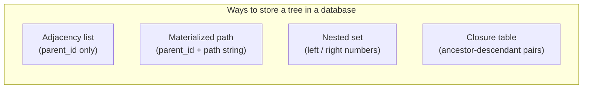

<details markdown="1">
<summary><b>Show: the four approaches compared</b></summary>

**1. Adjacency list.** Each row stores its parent's ID.

- Insert: one write, cheap.
- Fetch thread: recursive query, 8 joins for depth-8 tree.
- Delete subtree: find descendants first, then delete.

Works fine at small scale. The recursive query becomes a problem at a few hundred comments per article.

**2. Materialized path.** Each row stores its full ancestor chain, like `/123/456/789`.

- Insert: one extra SELECT to read parent's path. Then build `new_path = parent.path + "/" + own_id`.
- Fetch thread: `WHERE path LIKE '/123/%'` is a single index range scan. No recursion.
- Delete subtree: `DELETE WHERE path LIKE '/456/%'` is also one scan.
- Move subtree: expensive (rewrite every descendant's path). Fine for comments, which almost never move.

**3. Nested set.** Each row gets two numbers. Descendants sit between the parent's numbers.

- Reads are fast.
- Inserts renumber every row to the right. Comments are insert-heavy. Almost no production system uses this.

**4. Closure table.** A separate table stores every ancestor-descendant pair. A depth-5 comment produces 5 rows in the ancestry table.

- Reads fast via join.
- Inserts amplify: one comment becomes many rows.
- Stack Overflow uses this for some hierarchies.

| Approach | Insert | Fetch full thread | Fetch subtree | Extra storage |
|----------|--------|-------------------|---------------|---------------|
| Adjacency list | Cheap | Recursive query | Recursive | None |
| Materialized path | One extra read | Single prefix scan | Single prefix scan | ~50 bytes/row |
| Nested set | Very expensive | Single range query | Single range query | None |
| Closure table | Many writes | Single join | Single join | One row per ancestor pair |

**The recommendation:** keep both `parent_id` and `path`. Insert path uses `parent_id`. Read path uses `path`. Each is optimized for its job. The 50-byte path string per row is the right trade.

</details>

> **Take this with you.** `parent_id` for writes, `path` for reads. The redundancy costs 50 bytes per row. In exchange you never run a recursive query on the hot read path.

---

## Step 6: Build the architecture, one layer at a time

We have the data model. Now build the system that surrounds it. Add one layer at a time and say why.

### v1: just the app and the database

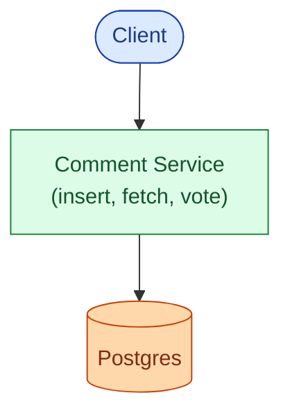

This handles the blog fine. The database is bored.

### v2: separate write and read paths

Reads beat writes 1,000 to 1. Add a **Read Service** backed by Redis to serve the rendered tree. The Comment Service keeps handling writes. They have different shapes and different scaling needs.

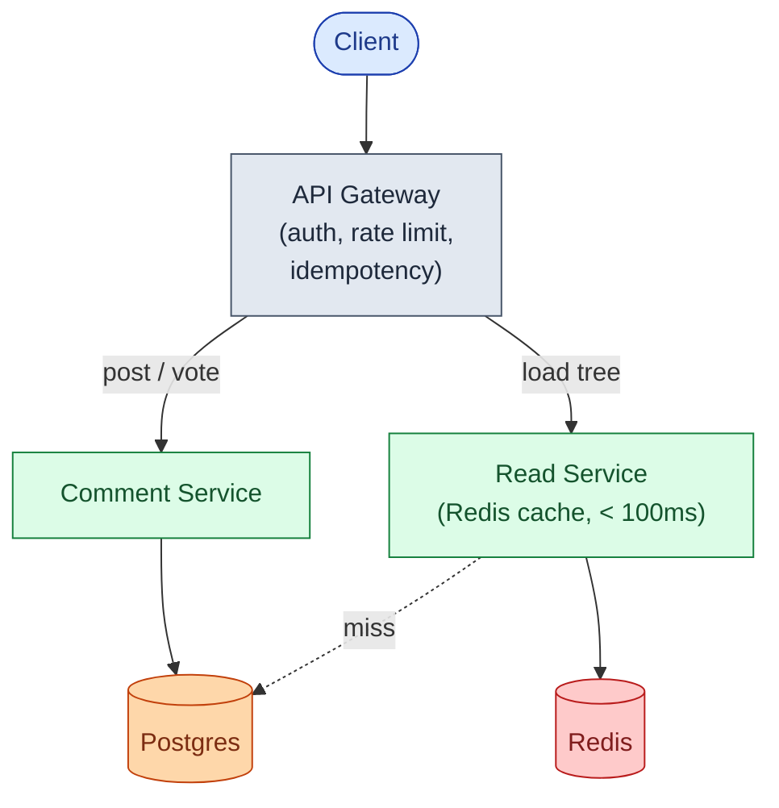

### v3: solve the hot-row problem for votes

A comment goes viral. 1,000 users upvote it in 5 seconds. Every `UPDATE comments SET score = score + 1` takes a row-level lock. The 1,000 concurrent updates serialize behind that lock. The database CPU spikes on one row.

Add a **Vote Aggregator**. Votes go to Redis as atomic increments. A background worker batches them into Postgres every 5 seconds. 1,000 votes become one UPDATE.

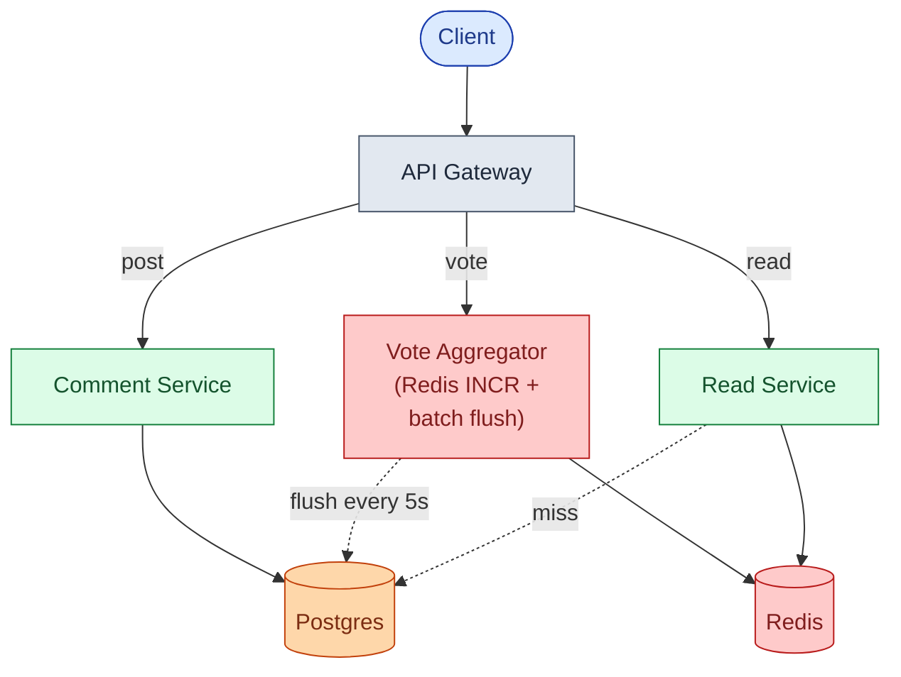

### v4: moderation, notifications, CDN

Moderation (ML toxicity, link scanning) must not slow down the write path. If the classifier takes 300ms, the user should not wait for it. Add **Kafka**. Everything reactive becomes a consumer.

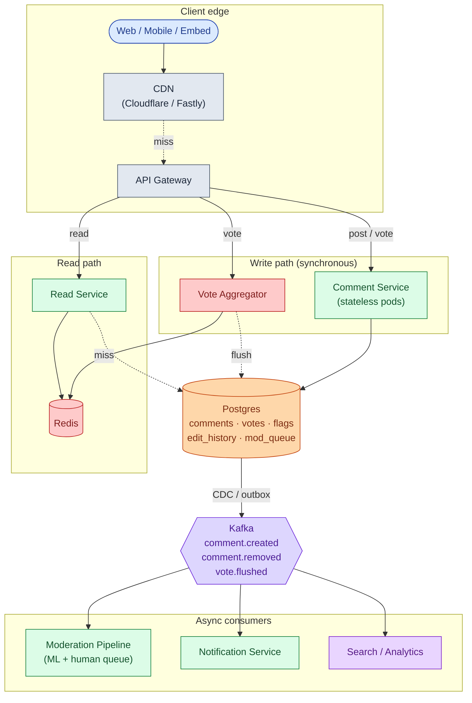

Each box in one line:

| Box | What it does |
|-----|--------------|
| **API Gateway** | Auth, per-user rate limit, idempotency key dedup. |
| **CDN** | Caches rendered comment trees at the edge. 99% of reads stop here. |
| **Comment Service** | Validates, inserts, emits events. Stateless pods. |
| **Vote Aggregator** | Redis INCR per click, batch flush to Postgres every 5 seconds. |
| **Read Service** | Assembles tree, applies sort, fills Redis cache. Falls back to replica on miss. |
| **Kafka** | Carries events to async consumers without slowing the write path. |
| **Moderation Pipeline** | ML toxicity + link scan + human review queue. Downstream of Kafka. |

> **Take this with you.** If the moderation service crashes at 3 a.m., new comments still post. They just get classified a few minutes late. Anything reactive lives after Kafka, not before.

---

## Step 7: One comment, all the way through

Alice posts a reply. Watch what happens.

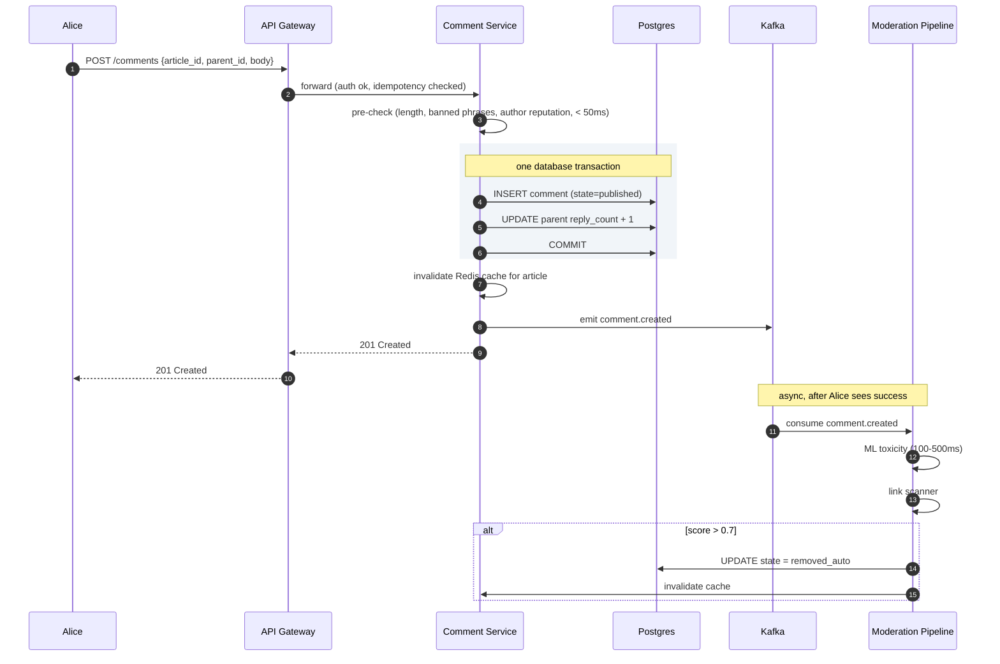

Three details worth pointing at:

1. The comment insert and the `reply_count` increment are in **one transaction**. A crash rolls both back cleanly.
2. The ML classifier runs after Alice has already seen "201 Created." It does not block her.
3. If the classifier removes the comment after Alice posted it, she sees the tombstone on her next refresh. The write path never waits for moderation.

---

## Step 8: The vote hot-row problem

A comment goes viral. 1,000 users upvote it in 5 seconds.

The naive design hits the same database row 1,000 times:

```sql
UPDATE comments SET score = score + 1 WHERE comment_id = 42;
```

Every UPDATE takes a row-level lock. The 1,000 updates serialize. The database CPU spikes. Everything slows down.

The fix uses Redis as a buffer:

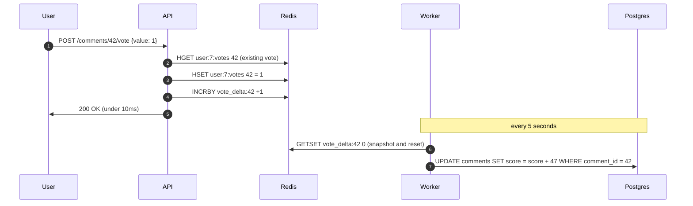

Three parts:

1. **Redis INCR per click.** `INCRBY vote_delta:42 +1` is a memory operation. Returns in under 1ms.
2. **User hash for dedup.** `user:7:votes` stores each user's current vote per comment. A user switching from down (-1) to up (+1) produces a delta of +2 without double-counting.
3. **Batch flush every 5 seconds.** The background worker reads all `vote_delta:*` keys and writes one UPDATE per comment. 1,000 votes become one database write. The hot row disappears.

<details markdown="1">
<summary><b>Show: the vote dedup logic</b></summary>

```python
def cast_vote(user_id, comment_id, new_value):
    key_user  = f"user:{user_id}:votes"
    key_delta = f"vote_delta:{comment_id}"

    existing = int(redis.hget(key_user, comment_id) or 0)
    delta = new_value - existing

    if delta != 0:
        with redis.pipeline() as p:
            p.incrby(key_delta, delta)
            if new_value == 0:
                p.hdel(key_user, comment_id)
            else:
                p.hset(key_user, comment_id, new_value)
            p.execute()
```

The flush worker:

```python
def flush_vote_deltas():
    keys = redis.keys("vote_delta:*")
    pipeline = redis.pipeline()
    for k in keys:
        pipeline.getset(k, 0)       # read and reset atomically
    deltas = pipeline.execute()

    with db.transaction():
        for k, d in zip(keys, deltas):
            d = int(d or 0)
            if d == 0:
                continue
            cid = int(k.split(":")[1])
            db.execute(
                "UPDATE comments SET score = score + %s WHERE comment_id = %s",
                d, cid
            )
```

</details>

The trade-off: scores lag actual votes by up to 5 seconds. Most users do not notice. To protect against Redis crash losing the unflushed delta, enable Redis AOF plus a replica, or write votes to Kafka (durable) and have the worker read from Kafka.

> **Take this with you.** Vote counts, like counts, view counts: anything that aggregates writes to a single row uses this pattern. INCR in Redis, batch flush to the database.

---

## Step 9: The moderation pipeline

Comments attract spam, hate speech, and scam links. Every high-volume site runs a confidence-routed pipeline. Fast cheap checks on the write path. Slower expensive checks off Kafka.

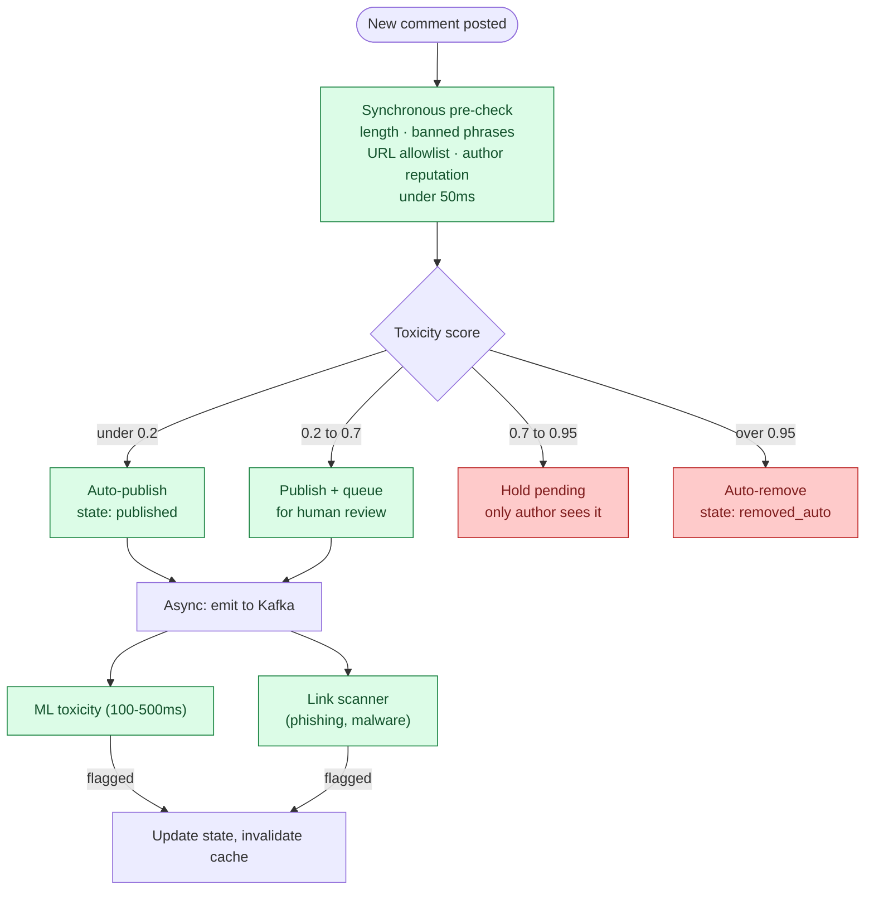

The confidence bands let you tune false-positive vs false-negative without changing code. Raising the 0.95 threshold auto-removes more at the cost of more false positives. Raising the 0.7 threshold sends more to human review.

**Shadow ban.** A spammer keeps creating accounts. Instead of banning and giving them a signal, shadow-ban: their comment looks published to them but is invisible to everyone else. They waste effort posting. The render logic: if the requesting user is the comment's author, show the comment regardless of state.

**User reports** feed the same human queue. A report from a high-reputation user weighs more than one from a new account. Ten reports within an hour auto-hides the comment pending review.

> **Take this with you.** Pre-publish review does not scale past a few comments per minute. Post-publish with fast async takedown is what every high-volume site does.

---

## Follow-up questions

Try answering each in 2 to 4 sentences before opening the solution.

1. **Soft delete of a popular comment.** A comment with 200 replies is deleted by its author. What happens to the replies? Walk through the data and the UI.

2. **Spam burst.** A user posts 1,000 comments in 10 seconds via a script. Where does this get caught? How do you avoid blocking a legitimate user who posts 5 comments in a minute during a hot discussion?

3. **Edit history.** A user edits their comment 3 hours after posting. The original said something they want to walk back. Should other users see "(edited)"? Should they see the original? What about for moderation?

4. **The "hot" sort algorithm.** Define Reddit's "hot" ranking. Why does it decay with time? What happens if you sort by score alone?

5. **Cache invalidation.** A new comment is posted. Your cached tree is now stale. Do you invalidate the whole cache key, do partial updates, or accept staleness? What is the trade-off?

6. **Report storm.** 50 users report the same comment within 5 minutes. Do you wait for a human, or auto-hide it? Where does the threshold come from?

7. **Real-time updates.** Someone wants the comment count and replies to update live on the article page. Sketch the WebSocket fan-out without melting the server when an article has 10,000 concurrent viewers.

8. **Pagination on a huge thread.** A 5,000-comment thread cannot ship to the client all at once. What is your paging strategy? How do you handle "load more replies" when one child has 80 sub-replies?

9. **Brigading.** A comment thread suddenly attracts a flood of accounts with no prior activity all downvoting one comment. How do you detect this and what do you do?

10. **GDPR delete.** A user requests deletion of all their comments. They have 4,000 comments going back 5 years, many with replies underneath. What happens?

---

## Related problems

- **[Approval Management (011)](../011-approval-management/question.md).** The moderation queue is a workflow engine with state-machine and role-routing patterns. The per-mod queue parallels the per-approver dashboard.
- **[Todo List Sharing (013)](../013-todo-list-sharing/question.md).** The soft-delete-with-tombstone pattern shows up in any system where deletes must preserve structure.
- **[Notification System (010)](../010-notification-system/question.md).** Replies and mentions fan out through this notification pipeline. The comment system emits events; the notification system delivers them.
- **[Write-Heavy System Patterns (018)](../018-write-heavy-patterns/question.md).** The vote aggregation and Kafka-first write pattern are textbook examples from this problem area.
