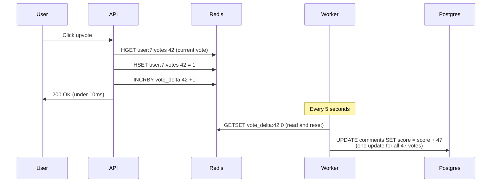
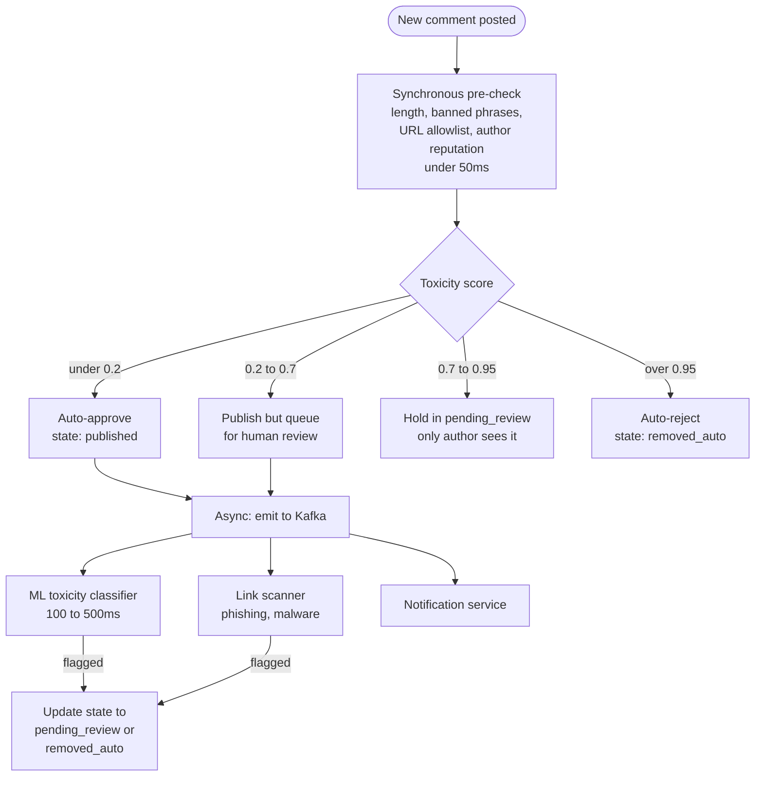
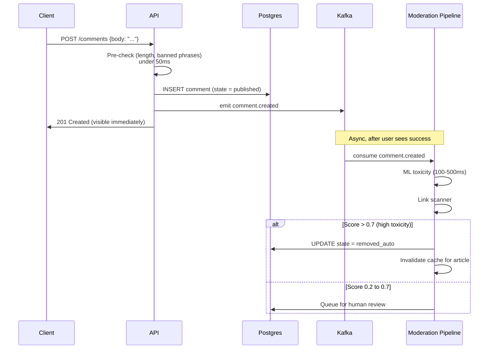

## The scene

You sit down. The interviewer puts down their coffee.

> *"We run a news site. Every article has a comment section. People reply to each other. People upvote and downvote. Sometimes a comment goes viral and gets 5,000 replies. Sometimes a comment is spam and a moderator removes it. Build the comment system. Think Disqus, HackerNews, Reddit-style."*

It looks like a simple CRUD app. It is not. Comments are the smallest piece of user content you can imagine, and they pack in every hard problem at once:

- Nested data (a reply to a reply to a reply)
- Heavy reads with bursty writes
- Voting that creates "hot rows" in the database
- Soft delete that has to keep the thread structure alive
- Ranking that is smarter than "newest first"
- A moderation pipeline that has to outrun trolls

If you start with "comments table with a parent_id, done," you skip every interesting question. The real ones are:

- How do you fetch a 5,000-node thread without making 5,000 database calls?
- How do you count 1,000 upvotes in 5 seconds without one row in the database locking everything else?
- How do you delete a comment that has 200 replies under it without breaking the thread?
- How does the moderation system decide what is spam without a human reading every single comment?

We will walk this from a tiny 10-article blog to a viral site doing 1 million comments a day. At every step we will name what breaks first, then add the smallest fix that solves it.

---

## Step 1: Ask the right questions

Before you draw anything, sit for five minutes. Write down questions you would ask the interviewer.

A good answer here is not "twenty questions about every edge case." It is the small handful of questions that change the design if answered differently.

<details markdown="1">
<summary><b>Show: 10 questions that matter</b></summary>

1. **Depth limit.** Can a reply to a reply to a reply go on forever? Or is there a cap? Reddit caps the visible nesting around 10 levels. HackerNews stops indenting after 8 levels. *Without a cap, one user can reply to themselves 200 times deep and break your fetch query.*

2. **Edit history.** Can users edit comments? Forever, or only for a short window? Do we keep the old versions? *The 5-minute edit window is the common pattern. No history means someone can change "I love this" to "I hate this" after people reply.*

3. **Voting model.** Upvote only (like Facebook reactions) or up and down? Can a user change their vote? *Downvotes change moderation incentives and need extra logic to avoid double-counting.*

4. **Sort orders.** What sorts does the UI need? Newest, oldest, top, hot, controversial? *Each sort needs its own cache and some are expensive to compute live.*

5. **Moderation model.** Auto-detect spam? Human mods? User reports? All three? Pre-publish review (every comment waits for a mod) or post-publish takedown (every comment goes live, mods react)? *Pre-publish is a completely different system from post-publish.*

6. **Delete semantics.** When a user deletes a comment that has 50 replies, what happens? Do we orphan the replies? Tombstone? Hard delete? *Almost always: soft delete with a tombstone so the thread structure survives.*

7. **Read vs write ratio.** How many reads per write? News articles get read 100 to 1000 times more than they get commented on. *Caching the rendered tree dominates the whole architecture.*

8. **Real-time updates.** When someone posts a reply, does my screen update live? Or only on refresh? *Live updates need a WebSocket fan-out, which is a different design.*

9. **Auth.** Anonymous comments allowed? Login required? *Anonymous changes the abuse story.*

10. **Notifications.** When someone replies to me, do I get pinged? *Usually a separate service that listens to events from the comment system.*

The three questions that change the architecture the most are **depth limit**, **sort order**, and **moderation model**. If you only ask "how many comments per day," you have already lost the interesting design space.

</details>

---

## Step 2: How big is this thing?

Same problem, two scales. Do the math.

**Small blog:**

- 10 articles per day
- 100 comments per day across all articles
- Each comment about 200 bytes

**Viral site:**

- 100,000 articles in the active set
- 1 million comments per day
- Top 1% of articles get 80% of the comments
- 300 bytes per comment on average
- Read-to-write ratio: 1000 to 1

For the viral site, compute these numbers: writes per second (steady and peak), reads per second (steady and peak), storage per year, and peak votes per second on the hottest comment in a viral moment.

<details markdown="1">
<summary><b>Show: the math at both scales</b></summary>

**Small blog:**

- 100 comments/day = about 1 comment every 15 minutes. Trivial.
- Reads at 1000:1 = about 1 read per second.
- Storage: 100 x 365 x 200 bytes = about 7MB per year. Tiny.

A laptop runs this. Ship it in a weekend with one Postgres database and no cache.

**Viral site:**

- 1,000,000 / 86,400 = about 12 writes per second steady.
- Peak is 3 to 5 times higher: 40 to 60 writes per second.
- Reads at 1000:1 = about 12,000 reads per second steady, 40,000 reads per second at peak.
- Storage: 1M x 365 x 300 bytes = about 110GB per year for comment text, about 250GB per year once you add votes, flags, and edit history.

**What the math is telling you:**

The total numbers are not huge. Steady-state load is small. A laptop could handle the average writes.

The real problems are:

1. **40,000 reads per second at peak**, concentrated on a few hot articles. A naive recursive query to the database on every page load would melt the database. **The cache layer is not optional.**

2. **1,000 votes per second on one hot comment** in a viral moment. That is a "hot row" problem in the database. One row gets hammered while everything else sits idle.

Storage is small enough that you do not need to shard for capacity. You shard so one bad article does not slow down the others.

> **Why this matters:** Reads beat writes 1000 to 1. The architecture is built around the read path (caching the rendered tree), not around write throughput. Most candidates design for writes and get this exactly backwards.

</details>

---

## Step 3: How do you store the tree?

This is the central decision. You have a tree of comments. How do you store a tree in a database that thinks in rows and columns?

You need four things to work well:

1. **Insert a new comment cheaply.** This is the hot write path.
2. **Fetch a whole thread for an article cheaply.** This is the hot read path.
3. **Delete a subtree cheaply.** Rare, but it happens.
4. **Move a subtree.** Very rare for comments.

There are four classic ways to store a tree in a database. Before peeking, try to guess the pros and cons of each.

<details markdown="1">
<summary><b>Show: the four approaches compared</b></summary>

**1. Adjacency list (parent pointer).**

Each row stores its parent's ID. The tree is built by pointing up.

```sql
CREATE TABLE comments (
    comment_id  BIGINT PRIMARY KEY,
    article_id  BIGINT NOT NULL,
    parent_id   BIGINT,                    -- NULL = top-level comment
    body        TEXT,
    created_at  TIMESTAMPTZ
);
```

Inserts are easy: just point to your parent. But fetching a whole thread needs a recursive query (`WITH RECURSIVE` in Postgres). A 5,000-comment thread at depth 8 means 8 joins. Workable but slow.

**2. Materialized path.**

Each row stores its full ancestor chain like `/123/456/789`, so the database can fetch an entire subtree with one prefix scan.

```sql
CREATE TABLE comments (
    comment_id  BIGINT PRIMARY KEY,
    article_id  BIGINT NOT NULL,
    path        TEXT NOT NULL,             -- "/123/456/789" = full ancestor chain
    depth       INT NOT NULL,
    body        TEXT,
    created_at  TIMESTAMPTZ
);
```

A reply's path is `parent.path + "/" + own_id`. Inserts cost one extra SELECT to read the parent's path. Fetching everything under a comment is `WHERE path LIKE '/123/%'`. One query, no recursion. Moving a subtree is expensive (you rewrite the path of every descendant), but for comments you almost never do that.

**3. Nested set (left/right numbers).**

Each row gets two numbers. Descendants sit between the parent's numbers. Fast reads, but inserts are brutal because every row to the right has to be renumbered. Almost no production comment system uses this. Comments are insert-heavy, and this is the wrong shape for inserts.

**4. Closure table.**

A separate table stores every ancestor-descendant pair. A comment at depth 5 produces 5 rows in the ancestry table. Reads are fast. Inserts amplify (one comment becomes many rows). Stack Overflow uses something like this for some hierarchies. Heavy on writes.

| Approach | Insert | Fetch subtree | Fetch full article | Move | Extra storage |
|----------|--------|---------------|--------------------|------|---------------|
| Adjacency list | Cheap | Recursive query | Single query, build tree in app | Cheap | None |
| Materialized path | Cheap (one extra read) | Single prefix scan | Single query | Expensive | One string per row |
| Nested set | Very expensive | Single range query | Single query | Very expensive | None |
| Closure table | Many writes per insert | Single join | Single join | Cheap | One row per ancestor pair |

**The recommendation:** Use **adjacency list AND materialized path together**. Keep `parent_id` because it is the natural shape for inserts and "who is my parent." Also keep `path` so subtree fetches are one query with a prefix index.

The two columns cannot drift apart because `path` is computed from the parent's path at insert time. You eat about 50 bytes per row for the path string. In exchange, you never run a recursive query on the hot read path.

> **Why this matters:** Doing both is not "over-engineering." It is exactly the right amount of engineering. Insert path uses `parent_id`. Read path uses `path`. Each is optimized for its job.

</details>

---

## Step 4: Draw the system

You know how comments are stored. Now draw the boxes around the database.

Try to fill in the missing pieces. Think about: where do comments come in, where do votes go, what serves the rendered tree, where does moderation happen.

```
            Client (web, mobile, embed iframe)
                       |
                       v
              +-----------------+
              |    [ ? ]        |   auth, rate limit, bot detection
              +-----+-------+---+
                    |       |
       post / vote  |       |   load comments
                    |       |
                    v       v
            +----------+   +----------+
            |  [ ? ]   |   |  [ ? ]   |   rendered comment trees
            | (writes) |   |          |   served from memory
            +--+----+--+   +----+-----+
               |    |           |
               |    v           v
               |  +----------+  +-------------+
               |  |  [ ? ]   |  |  Read       |
               |  | (Redis   |  |  Replica    |
               |  |  INCR +  |  |  (Postgres) |
               |  |  batch)  |  +-------------+
               |  +----+-----+
               |       |
               v       v
            +-----------------+
            |  Comments DB    |   source of truth
            |  (Postgres)     |
            +--------+--------+
                     |  async via Kafka
                     v
            +-----------------+
            |    [ ? ]        |   spam classifier,
            |                 |   human review queue
            +-----------------+
```

<details markdown="1">
<summary><b>Show: the full architecture</b></summary>

```
            Client (web, mobile, embed iframe)
                       |
                       v
              +-----------------+
              |  API Gateway    |   auth, per-user rate limit,
              |  + WAF          |   simple bot detection
              +-----+-------+---+
                    |       |
       post / vote  |       |   load comments
                    |       |
                    v       v
            +----------+   +-------------+
            | Comment  |   |  Read       |
            | Service  |   |  Service    |   serves rendered
            | (writes) |   |  (Redis +   |   trees from cache
            |          |   |   CDN)      |
            +--+----+--+   +----+--------+
               |    |           |
               |    v           v
               |  +----------+  +-------------+
               |  | Vote     |  | Read        |
               |  | Aggreg.  |  | Replica     |
               |  | (Redis   |  | (Postgres)  |
               |  |  INCR +  |  +-------------+
               |  |  batch   |
               |  |  flush)  |
               |  +----+-----+
               |       |
               v       v
            +-----------------+
            |  Comments DB    |   tables: comments, votes,
            |  (Postgres,     |   flags, edits, mod_queue
            |   primary)      |
            +--------+--------+
                     |  async via Kafka
                     v
            +-----------------+
            |  Moderation     |   auto: profanity + ML toxicity
            |  Pipeline       |   manual: human queue
            |                 |   reactive: user reports
            +-----------------+
```

What each piece does, in one line:

- **API Gateway.** Auth (who is this), rate limit (no bot floods), idempotency (prevent duplicate posts on mobile retry).
- **Comment Service.** Validates the comment, runs a fast pre-check for obvious spam, writes to Postgres, sends an event to Kafka.
- **Read Service.** Serves the rendered comment tree. Reads from Redis cache. Falls back to a Postgres read replica on miss.
- **Vote Aggregator.** Takes votes, increments a Redis counter, returns success immediately. A background job batches the votes into one database update every 5 seconds.
- **Postgres.** Source of truth. Stores all comments, votes, flags, edit history, and the moderation queue.
- **Kafka.** Carries events to downstream consumers (moderation, notifications, search, analytics) without slowing down the write path.
- **Moderation Pipeline.** Runs ML toxicity classifiers and link scanners on every comment after it is published. Flags suspicious ones for human review or auto-removes the worst.

> **Why is the read service separate from the comment service?** Because reads and writes have totally different shapes. Writes are small and fast. Reads need to assemble a tree, sort it, render it, and serve it under 100ms. Mixing them in one service means one slow read can starve writes.

</details>

---

## Step 5: The vote hot-row problem

A comment goes viral. 1,000 users upvote it in 5 seconds. Your naive design:

```sql
UPDATE comments SET score = score + 1 WHERE comment_id = 42;
INSERT INTO votes (user_id, comment_id, value) VALUES (?, 42, 1);
```

What happens? Why is this a problem? Design something that handles 1,000 votes per second on a single comment without melting the database.

<details markdown="1">
<summary><b>Show: the hot-row problem and the fix</b></summary>

**Why the naive design melts:**

Every UPDATE on the same row takes a row-level lock. The 1,000 concurrent UPDATEs serialize, one at a time, behind that lock. Every voter waits. Postgres's write-ahead log fills with 1,000 row-version entries for the same row. Other queries trying to read this comment wait too. Replication lag grows because the primary is busy. The database's CPU spikes on one row while everything else slows down.

That is the "hot row" problem.

**The fix has three parts.**



**1. Decouple vote from score update.** The user's click does not need to update the database row right now. It needs the vote recorded (for dedup) and the score eventually correct. So `POST /comments/42/vote` goes to the Vote Aggregator. The aggregator does:

- `INCRBY vote_delta:42 1` in Redis (constant time, in memory)
- `HSET user:7:votes 42 1` to remember this user's vote (for dedup)
- Returns 200 to the user in about 5ms

**2. Batch-flush to the database.** A background worker runs every 5 seconds. It reads all the `vote_delta:*` keys. For each comment, it runs one UPDATE with the accumulated delta:

```sql
UPDATE comments SET score = score + 47 WHERE comment_id = 42;
```

1,000 votes in 5 seconds become **one UPDATE**, not 1,000. The hot row sees one write per 5 seconds. The problem disappears.

**3. Dedup at the Redis layer.** A user clicks upvote twice. Or changes from up to down. The `user:7:votes` hash holds their current vote on each comment. On submit:

- Read existing vote: was 0
- New vote is 1
- Delta = +1
- Store new vote, apply delta

If they switch from down (-1) to up (+1), the delta is +2. If they click upvote when already upvoted, the delta is 0 and nothing changes.

> **Why batch every 5 seconds and not after every vote?** Because if 10,000 users upvote the same comment in the same second, you would hit the database with 10,000 UPDATE statements on the same row. They would all serialize, the database would lock up. Instead, INCR in Redis is just memory; then one database write per 5 seconds covers all 10,000 votes.

**Trade-offs:**

- The displayed score lags actual votes by up to 5 seconds. Most users do not notice.
- Up to 5 seconds of votes could be lost if Redis crashes before the flush. Fix: enable Redis AOF (append-only file) + a replica, or write the vote to Kafka first (durable) and have the worker read from Kafka.

This pattern is the standard answer for "high write rate on a single counter." Vote counts, view counts, like counts, anything that aggregates.

</details>

---

## Step 6: The moderation pipeline

Comments attract spam, hate speech, NSFW content, scam links. The interviewer asks: walk me through how a comment is moderated, from posted to either visible-to-everyone or removed.

You have three input signals:

1. **Automated detection** at post time
2. **User reports** after the fact
3. **Manual scanning** by mods

Sketch the pipeline. What states does a comment pass through?

<details markdown="1">
<summary><b>Show: the states and the pipeline</b></summary>

**States a comment can be in:**

| State | Visible to | How it got here |
|-------|-----------|-----------------|
| `published` | Everyone | Posted and passed auto-checks |
| `pending_review` | Author only | Auto-checker had medium confidence it might be bad |
| `shadow_banned` | Author only | Author is a known bad actor; comment looks live to them, invisible to everyone else |
| `removed_auto` | No one (but a tombstone keeps the thread shape) | Auto-checker was very confident it was spam |
| `removed_manual` | No one | A human mod removed it |
| `removed_self` | No one | Author deleted it |

**The pipeline:**



**The flow when a user posts a comment:**



**Why the pipeline has fast + slow stages:**

The synchronous pre-check is the only thing on the hot write path. It must finish in about 50ms because it blocks the user. So it does only cheap things:

- Length check
- Bloom filter pass against banned phrases
- Reputation lookup (is this user already shadow-banned)
- URL allowlist

Async checks are slower and more expensive. ML toxicity models take 100 to 500ms per inference. Link scanning calls an external API. These run **after** the comment is already visible. If they flag it, the comment's state updates and the cache invalidates. The user sees their comment briefly, then sees a "your comment was removed" notice if it got flagged.

**User reports** are the third input. A "report" button lets users flag content. Reports queue into the same human-review tool, sorted by report count, the reporter's reputation, the comment's auto-toxicity score, and the author's reputation.

**Why not pre-publish review for everything?** Two reasons:

1. **Latency.** Users expect comments to appear immediately. Waiting for a human to approve breaks the experience.
2. **Volume.** At 1 million comments per day, even 1 second of human attention per comment needs about 10,000 mod hours per day. Not viable.

Post-publish with fast async takedown is what every high-volume site does.

**The shadow ban trick.** A user spams. You ban them. They make a new account. Instead, shadow-ban: their comments look published *to them* but are invisible to everyone else. They waste effort posting comments nobody sees, and the system gives them no signal that something is wrong, so they are less likely to spawn alternate accounts. On render: if the requesting user is the comment's author, show the comment regardless of state. Otherwise hide it.

> **Why batch-route by confidence score?** Because moderation costs scale with how many comments a human looks at. If everything goes to a human, mods cannot keep up. If nothing goes to a human, garbage stays up. The confidence bands (auto-approve / queue / shadow / auto-reject) let you tune the false-positive vs false-negative balance.

</details>

---

## Step 7: The render flow

A user loads `/articles/news-of-the-day`. The article is hot, getting 10,000 loads per minute. Sketch the read path.

<details markdown="1">
<summary><b>Show: the read path with cache tiering</b></summary>

```
        GET /articles/news-of-the-day/comments
                   |
                   v
        +------------------+
        |   CDN edge       |   Cloudflare, Fastly.
        |                  |   99% of reads stop here.
        +--------+---------+
                 | miss
                 v
        +------------------+
        |  Read Cache      |   Key: article:42:tree:sort=hot
        |  (Redis)         |   Value: rendered JSON tree
        |                  |   TTL: 60 seconds
        +--------+---------+
                 | miss
                 v
        +------------------+
        |  Read Service    |
        |  - SELECT all    |
        |    comments      |
        |    WHERE         |
        |    article_id=42 |
        |  - Build tree    |
        |    in memory     |
        |  - Apply sort    |
        |  - Render JSON   |
        |  - Cache for 60s |
        +--------+---------+
                 |
                 v
        +------------------+
        |  Read Replica    |
        |  (Postgres)      |
        +------------------+
```

**Three layers, three TTLs:**

1. **CDN edge.** For hot articles, the CDN holds the rendered JSON. 99% of reads never touch your origin. Refresh from origin every 60 seconds.

2. **Redis cache.** Keyed by `(article_id, sort_order)` because the same article has different trees for "newest" vs "hot" vs "top." TTL 60s. Invalidated on writes.

3. **Read Service.** Runs the single query `SELECT * FROM comments WHERE article_id = X ORDER BY path`. Builds the tree in memory in O(n). Applies the sort. Renders JSON. Writes to Redis.

For cold articles, every read goes to the read replica. A cold article usually has few comments, so the response is small.

> **Why include the sort order in the cache key?** Because users sort differently. "Newest" produces a different tree order from "hot." If you only key by `article_id`, switching sort returns the wrong order or the cache becomes useless because every user invalidates the same key.

</details>

---

## Follow-up questions

Try answering each in 2 to 4 sentences before opening the solution.

1. **Soft delete of a popular comment.** A comment with 200 replies under it gets deleted by its author. What happens to the replies? Walk through the data and the UI.

2. **Spam burst.** A user posts 1,000 comments in 10 seconds via a script. Where does this get caught? How do you avoid blocking a legitimate user who posts 5 comments in a minute during a hot discussion?

3. **Edit history.** A user edits their comment 3 hours after posting. The original said something they want to walk back. Should other users see "(edited)"? Should they be able to see the original? What about for moderation?

4. **The "hot" sort algorithm.** Define Reddit's "hot" ranking. Why does it decay with time? What happens if you sort by score alone?

5. **Cache invalidation.** A new comment is posted. Your cached tree is now stale. Do you invalidate the whole cache key, do partial updates, or accept staleness? What is the trade-off?

6. **Report storm.** A user reports a comment as spam. 50 others report the same comment within 5 minutes. Do you wait for a human, or auto-hide it? Where does the threshold come from?

7. **Real-time updates.** Someone wants the comment count and replies to update live on the article page. Sketch the WebSocket fan-out without melting the server when an article hits 10,000 concurrent viewers.

8. **Pagination on a huge thread.** A 5,000-comment thread cannot ship to the client all at once. What is your paging strategy? How do you handle "load more replies" when one child has 80 sub-replies?

9. **Brigading.** A comment thread suddenly attracts brigading from another site. A sudden flood of accounts with no prior activity all downvote one comment. How do you detect this and what do you do?

10. **GDPR delete.** A user requests deletion of all their comments. They have 4,000 comments going back 5 years, many with replies underneath. What happens?

---

## Related problems

- **[Approval Management (011)](../011-approval-management/question.md).** The moderation queue is a workflow engine with state-machine plus role-routing patterns. The per-mod queue parallels the per-approver dashboard.
- **[Todo List Sharing (013)](../013-todo-list-sharing/question.md).** The soft-delete-with-tombstone pattern shows up in any system where deletes must preserve structure.
- **[Notification System (010)](../010-notification-system/question.md).** Replies and mentions fan out through this exact notification pipeline. The comment system emits events; the notification system delivers them.
- **[Write-Heavy System Patterns (018)](../018-write-heavy-patterns/question.md).** The vote aggregation and Kafka-first write pattern are textbook examples from this problem area.
