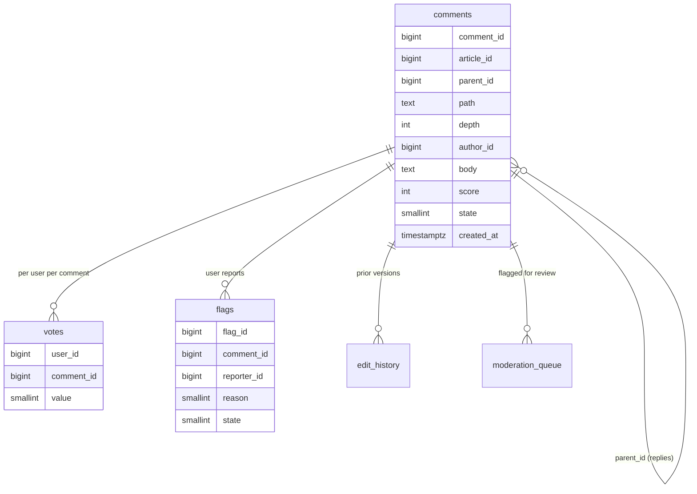
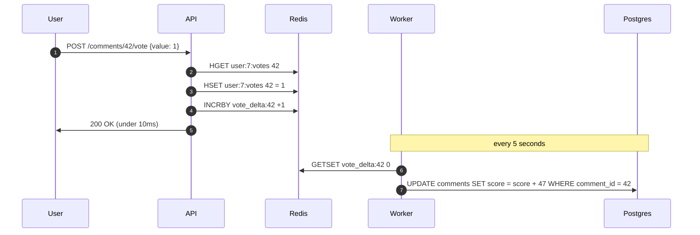
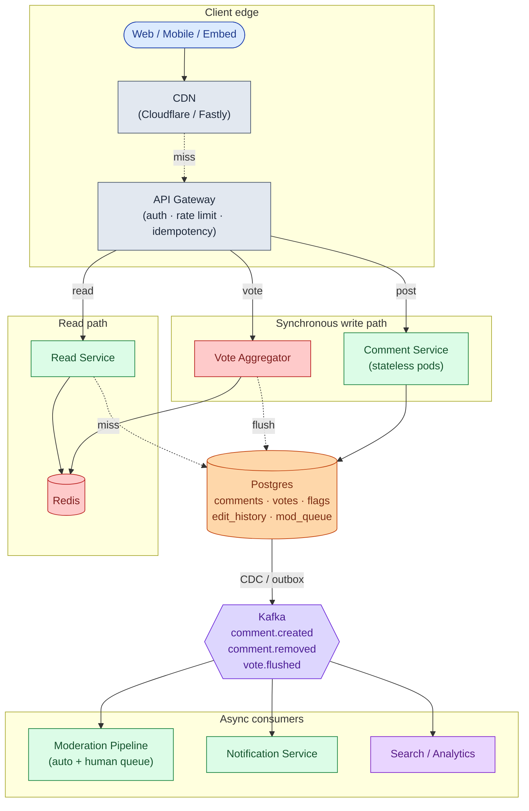
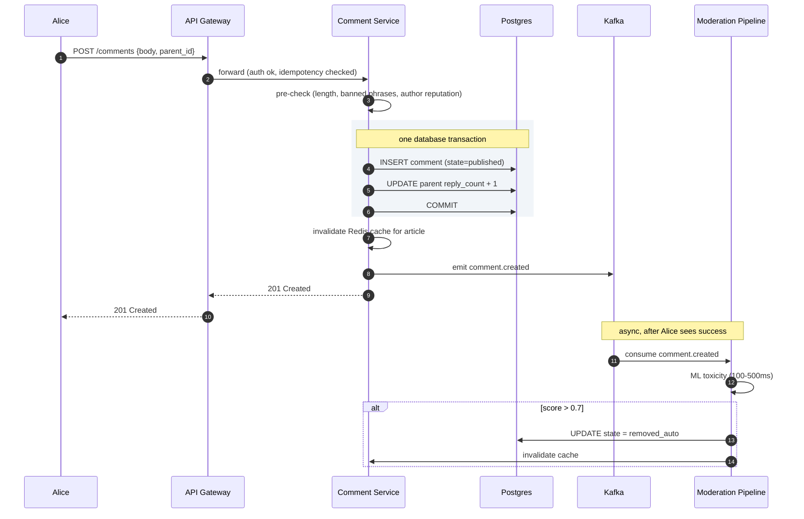
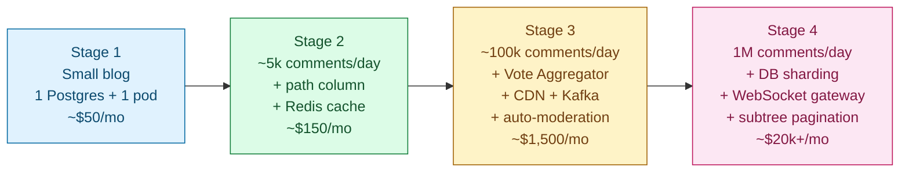

## Solution: Comment System

### The short version

A comment system looks like a CRUD app. Five things make it real:

1. Storing nested data so that fetching a thread is not a recursive walk
2. Surviving 1,000 votes per second on one hot comment
3. Soft-deleting a comment with 200 replies without orphaning them
4. Ranking by something smarter than newest-first
5. A moderation pipeline that scales past human review

The base shape is a Postgres table with two pointers per row: `parent_id` for cheap inserts and a materialized `path` like `/123/456/789` for one-query subtree reads. Votes never write to the comment row directly. They go to Redis as atomic increments, then a background worker batches them into Postgres every 5 seconds. Tree reads come from a per-article cache keyed by `(article_id, sort_order)`. Moderation is a confidence-routed pipeline: fast pre-check on the write path, ML classifier off Kafka after publish.

Scale here is not a throughput story. Steady-state writes are small. What you actually design for is the 1,000:1 read amplification and the burst behavior of one viral comment hammering one database row.

---

### 1. The two questions that matter most

If you only ask two clarifying questions, ask these.

**Pre-publish or post-publish moderation?** Pre-publish (every comment waits for a human) is a completely different system. It does not scale past a few comments per minute. Every high-volume site picks post-publish: comments go live, mods react. This one choice determines half the architecture.

**What sort orders does the UI need?** Each sort order is its own cache key. "Hot" requires periodic recomputation as time decays the score. If you only need "newest," the cache story is simple. If you need "hot," "top," "controversial," and "newest" simultaneously, each article has four cache entries that need independent invalidation.

Everything else (depth cap, edit window, voting model, real-time updates) is important but follows from these two.

---

### 2. The math, in plain numbers

| Scale | Comments/day | Writes/sec | Reads/sec | Storage/year |
|-------|--------------|------------|-----------|--------------|
| Small blog | 100 | ~0.001 | ~1 | ~7 MB |
| Viral site | 1,000,000 | ~12 steady, ~50 peak | ~12k steady, ~40k peak | ~250 GB |

The interesting numbers:

- **40,000 reads/second at peak**, concentrated on a few hot articles. The cache layer handles this. The database never sees most of it.
- **1,000 votes per second on one row** during a viral moment. Hot-row problem. Gets its own machinery.
- **1,000:1 read-to-write ratio.** The architecture exists to serve the read path fast. Designing for write throughput is backwards.
- Storage is small enough that you do not shard for capacity. You shard so one bad article does not slow down the others.

---

### 3. The API

Two endpoints carry the core product. Post a comment and cast a vote. Everything else is reading data back.

```
POST /api/v1/articles/{article_id}/comments
Idempotency-Key: <uuid>

{
  "parent_id": null,          -- null = top-level comment
  "body": "What a take."
}
```

| Status | Meaning |
|--------|---------|
| 201 Created | Published (or author sees it; auto-removed async) |
| 200 OK | Idempotency-Key seen before, returning existing |
| 202 Accepted | Held for moderation review |
| 400 | Body too long or parent_id invalid |
| 403 | Shadow-banned or suspended |
| 409 | Parent comment deleted, cannot reply |
| 429 | Rate limit hit |

```
POST /api/v1/comments/{comment_id}/vote
{ "value": 1 | -1 | 0 }      -- 0 = clear vote
```

```
GET /api/v1/articles/{article_id}/comments?sort=hot&limit=50&cursor=...
```

Small choices worth defending:

- **Idempotency-Key is required on POST.** Mobile retries on timeout. Without it, users get duplicate comments. The key is stored for 24 hours; the same key returns the same response.
- **Vote accepts 0.** Clearing a vote is a common interaction. A separate DELETE just pushes complexity to clients.
- **Cursor-based pagination, not offset.** New comments posted while a user scrolls would shift offset-based results. Cursor by `(score, comment_id)` is stable.

---

### 4. The data model



<details markdown="1">
<summary><b>Show: full SQL for all tables</b></summary>

```sql
CREATE TABLE comments (
    comment_id     BIGINT PRIMARY KEY,
    article_id     BIGINT NOT NULL,
    parent_id      BIGINT,
    path           TEXT NOT NULL,
    depth          INT NOT NULL,
    author_id      BIGINT,
    body           TEXT NOT NULL,
    score          INT NOT NULL DEFAULT 0,
    reply_count    INT NOT NULL DEFAULT 0,
    state          SMALLINT NOT NULL DEFAULT 1,
        -- 1=published, 2=pending_review, 3=removed_auto,
        -- 4=removed_manual, 5=removed_self, 6=shadow
    created_at     TIMESTAMPTZ NOT NULL DEFAULT NOW(),
    updated_at     TIMESTAMPTZ,
    edit_count     SMALLINT NOT NULL DEFAULT 0
);

CREATE INDEX idx_comments_article ON comments (article_id, created_at DESC);
CREATE INDEX idx_comments_path    ON comments (article_id, path text_pattern_ops);
CREATE INDEX idx_comments_parent  ON comments (parent_id) WHERE parent_id IS NOT NULL;
CREATE INDEX idx_comments_author  ON comments (author_id, created_at DESC);

CREATE TABLE votes (
    user_id     BIGINT NOT NULL,
    comment_id  BIGINT NOT NULL,
    value       SMALLINT NOT NULL,
    created_at  TIMESTAMPTZ NOT NULL DEFAULT NOW(),
    updated_at  TIMESTAMPTZ NOT NULL DEFAULT NOW(),
    PRIMARY KEY (user_id, comment_id)
);

CREATE TABLE flags (
    flag_id      BIGINT PRIMARY KEY,
    comment_id   BIGINT NOT NULL,
    reporter_id  BIGINT NOT NULL,
    reason       SMALLINT NOT NULL,
    details      TEXT,
    created_at   TIMESTAMPTZ NOT NULL DEFAULT NOW(),
    state        SMALLINT NOT NULL DEFAULT 1,
    UNIQUE (comment_id, reporter_id)
);

CREATE TABLE edit_history (
    edit_id      BIGINT PRIMARY KEY,
    comment_id   BIGINT NOT NULL,
    prior_body   TEXT NOT NULL,
    edited_at    TIMESTAMPTZ NOT NULL DEFAULT NOW(),
    edited_by    BIGINT
);

CREATE TABLE moderation_queue (
    queue_id      BIGINT PRIMARY KEY,
    comment_id    BIGINT NOT NULL,
    priority      SMALLINT NOT NULL,
    reason        TEXT NOT NULL,
    queued_at     TIMESTAMPTZ NOT NULL DEFAULT NOW(),
    assigned_to   BIGINT,
    resolved_at   TIMESTAMPTZ,
    resolution    SMALLINT
);

CREATE INDEX idx_modq_unclaimed ON moderation_queue (priority DESC, queued_at)
    WHERE resolved_at IS NULL AND assigned_to IS NULL;
```

</details>

Three choices worth defending out loud:

**`parent_id` and `path` together.** `parent_id` keeps inserts simple and gives you "who is the parent" for free. `path` makes `WHERE path LIKE '/123/%'` a single index range scan, no recursion. The two cannot drift apart because `path` is computed from the parent's path at insert time.

**`score` and `reply_count` are denormalized on the comment row.** Computing them from `votes` and `parent_id` joins on every read would be a scan per comment. The vote aggregator keeps `score` close to current. A nightly reconciliation job corrects `reply_count` drift.

**`votes` primary key is `(user_id, comment_id)`.** Enforces one vote per user. Update the row when the user changes their mind. `UNIQUE (comment_id, reporter_id)` on flags prevents one user from spamming reports.

---

### 5. The tree: insert and fetch

Insert uses `parent_id` to compute `path`. Fetch uses `path` for a single index scan.

<details markdown="1">
<summary><b>Show: insert and fetch code</b></summary>

```python
def insert_reply(article_id, parent_id, author_id, body):
    parent = db.fetch_one(
        "SELECT path, depth FROM comments WHERE comment_id = %s", parent_id
    )
    if not parent:
        raise ParentGone()
    if parent.depth >= MAX_DEPTH:
        parent_id, parent = find_anchor_ancestor(parent.path, MAX_DEPTH - 1)

    comment_id = snowflake.next()
    new_path  = f"{parent.path}/{comment_id}"

    with db.transaction():
        db.execute("""
            INSERT INTO comments
                (comment_id, article_id, parent_id, path, depth, author_id, body)
            VALUES (%s, %s, %s, %s, %s, %s, %s)
        """, comment_id, article_id, parent_id, new_path,
             parent.depth + 1, author_id, body)
        db.execute(
            "UPDATE comments SET reply_count = reply_count + 1 WHERE comment_id = %s",
            parent_id
        )


def fetch_tree(article_id, sort="hot"):
    rows = db.fetch_all("""
        SELECT comment_id, parent_id, path, depth, author_id, body,
               score, reply_count, state, created_at
        FROM comments
        WHERE article_id = %s
          AND state IN (1, 3, 4, 5)     -- include tombstones for structure
        ORDER BY path                   -- pre-order traversal naturally
    """, article_id)

    by_id = {r.comment_id: {**r, "children": []} for r in rows}
    roots = []
    for r in rows:
        if r.parent_id is None:
            roots.append(by_id[r.comment_id])
        elif r.parent_id in by_id:
            by_id[r.parent_id]["children"].append(by_id[r.comment_id])

    for node in by_id.values():
        if node["state"] in (3, 4, 5):
            node["body"] = "[deleted]"
            node["author_id"] = None

    sort_tree(roots, by=sort)
    return roots
```

Fetching a subtree (load more replies):

```python
def fetch_subtree(article_id, root_comment_id, limit=50):
    root = db.fetch_one(
        "SELECT path FROM comments WHERE comment_id = %s", root_comment_id
    )
    rows = db.fetch_all("""
        SELECT comment_id, parent_id, path, depth, author_id, body, score, state
        FROM comments
        WHERE article_id = %s AND path LIKE %s
        ORDER BY path
        LIMIT %s
    """, article_id, root.path + "/%", limit)
    return assemble(rows)
```

Soft delete:

```python
def delete_comment(comment_id, by_user_id):
    db.execute("""
        UPDATE comments
        SET state = 5, body = '[deleted]', author_id = NULL, updated_at = NOW()
        WHERE comment_id = %s AND author_id = %s
    """, comment_id, by_user_id)
    invalidate_cache_for(article_id_of(comment_id))
```

</details>

The row stays. The `path` stays. Children stay. The thread renders correctly above and below the deleted comment. Hard-deleting orphans every child and breaks every `path` string below.

---

### 6. The vote aggregator



1,000 votes on one comment in 5 seconds become one UPDATE on that row, not 1,000. The hot-row problem disappears.

Trade-off: scores lag actual votes by up to 5 seconds. For resilience against Redis crash, enable AOF plus a replica, or write vote events to Kafka and have the worker read from Kafka instead.

---

### 7. The architecture



Five things to notice:

- The Comment Service does not call out to moderation on the write path. The synchronous pre-check is bounded at about 50ms. ML classification runs off Kafka after publish.
- The Vote Aggregator is the only thing between the user and "vote recorded." No database call on the hot path. One UPDATE per comment per 5 seconds regardless of vote rate.
- The Read Service is stateless. State is in the cache and the read replica. Cache invalidation comes from a Redis pub/sub channel all Read Service pods subscribe to.
- Notifications, search indexing, and analytics are downstream of Kafka. If the notification service is down, comments still post and votes still count.
- Postgres is one primary plus replicas at small scale. Shard by `article_id` only when you outgrow one box. Hot articles distribute across shards.

---

### 8. A comment write, end to end



The read path:

CDN → Redis check (`comments:article:42:tree:sort=hot`) → Read Service runs `WHERE article_id=42 ORDER BY path`, builds tree in memory (O(n)), applies sort, writes Redis with 60s TTL → Postgres read replica on miss.

Target latencies:

| Operation | P99 |
|-----------|-----|
| Post comment | ~200ms (pre-check is the bottleneck) |
| Cast vote | ~50ms (Redis only) |
| Load tree (cache hit) | ~100ms |
| Load tree (cache miss) | ~500ms (tree build on large articles) |

---

### 9. The scaling journey: 10 users to 1 million



#### Stage 1: small blog, 100 comments/day

One Postgres, one app pod. Adjacency list only (`parent_id`). Recursive `WITH RECURSIVE` for tree fetch. No cache, no queue, no Redis. Moderation is an email to the admin. About $50/month. Build it in a weekend.

Enough because the database handles 1 read per second without breaking a sweat.

#### Stage 2: 5,000 comments/day

Something breaks: one article got 800 comments and the recursive query takes 400ms.

Add the materialized `path` column. Backfill existing rows. Switch the fetch query to `WHERE article_id=X ORDER BY path`. Add per-user rate limiting at the API gateway (10 comments/minute). Add a simple Redis cache for rendered trees (60s TTL). Add the `edit_history` table.

Still no Vote Aggregator, no Kafka. About $150/month.

#### Stage 3: 100,000 comments/day

Several things break at once:

- A viral article: 10,000 concurrent viewers, 500 votes per minute on the top comment. Postgres CPU at 90%.
- The moderation team cannot keep up. 2,000 comments to review vs 50 the day before.
- Cache hit rate at 70% because large trees get evicted, then re-fetched on every view.
- Ten users reported a comment as spam, it stayed up for 6 hours.

Fixes in order: Vote Aggregator with Redis plus batch flush. CDN in front of the read endpoint. ML auto-moderation pipeline on Kafka (80% reduction in human queue). User-report threshold for auto-hide. Author reputation fed into the pre-check. Two Postgres read replicas.

About $1,500/month.

#### Stage 4: 1 million comments/day

New problems:

- Viral moment: 1,000 votes per second on one comment. Even the 5-second flush is a 5,000-delta UPDATE.
- One article hits 5,000 comments. Tree build on cache miss takes 800ms. Cache expiry causes a thundering herd.
- Moderation queue: 500-comment-per-day backlogs during news events.
- Postgres primary at 70% CPU.

Fixes: shard `comments` by `article_id` (16-64 shards). Each shard is its own Postgres. In-process LRU per Read Service pod with stale-while-revalidate. Sub-tree pagination (top 50 top-level comments, first 3 replies inline, cursor for more). WebSocket gateway for live updates via Kafka to Redis pub/sub. Tighten auto-action thresholds so high-toxicity comments skip the human queue.

About $20k/month depending on CDN volume and ML inference bill.

#### Stage 5: 10M comments/day

Dedicated counter store for scores, separated from the comments table. Per-shard moderation workers. Tiered storage: hot comments in Postgres, cold in ClickHouse or S3 Parquet. Dedicated search (Elasticsearch) for comment text.

---

### 10. Reliability

**Vote double-counting.** Handled at the Redis hash level. Existing vote is compared, delta computed, hash updated atomically via Lua script. User clicks Upvote twice fast: second click sees `existing=1, new=1, delta=0`, no-op.

**Cache stampede on a hot article.** Stale-while-revalidate: serve the stale cached value while one request refreshes in the background. Per-key request coalescing: only one database fetch per article in flight. Jittered TTLs so keys do not all expire at the same second.

**One bad comment crashing the renderer.** A comment with a pathological character sequence should not block the entire tree. Render comments individually; isolate failures per comment. Replace the broken one with a placeholder.

**Database primary failover.** Promote a replica: about 30-60 seconds of write unavailability. During the window, Kafka-first writes (Stage 4) queue comments and land after recovery. Votes hit Redis and flush when the database is back.

**Moderation backlog during news events.** Auto-action thresholds tighten dynamically. If the queue exceeds a threshold, promote comments with toxicity > 0.7 from "review" to "remove." Prevents the queue from spiraling while mods are overwhelmed.

---

### 11. Observability

| Metric | Why it matters |
|--------|----------------|
| `comment.created.rate` | Sudden spike = bot or viral moment. Drop = auth broken. |
| `comment.pre_check.latency.p99` | Must stay under 50ms. If it grows, every poster waits. |
| `comment.auto_removed.rate` | Over 5% = pre-check too aggressive. Under 0.1% = not catching enough. |
| `comment.pending_review.rate` | If growing faster than `moderation.resolve.rate`, backlog is growing. |
| `cache.hit_rate` (Redis tree) | Under 90% = cache too small or churn too high. |
| `cache.miss.fetch.latency.p99` | Over 500ms = trees getting large; pagination might be needed. |
| `vote.flush.lag` | Time since last successful flush. Over 30s = votes piling up in Redis. |
| `vote.flush.batch_size` | Average deltas per flush. Spikes signal virality. |
| `flag.open.count` | Unresolved user reports. Should trend down. |
| `moderation.queue.depth` | Items awaiting human review. Page when over 500 for 30 min. |
| `tree.depth.p99` per article | Should stay under 10. Higher = abuse attempts. |
| `replica.lag.p99` | Must stay under 2 seconds for the UI to feel current. |

Page on: write error rate > 2% for 5 minutes, vote flush stalled > 60 seconds, cache hit rate < 70% for 10 minutes.

Ticket on: moderation queue depth growing for over 1 hour, tree depth p99 above the cap.

---

### 12. Follow-up answers

**1. A comment with 200 replies is deleted.**

Soft delete: `UPDATE comments SET state=5, body='[deleted]', author_id=NULL`. The 200 replies are untouched. Their `parent_id` still points at the deleted comment. Their `path` strings still include the deleted comment's ID. On render, the deleted comment shows as `[deleted]`. The 200 replies render normally underneath. Cache for the article is invalidated. If you hard-deleted instead, every reply with `parent_id = <deleted>` would orphan. The `path` strings of descendants would reference a non-existent ID.

**2. A user spams 1,000 comments in 10 seconds.**

Multiple defenses in order. API Gateway rate limit (10 per minute per user, 50 per minute per IP) stops them at request 11 with a 429. If they rotate accounts, per-IP rate limit catches them. If they rotate IPs (botnet), the synchronous pre-check catches behavioral signals: new account, high posting cadence, link density. New accounts posting links at high rate go to `pending_review`. After 3 strikes within an hour, account auto-shadow-bans. A legitimate user posting 5 comments per minute is under the 10-per-minute cap and sees no friction.

**3. Edit window vs immutable history.**

Free edit for the first 5 minutes, no history saved, no badge. After 5 minutes, edits allowed for up to 24 hours. Each edit saves the prior body to `edit_history` and the "(edited)" badge appears. After 24 hours, edits are locked for normal users. For moderation: when a comment is reported, the reported version is snapshotted into the moderation queue record. The moderator sees the reported version and the current version side by side. If the author edits while it is in review, the moderator decides based on what was reported.

**4. The "hot" sort algorithm.**

Reddit's formula:

```python
def hot_score(ups, downs, created_at):
    score = ups - downs
    order = log10(max(abs(score), 1))
    sign  = 1 if score > 0 else (-1 if score < 0 else 0)
    seconds = (created_at - epoch).total_seconds() - 1134028003
    return round(sign * order + seconds / 45000, 7)
```

Logarithmic on score (10 upvotes = 1 order of magnitude, 100 = 2; diminishing returns). Linear in time: newer comments start higher. The constant 45,000 seconds (~12.5 hours) controls the half-life. After that age, a comment needs 10x more votes to outrank a fresh one. Sort purely by score and the front page never changes. The first viral comment stays at the top forever. New comments cannot break in.

**5. New comment, cached tree now stale.**

Three options: full invalidation (DEL the key, next read rebuilds, simplest but cold-start latency), partial update (modify the cached value in place to insert the new comment, hard to get right under concurrency), or accept staleness (TTL 60s, new comments appear up to 60s late). Most systems pick full invalidation with stale-while-revalidate: on write, invalidate; on next read, refresh in the background and serve stale during the refresh. Combines freshness with no stampede risk.

**6. 50 users report a comment in 5 minutes.**

Threshold-based auto-action. Track reports per comment in a Redis sorted set with timestamps as scores. If `reports_in_last_hour >= 10` and `reports_in_last_5_min >= 5`, auto-hide (state to `pending_review`) and front-of-queue for human review. If `reports_in_last_hour >= 25`, auto-remove. Thresholds come from tuning over time. Account for reporter reputation: 10 reports from new accounts count less than 5 from established users.

**7. Real-time updates via WebSocket.**

Kafka consumer subscribes to `comment.created`. On each event, it publishes to Redis pub/sub on `comments:article:{article_id}`. WebSocket Gateway pods each subscribe to that channel and fan out to locally connected clients. 10,000 viewers on one article: spread across 10 Gateway pods (1,000 each). Each pod gets one pub/sub message and fans out to its 1,000 local clients. The database and Comment Service never see the read traffic. Vote count updates: the vote aggregator publishes a delta event every 5 seconds for comments with changes. Clients update the displayed score from the event stream.

**8. Pagination on a 5,000-comment thread.**

Initial load: top 50 top-level comments, each carrying `reply_count` and the first 3 child replies inline, with a cursor for more. Cursor: `(score, comment_id)` for hot sort, `(created_at, comment_id)` for chronological. "Load more top-level" fetches the next 50. "Load more replies under this comment" uses the path prefix to fetch the next batch under that specific subtree.

```
GET /articles/42/comments?sort=hot&limit=50
GET /articles/42/comments?sort=hot&limit=50&cursor=...
GET /comments/cmt_abc/replies?limit=50&cursor=...
```

The path-prefix index makes "more replies under one comment" a single index range scan. The 5,000-comment tree is never loaded all at once.

**9. Brigading.**

Signals: vote velocity anomaly (200 votes in 60 seconds on a comment that previously saw 5 per day), voter profile (new accounts under 7 days old, no prior activity, voting only on this one comment), referrer (votes arriving from off-site). Action: mark these votes "low confidence." They are still recorded for audit, but the displayed score uses only confidence-weighted votes. Throttle voting from the implicated account cohort site-wide for 24 hours. Similar to Reddit's vote fuzzing where displayed score deviates from raw count under suspicious conditions.

**10. GDPR delete of 4,000 comments.**

For each comment: `UPDATE comments SET body='[deleted]', author_id=NULL, state=5`. Same as a normal soft delete. Tree structure preserved. Replies underneath remain (they are other users' content). For `votes` rows by this user: the primary key includes `user_id`, so delete the rows. Scores are already aggregated into `score` on the comment row; deleting vote rows does not change them. For `edit_history`: replace `prior_body` with `[deleted]`. For `flags` by this user: delete. Scan all shards for `author_id=X` in parallel, soft-delete, invalidate caches for every affected article. Confirm within 30 days per GDPR.

---

### 13. Trade-offs worth saying out loud

**Why Postgres over Cassandra.** Tree fetches via path prefix work natively on B-tree indexes. Strong consistency on votes (no double-count if a user clicks twice fast) is free. 250 GB/year fits comfortably on a sharded Postgres. Cassandra would need application-side consistency for vote dedup and cannot do range scans on arbitrary paths efficiently.

**Why not a graph database.** Comment trees have no cycles and no many-parent relationships. Graph databases add operational complexity without benefit at this scale.

**Why not event-source the comments.** Tempting, but building tree views from event logs at read time outweighs the audit benefit. The `edit_history` table gives the change record without the complexity.

**Why both `parent_id` and `path`.** This is the load-bearing choice. Insert path uses `parent_id`. Read path uses `path`. If you only have `parent_id`, you run a recursive query on every page load. If you only have `path`, "what is the parent of this comment" requires parsing a string. Both is the right amount of engineering.

**Why post-publish moderation.** Pre-publish (waiting for a human before the comment appears) does not scale past a few hundred comments per day. At 1 million comments per day, 1 second of human attention per comment would require about 10,000 mod-hours per day. Not viable. Post-publish with fast async takedown is what every high-volume site does.

---

### 14. Common mistakes

**Adjacency list with recursive fetch only.** Works at small scale, falls over at 5,000 comments per article. The materialized path is the answer.

**Naive UPDATE on the comment row for every vote.** Hot-row meltdown the moment a comment goes viral. Vote Aggregator with Redis plus batch flush is the canonical answer.

**Hard-delete on comments.** Breaks the tree the moment a comment with replies is deleted. Soft delete with tombstone is non-negotiable.

**Pre-publish moderation for everything.** Does not scale past a few comments per minute. Post-publish with fast async takedown is what every high-volume site does.

**No depth cap.** Pathological nesting is a real abuse vector. Cap at about 10 visible levels. Deeper replies render as siblings at the cap level.

**Forgetting that the cache unit is the rendered tree.** Caching individual comments forces tree assembly on every read. Caching the whole rendered tree per `(article_id, sort)` is what makes reads fast.

**Ignoring edit history.** Every interview asks. Have a model: 5-minute free edit, then edits saved with "(edited)" badge.

**Vote dedup as an afterthought.** "We'll check before incrementing" misses the race condition. Dedup must be atomic at the Redis layer or via a database unique constraint.

**Treating moderation as a side concern.** It is half the system in production. A junior candidate designs the comment table. A senior designs the moderation queue, the auto-classifier, and the human workflow alongside it.

If you can hit 7 of these 9 without prompting, you are interviewing at staff level. The three that separate strong from average: vote hot-row handling, soft-delete tombstone design, and a confidence-routed moderation pipeline (not a single human queue). Those signal you have operated a comment system at scale.
