## The scene

You sit down. The interviewer draws a tiny picture on the whiteboard: three stick figures on the left, a box labeled `nginx` in the middle, a box labeled `backend` on the right.

> *"One service. One server. One hundred users. There is a single nginx in the middle. Walk me from here to one million users. At each step, tell me what the load balancer is actually doing, why we need it, and what breaks when we outgrow it."*

It sounds easy. It is not.

The trap is the phrase "load balancer." It sounds like one thing. It is not. A load balancer is a stack of layers. Each layer does a different job. Each layer breaks for a different reason.

We will start with the smallest version that works for 100 users. Then we add one pressure at a time and watch the design grow.

Two terms you need up front:

- **L4** means layer 4 (the TCP/IP level). An L4 load balancer reads only the source and destination IP and port. It does not look inside the request. Fast, but limited.
- **L7** means layer 7 (the application level). An L7 load balancer reads the full HTTP request: the URL, the headers, the cookies. Slower, but smart.

---

## Step 1: Picture one request

Before any boxes, just picture what the load balancer is doing. A client sends a request. The LB picks a server. The server replies.

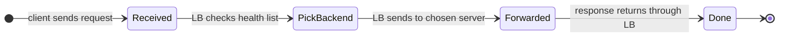

That is the whole product. Everything we add later (multiple algorithms, health checks, sticky sessions, geo-routing) is a complication on top of this loop.

> **Take this with you.** A load balancer has two jobs: pick a backend for each request, and keep the list of backends honest. The picking is the easy part.

---

## Step 2: Ask the right questions

In a real interview, sit quietly for two minutes. Write down what you want to ask. Not twenty questions. Five good ones.

<details markdown="1">
<summary><b>Show: 5 questions that change the design</b></summary>

1. **What protocol?** Plain TCP? HTTP/1.1? HTTP/2? WebSockets? *L4 is fine for raw TCP. HTTP/2 changes how you count connections: one TCP connection carries many requests at once. WebSockets stay open for hours, so round-robin stops working.*

2. **Do users need to land on the same backend every time?** If the backend keeps state in memory (a cart, a session), yes. This is called sticky sessions. It causes uneven load. If the backend is stateless and stores nothing in memory, you have more freedom.

3. **One region or many?** One region means one LB layer. Many regions means you need DNS or anycast to send each user to the closest one.

4. **How fast must we notice a dead backend?** Sub-second matters for payments. Thirty seconds is fine for a blog. This drives check frequency and how patient you are before kicking a backend out.

5. **What if the LB itself dies?** This is the question beginners forget. One LB is a single point of failure. You need at least two, with some way for traffic to switch.

A bonus question worth asking: *"Are DDoS protection and bot filtering in scope?"* The right answer is "separate problem." They sit next to the LB but are different products.

</details>

---

## Step 3: How big is this thing?

Same product, four scales. The interviewer gives you the targets: start at 100 users, end at 1 million daily active users, ~30,000 requests per second at peak, ~5 Gbps of bandwidth.

| Stage | Users | Req/sec | Bandwidth | Concurrent connections | What hurts |
|-------|-------|---------|-----------|------------------------|------------|
| **1** | 100 | 10 | ~5 Mbps | ~50 | nothing; the box is bored |
| **2** | 10k | 500 | ~240 Mbps | ~2k | NIC and nginx workers |
| **3** | 100k | 5k | ~2.4 Gbps | ~20k | TLS CPU starts to matter |
| **4** | 1M | 30k | ~5-15 Gbps | ~200k+ | TLS dominates; need multiple LBs |

<details markdown="1">
<summary><b>Show: where the numbers come from</b></summary>

Assume average request is 4 KB and average response is 60 KB (total ~64 KB per request).

**Stage 1 (100 users, 10 req/sec):** 10 × 64 KB = ~640 KB/sec = ~5 Mbps. About 50 concurrent connections (assuming 5s average hold time). One backend handles it.

**Stage 2 (10k users, 500 req/sec):** 500 × 64 KB = ~32 MB/sec = ~240 Mbps. About 2,000 concurrent connections. 3-5 backends. TLS cost is still fine (~50 new connections per second).

**Stage 3 (100k users, 5k req/sec):** ~320 MB/sec = ~2.4 Gbps. ~20k connections. ~500 new TCP connections per second. Each TLS handshake costs 1-3 ms of CPU. At 500/sec, that is one whole CPU core doing nothing but handshakes. 20-50 backends needed.

**Stage 4 (1M users, 30k req/sec):** ~5 Gbps steady, 15+ Gbps in spikes. 200,000+ concurrent connections (millions with WebSockets). ~3,000 new TCP/sec. TLS dominates. Hundreds of backend pods. The LB itself is now three layers: global, regional, local.

**The big insight:** a single LB breaks at three different scales for three different reasons.

- **Bandwidth** breaks first if your responses are large (video, files, images).
- **TLS CPU** breaks first if you have many short-lived clients (mobile apps, IoT devices).
- **Connection count** breaks first if you have long-lived connections (WebSockets, gRPC streams, chat).

A generic answer says "scale the LB." A senior answer says "for *our* workload, X will break first, here is how I know."

</details>

---

## Step 4: The smallest thing that works

Forget 1 million users. We are a 10-person startup. One backend. One nginx. That nginx is already a load balancer.

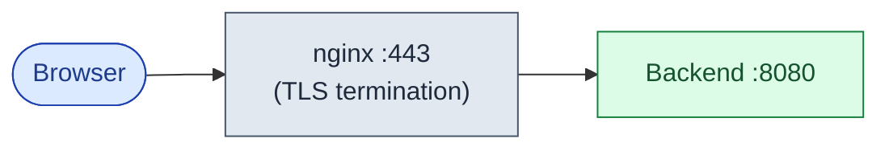

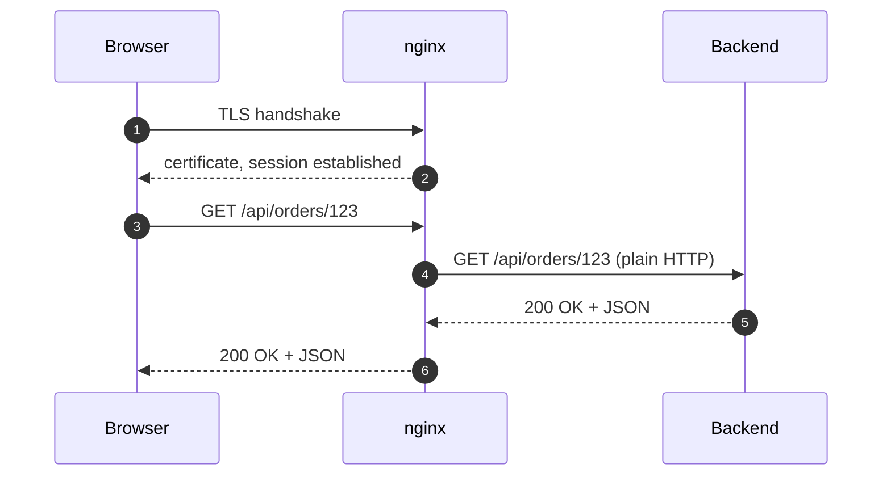

Why put nginx in front from day one? Three reasons: you can swap the backend without changing DNS, you can add a second backend later without restructuring, and TLS lives in one place so cert renewal does not need a backend deploy.

<details markdown="1">
<summary><b>Show: the minimal nginx config</b></summary>

```nginx
upstream api {
    server 10.0.1.10:8080;
}

server {
    listen 443 ssl;
    server_name api.example.com;

    ssl_certificate     /etc/ssl/api.crt;
    ssl_certificate_key /etc/ssl/api.key;

    location / {
        proxy_pass http://api;
        proxy_set_header Host            $host;
        proxy_set_header X-Forwarded-For $proxy_add_x_forwarded_for;
    }
}
```

One upstream, one backend. Round-robin across one server is a no-op, but the config is ready for a second backend the day you need it.

</details>

> **Take this with you.** Always start from the smallest thing that works. The interesting part of the interview is what happens **next**.

---

## Step 5: The first crack

The startup grows. You add backends. Then the on-call gets paged: *"Backend B is down. nginx kept sending it requests for a full minute before anyone noticed."*

You look at the config. There are no health checks. nginx has no idea backend B is dead. It discovers the problem the hard way: on a real user's request.

This is the first crack. You need a health checker.

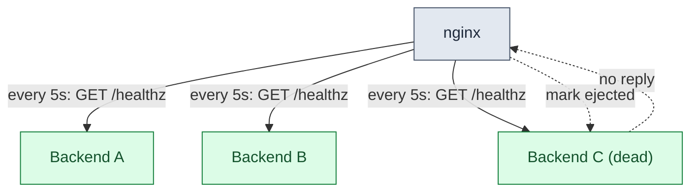

A backend has a lifecycle. Once you add health checks, it looks like this:

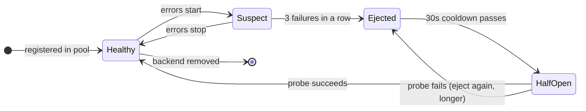

One detail that separates good answers from great ones: `max_ejection_percent`. If a bad deploy flips every backend to returning 5xx errors, an aggressive health checker kicks them all out. The site goes dark. Setting `max_ejection_percent: 50` means the LB keeps sending traffic somewhere even in the worst case. A partial outage beats a total one.

> **Take this with you.** Health checks are what separate a load balancer from a dumb proxy. The lifecycle above applies to every LB at every scale.

---

## Step 6: Build the architecture, one layer at a time

We have health checks. Now build the system around them. We will add one layer at a time.

### v1: nginx with real health checks

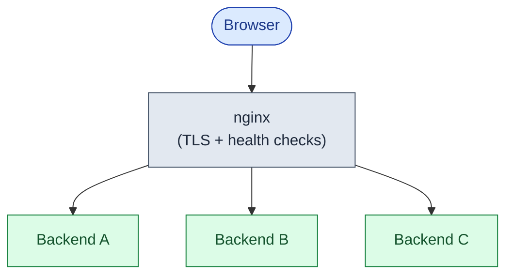

Fine for 10,000 users. One problem: the nginx is still a single point of failure.

### v2: two LB instances

Two nginx boxes. One holds the **virtual IP (VIP)**. The second watches via a protocol called VRRP. If the active one dies, the standby grabs the VIP. Failover takes about a second. Same IP, same DNS, clients see nothing.

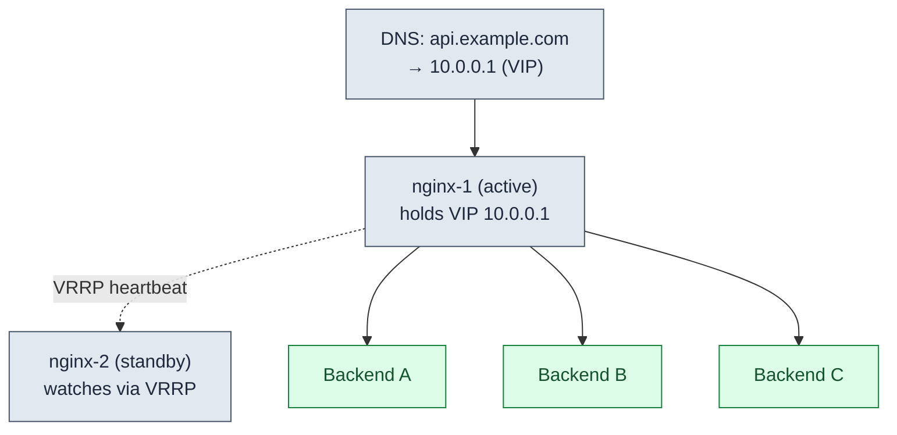

### v3: path-based routing for multiple services

The team splits the monolith. `/api/orders/*` goes to the orders service. Everything else goes to the main pool.

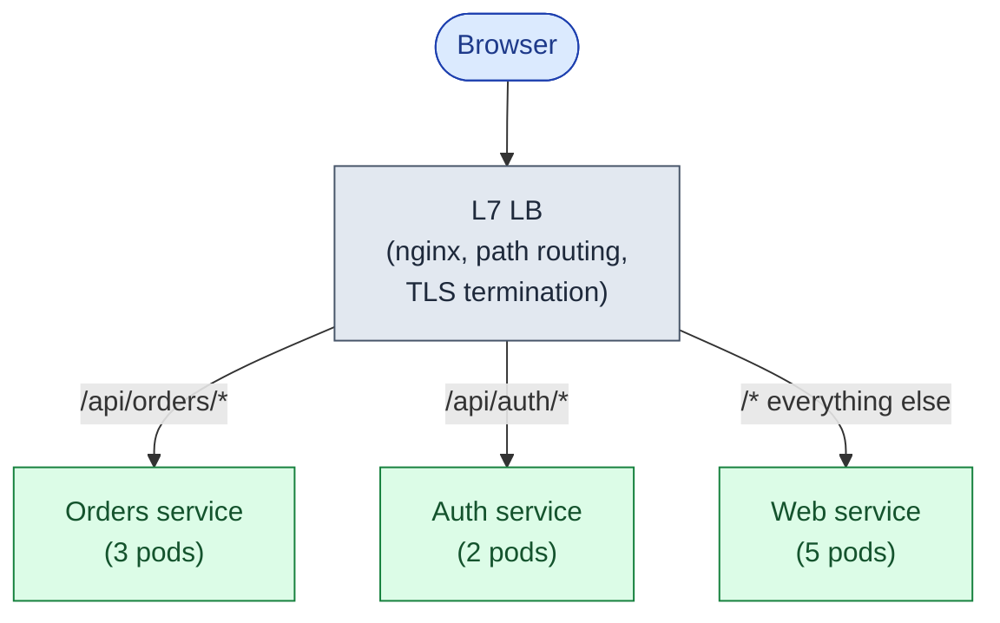

### v4: global + regional + local

Users in Asia get 300 ms to us-east. That is too slow. Add **anycast**: the same IP is announced from multiple data centers via BGP. The internet's routing system sends each user to the closest region automatically.

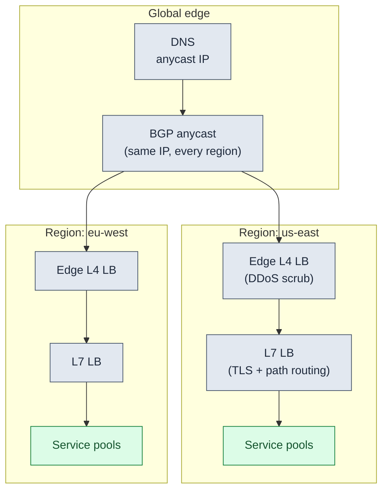

Each layer in one line:

| Layer | What it does |
|-------|--------------|
| **DNS + anycast** | Routes each user to the nearest healthy region. BGP withdraw = sub-second failover. |
| **Edge L4 LB** | Terminates TCP, absorbs DDoS, passes bytes to L7. Fast; does not parse HTTP. |
| **L7 LB** | Terminates TLS, reads URLs, routes to per-service pools, injects headers. |
| **Service pool** | The actual backends. Scaled per service. Each with its own health checks. |

> **Take this with you.** Every layer earns its slot by solving one specific problem. You add them when that problem arrives, not before.

---

## Step 7: One request, end to end

Alice opens the orders page. Watch what happens across all four layers.

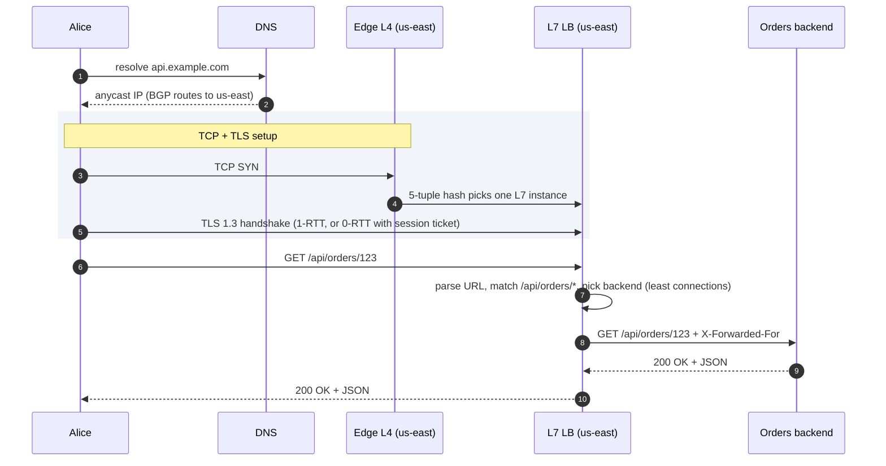

Three details worth pointing at:

1. The TLS handshake happens between Alice and the L7 LB, not the backend. The backend speaks plain HTTP inside the region.
2. Step 6 is `least connections`, not round-robin. More on why in Step 8 below.
3. The Edge L4 uses a 5-tuple hash (source IP + port + dest IP + port + protocol) so the same TCP connection always lands on the same L7 instance. The L7 can then maintain connection state.

---

## Step 8: How the LB picks a backend

A request arrives. The LB has 5 healthy backends. It has to pick one. There are six algorithms worth knowing.

Try this: for each one, write down (a) how it works in one sentence, (b) when you would use it, (c) how it breaks.

1. Round robin
2. Least connections
3. IP hash
4. Consistent hash
5. Weighted round robin
6. EWMA (least response time)

<details markdown="1">
<summary><b>Show: all six algorithms explained</b></summary>

**1. Round robin.** Request 1 to A, 2 to B, 3 to C, 4 to A. Just cycle. Works for stateless backends with uniform request times. Breaks when request durations vary (a slow request and a fast one count the same) and when a backend is already overloaded (it keeps getting requests).

**2. Least connections.** Keep a counter of in-flight requests per backend. Send the next request to the lowest. This is the right default for most HTTP services. Variable request times work themselves out: a slow backend's counter goes up, so it gets fewer new requests. One trap: under HTTP/2, one TCP connection carries many requests. Every backend looks like it has "1 connection." All traffic piles onto one. Fix: count *active requests*, not connections (Envoy calls this `LEAST_REQUEST`).

**3. IP hash.** Hash the client IP, mod the number of backends. Same client always lands on the same backend. Useful when you want stickiness but cannot use cookies. Breaks when many clients are behind one NAT (10,000 corporate users all hash to one backend). Adding a backend reshuffles everyone.

**4. Consistent hash.** Hash backends and keys onto a ring. Each backend "owns" a slice. Same key always lands on the same backend. Adding or removing a backend only moves 1/N of keys. Used for cache pools and sharded databases. Breaks on hot keys. Fix: virtual nodes (each backend appears in many ring spots) and bounded-load hashing (cap any one backend at 1.25x the average load).

**5. Weighted round robin.** Each backend has a weight. Weight 3 gets three requests per cycle; weight 1 gets one. Use for different-sized machines and canary deploys (new version weight 1, old weight 9 = 10% canary). Weights are static; pair with health checks.

**6. EWMA (least response time).** Track recent average response time, with recent samples weighted more. Send the next request to the backend with the lowest current average. Works when backends vary in performance. One trap: a backend that crashes and returns TCP RST instantly looks amazing (1 ms!). LB sends all traffic there. Death spiral. Fix: pair with error-rate health checks.

**The pragmatic default for HTTP services:** least connections (or least active requests for HTTP/2) with passive health checks. Simple, well-understood. Switch to consistent hash for sharded state. Switch to EWMA when backends vary in performance.

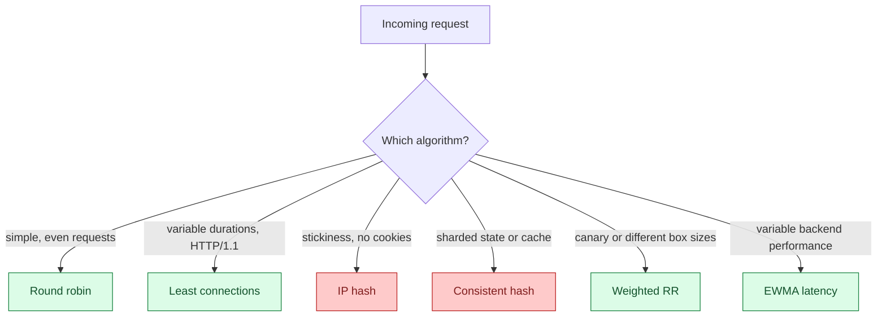

</details>

> **Take this with you.** Least connections is the right default for most HTTP workloads. Name the one that will break first for *your* specific load shape.

---

## Step 9: Sticky sessions, and why they hurt

The interviewer leans in: *"Some backends need the same user to land on the same box every time. How do you handle that?"*

That is sticky sessions. The LB reads a cookie. If the cookie says `srv_id=backend-B`, the request goes to Backend B, period.

It sounds easy. The production problems are non-obvious.


Alice, Carol, and Dave all land on Backend B. Bob lands on A. B is overwhelmed. A is idle. The usual LB algorithms cannot help: the sticky cookie overrides them.

Three fixes:

1. **Cap session TTL.** After 1 hour the cookie expires. The user gets re-assigned on next load. Periodic rebalancing at the cost of brief stickiness loss.
2. **Bounded-load stickiness.** If the target backend is already above 1.25x average load, the LB re-assigns the user to a lighter backend and issues a new cookie. Slightly disrupts stickiness for the unlucky few.
3. **Externalize the session.** Store sessions in Redis, not in backend memory. Backends become stateless. Any backend handles any request. The sticky cookie goes away entirely. This is the right answer for new systems.

<details markdown="1">
<summary><b>Show: sticky sessions across multiple LB instances</b></summary>

When you have more than one LB instance, each has its own in-memory sticky table. A user might land on LB-1 with their first request and LB-2 on the second. LB-2 has no record of their cookie.

The cleanest solution: put the backend ID *inside the cookie itself* (signed and encrypted by the LB key). Any LB instance can decrypt the cookie and route correctly. No shared state between LB instances.

```
srv_id = base64(encrypt(backend_id="B", issued_at=..., expires=..., sig=...))
```

The LB decrypts on every request. Validates expiry. Routes. If the cookie is tampered with, decryption fails and the user is treated as new.

</details>

> **Take this with you.** Stickiness is easy to enable and hard to live with. New systems should default to stateless backends with an external session store.

---

## Follow-up questions

Try answering each in 2 or 3 sentences before opening the solution.

1. **Sticky sessions and uneven load.** You enable cookie-based stickiness. Three power users cluster on Backend B. It runs hot while A and C idle. How do you fix this without losing stickiness?

2. **TLS termination cost.** Your LB's CPU sits at 80% and you trace it to TLS handshakes. What are your options, cheapest first?

3. **HTTP/2 and least connections.** You switch backends to HTTP/2. Suddenly almost all traffic goes to one backend. Why, and what do you change?

4. **WebSockets.** You add a WebSocket feature. Each user opens one long-lived connection. After deploying, the load is wildly uneven for hours. What happened?

5. **Slow backend starving the pool.** One backend has a slow disk. Requests there take 30 seconds instead of 30 ms. Round-robin keeps sending it requests. nginx workers pile up. What algorithm or config fixes this?

6. **DNS TTL.** You set DNS TTL to 1 hour. Your LB IP changes during an emergency. Clients still hit the old IP for an hour. What is the right TTL? What is the trade-off?

7. **Cross-region failover.** Your us-east region is down. How does traffic get to eu-west? How long does it take? Walk through each layer.

8. **Path-based routing for a monolith split.** You are splitting a monolith. `/api/orders/*` should go to a new order-service. Everything else stays on the monolith. What changes in the LB? How do you migrate without breaking clients?

9. **Health check storm.** 200 LB instances each polling 500 backends every 5 seconds = 20,000 `/healthz` requests per second. How do you cut this down without losing health visibility?

10. **LB dropping connections during deploy.** New backends register before they are ready. Old backends are killed mid-request. What is the right deploy sequence?

---

## Related problems

- **[Distributed Cache (009)](../009-distributed-cache/question.md).** Consistent hashing was introduced here. Cache pools use exactly the same ring algorithm to distribute keys.
- **[Read-Heavy System Patterns (017)](../017-read-heavy-patterns/question.md).** The LB sits at the center of the read scaling story. Same algorithms, different traffic shape.
- **[Write-Heavy System Patterns (018)](../018-write-heavy-patterns/question.md).** Puts the LB in front of the write path, where stickiness choices affect how partitioning behaves.
