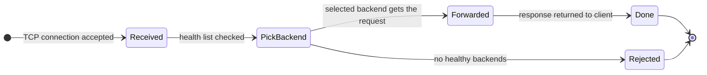
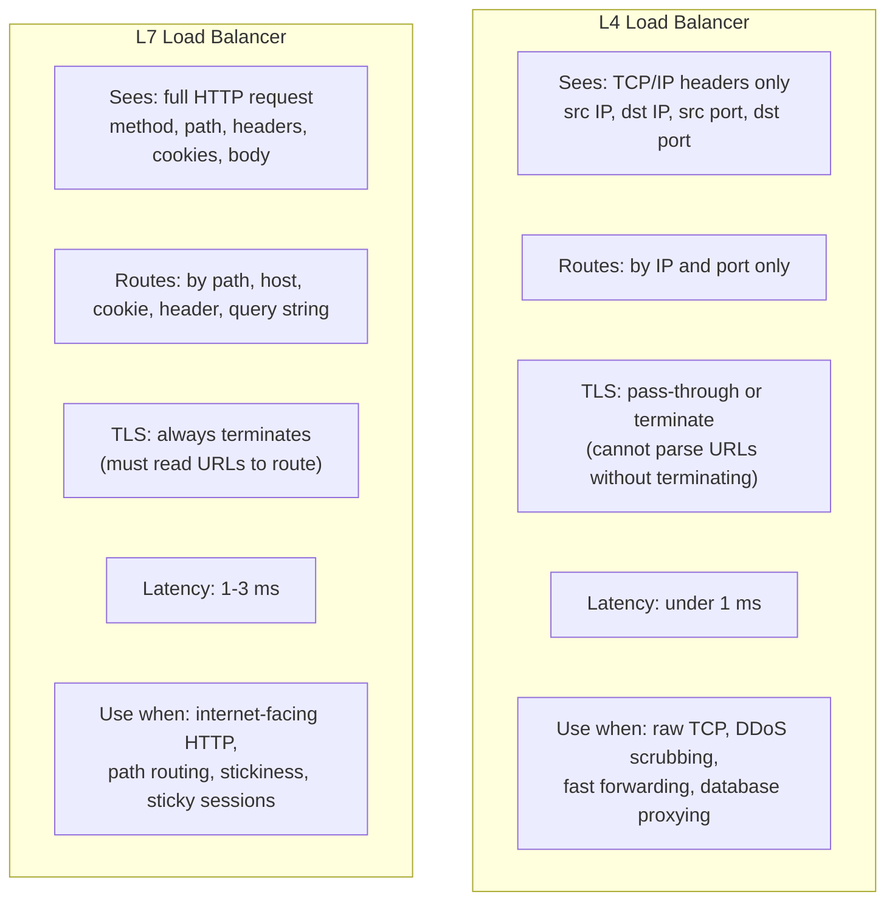
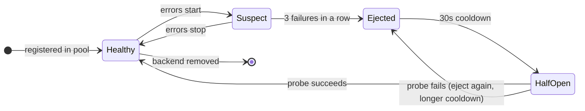
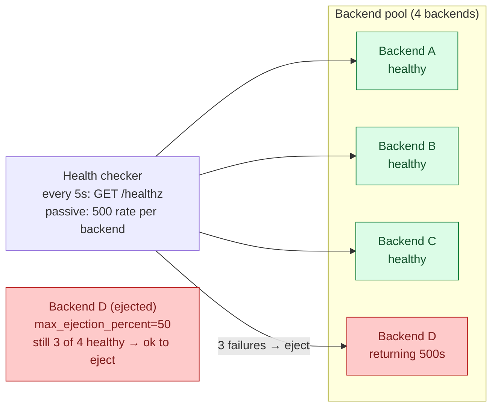
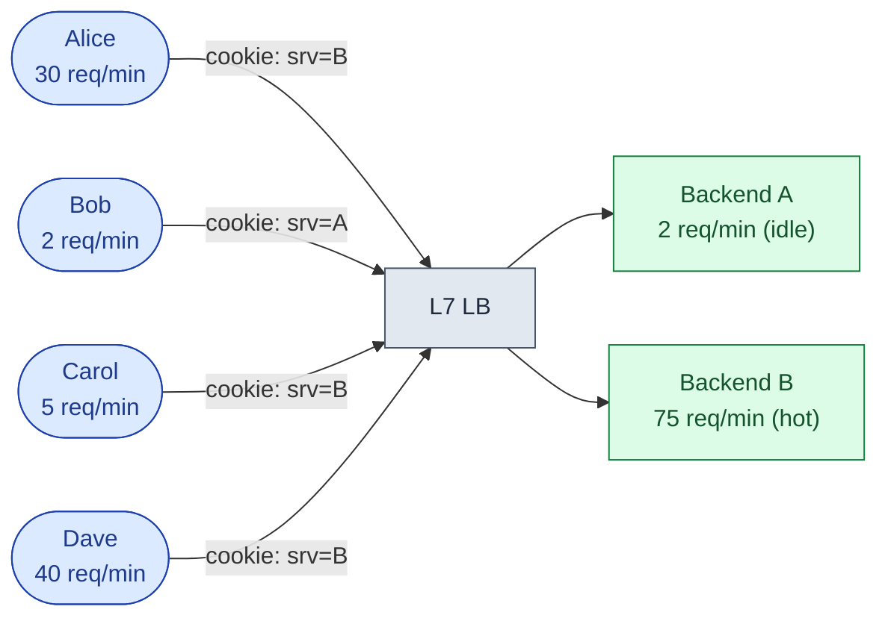
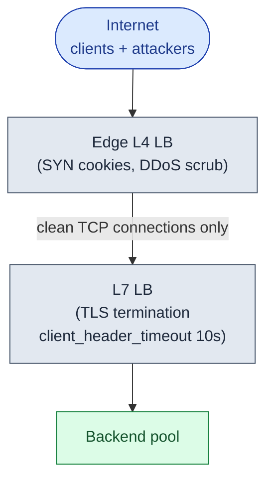
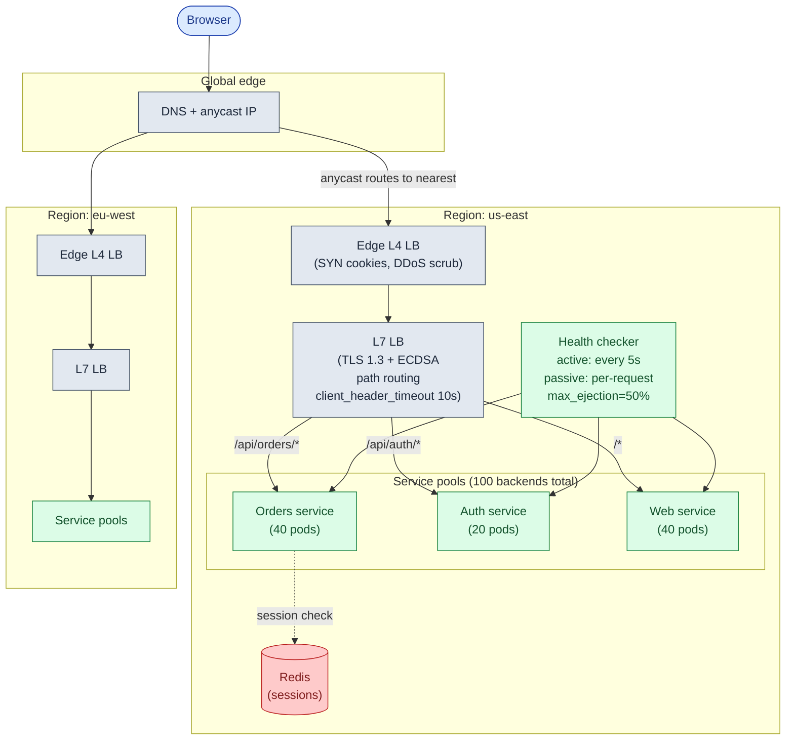
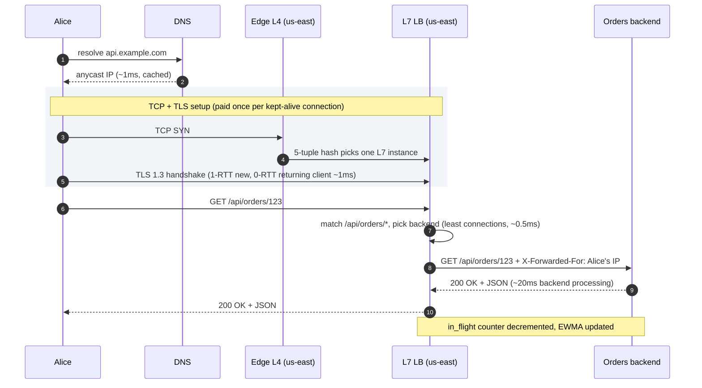
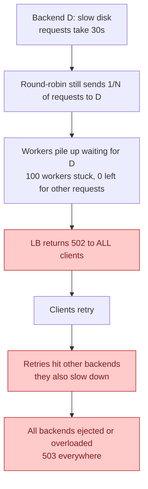

## What we are building

A load balancer sits between internet clients and a fleet of backend servers. It picks one backend for each incoming connection, spreads load across the pool, and removes unhealthy backends from rotation within seconds. Every internet-facing product you have used runs behind one.

Concretely: 100 backend servers each handle ~300 req/s. A load balancer in front receives ~30,000 req/s and distributes them across the pool. One backend dies. The LB detects the failure within 15 seconds and stops sending it traffic. TLS terminates at the LB so each backend speaks plain HTTP. The LB also survives the death of one of its own instances.

The problem looks like "just a proxy." The real work is five hard problems hiding underneath:

1. **L4 vs L7.** An L4 LB sees only IP and port. An L7 LB reads the full HTTP request. The choice drives TLS termination, path routing, and how you count connections.
2. **Health check accuracy.** A backend returning 200 to `/healthz` can still be throwing 500s on real traffic. Detecting the difference without flooding the backend with probes is not obvious.
3. **Sticky sessions vs stateless.** Cookie-based stickiness is easy to enable and hard to live with. It causes load skew. Stateless backends cost a network hop per request for session data.
4. **Attack traffic.** Slow-loris attacks hold connections open without sending data. SYN floods exhaust the connection table. Both look different from L4 and L7 and need different mitigations.
5. **TLS termination cost.** At 3,000 new connections per second, TLS handshakes consume roughly six CPU cores. Session resumption, ECDSA certs, and TLS 1.3 each cut that cost by a measurable amount.

We will start with the simplest setup that works. Then we add one problem at a time and watch the design grow.

---

## The lifecycle of one connection

Every request passes through the same small loop. Picture it before drawing any boxes.



The picking step seems trivial. Everything interesting happens around it: maintaining the health list, handling the case where the selected backend dies mid-request, and preventing a single bad backend from absorbing all retry traffic.

> **Take this with you.** A load balancer has two jobs: pick a backend, and keep the backend list honest. The picking is the easy part.

---

## How big this gets

A realistic internet-facing service at each stage of growth.

| Stage | Daily users | Peak req/s | Bandwidth | New TLS/s | Concurrent connections |
|-------|-------------|------------|-----------|-----------|------------------------|
| **1** | 1k | 20 | ~10 Mbps | ~2 | ~100 |
| **2** | 100k | 500 | ~240 Mbps | ~50 | ~2,500 |
| **3** | 1M | 5,000 | ~2.4 Gbps | ~500 | ~25,000 |
| **4** | 10M | 30,000 | ~5-15 Gbps | ~3,000 | ~200,000+ |

<details markdown="1">
<summary><b>Show: where the numbers come from</b></summary>

Assume average request is 4 KB and average response is 60 KB (~64 KB per request-response pair). Average held connection time: ~5 seconds.

**Stage 1 (1k users, 20 req/s):** 20 × 64 KB = ~1.3 MB/s = ~10 Mbps. ~100 concurrent connections. TLS: ~2 new handshakes per second, one CPU core is bored. One backend handles everything.

**Stage 2 (100k users, 500 req/s):** 500 × 64 KB = ~32 MB/s = ~240 Mbps. ~2,500 concurrent connections. TLS: ~50 new/s, fraction of a core. 3-5 backends needed. Health checks start to matter.

**Stage 3 (1M users, 5k req/s):** ~320 MB/s = ~2.4 Gbps. ~25k connections. TLS: ~500 new/s, roughly one core doing nothing but handshakes. 20-50 backends. Session resumption becomes worthwhile.

**Stage 4 (10M users, 30k req/s):** ~5+ Gbps. 200k+ concurrent connections (millions with WebSockets). TLS: ~3,000 new/s, six cores for handshakes alone. Hundreds of backends. The LB itself needs to be a cluster, not one box.

Three ceilings that each break first depending on workload:

- **Bandwidth:** a 10 Gbps NIC caps at ~9 Gbps usable. Video or file downloads hit this before TLS becomes a problem.
- **TLS CPU:** each handshake costs 1-3 ms of CPU. IoT and mobile apps with short connection lifetimes hit this first.
- **Connection count:** each kept-alive connection costs file descriptors and ~10 KB of kernel memory. Chat and streaming apps hit this first.

Naming which ceiling is *yours* is the senior answer.

</details>

> **Take this with you.** The LB breaks at three different scales for three different reasons: bandwidth, TLS CPU, and connection count. Which one hits first depends on your traffic shape, not the request volume.

---

## The smallest version that works

One nginx. One backend. nginx terminates TLS and proxies plain HTTP to the backend.


Two endpoints carry the whole product.

| Endpoint | What it does |
|----------|--------------|
| `GET *` | Proxy any HTTP request to the backend pool |
| `GET /healthz` | Return 200 if the LB itself is alive (for the layer above this one) |

<details markdown="1">
<summary><b>Show: the minimal nginx config</b></summary>

```nginx
upstream api {
    server 10.0.1.10:8080;
}

server {
    listen 443 ssl;
    server_name api.example.com;

    ssl_certificate     /etc/ssl/api.crt;
    ssl_certificate_key /etc/ssl/api.key;

    location / {
        proxy_pass http://api;
        proxy_set_header Host            $host;
        proxy_set_header X-Forwarded-For $proxy_add_x_forwarded_for;
    }
}
```

One upstream, one backend. Round-robin across one server is a no-op, but the config is ready for a second backend the day you need it.

</details>

Why put nginx in front from day one? Three reasons. You can swap the backend without changing DNS. You can add a second backend later without restructuring. TLS cert renewal does not require a backend deploy.

This is enough for a few hundred users. The interesting question is what breaks first as traffic grows.

---

## Decision 1: L4 or L7?

Every load balancer decision flows from this one. L4 and L7 are not interchangeable choices with trade-offs. They are different products.



An algorithm comparison across three dimensions:

| | Round-robin | Least connections | IP hash | Consistent hash |
|-|-------------|-------------------|---------|-----------------|
| **Works for HTTP/1.1** | yes | yes (better default) | yes | yes |
| **Works for HTTP/2** | no (one conn = many requests) | no (same problem) | no | yes |
| **Handles variable request time** | poorly | well | poorly | depends on key |
| **Provides stickiness** | no | no | yes (fragile) | yes (stable) |
| **Handles backend add/remove** | fine | fine | reshuffles all clients | moves 1/N of clients |

The practical defaults:

- **HTTP/1.1:** least connections. Handles variable request times naturally.
- **HTTP/2:** least active requests (count streams, not TCP connections). Envoy calls this `LEAST_REQUEST`.
- **Sharded state or cache pools:** consistent hash. Adding a backend moves 1/N of keys.
- **Canary deploys:** weighted round-robin. Set new version weight=1, old weight=9 for a 10% canary.

> **Take this with you.** L4 is faster and cheaper. L7 is smart. Pick L7 for any HTTP-aware work (path routing, stickiness, per-route policy). Pick L4 at the outermost edge for DDoS scrubbing and raw TCP throughput.

---

## Decision 2: how do we know a backend is healthy?

The startup grows. Multiple backends. On-call gets paged: backend B has been down for a minute, nginx kept sending traffic to it the whole time. There were no health checks.

A backend has a lifecycle once health checks are running.



Active health checks (LB polls `/healthz` every 5 seconds) catch process death. They miss silent degradation: a backend returning 200 to `/healthz` while throwing 500s on real traffic, or responding in 30 seconds instead of 30 ms.

Passive outlier detection fills the gap. After each real request, the LB updates an error rate and a moving average latency per backend. If one backend's p99 is more than 3x the pool median for 60 seconds, it is a candidate for ejection.

One parameter separates competent designs from dangerous ones: `max_ejection_percent`. If a bad deploy makes every backend return 500, an aggressive health checker kicks them all out. The site goes dark. Setting `max_ejection_percent: 50` means the LB keeps sending traffic somewhere even in the worst case. A partial outage beats a total one.



> **Take this with you.** Active checks catch dead processes. Passive checks catch degraded ones. `max_ejection_percent` is the safety valve that prevents a total outage when the whole pool degrades at once.

---

## Decision 3: sticky sessions or stateless backends?

Some backends need the same user to land on the same box every time. Authenticated sessions held in process memory, an in-progress checkout cart, an open WebSocket. How do you keep that user pinned without losing the LB's ability to spread load?

Cookie-based stickiness: the LB reads a cookie. If it says `srv=backend-B`, the request goes to Backend B regardless of load.

The production problem is load skew.



Alice, Carol, and Dave all stick to Backend B. Bob sticks to A. B is overwhelmed. A is idle. The usual balancing algorithms cannot help: the sticky cookie overrides them.

Three fixes in order of preference for new systems:

1. **Externalize the session.** Store sessions in Redis. Backends become stateless. Any backend handles any request. The sticky cookie disappears. One extra network hop (~1-2 ms), zero load skew. This is the right answer for new systems.
2. **Bounded-load stickiness.** If the target backend is already above 1.25x average load, re-assign the user and issue a new cookie. Disrupts stickiness for the unlucky few but caps imbalance.
3. **Cap session TTL.** After 1 hour the cookie expires. The user gets re-assigned. Periodic rebalancing at the cost of brief disruption.

<details markdown="1">
<summary><b>Show: sticky sessions across multiple LB instances</b></summary>

When you have more than one LB instance, each maintains its own in-memory sticky table. A user might hit LB-1 on their first request and LB-2 on the next. LB-2 has no record of their cookie.

The cleanest fix: encode the backend ID inside the cookie itself (signed and encrypted). Any LB instance decrypts it and routes correctly. No shared state between LB instances.

```
srv_id = base64(encrypt(backend_id="B", issued_at=..., expires=..., sig=...))
```

The LB decrypts on every request. Validates expiry. Routes. A tampered cookie fails decryption and the user is treated as new.

</details>

> **Take this with you.** Stickiness is easy to enable and hard to operate. New systems should default to stateless backends with an external session store. The one extra Redis hop is cheaper than the operational cost of debugging load skew at 2 a.m.

---

## Decision 4: TLS termination cost

At stage 3 (500 new connections per second), TLS handshakes consume roughly one full CPU core. At stage 4 (3,000/s), six cores. This is not a minor overhead.

Four knobs, cheapest first:

| Change | Cost reduction | How |
|--------|----------------|-----|
| TLS 1.3 session tickets (0-RTT) | ~10x for returning clients | Client reuses session from last connection. One trip instead of two. |
| ECDSA certs (P-256) instead of RSA-2048 | ~5x | Same security level, much cheaper math. Just a cert swap. |
| Session ticket cache tuning | Marginal | Make sure the cache is large enough that tickets do not expire before clients return. |
| Horizontal LB scaling | Linear with instances | Add more LB boxes. Works but costs money. |

L4 at the outermost edge, L7 inside the region: the edge L4 terminates TCP and absorbs DDoS without parsing TLS. The L7 inside the region terminates TLS and does path routing. Each box does exactly one thing. A single box trying to do both is slower and harder to scale.

> **Take this with you.** TLS 1.3 with session tickets plus ECDSA certs cuts handshake CPU by roughly 50x compared to RSA-2048 without session resumption. Do both before reaching for more hardware.

---

## Decision 5: surviving attack traffic

Two attacks look different at different layers.

**Slow-loris** (L7 attack): an attacker opens many connections and sends HTTP headers slowly, one byte every 30 seconds. Each connection holds an nginx worker. With 10,000 of them, no workers are left for real requests.

Fix: `client_header_timeout 10s`. If a client does not complete its headers in 10 seconds, close the connection. This has no effect on real browsers, which send headers in under 100 ms.

**SYN flood** (L4 attack): an attacker sends millions of TCP SYN packets with spoofed source IPs. The server allocates a half-open connection slot for each and waits for the ACK that never comes. The SYN backlog fills. Real clients cannot connect.

Fix: SYN cookies. The server encodes connection state in the SYN-ACK reply instead of allocating memory. If the client never ACKs, no resources were wasted. Built into Linux (`net.ipv4.tcp_syncookies=1`). A dedicated L4 LB at the edge (AWS Shield, Cloudflare) scrubs SYN floods before they reach origin.



> **Take this with you.** SYN floods are an L4 problem. Slow-loris is an L7 problem. The mitigations sit at different layers and need different config. Mentioning both without prompting is a senior signal.

---

## The full architecture

Pulling all five decisions together.



Each component in one line:

| Component | Purpose |
|-----------|---------|
| DNS + anycast | Routes each user to the nearest healthy region. BGP withdraw = sub-second regional failover. |
| Edge L4 LB | Terminates TCP, scrubs SYN floods, passes clean connections to L7. Does not parse HTTP. |
| L7 LB | Terminates TLS, reads URLs, routes by path, applies per-route policy, detects slow clients. |
| Health checker | Active polls every 5s, passive check per response, max 50% ejection. |
| Service pools | One pool per service. Each scales independently. Each has its own health check config. |
| Redis | Holds sessions so backends are stateless. Any backend handles any request. |

---

## Walk: a request, end to end

Alice opens the orders page.



Latency budget:

| Step | Typical |
|------|---------|
| DNS (cached) | < 1 ms |
| Edge L4 forwarding | < 1 ms |
| TLS handshake (new) | 10-30 ms |
| TLS resumption (0-RTT) | < 1 ms |
| L7 parse + route | < 1 ms |
| Backend processing | 5-50 ms |

The LB layers together add about 2-5 ms for a returning client. That is the price for path routing, observability, and health management.

---

## The hard sub-problem: cascading failure

One backend is slow: disk latency has ballooned from 1 ms to 30 ms. Active health checks pass (it answers `/healthz`). Passive detection has not triggered yet.

Round-robin keeps sending it requests. Each takes 30 seconds. Workers pile up. After 100 workers are stuck on this backend, nginx runs out of workers and starts returning 502 to all clients, including the ones routed to healthy backends.

Without protection, this is the failure sequence:



The defenses, in order of application:

1. **Least connections instead of round-robin.** Backend D accumulates in-flight requests. Once it has more than the others, new requests go elsewhere. The skew corrects automatically.
2. **`proxy_read_timeout 30s`.** After 30 seconds the LB gives up, frees the worker, and records a failure against Backend D. The backend's failure count rises toward ejection threshold.
3. **Passive latency ejection.** If Backend D's p99 is more than 3x the pool median for 60 seconds, mark it as suspect. Combine with `max_ejection_percent: 50`.
4. **Backend-side circuit breaker.** When Backend D's own dependency (slow disk, slow DB) is sick, the backend should return 503 immediately instead of queuing for 30 seconds. The LB ejects it on the 503 and Backend D recovers faster.
5. **Client retries with backoff.** Retries are inevitable. Without jitter, every client retries at the same second. With exponential backoff and jitter, retries spread out over tens of seconds.

> **Take this with you.** Cascading failure is the most common LB production incident. The fix is: least connections + read timeout + passive ejection + max_ejection_percent. All four are needed. Any one alone is not enough.

---

## Follow-up questions

Try answering each in 2-3 sentences before opening the solution.

1. **Sticky sessions and uneven load.** You enable cookie-based stickiness. Three power users cluster on Backend B. It runs hot while A and C idle. How do you fix this without losing stickiness?

2. **TLS termination cost.** Your LB's CPU sits at 80% and you trace it to TLS handshakes. What are your options, cheapest first?

3. **HTTP/2 and least connections.** You switch backends to HTTP/2. Suddenly almost all traffic goes to one backend. Why, and what do you change?

4. **WebSockets.** You add a WebSocket feature. Each user opens one long-lived connection. After deploying, the load is wildly uneven for hours. What happened?

5. **Slow backend starving the pool.** One backend has a slow disk. Requests there take 30 seconds instead of 30 ms. Round-robin keeps sending it requests. nginx workers pile up. What algorithm or config fixes this?

6. **DNS TTL.** You set DNS TTL to 1 hour. Your LB IP changes during an emergency. Clients still hit the old IP for an hour. What is the right TTL? What is the trade-off?

7. **Cross-region failover.** Your us-east region is down. How does traffic get to eu-west? How long does it take? Walk through each layer.

8. **Path-based routing for a monolith split.** You are splitting a monolith. `/api/orders/*` should go to a new order-service. Everything else stays on the monolith. What changes in the LB? How do you migrate without breaking clients?

9. **Health check storm.** 200 LB instances each polling 500 backends every 5 seconds = 20,000 `/healthz` requests per second. How do you cut this down without losing health visibility?

10. **LB dropping connections during deploy.** New backends register before they are ready. Old backends are killed mid-request. What is the right deploy sequence?

---

## Related problems

- **[Distributed Cache (009)](../009-distributed-cache/question.md).** Consistent hashing was introduced here. Cache pools use the same ring algorithm to distribute keys across nodes.
- **[Read-Heavy System Patterns (017)](../017-read-heavy-patterns/question.md).** The LB sits at the center of the read scaling story. Same algorithms, different traffic shape.
- **[Write-Heavy System Patterns (018)](../018-write-heavy-patterns/question.md).** Puts the LB in front of the write path, where stickiness choices affect how partitioning behaves.
