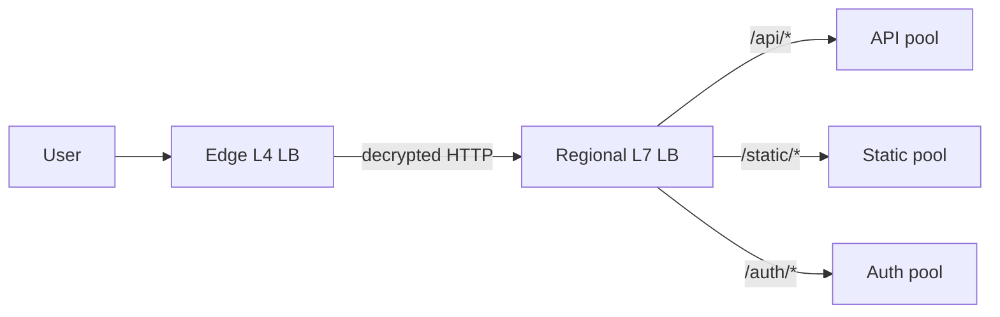
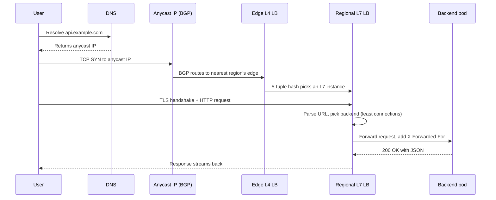
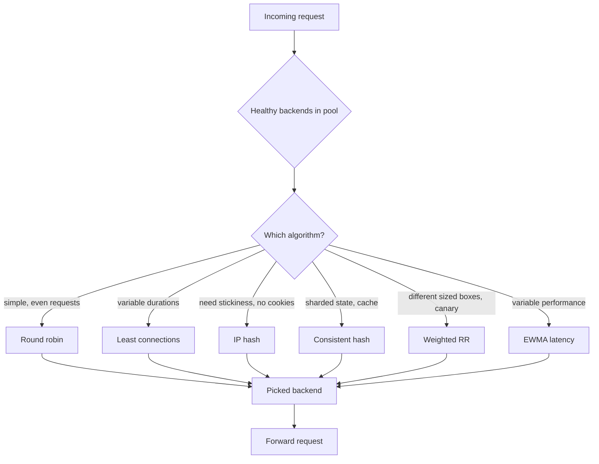
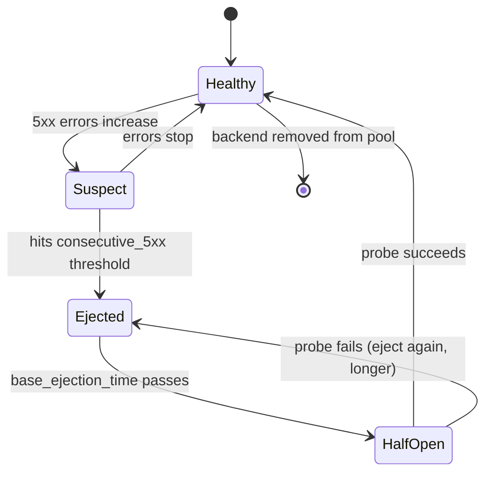

## The scene

You sit down. The interviewer draws a tiny picture on the whiteboard.

Three stick figures on the left. They are users. A small box in the middle labeled `nginx`. A bigger box on the right labeled `backend`. An arrow points from the users to nginx, and another arrow points from nginx to the backend.

Then they say:

> *"One service. One server. One hundred users. There is a single nginx in the middle. Walk me from here to one million users. At each step, tell me what the load balancer is actually doing, why we need it, and what breaks when we outgrow it."*

It sounds easy. It is not.

The trap is the words "load balancer." They sound like one thing. They are not. A load balancer is a stack of layers. Each layer does a different job. Each layer breaks for a different reason.

We will walk this from a single box serving 100 users all the way to a global setup serving 1 million users. At every step we will name what just broke, then add the smallest fix.

A note on jargon before we start:

- **L4** means "layer 4, the network level." An L4 load balancer reads TCP/IP headers (just the source and destination IP and port). It does not look inside the request. It is fast but dumb.
- **L7** means "layer 7, the application level." An L7 load balancer reads the full HTTP request (the URL, the headers, the cookies). It can route based on what is inside. It is slower but smart.
- **anycast** means "one IP address that points to many servers at once." The internet's routing system sends each user to the closest server that holds that IP. You announce the same IP from data centers in Tokyo, Sydney, and Frankfurt. A user in Tokyo gets routed to Tokyo. A user in Berlin gets routed to Frankfurt. All without changing anything.
- **TLS termination** means "the load balancer decrypts the HTTPS connection." After that, traffic between the LB and the backend is plain HTTP. Less work for the backend.
- **SPOF** means "single point of failure." A box where, if it dies, the whole system dies.

---

## Step 1: Ask the right questions

Before you draw anything, sit for five minutes. Write down questions you would ask the interviewer.

A good answer here is not "20 questions about every detail." It is the small handful of questions that change the design.

<details markdown="1">
<summary><b>Show: 8 questions that matter</b></summary>

1. **What protocol?** Plain TCP? HTTP/1.1? HTTP/2? WebSockets? gRPC? *(L4 is fine for raw TCP. HTTP/2 changes how you count "connections" because one TCP connection carries many requests at once. WebSockets stay open for hours, so round-robin balancing stops working.)*

2. **Does the LB decrypt HTTPS, or pass it through?** *(Decrypting means the LB can read URLs and route smartly. Passing through means the backend has to deal with certs. Most setups decrypt.)*

3. **Do users need to land on the same backend every time?** *(If the backend keeps stuff in memory like a shopping cart, yes. This is called a "sticky session." It causes uneven load. If the backend is stateless and stores nothing, you have more freedom.)*

4. **One region or many?** *(One region means one LB layer. Many regions means you need DNS or anycast to send users to the closest one.)*

5. **What does traffic look like?** Lots of small requests? A few huge file downloads? Steady, or spiky? *(An LB doing 1,000 tiny JSON requests per second is a very different machine from one streaming 100 Gbps of video.)*

6. **How fast must we notice a dead backend?** *(Sub-second matters for payments. 30 seconds is fine for a blog. This drives how often we check, and how patient we are before kicking a backend out.)*

7. **Managed cloud LB, or run our own?** *(AWS ALB and Google's LB cost more per byte but save you operational pain. nginx and HAProxy are cheap but you babysit them. At big bandwidth bills, running your own gets cheaper.)*

8. **What if the LB itself dies?** *(This is the question juniors forget. If you have one LB, it is a single point of failure. You need at least two, with some way for traffic to switch over.)*

A bonus question: *"Are DDoS protection and bot filtering in scope?"* The right answer is "separate problem." They sit next to the LB but are different products.

</details>

---

## Step 2: How big is this thing?

Same problem, four scales. Do the math.

The interviewer gives you the targets:

- **Start:** 100 users, ~10 requests/sec, one nginx, one backend.
- **End:** 1 million daily active users, ~30,000 requests/sec at peak, ~5 Gbps of bandwidth, average request 4 KB and response 60 KB.
- HTTP/1.1 today, HTTP/2 coming next year.
- Two regions to start. Four eventually.
- Backends are stateless. Sessions live in Redis.

At each scale, work out: requests per second, bandwidth, how many connections are open at once, new TCP connections per second (TLS handshakes are expensive), and how many backends you need.

<details markdown="1">
<summary><b>Show: the math</b></summary>

**Stage 1 (100 users, 10 req/s):** 5 Mbps bandwidth, ~50 connections. One backend handles it. nginx exists mostly so you can swap backends without changing DNS.

**Stage 2 (10k users, 500 req/s):** ~240 Mbps, ~2,000 connections, ~50 new TCP/sec. TLS cost is fine. 3-5 backends.

**Stage 3 (100k users, 5k req/s):** ~2.4 Gbps, ~20k connections, ~500 new TCP/sec. TLS starts to bite. Each handshake costs 1-3 ms of CPU. 500/sec × 2 ms = one whole CPU core doing nothing but handshakes. 20-50 backends, split by service.

**Stage 4 (1M users, 30k req/s, 5 Gbps):** 5 Gbps steady, 15+ Gbps in spikes. No single box does this. 200,000+ connections (millions with WebSockets). ~3,000 new TCP/sec. TLS dominates. Hundreds of pods. LB is now three layers (global, regional, local).

**The big insight from the math:**

A single LB breaks at three different scales for three different reasons. Knowing which one will bite you first is the whole game.

- **Bandwidth** breaks first if your responses are big (video, files, images).
- **TLS CPU** breaks first if you have lots of short-lived clients (mobile apps, IoT devices).
- **Connection count** breaks first if you have long-lived connections (WebSockets, gRPC streams, chat).

A generic answer says "scale the LB." A senior answer says "for *our* workload, X will break first, here is how I know."

</details>

---

## Step 3: L4 vs L7

Before you draw any topology, you need to know what a load balancer actually *is*. There are two kinds. They do different jobs.

L4 is a "smart NAT." It looks at the network headers only. It sees: source IP, destination IP, source port, destination port. It does not know what you sent. It just rewrites the destination and shovels bytes.

L7 is a "reverse proxy." It reads the full HTTP request. It can see the URL path, the cookies, the headers, even the body. It can decide where to send the request based on any of that.

Try to fill in the comparison table. When does each one earn its keep?

<details markdown="1">
<summary><b>Show: L4 vs L7 side by side</b></summary>

| Aspect | L4 (network level) | L7 (HTTP level) |
|--------|--------------------|------------------|
| What it reads | TCP/UDP headers (IPs and ports) | Full HTTP (method, path, headers, cookies) |
| What it routes by | IP and port | Path, host, header, cookie, query string |
| TLS | Either pass through, or decrypt | Always decrypts (otherwise it cannot read URLs) |
| Speed | Very fast (kernel or even hardware) | Slower (has to parse HTTP) |
| Latency it adds | Less than 1 ms | 1-3 ms |
| When you use it | Plain TCP, databases, internal RPC | Anything internet-facing serving HTTP |
| Examples | AWS NLB, HAProxy in TCP mode, IPVS | AWS ALB, nginx, Envoy, HAProxy in HTTP mode |

**When you need L7:** path-based routing (`/api/*` vs `/static/*`), host-based routing (`tenant-a.example.com`), cookie-based stickiness, header rewriting, per-route rate limits, A/B traffic splits.

**When L4 is enough (and cheaper):** database connection pooling, internal RPC, WebSocket gateways (after the upgrade handshake the LB just shuffles bytes), DDoS scrubbing.

**The common pattern:** L4 at the edge, L7 inside.

The edge L4 does TLS termination and basic DDoS protection. The L7 LB inside the region does the smart stuff: path routing, per-service policy. Each does what it is best at. Mixing them creates a single box that is both slow and a SPOF.



</details>

---

## Step 4: Draw the system

You know what an LB is. Now draw the full stack at non-trivial scale. Eight pieces are missing.

Think about: what turns a domain name into an IP? What does the actual balancing? What holds the list of backends? Who decides a backend is dead? What is the optional hardware that helps with TLS?

```
                Client (browser, app)
                       |
                       |  "GET /something"
                       v
                +------------+
                |   [ ? ]    |   turns a hostname into an IP;
                |            |   can also do basic geo-routing
                +-----+------+
                      |
                      v
                +------------+
                |   [ ? ]    |   the LB itself; accepts the connection,
                |            |   terminates TLS, picks a backend
                +-----+------+
                      |
                +-----+------------+--------------+
                |                  |              |
                v                  v              v
            +-------+         +-------+      +-------+
            |backend|         |backend|      |backend|
            |   A   |         |   B   |      |   C   |
            +-------+         +-------+      +-------+
                                  ^
                                  | periodic pokes ("are you alive?")
                                  |
                          +---------------+
                          |    [ ? ]      |   decides which backends
                          |               |   are in or out of the pool
                          +---------------+

           Config:                       Optional:
           +----------------+            +----------------+
           |     [ ? ]      |            |     [ ? ]      |
           |  the list of   |            |  offload TLS   |
           |  backends and  |            |  handshakes;   |
           |  their state   |            |  often in HW   |
           +----------------+            +----------------+
```

<details markdown="1">
<summary><b>Show: the full architecture</b></summary>

```
                Client (browser, app)
                       |
                       |  "GET /something"
                       v
                +------------+
                |    DNS     |   Returns one of several IPs (round robin)
                |  resolver  |   or one anycast IP (BGP routes to nearest).
                +-----+------+
                      |
                      v
                +------------+
                |    Load    |   Accepts the connection.
                |  Balancer  |   Picks a backend.
                | (nginx,    |   Forwards the request.
                |  HAProxy,  |
                |  Envoy)    |
                +-----+------+
                      |
                +-----+------------+--------------+
                |                  |              |
                v                  v              v
            +-------+         +-------+      +-------+
            |backend|         |backend|      |backend|
            |   A   |         |   B   |      |   C   |
            +-------+         +-------+      +-------+
                                  ^
                                  | GET /healthz every 5s
                                  |
                          +---------------+
                          | Health Checker|   Marks a backend bad
                          |  (in-LB or    |   after N failures.
                          |   sidecar)    |   Re-adds after M successes.
                          +---------------+

           Config:                       Optional:
           +----------------+            +-----------------+
           | Backend Pool   |            | TLS Terminator  |
           |  Config        |            |  (dedicated     |
           | (static file,  |            |   process or    |
           |  Consul,       |            |   SmartNIC for  |
           |  Kubernetes    |            |   very high     |
           |  endpoints)    |            |   handshake     |
           +----------------+            |   rates)        |
                                         +-----------------+
```

A quick tour:

- **DNS resolver.** The first "load balancer" most people forget about. Multiple A records = round-robin at layer zero. Anycast turns this into "one IP, routed by the internet to the closest region."
- **The LB itself.** nginx, HAProxy, Envoy in software. AWS ALB/NLB, Google Cloud LB, F5 BIG-IP for managed or hardware.
- **Backend pool config.** Old way: a static file. Modern way: service discovery (Kubernetes endpoints, Consul, etcd) that the LB watches.
- **Health checker.** Pokes backends actively (`/healthz` every few seconds). Also watches real traffic passively (lots of 500s = kick out). Good LBs do both.
- **TLS terminator.** Usually the same process as the LB. At very high handshake rates, offload to a dedicated tier.

Here is the request flow through every layer:



</details>

---

## Step 5: How does the LB pick a backend?

A request arrives. The LB has 5 healthy backends. It has to pick one. How?

There are six algorithms worth knowing. Each one is great for some workloads. Each one breaks in a specific way for others.

Try this exercise: for each algorithm, write down (a) how it works in one sentence, (b) when you would use it, (c) how it breaks.

1. Round robin
2. Least connections
3. IP hash
4. Consistent hash
5. Weighted round robin
6. EWMA (least response time)

<details markdown="1">
<summary><b>Show: all six algorithms explained</b></summary>

**1. Round robin.** Request 1 to A, 2 to B, 3 to C, 4 to A. Just cycle. Works for stateless backends with uniform request times. Breaks when request durations vary (a slow request and a fast one count the same) and when a backend is already overloaded (it keeps getting requests).

**2. Least connections.** Keep a counter of in-flight requests per backend. Send next request to the lowest. This is the default for most HTTP services. Variable request times work themselves out: a slow backend's counter goes up, so it gets fewer new requests. Breaks under HTTP/2 because one TCP connection carries many requests at once. Every backend looks like it has "1 connection." All new traffic piles onto one. Fix: count *active requests*, not connections (Envoy calls this `LEAST_REQUEST`).

**3. IP hash.** Hash the client IP, mod the number of backends. Same client always lands on the same backend. Useful when you want stickiness but cannot use cookies (some IoT devices, raw TCP). Breaks when lots of clients are behind one NAT (10,000 corporate users hash to one backend). Mobile users changing IPs lose stickiness. Adding a backend reshuffles everyone.

**4. Consistent hash.** Hash backends and keys onto a ring. Each backend "owns" a slice. Same key always lands on the same backend. Adding or removing a backend only moves 1/N of keys. Used for cache pools, sharded databases, anywhere "same key, same backend" matters more than "perfectly even spread." Breaks on hot keys: one key gets 90% of traffic, one backend melts. Fix: virtual nodes (each real backend appears in many ring spots) and bounded-load consistent hashing (cap any one backend at 1.25x the average, spill over).

**5. Weighted round robin.** Each backend has a weight. Weight 3 gets three requests per cycle, weight 1 gets one. Use for different-sized boxes and canary deploys (new version weight 1, old weight 9 = 10% canary). Breaks because weights are static; they do not reflect actual load. Always pair with health checks.

**6. EWMA (least response time).** EWMA = "exponentially weighted moving average," a way to say "we track recent average response time, with recent samples weighted more." Send the next request to the backend with the lowest current average. Works for backends with wildly different performance (noisy neighbors, GC pauses). Breaks when a backend crashes and instantly returns TCP RST. Its "response time" looks amazing (1 ms!). LB sends all traffic there. Death spiral. Fix: pair with error-rate health checks.

**The pragmatic default for HTTP services:** least connections (or least active requests for HTTP/2) with passive health checks. Simple, robust, well-understood failure modes. Switch to consistent hash for sharded state. Switch to EWMA when backends vary in performance.

Here is the decision flow:



</details>

---

## Step 6: Health checks and failover

A backend can die in many ways:

- It crashes hard (no response to TCP at all).
- It hangs (TCP connects, but no HTTP reply ever comes).
- It returns 500 errors.
- It is alive but serving stale data.
- It is fast for `/healthz` but slow for everything else (the worst one).

Your LB has to spot each of these, then react.

Also: what happens when the LB itself dies?

<details markdown="1">
<summary><b>Show: health checks and LB failover</b></summary>

**Active health checks.** The LB pokes each backend on a schedule.

```yaml
health_checks:
  - timeout: 1s
    interval: 5s
    unhealthy_threshold: 3      # 3 fails in a row = kick out
    healthy_threshold: 2        # 2 successes in a row = add back
    http_health_check:
      path: "/healthz"
      expected_statuses: [200]
```

The knobs that matter:

- **Interval.** Too short wastes traffic and makes backends flap during deploys. Too long means slow detection. 5-10 seconds is the usual sweet spot.
- **Threshold.** 3 fails before kicking out stops single-hiccup flapping. 2 successes before re-adding stops flapping back during partial recovery.
- **What `/healthz` returns.** A real one checks the database, the cache, and whether the app finished warming up. Returning 200 just because the process is alive is a lie that lets a broken backend keep serving.
- **Shallow vs deep.** Shallow (`return 200`) catches process death. Deep (verify DB) catches more, but all backends fail at once when the DB dies. Best: ship both. Shallow for the LB's fast poll. Deep for monitoring dashboards.

**Passive health checks (outlier detection).** The LB watches real traffic and kicks out backends that misbehave.

```yaml
outlier_detection:
  consecutive_5xx: 5            # kick out after 5 in a row
  interval: 10s
  base_ejection_time: 30s       # kicked out for at least 30s
  max_ejection_percent: 50      # never kick out more than half
```

The most important line: `max_ejection_percent: 50`. This is the difference between "graceful degradation" and "total outage."

Without it, a bad deploy or a downstream failure can flip every backend to 5xx. The LB kicks out everyone. The site is dark.

Capping at 50% means you keep sending traffic somewhere even in the worst case. Better a partial outage than a total one.

Here is the state diagram for a backend:



**What about the LB itself?**

One LB is a SPOF. Two patterns fix this.

**Active-passive with a virtual IP (VIP).** Two LB instances. One holds the VIP. The other watches via a protocol called VRRP (or a tool called keepalived). If the active one dies, the standby grabs the VIP. Failover in about a second. Same IP, same DNS, clients do not change anything. Downside: one LB does work, the other idles.

**Active-active with anycast or multiple IPs.** N LB instances, all serving traffic. DNS returns multiple A records, or BGP anycasts a single IP to all of them. Clients land on whichever is reachable. If one dies, DNS clients retry the next record; anycast clients are silently re-routed by the internet's routing system.

For internet-facing services at any non-trivial scale, **active-active anycast is the default**. Active-passive VIP is more common in corporate data centers because it needs less BGP and DNS infrastructure.

**Cascading failure (the thundering herd).** Watch out for this:

1. Backend A dies.
2. LB shifts A's traffic to B and C.
3. B and C are now at 1.5x load. They start timing out.
4. LB kicks them out too.
5. Now there are no backends. LB returns 503 to every client.
6. Clients retry. The retries hammer the next backend that recovers.
7. The system is in a worse state than if A had stayed in the pool returning 5xx.

The fixes: `max_ejection_percent: 50`, circuit breakers on the backend (return 503 fast when overloaded, do not try and time out), client retries with exponential backoff and jitter.

</details>

---

## Step 7: Write the actual config

You have the architecture and the algorithm. Now write a real-world nginx config. Two services behind one nginx:

- `/api/orders/*` goes to an `orders` pool of 3 backends.
- Everything else goes to a `web` pool of 5 backends.
- TLS terminates at the LB.
- Health checks on `/healthz`.
- Sticky sessions on `web` (cookie-based).
- `least_conn` on `orders`.

Take ten minutes. The point is to see where the defaults bite.

<details markdown="1">
<summary><b>Show: the nginx config and where the defaults will burn you</b></summary>

```nginx
# /etc/nginx/conf.d/api.conf

upstream orders {
    least_conn;
    server 10.0.1.20:8080 max_fails=3 fail_timeout=30s;
    server 10.0.1.21:8080 max_fails=3 fail_timeout=30s;
    server 10.0.1.22:8080 max_fails=3 fail_timeout=30s;
    keepalive 32;
}

upstream web {
    # Cookie-based stickiness. nginx-plus or HAProxy has this built in.
    # Free nginx only has ip_hash.
    sticky cookie srv_id expires=1h path=/;
    server 10.0.1.10:8080 max_fails=3 fail_timeout=30s;
    server 10.0.1.11:8080 max_fails=3 fail_timeout=30s;
    server 10.0.1.12:8080 max_fails=3 fail_timeout=30s;
    server 10.0.1.13:8080 max_fails=3 fail_timeout=30s;
    server 10.0.1.14:8080 max_fails=3 fail_timeout=30s;
    keepalive 64;
}

server {
    listen 443 ssl http2;
    server_name api.example.com;

    ssl_certificate     /etc/ssl/api.crt;
    ssl_certificate_key /etc/ssl/api.key;
    ssl_protocols       TLSv1.2 TLSv1.3;
    ssl_session_cache   shared:SSL:50m;
    ssl_session_timeout 1d;
    ssl_session_tickets on;

    # Timeouts. Defaults are way too long.
    proxy_connect_timeout 2s;
    proxy_send_timeout    10s;
    proxy_read_timeout    30s;

    # Headers so the backend knows the real client.
    proxy_set_header Host              $host;
    proxy_set_header X-Real-IP         $remote_addr;
    proxy_set_header X-Forwarded-For   $proxy_add_x_forwarded_for;
    proxy_set_header X-Forwarded-Proto $scheme;

    # Retry on a different backend if the first fails.
    proxy_next_upstream         error timeout http_502 http_503 http_504;
    proxy_next_upstream_tries   2;
    proxy_next_upstream_timeout 5s;

    # Keepalive to backend.
    proxy_http_version 1.1;
    proxy_set_header Connection "";

    location /api/orders/ {
        proxy_pass http://orders;
    }

    location / {
        proxy_pass http://web;
    }

    location = /healthz {
        access_log off;
        return 200 "ok\n";
    }
}

# Redirect plain HTTP to HTTPS.
server {
    listen 80;
    server_name api.example.com;
    return 301 https://$host$request_uri;
}
```

**Where the defaults will burn you** (roughly in order):

1. **`proxy_read_timeout` defaults to 60 seconds.** Way too long. A hung backend ties up an nginx worker for a full minute. Set it to your real P99 plus some headroom.

2. **`proxy_connect_timeout` also defaults to 60 seconds.** A dead backend that does not actively refuse the connection (just black-holes the SYN packet) makes the LB wait a minute before trying the next one. Set to 2 seconds.

3. **`proxy_next_upstream` defaults to `error timeout`,** which does *not* include `http_502 http_503 http_504`. So if a backend returns 503, the LB cheerfully forwards it to the client instead of trying another backend. You almost always want the retry.

4. **No `proxy_next_upstream_tries` limit** means a request that fails on every backend retries through *all* of them. Burns seconds per failed request. Cap at 2 or 3.

5. **No `keepalive` on the upstream** means nginx opens a brand new TCP connection to the backend per request. Adds 1-2 round trips per request and burns through ephemeral ports. Always set keepalive.

6. **Default SSL session cache is tiny (about 10k sessions).** For a busy LB you want 50m or more. Without it, every returning client does a fresh TLS handshake.

7. **`ssl_protocols` defaults vary by nginx version.** Old defaults include TLS 1.0 and 1.1, both deprecated. Pin it to `TLSv1.2 TLSv1.3` explicitly.

The config is short. The number of decisions hidden in it is large. Every default that "just works" in dev becomes a production incident at some scale.

</details>

---

## Follow-up questions

Try each in 2-4 sentences before reading the solution.

1. **Sticky sessions and uneven load.** You enable cookie-based stickiness so users keep landing on the same backend (their cart is in memory). One backend ends up with the heaviest users. How do you fix this without losing stickiness?

2. **TLS termination cost.** Your LB's CPU is at 80% and you trace it to TLS handshakes. What are your options, cheapest first?

3. **HTTP/2 and least connections.** You switch backends to HTTP/2. Suddenly the LB sends almost all traffic to one backend. Why, and what do you change?

4. **WebSockets.** You add a WebSocket feature. Each user opens one long-lived connection. After deploying, the load is wildly uneven for hours. What happened?

5. **Slow backend starving the pool.** One backend has a slow disk. Requests there take 30 seconds instead of 30 ms. Round-robin keeps sending it requests; nginx workers pile up. What algorithm or config fixes this?

6. **DNS TTL.** You set DNS TTL to 1 hour. Your LB IP changes during an emergency. Clients still hit the old IP for an hour. What is the right TTL? What is the trade-off?

7. **Cross-region failover.** Your us-east region is down. How does traffic get to eu-west? How long does it take? Walk through each layer.

8. **Path-based routing for a monolith split.** You are splitting a monolith. `/api/orders/*` should go to a new order-service. Everything else stays on the monolith. What changes in the LB? How do you migrate without breaking clients?

9. **Health check storm.** 200 LB instances each polling 500 backends every 5 seconds = 20,000 requests per second of `/healthz` traffic. How do you cut this down without losing health visibility?

10. **LB dropping connections during deploy.** New backends register before they are ready. Old backends are killed mid-request. What is the right deploy sequence?

---

## Related problems

- **[Distributed Cache (009)](../009-distributed-cache/question.md)** uses consistent hashing internally. The algorithm we sketched here is exactly the one cache pools use to distribute keys.
- **[Read-Heavy System Patterns (017)](../017-read-heavy-patterns/question.md)** has the LB at the center of the read scaling story. Same algorithms, different shape of traffic.
- **[Write-Heavy System Patterns (018)](../018-write-heavy-patterns/question.md)** puts the LB in front of the write path, where stickiness choices change how partitioning behaves.
