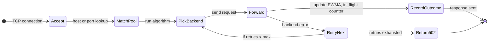
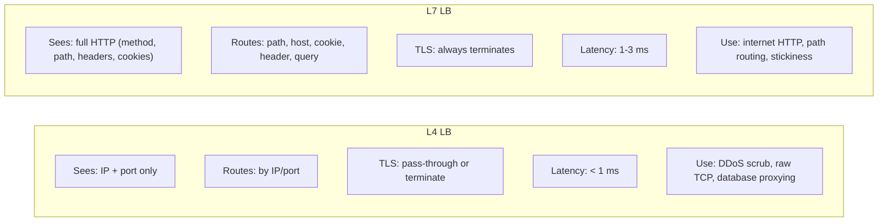
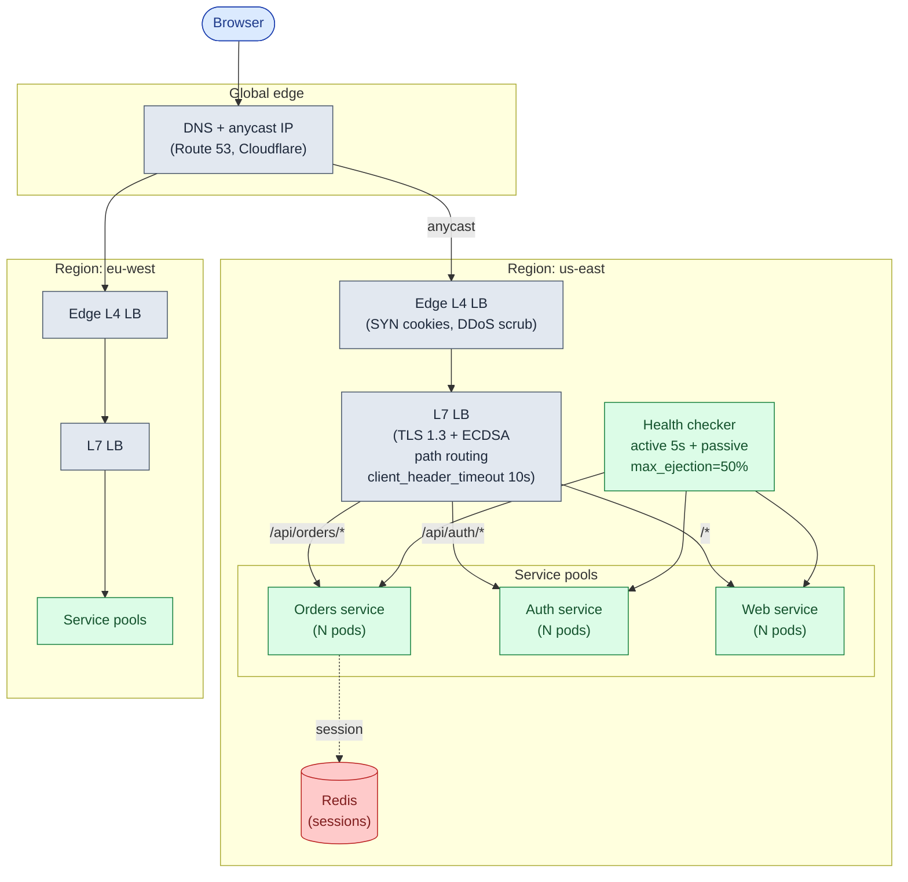
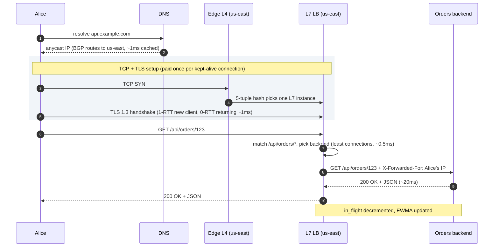
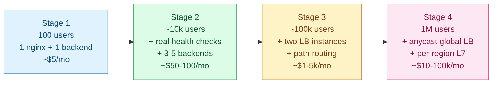

## Solution: Design a Load Balancer

### The short version

A load balancer is a proxy that picks a backend for each incoming connection, keeps the backend list honest by removing unhealthy servers within seconds, and distributes traffic so no single backend is overwhelmed. TLS terminates at the LB so backends speak plain HTTP. The LB itself needs to survive the failure of one of its own instances.

The picking algorithm is the easy part. The hard work is health accuracy (an active `/healthz` check does not detect a backend that answers it while throwing 500s on real traffic), load skew from sticky sessions, TLS handshake CPU at scale, and cascading failure when one slow backend blocks all workers.

The right topology is layered. An L4 edge terminates TCP and scrubs DDoS. An L7 layer inside each region terminates TLS and does path-based routing. DNS or anycast directs clients to the nearest region. Each layer adds 1-3 ms in exchange for one specific control point.

---

### 1. The two questions that matter most

**Protocol shape.** HTTP/2 with multiplexed connections is a completely different load picture from HTTP/1.1 with short connections. WebSockets change it again. The algorithm that works for HTTP/1.1 (least connections) fails silently for HTTP/2 because one TCP connection carries many requests. The algorithm that works for short requests (round-robin) fails for WebSockets because connections live for hours and round-robin only spreads the connects evenly, not the sustained load.

**Stickiness requirement.** If backends are stateless (sessions in Redis, not memory), every balancing algorithm is available. If backends hold state in memory (shopping carts, WebSocket handles, in-memory caches), every algorithm has a tax: sticky algorithms cause load skew; stateless algorithms cost a network hop per request for session data.

Everything else follows from those two answers.

---

### 2. The math, in plain numbers

| Stage | Peak req/s | Bandwidth | New TLS/s | Concurrent conns | What hurts |
|-------|-----------|-----------|-----------|-----------------|------------|
| **1** | 20 | ~10 Mbps | ~2 | ~100 | nothing |
| **2** | 500 | ~240 Mbps | ~50 | ~2,500 | NIC and nginx workers |
| **3** | 5,000 | ~2.4 Gbps | ~500 | ~25,000 | TLS CPU starts to bite |
| **4** | 30,000 | ~5-15 Gbps | ~3,000 | ~200k+ | TLS dominates; need LB cluster |

Three ceilings:

**Bandwidth.** A 10 Gbps NIC caps at ~9 Gbps usable. Video and file-heavy workloads hit this before TLS becomes a problem.

**TLS handshakes.** Each costs 1-3 ms of CPU. At 500/s, roughly one core. At 3,000/s, six cores doing nothing but handshakes. TLS 1.3 with session tickets (0-RTT for returning clients) cuts this by ~10x. ECDSA-P256 certs instead of RSA-2048 cut it by another ~5x. Both together: ~50x reduction, no hardware change.

**Connection count.** Each kept-alive connection costs file descriptors and ~10 KB of kernel memory. 200k concurrent connections needs Linux kernel tuning (`ulimit`, `net.core.somaxconn`) and several GB of RAM just for the socket table.

Which ceiling hits first depends on your workload. Name which one is yours.

---

### 3. The control plane API

A load balancer is not a REST API. It is a TCP/HTTP proxy. But every LB needs a control plane to manage its config at runtime, especially for deploys.

```
GET    /admin/v1/pools                         list all backend pools
GET    /admin/v1/pools/{pool}/backends         list backends with health status
POST   /admin/v1/pools/{pool}/backends         add a backend
DELETE /admin/v1/pools/{pool}/backends/{id}    remove a backend
PUT    /admin/v1/pools/{pool}/backends/{id}    change weight or state

POST   /admin/v1/pools/{pool}/backends/{id}/drain   stop new connections, let in-flight finish
POST   /admin/v1/pools/{pool}/backends/{id}/ready   re-enable after drain or maintenance

GET    /admin/v1/stats                         request rate, errors, latency histograms
```

The `drain` endpoint is load-bearing for deploys. Before killing a backend process, call drain. The LB stops sending new connections. In-flight requests finish. After a 30-second grace period, kill the process. Skip this and you drop real requests.

---

### 4. The data model

The LB is stateless for routing. All its operational state lives in RAM. There is no database on the hot path.

```
BackendPool {
    name: string
    algorithm: round_robin | least_conn | ip_hash |
               consistent_hash | ewma | weighted_rr
    health_check: HealthCheckConfig
    backends: List<Backend>
}

Backend {
    id: string                        # "10.0.1.10:8080"
    address: ip + port
    weight: int
    state: healthy | suspect | ejected | draining
    consecutive_failures: int
    consecutive_successes: int
    in_flight_requests: atomic int    # for least_conn / LEAST_REQUEST
    ewma_latency_ms: float            # for EWMA
    last_check_at: timestamp
}

HealthCheckConfig {
    type: http | tcp | grpc
    path: string                      # "/healthz"
    interval_ms: int                  # 5000
    timeout_ms: int                   # 1000
    unhealthy_threshold: int          # 3 consecutive fails = eject
    healthy_threshold: int            # 2 consecutive successes = re-add
    expected_status: List<int>        # [200]
    max_ejection_percent: int         # 50: never eject more than half the pool
}
```

Three things to defend out loud:

**All of this fits in RAM.** A pool of 1,000 backends with full state is well under 1 MB. No database, no Zookeeper, no Consul required on the hot path.

**Each LB instance has its own independent view of health.** If LB-1's network path to Backend B is broken but LB-2's path is fine, each should route to whatever it can reach. A shared global "B is unhealthy" opinion would turn a local network partition into a global outage.

**Sticky sessions across multiple LB instances** require encoding the backend ID inside the cookie itself (signed, encrypted). Any instance decrypts it and routes correctly. No shared state between LB instances.

---

### 5. The core engine



<details markdown="1">
<summary><b>Show: the pick and forward loop in pseudo-code</b></summary>

```python
def handle_request(conn):
    pool = match_pool(conn.host, conn.port)
    retries = 0

    while retries < pool.max_retries:
        backend = pick_backend(pool, conn)
        if backend is None:
            return respond_503(conn, "no healthy backends")

        backend.in_flight.increment()
        try:
            response = forward(conn, backend)
            backend.in_flight.decrement()
            record_outcome(backend, response.status, response.latency_ms)
            return respond(conn, response)
        except BackendError as e:
            backend.in_flight.decrement()
            record_failure(backend, e)
            retries += 1

    return respond_502(conn, "backend exhausted after retries")


def pick_backend(pool, conn):
    healthy = [b for b in pool.backends if b.state == "healthy"]
    if not healthy:
        return None

    if pool.algorithm == "least_conn":
        return min(healthy, key=lambda b: b.in_flight.get())

    elif pool.algorithm == "round_robin":
        return healthy[pool.rr_counter.next() % len(healthy)]

    elif pool.algorithm == "consistent_hash":
        return pool.hash_ring.lookup(conn.routing_key)

    elif pool.algorithm == "ewma":
        return min(healthy, key=lambda b: b.ewma_latency_ms)
```

The health check loop runs in parallel. It polls `/healthz` on each backend, updates consecutive failure/success counters, and flips state when thresholds cross. Passive detection runs on every real response: update the EWMA, check if p99 exceeds 3x pool median, eject if so (but never more than `max_ejection_percent`).

</details>

Three things that make this safe in production:

**Pick-and-forward tolerates a backend dying between health check intervals.** If forwarding raises an error, the LB picks the next backend. Retries are capped so a fully broken pool fails fast rather than hanging forever.

**Active and passive checks are complementary.** Active catches process death. Passive catches silent degradation: a backend answering 200 to `/healthz` while returning 500 on real traffic, or responding slowly.

**`max_ejection_percent` is the difference between a partial outage and a total one.** The outlier logic refuses to eject if doing so would drop the pool below the floor. Better to keep sending traffic to a sick backend than to send it nowhere.

---

### 6. L4 vs L7, resolved



Production pattern: **L4 at the outermost edge, L7 inside each region.**

The edge L4 terminates TCP, absorbs DDoS via SYN cookies and rate limiting, and passes clean connections inward. It does not parse HTTP, which is why it is fast. The L7 inside the region terminates TLS, reads URLs, routes to per-service pools, and injects headers. Each layer does exactly one job. A single box trying to do both is slower and harder to scale independently.

---

### 7. The architecture



| Component | Purpose | Why it exists |
|-----------|---------|---------------|
| DNS + anycast | Routes each user to the nearest healthy region | BGP withdraw = sub-second regional failover |
| Edge L4 LB | Terminates TCP, absorbs DDoS | Fast; does not parse HTTP; scales to Tbps |
| L7 LB | Terminates TLS, routes by path, injects headers | Smart routing, per-route policy, observability |
| Health checker | Active + passive, max 50% ejection | Detects dead and degraded backends |
| Service pools | One pool per service | Each service scales independently |
| Redis | Holds sessions | Lets backends be stateless |

> **Take this with you.** If the auth service dies, orders and web keep running. Each pool is independent. The LB is the only component that sees all of them.

---

### 8. A request, end to end



Latency budget:

| Step | Typical |
|------|---------|
| DNS (cached) | < 1 ms |
| Edge L4 forwarding | < 1 ms |
| TLS handshake (new client) | 10-30 ms |
| TLS resumption (0-RTT) | < 1 ms |
| L7 parse + route | < 1 ms |
| Backend processing | 5-50 ms |

The LB layers together add ~2-5 ms for a returning client.

---

### 9. The scaling journey: 100 users to 1 million



#### Stage 1: 100 users

One nginx, one backend. nginx terminates TLS and proxies HTTP. Round-robin across one backend is a no-op, but the config is ready for a second. No health checker (one backend is always up or the site is down for 100 users). No failover.

#### Stage 2: 10,000 users, 3-5 backends

**What broke:** the single backend pegs CPU during bursts. Killing it for deploys takes the site down for 30 seconds.

- Scale to 3-5 backends. Switch from round-robin to `least_conn`.
- Active health checks every 5 seconds. Eject after 3 failures, re-add after 2 successes.
- `proxy_next_upstream` so the LB retries on a different backend when one fails mid-request.
- Drain before killing for deploys.

Not built yet: no second LB instance. A single nginx is still a SPOF. For 10,000 users a rare 30-second failover is acceptable.

#### Stage 3: 100,000 users, active-active LB, path routing

**What broke (several things at once):**

- TLS CPU on the single nginx climbs. 500 new connections/s x 2 ms = one core just on handshakes.
- The single nginx is a SPOF that cannot be accepted.
- Monolith is splitting; nginx config is getting unmanageable.

- Add a second nginx in active-active with a shared VIP (keepalived/VRRP). ~1-second failover. Or use a managed cloud L7 LB (AWS ALB) which is multi-AZ by default.
- Path-based routing: `/api/orders/*` to orders service, etc.
- TLS 1.3 + session tickets. ECDSA-P256 certs. Cut handshake CPU by ~50x.
- Move sessions to Redis. Backends become stateless. No sticky sessions needed.

#### Stage 4: 1,000,000 users, global + regional

**What broke:**

- Users in Asia see 300 ms to us-east.
- TLS at 3,000/s costs 6 cores even with session tickets.
- Service-to-service traffic crosses the central LB twice per call.

- Anycast global LB (Cloudflare, AWS Global Accelerator). Same IP from every region. BGP routes each user to nearest healthy region. Failover in seconds.
- Sidecar proxy (Envoy, Linkerd) on every pod. Internal calls skip the central LB. Adds mTLS, retries, and per-call observability.
- TLS 1.3 + 0-RTT everywhere. ECDSA everywhere.
- Slow start: ramp new backend weight from 0 to 100% over 30 seconds. Cold caches do not get slammed.

---

### 10. Reliability

**The LB itself dies.** Active-passive VIP with keepalived: ~1-second failover, same IP. Active-active anycast: BGP withdraw shifts traffic sub-second. Anycast wins for internet-facing services at scale.

**A backend dies.** Active health checks notice within 1-3 intervals (5-15 seconds). In-flight requests on the dead backend fail and are retried on a healthy backend via `proxy_next_upstream`.

**The whole pool degrades.** `max_ejection_percent: 50` stops the LB from ejecting everyone. It returns 503 while someone investigates. Better to tell the truth than forward to nowhere.

**A backend is alive but slow.** The dangerous case. Active health checks pass. Real requests take 30 seconds. Round-robin keeps sending more.

Fix: `least_conn` stops sending new requests to the slow backend once it accumulates in-flight. Combine with `proxy_read_timeout 30s`. Add passive latency ejection: if p99 is more than 3x the pool median for 60 seconds, eject temporarily. Backend-side circuit breaker: when the backend's own dependency is sick, it should return 503 fast rather than serve slowly.

**Cascading failure.** Backend A is slow. LB ejects it. Traffic shifts to B and C. They hit 1.5x load and start timing out. LB ejects them too. All backends gone.

The fixes together: `max_ejection_percent: 50` (never eject everyone); backend circuit breakers (return 503 fast when overloaded); client retries with exponential backoff and jitter (spread retry bursts over tens of seconds instead of one second).

**TLS cert expiry.** A cert expiring silently takes the whole service down. Automate renewal (Let's Encrypt + cert-manager). Alert on certs expiring within 30 days.

---

### 11. Observability

| Metric | Why it matters |
|--------|----------------|
| `lb.request.rate` per backend | Uneven values mean the balancing algorithm is not working |
| `lb.request.error_rate` per backend | One backend spiking = candidate for ejection |
| `lb.request.latency` p50/p95/p99 per backend | Find slow backends before they cascade |
| `lb.healthy_backend_count` per pool | Below 50% = page someone |
| `lb.ejected_backend_count` per pool | Spike = something pool-wide is wrong |
| `lb.tls.handshakes_per_sec` | TLS CPU ceiling watch |
| `lb.tls.session_resumption_rate` | Below 70% means tickets are not working |
| `lb.connection.active_count` | File descriptor and memory pressure |
| `lb.connection.new_per_sec` | Much lower than request rate means keep-alive is working |
| `lb.upstream.retry_rate` | High = flaky backends; the LB is masking the problem |
| `lb.bandwidth.in_out` | NIC saturation watch |

Page on: `healthy_backend_count < 50%` for 1 minute. LB instance unresponsive. TLS error rate > 1%.

Ticket on: latency p99 regression > 30% sustained. `ejected_backend_count > 0` for 10 minutes. Bandwidth > 70% of NIC capacity.

---

### 12. Follow-up answers

**1. Sticky sessions and uneven load.**

Three options in order of how much stickiness you give up. First: cap session TTL at 1 hour. Users re-assign periodically. Brief disruption, periodic rebalancing. Second: bounded-load stickiness. If the target backend is at > 1.25x average load, re-assign and re-issue the cookie. Disrupts a few users but caps the imbalance. Third: externalize sessions to Redis. Backends become stateless. Stickiness goes away entirely. Right answer for new systems. Legacy systems often cannot pay the rewrite cost.

**2. TLS termination cost, cheapest first.**

Enable TLS 1.3 with session tickets (returning clients do 0-RTT, ~10x cheaper; just a config change). Switch to ECDSA-P256 certs instead of RSA-2048 (~5x faster at the same security level; just a cert swap). Tune the session ticket cache size. Scale the LB horizontally. Hardware TLS offload (worth it only above ~10k handshakes/s). Most teams stop at step 2.

**3. HTTP/2 and least connections.**

With HTTP/2, each client opens one TCP connection and multiplexes many requests over it. `least_conn` sees every backend has 1 connection. The first backend wins ties consistently and gets all new traffic. Fix: switch to least active requests. Envoy calls this `LEAST_REQUEST`. It counts in-flight HTTP/2 streams per backend, not TCP connections. If the LB is L4 and cannot parse HTTP/2, move to an L7 LB.

**4. WebSockets and uneven distribution.**

WebSocket connect is one round trip. After that the LB shuffles bytes. With 10k users and 5 backends on round-robin, the initial spread is even (2k per backend). As users disconnect and reconnect over hours, the spread drifts. If a backend bounces, all its connections reconnect and round-robin slams the next backend in rotation. Fixes: `least_conn` for the connect step; graceful drain on bounce (close connections in waves over 2 minutes, not all at once); cap max connections per backend; consider a dedicated WebSocket gateway.

**5. Slow backend starving the pool.**

`least_conn` is the primary fix. The slow backend accumulates in-flight requests. Once it has more than the others, new requests go elsewhere. Combine with `proxy_read_timeout 30s`: after 30 seconds the LB gives up and frees the worker. Add passive latency ejection: if p99 is more than 3x pool median for 60 seconds, eject temporarily. Backend-side circuit breaker: when the backend's own dependency (slow disk, slow DB) is sick, it should return 503 immediately. The LB ejects it and the backend recovers faster.

**6. DNS TTL.**

Long TTL: fewer DNS queries, slower to react to LB IP changes. Short TTL: faster failover, more DNS load. Production default: 60 seconds. Worst-case failover is 1-2 minutes. For a planned LB IP change: drop TTL to 30s 24 hours ahead so resolver caches have short TTLs by the time you flip. The real fix is anycast: the IP never changes, BGP advertisement just stops from the failed region.

**7. Cross-region failover.**

With anycast: BGP advertisement from the failed region is withdrawn. Routers learn within seconds. Clients are silently routed to the next-nearest region. Sub-second on good networks, up to 30 seconds on slow-converging paths. With geo-DNS only: Route 53 health checks detect the failure and stop returning the failed region's IP. Bound by DNS TTL (60 seconds). Clients with cached DNS still hit the dead region for up to TTL seconds. Anycast failover is ~10x faster.

**8. Path-based routing for a monolith split.**

Add a route to the L7 LB: `/api/orders/*` to `order_service`, everything else to `monolith`. More specific paths first. Migration: deploy `order_service` in parallel with the monolith. Route 5% of `/api/orders/*` traffic to the new service using weighted routing. Monitor. Raise to 25%, then 50%, then 100%. Remove order-handling from the monolith. Rollback is a single LB config change.

**9. Health check storm.**

200 LBs × 500 backends / 5s = 20,000 `/healthz` requests per second. If checks are deep (DB query), you DoS your own DB. Two fixes: keep `/healthz` shallow (is the process alive, 200); run deep checks (DB connectivity) separately at 60-second intervals through monitoring, not the LB. Better: switch from pull to push. Envoy subscribes to a service discovery system (xDS) that pushes health updates. The discovery system checks each backend once, not 200 times. In Kubernetes: `kubelet` runs liveness and readiness probes once per node, and the LB watches Endpoints. Either approach cuts health check load by 100-200x.

**10. LB dropping connections during deploy.**

Two failure modes: new backends register before they finish warming up (cold cache errors on real requests); old backends are killed mid-request (dropped connections). Correct sequence: new backend starts. Readiness probe `/ready` returns 503 until initialization completes. LB does not include it until `/ready` is 200. LB slow-starts the new backend: ramp weight from 0 to 100% over 30 seconds. Old backend drain: mark as draining, stop new connections, let in-flight finish, kill after 30-second grace period. Roll one backend at a time. Never kill more than one simultaneously. Kubernetes handles most of this with readiness probes, `preStop` hooks, and `terminationGracePeriodSeconds`.

---

### 13. Trade-offs worth saying out loud

**Hardware LB vs software LB vs cloud-managed.** Hardware (F5, NetScaler): high upfront cost, very high throughput per unit, complex to operate. Common in regulated enterprises. Software (nginx, HAProxy, Envoy): commodity hardware, open source, full control, you operate it. Default for most engineering teams. Cloud-managed (ALB, GCLB): zero operations, pay per request and per GB, less flexibility. Right for cloud-native teams below a certain bandwidth bill. Above tens of TB/month outbound, self-managed often gets cheaper.

**Sidecar mesh vs centralized LB.** Centralized: one LB tier in front of all services. Easy to reason about, single config point, single failure point. Sidecar: every pod has a proxy, routing decisions are local, full per-call observability, ~50 MB overhead per pod. Sidecar wins for service-to-service traffic inside the cluster. Centralized wins for ingress from the internet. Most large systems use both.

**Sticky sessions vs stateless backends.** Stickiness is operationally simpler (no shared state to operate). Stateless is operationally cleaner (any algorithm works, any backend serves any request, no load skew). New systems should default to stateless. Legacy systems are often stuck with stickiness.

---

### 14. Common mistakes

**Treating "load balancer" as a single thing.** The LB is layered. Saying "we use nginx" without acknowledging the DNS/anycast layer in front and the sidecar layer behind shows you have not thought about topology.

**No mention of L4 vs L7.** The difference is the most basic concept question on this topic. Skip it and the interviewer moves on.

**Round-robin everywhere.** Round-robin is the wrong default for variable-duration requests, HTTP/2, and WebSockets. `least_conn` (or least active requests for HTTP/2) is a better default.

**Ignoring sticky session costs.** "We'll use cookie-based stickiness" without discussing load skew and the backend-failover reshuffle is a junior answer.

**No mention of health check storms.** At non-trivial scale, 200 LB instances polling 500 backends becomes its own DoS vector. Push-based health via xDS or Kubernetes Endpoints is the senior answer.

**Forgetting the LB is a SPOF.** Active-active anycast or active-passive VIP. Either works. Not addressing it is not.

**TLS handwave.** "Terminate at the LB" is correct but incomplete. Mention session tickets, ECDSA certs, 0-RTT, and at scale, when hardware offload is worth considering.

**Cascading failure not mentioned.** This is the most common LB production incident. `max_ejection_percent` and backend-side circuit breakers are the answer. Candidates who name both without prompting are at senior level.

**No drain step in deploys.** Rolling deploys without drain drop requests. A senior candidate names readiness probes, slow start, and drain without being asked.

**Treating sidecar mesh as a buzzword.** If you mention service mesh, explain why it removes the central LB hop for internal traffic and gives per-service mTLS. Not just that you would use it.

Seven of these ten without prompting is a senior-level answer. The three that matter most: L4/L7 framing, sticky session costs, and health check storms.
