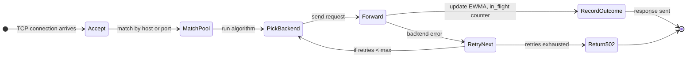
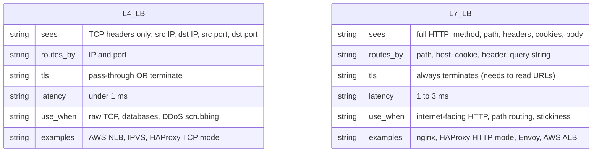
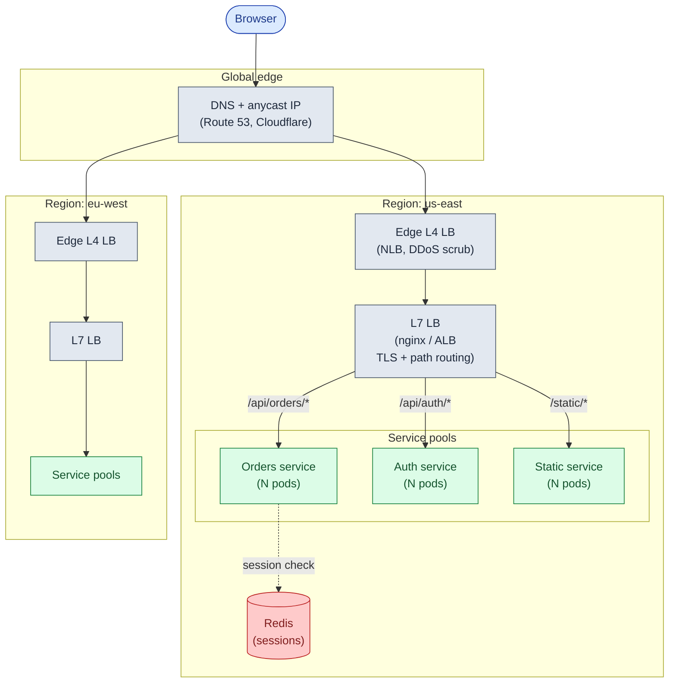
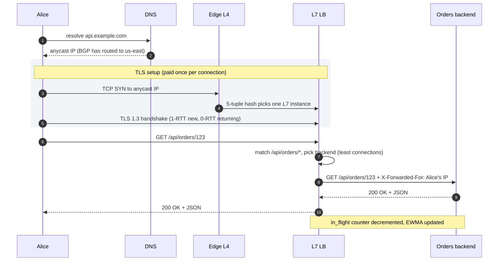
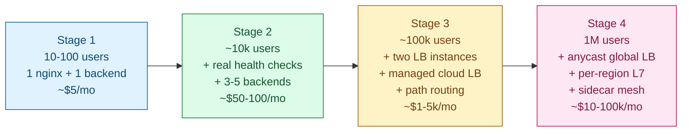

## Solution: Design a Load Balancer

### The short version

A load balancer has two jobs: pick a backend for each incoming request, and keep the list of backends honest by kicking out the dead ones.

The picking is simple. A round-robin loop or a least-connections counter handles most workloads. The interesting design work is everything around it. What does the LB *see* (L4 sees only IPs and ports; L7 sees the full HTTP request)? How does it decide a backend is unhealthy? What happens when a sticky cookie sends a user to a backend that then dies? And how do you stop the LB itself from taking the whole site down?

The right setup is layered. DNS or anycast routes users to the nearest region. Inside each region, an L7 LB terminates TLS and does path-based routing to per-service pools. Inside each pod, a sidecar handles service-to-service traffic. Each layer adds 1-3 ms of latency in exchange for one specific control point. You add layers when something specific breaks.

---

### 1. The two questions that matter most

**Protocol shape.** HTTP/2 with multiplexed connections is a totally different load picture from HTTP/1.1 with short connections. WebSockets change it again. The algorithm that works for HTTP/1.1 fails for HTTP/2. The algorithm that works for short requests fails for WebSockets. Protocol is the single most important answer to get right.

**Stickiness requirement.** If backends are stateless (sessions in Redis, not memory), every algorithm is on the table. If they hold state (carts, WebSocket handles, in-memory caches), every algorithm has a tax: sticky algorithms cause uneven load; stateless algorithms force you to externalize state, which costs a network hop per request.

Everything else (geo-routing, TLS offload, health checks, failover) follows from those two answers.

---

### 2. The math, in plain numbers

| Stage | Users | Req/sec peak | Bandwidth | Concurrent conns | New TCP/sec | What hurts |
|-------|-------|--------------|-----------|------------------|-------------|------------|
| **1** | 100 | 10 | ~5 Mbps | ~50 | ~5 | nothing; the box is bored |
| **2** | 10k | 500 | ~240 Mbps | ~2k | ~50 | NIC and nginx workers |
| **3** | 100k | 5k | ~2.4 Gbps | ~20k | ~500 | TLS CPU starts to bite |
| **4** | 1M | 30k | ~5-15 Gbps | ~200k+ | ~3k | TLS dominates; need multiple LBs |

Three ceilings to watch:

**Bandwidth.** A single 10 Gbps NIC handles about 9 Gbps usable. Video and file-heavy workloads hit this first.

**TLS handshakes.** Each handshake costs 1-3 ms of CPU. At 500/sec you spend roughly one core. At 3,000/sec, six cores doing nothing but handshakes. Fix: session resumption. When the same client returns, they reuse a "ticket" from last time (about 10x cheaper). TLS 1.3 with tickets is non-negotiable above stage 3.

**Connection count.** Each kept-alive connection costs file descriptors and ~10 KB of kernel memory. 200k concurrent connections needs Linux tuning and several GB of RAM just for the socket table.

Which ceiling hits first depends on your workload. Video CDN: bandwidth. IoT: TLS. Chat: connection count. Naming which one is *yours* separates a useful answer from a generic one.

---

### 3. The API (control plane)

A load balancer is not a REST API. It is a TCP/HTTP proxy. The "API" is "speak HTTP at me and I will proxy." But every LB needs a **control plane** to manage its config.

```
GET    /admin/v1/pools                           list all backend pools
GET    /admin/v1/pools/{pool}/backends           list backends with health status
POST   /admin/v1/pools/{pool}/backends           add a backend
DELETE /admin/v1/pools/{pool}/backends/{id}      remove a backend
PUT    /admin/v1/pools/{pool}/backends/{id}      change weight or state

POST   /admin/v1/pools/{pool}/backends/{id}/drain   stop new conns, let existing finish
POST   /admin/v1/pools/{pool}/backends/{id}/ready   re-enable

GET    /admin/v1/stats                           request rate, errors, latency histograms
```

The `drain` endpoint is worth calling out. Before you kill a backend for a deploy, you call drain. The LB stops sending new connections to it. Existing in-flight requests finish. After a 30-second grace period, you kill the process. Skip this step and you drop requests.

---

### 4. The data model

The LB is mostly stateless. The state it holds lives entirely in RAM. There is no database.

```
BackendPool {
    name: string
    algorithm: round_robin | least_conn | ip_hash |
               consistent_hash | ewma | weighted_rr
    health_check: HealthCheckConfig
    backends: List<Backend>
}

Backend {
    id: string                        # "10.0.1.10:8080"
    address: ip + port
    weight: int
    state: healthy | unhealthy | draining | maintenance
    consecutive_failures: int
    consecutive_successes: int
    in_flight_requests: atomic int    # for least_conn
    ewma_latency_ms: float            # for EWMA
    last_check_at: timestamp
}

HealthCheckConfig {
    type: http | tcp | grpc
    path: string                      # "/healthz"
    interval_ms: int                  # 5000
    timeout_ms: int                   # 1000
    unhealthy_threshold: int          # 3 consecutive fails = eject
    healthy_threshold: int            # 2 consecutive successes = re-add
    expected_status: List<int>        # [200]
    max_ejection_percent: int         # 50: never eject more than half
}
```

Three things to defend out loud:

**All of this fits in RAM.** A pool of 1,000 backends with full state is well under 1 MB. There is no database, no Zookeeper, no Consul required for the hot path. The LB process owns the state.

**Each LB instance has its own opinion about health.** They do not share. By design. If LB-1's network path to backend B is broken but LB-2's path to B is fine, each should route to whatever it can reach. Sharing one global "B is unhealthy" opinion would turn a local network problem into a global outage.

**For sticky sessions across multiple LB instances**, put the backend ID inside the cookie itself (signed and encrypted). Any LB instance can decrypt it and route correctly. No shared state needed between LB instances.

---

### 5. The engine

The LB's main loop is small.



<details markdown="1">
<summary><b>Show: the pick and forward loop in pseudo-code</b></summary>

```python
def handle_request(conn):
    pool = match_pool(conn.host, conn.port)
    retries = 0

    while retries < pool.max_retries:
        backend = pick_backend(pool, conn)
        if backend is None:
            return respond_503(conn, "no healthy backends")

        backend.in_flight.increment()
        try:
            response = forward(conn, backend)
            backend.in_flight.decrement()
            record_outcome(backend, response.status, response.latency_ms)
            return respond(conn, response)
        except BackendError as e:
            backend.in_flight.decrement()
            record_failure(backend, e)
            retries += 1

    return respond_502(conn, "backend exhausted after retries")


def pick_backend(pool, conn):
    healthy = [b for b in pool.backends if b.state == "healthy"]
    if not healthy:
        return None

    if pool.algorithm == "least_conn":
        return min(healthy, key=lambda b: b.in_flight.get())

    elif pool.algorithm == "round_robin":
        return healthy[pool.rr_counter.next() % len(healthy)]

    elif pool.algorithm == "consistent_hash":
        return pool.hash_ring.lookup(conn.routing_key)

    elif pool.algorithm == "ewma":
        return min(healthy, key=lambda b: b.ewma_latency_ms)
```

The health check loop runs in parallel. It polls `/healthz` on each backend, updates consecutive failure/success counters, and flips state when thresholds are crossed. Passive outlier detection runs on every response: update the EWMA, check if the recent error rate exceeds the threshold, eject if it does (but never more than `max_ejection_percent`).

</details>

Three things make this safe:

**Pick-and-forward tolerates a backend dying between health checks.** If forwarding raises, the LB moves to the next backend. Retries are capped so a fully broken pool fails fast.

**Active and passive checks complement each other.** Active catches process death. Passive catches slow degradation: a backend returning 200 to `/healthz` while throwing 500 on real traffic.

**`max_ejection_percent` is the difference between partial outage and total outage.** The outlier code refuses to eject if doing so would drop the pool below the floor. Better to keep sending traffic to a sick backend than to send it nowhere.

---

### 6. Resolving L4 vs L7

Before drawing topology, you need to know what the LB is actually doing at each layer.



The common production pattern: **L4 at the edge, L7 inside the region.**

The edge L4 terminates TCP, absorbs DDoS, and passes bytes to the L7. The L7 inside the region terminates TLS, reads URLs, does path routing, and applies per-route policy. Each does exactly one thing. A single box trying to do both is slower and harder to scale.

---

### 7. The architecture



What each box earns:

| Box | What it does | Why it exists |
|-----|--------------|---------------|
| **DNS + anycast** | Routes each user to the nearest healthy region | Sub-second regional failover via BGP withdraw |
| **Edge L4 LB** | Terminates TCP, absorbs DDoS | Fast; does not parse HTTP; scales to Tbps |
| **L7 LB** | Terminates TLS, routes by path, injects headers | Smart routing; per-route policy; observability |
| **Service pools** | The actual backends, one pool per service | Each service scales independently |
| **Redis** | Holds sessions | Lets backends be stateless; enables any-backend routing |

> **Take this with you.** If the auth service dies, the rest of the site keeps running. Each service pool is independent. The LB is the only thing that sees all of them.

---

### 8. A request, end to end



Latency budget per step:

| Step | Typical latency |
|------|-----------------|
| DNS (cached) | < 1 ms |
| BGP/anycast routing | ~5-20 ms (first connection only) |
| Edge L4 forwarding | < 1 ms |
| TLS handshake (new client) | 10-30 ms |
| TLS resumption (returning) | 0-5 ms |
| L7 parse + route | < 1 ms |
| Backend processing | 5-50 ms |

The LB layers add maybe 5 ms total. That is the price for control, observability, and smart routing.

---

### 9. The scaling journey: 10 users to 1 million



#### Stage 1: 100 users, single nginx, one backend

One nginx, one backend. nginx terminates TLS, proxies HTTP. Round-robin across one backend is a no-op, but the config is ready for a second.

What you **do not** build: no health checker (one backend is always up or the site is down), no failover (acceptable for 100 users), no sticky sessions.

#### Stage 2: 10,000 users, 3-5 backends, real health checks

**What just broke:** the single backend pegs CPU during bursts. Killing it for deploys takes the site down for 30 seconds.

**The fixes:**

- Scale to 3-5 backends behind the same nginx.
- Switch to `least_conn`. Handles variable request times better than round-robin.
- Add active health checks every 5 seconds. Eject after 3 failures, re-add after 2 successes.
- Add `proxy_next_upstream` so the LB retries on a different backend when one fails.
- For deploys: drain one backend at a time before killing it.

What you **do not** build yet: no second nginx instance. One LB is still a SPOF. For 10,000 users, a rare 30-second failover is acceptable.

#### Stage 3: 100,000 users, active-active LB, path-based routing

**What just broke (several things at once):**

- TLS CPU on the single nginx is climbing. 500 new connections/sec × 2 ms = one CPU core just on handshakes.
- The single nginx is a SPOF you can no longer accept.
- The team is splitting the monolith into services. The nginx config is becoming unmanageable.

**The fixes:**

- Add a second nginx instance. Run them active-active behind a shared VIP (keepalived/VRRP). ~1-second failover.
- Or use a managed cloud L7 LB (AWS ALB, GCP HTTPS LB). Multi-AZ by default. Terminates TLS, absorbs DDoS, routes to per-service target groups.
- Path-based routing: `/api/orders/*` to orders service, `/api/auth/*` to auth service, `/*` to web service.
- Enable TLS 1.3 + session tickets. Returning clients do 0-RTT. Cuts handshake CPU by ~10x.
- Move sessions to Redis. Backends become stateless. No sticky sessions needed.

#### Stage 4: 1,000,000 users, global + regional + sidecar

**What just broke:**

- Users in Asia get 300 ms to us-east. Unacceptable.
- TLS handshake CPU at 3,000 req/sec is expensive at scale.
- Service-to-service traffic crosses the central L7 LB twice per call. Internal latency budgets are eaten.

**The fixes:**

- Add anycast global LB (Cloudflare, AWS Global Accelerator, GCP Premium Tier). Same IP announced from every region. BGP routes each user to the nearest healthy region. Failover in seconds, not minutes.
- Add a sidecar proxy (Envoy, Linkerd) to every pod. Service-to-service calls go: pod sidecar to remote pod sidecar. Removes the central LB hop for internal traffic. Adds mTLS, retries, and per-call observability for free.
- TLS 1.3 with 0-RTT everywhere. ECDSA certs (5x cheaper CPU than RSA at same security level).
- Slow start for new backends: ramp weight from 0 to 100% over 30 seconds so cold caches do not get slammed.

---

### 10. The variants

| Variant | What changes | The lesson |
|---------|--------------|------------|
| **HTTP/2** | Least connections counts connections, not requests. One TCP connection carries many. | Use least *active requests* (Envoy's `LEAST_REQUEST`), not least connections. |
| **WebSockets** | One long-lived connection per user. Round-robin spreads connects evenly. Load drifts over hours as users disconnect unevenly. | Use `least_conn` for connect. Drain gracefully on bounce. Consider a dedicated WS gateway. |
| **gRPC** | Like HTTP/2 but with typed messages. Long-lived streams. | Same as HTTP/2. Least active requests. L7 LB that understands gRPC framing. |
| **Canary deploy** | Route 10% of traffic to new version. | Weighted round-robin: new version weight 1, old weight 9. Ramp gradually. |
| **Database proxy** | MySQL or Postgres connections are expensive to open. Route to a pool of persistent connections. | L4 LB + consistent hash on client session ID. PgBouncer or ProxySQL does this job. |

---

### 11. Reliability

**The LB itself dies.** Active-passive VIP with keepalived: one LB holds the VIP; standby grabs it on failure (~1-second failover). Active-active anycast: all LBs serve traffic; BGP withdraw shifts traffic sub-second. For internet-facing services at scale, active-active anycast wins.

**A backend dies.** Active health checks notice within 1-3 intervals (5-15 seconds). In-flight requests on the dead backend fail; `proxy_next_upstream` retries them on a healthy backend.

**The whole pool goes bad.** `max_ejection_percent: 50` stops the LB from ejecting everyone. The LB returns 503 while someone investigates. That is correct behavior. Better to tell the truth (503) than forward to nowhere and hang.

**A backend is alive but slow.** The dangerous case. Active health checks pass (it answers `/healthz`). Real requests take 30 seconds. Round-robin keeps sending it more. Workers pile up.

The fix: `least_conn` avoids it naturally (slow backend accumulates in-flight). Combine with `proxy_read_timeout 30s`. After 30 seconds the LB gives up and frees the worker. Add passive latency-based ejection: if a backend's p99 is more than 3x the pool median for 1 minute, eject it temporarily.

**Cascading failure.** Backend A is slow. LB ejects it. Traffic shifts to B and C. They run at 1.5x load. They start timing out. LB ejects them too. No backends. LB returns 503. Clients retry. Retries hammer the next backend that comes up.

The fixes: `max_ejection_percent: 50` (never eject everyone); backend-side circuit breakers (return 503 fast when overloaded, do not serve slowly); client retries with exponential backoff and jitter.

**TLS cert expiry.** A cert expiring silently takes the whole service down. Automate renewal (Let's Encrypt + cert-manager). Alert on certs expiring within 30 days.

---

### 12. Observability

| Metric | Why it matters |
|--------|----------------|
| `lb.request.rate` per backend | Uneven values mean the balancing algorithm is not working |
| `lb.request.error_rate` per backend | One backend spiking errors = candidate for ejection |
| `lb.request.latency` p50/p95/p99 per backend | Find slow backends before they cascade |
| `lb.healthy_backend_count` per pool | Drops below threshold = page someone |
| `lb.ejected_backend_count` per pool | Spikes = something pool-wide is wrong |
| `lb.tls.handshakes_per_sec` | TLS CPU ceiling watch |
| `lb.tls.session_resumption_rate` | Below 70% means clients are not using tickets |
| `lb.connection.active_count` | File descriptor and memory pressure |
| `lb.connection.new_per_sec` | Should be much lower than request rate (keep-alive working) |
| `lb.upstream.retry_rate` | High = backends are flaky; the LB is masking it |
| `lb.bandwidth.in_out` | NIC saturation watch |

Page on: `healthy_backend_count < 50%` of total for 1 minute. LB instance unresponsive. TLS error rate > 1%.

Ticket on: latency p99 regression > 30%. `ejected_backend_count > 0` sustained for 10 minutes. Bandwidth > 70% of NIC capacity.

---

### 13. Follow-up answers

**1. Sticky sessions and uneven load.**

Three options in order of how much you give up. First: cap session TTL at 1 hour. Users re-assign periodically. Brief stickiness loss, periodic rebalancing. Second: bounded-load stickiness. If the target backend is at > 1.25x average load, re-assign the user and re-emit the cookie. Disrupts stickiness for a few unlucky users but caps the imbalance. Third: externalize sessions to Redis. Backends become stateless. Any backend serves any request. Stickiness goes away entirely. Right answer for new systems. Legacy systems often cannot pay the rewrite cost.

**2. TLS termination cost.**

In order from cheapest to most expensive: enable TLS 1.3 with session tickets (returning clients do 0-RTT, about 10x cheaper than fresh handshakes; just a config change); switch to ECDSA certs instead of RSA (ECDSA-P256 is ~5x faster at the same security level; just a cert change); tune the session resumption cache size; scale the LB horizontally (more cores); TLS offload to a dedicated proxy tier; SmartNIC/ASIC offload (worth it only above ~10k handshakes/sec). Most teams stop at step 3 or 4.

**3. HTTP/2 and least connections.**

With HTTP/2, each client opens one TCP connection and multiplexes many requests over it. The LB's `least_conn` sees every backend has 1 connection. The first backend wins ties consistently and gets all new traffic. Fix: switch from least connections to least active requests. Envoy calls this `LEAST_REQUEST`. The LB counts in-flight HTTP/2 streams per backend, not TCP connections. If the LB is L4 and cannot parse HTTP/2, move to a L7 LB.

**4. WebSockets and uneven distribution.**

WebSocket connect is one round trip. After that the LB just shuffles bytes. Users connect once and stay connected for hours. With 10k users and 5 backends on round-robin, the initial spread is even (2k per backend). As users disconnect and reconnect, the spread drifts based on disconnect patterns. If a backend bounces, all its connections reconnect and round-robin slams the next backend. Fixes: `least_conn` for the connect step; drain gracefully on bounce (close connections in waves over 2 minutes, not all at once); cap connections per backend; consider a dedicated WebSocket gateway layer separate from the HTTP LB.

**5. Slow backend starving the pool.**

`least_conn` is the simplest fix. The slow backend accumulates in-flight requests. Once it has more than the others, new requests go elsewhere. Combine with `proxy_read_timeout 30s`: after 30 seconds, the LB gives up and frees the worker. Add passive latency-based ejection: if p99 is more than 3x pool median for 1 minute, eject temporarily. Backend-side circuit breaker: when the backend's own dependency (slow disk, slow DB) is sick, return 503 fast rather than serving slowly. The LB ejects, the backend recovers, the LB re-admits.

**6. DNS TTL.**

Long TTL: clients cache longer, fewer DNS queries, slower to react to changes. Short TTL: clients re-resolve often, faster failover, more DNS load. Production default: 60 seconds. Failover happens within 1-2 minutes worst case. For an emergency LB IP change: drop TTL to 30s 24 hours ahead so resolver caches have short TTLs by the time you flip. Then raise it back. The real fix is to not change LB IPs. Anycast IPs do not change; they just stop being advertised from a failed region.

**7. Cross-region failover.**

Layer by layer. Anycast (if used): BGP advertisement from the failed region is withdrawn. Routers learn within seconds. Clients are silently routed to the next-nearest region. Sub-second on good networks, up to 30 seconds on slow ones. Geo-DNS (if used instead): Route 53's latency routing has health checks. When us-east fails, eu-west's IP is returned. Bound by DNS TTL (60 seconds). Clients with cached DNS still hit us-east for up to TTL seconds, then retry. SDKs with retry logic eventually succeed against eu-west. End-to-end: anycast = 5-30s. Geo-DNS = 60-300s.

**8. Path-based routing for a monolith split.**

Add a route to the L7 LB: `/api/orders/` goes to `order_service`, everything else goes to `monolith`. More specific paths first. Migration plan: deploy `order_service` in parallel with the monolith (both handle `/api/orders/*`). Route 5% using `split_clients`. Monitor. If it handles 5% cleanly, raise to 25%, then 50%, then 100%. Remove order-handling from the monolith. Route 100% to `order_service`. The LB is the cutover point. Rollback is one config change.

**9. Health check storm.**

200 LBs × 500 backends ÷ 5s = 20,000 req/sec on `/healthz`. If checks are deep (DB query), you DoS your own DB. Fixes: keep `/healthz` shallow (process is alive, 200); run deep checks (DB connectivity) on a 60-second interval via monitoring, not the LB. Better: switch from pull to push. Modern LBs (Envoy) subscribe to a service-discovery system that pushes updates. The discovery system health-checks each backend once, not 200 times. In Kubernetes: `kubelet` runs liveness/readiness probes once per node; the LB watches Endpoints. Either approach cuts the health check load by 100-200x.

**10. LB dropping connections during deploy.**

Two failure modes: new backends register before they finish warming up (cold cache errors); old backends are killed mid-request (dropped connections). Correct deploy sequence: new backend starts and boots its app. Readiness probe `/ready` returns 503 until init finishes. LB does not include it until `/ready` is 200. Separate from `/healthz` (liveness). LB slow-starts the new backend: ramps weight from 0 to 100% over 30 seconds. Old backend drain: mark as draining, no new connections accepted, in-flight requests finish. After drain timeout (30 seconds), kill the process. Repeat per backend in a rolling update. Never lose more than one backend at once. Kubernetes does most of this with readiness probes plus `preStop` hooks plus `terminationGracePeriodSeconds`.

---

### 14. Trade-offs worth saying out loud

**Hardware LB vs software LB vs cloud-managed.** Hardware (F5, NetScaler): high upfront cost, very high throughput per unit, complex to operate, vendor lock-in. Common in enterprises with regulatory requirements. Software (nginx, HAProxy, Envoy): commodity hardware, open source, full control, you operate it. Default for most teams. Cloud-managed (ALB, GCLB): zero operations, pay per request and per GB, less config flexibility. Right for cloud-native teams below a certain bandwidth bill. Above tens of TB/month outbound, self-managed gets cheaper.

**L4 vs L7.** L4 is faster, cheaper, limited. L7 is slower, more expensive, smart. Pick L7 if you need anything HTTP-aware (path routing, cookies, headers, per-route policy). Pick L4 for raw TCP or when you need the throughput and do not need parsing.

**Sidecar mesh vs centralized LB.** Centralized: one LB tier in front of all services. Easy to reason about, single config point, single failure point. Sidecar: every pod has a proxy, decisions are local, full per-call observability, more moving parts and ~50 MB overhead per sidecar. Sidecar wins for service-to-service traffic inside the cluster. Centralized wins for ingress from the internet. Most large systems use both.

**Sticky sessions vs stateless backends.** Stickiness is operationally simpler (no shared state to operate). Stateless is operationally cleaner (any algorithm works, any backend serves any request). New systems should default to stateless with an external session store. Legacy systems are often stuck with stickiness.

---

### 15. Common mistakes

**Treating "load balancer" as a single thing.** The LB is layered. Saying "we use nginx" without acknowledging the DNS/anycast layer in front and the sidecar layer behind shows you have not thought about topology.

**No mention of L4 vs L7.** The difference is the most basic concept question on this topic. Skip it and you lose the round.

**Round-robin everywhere.** Round-robin is the wrong default for variable-duration requests, HTTP/2, WebSockets, and most modern workloads. `least_conn` (or least active requests for HTTP/2) is a better default and the right answer to say out loud.

**Ignoring sticky session costs.** "We'll use cookie-based stickiness" without discussing load skew and the backend-failover reshuffle is a junior answer.

**No mention of health check storms.** At non-trivial scale, the LB tier polling backends becomes its own DoS vector. Push-based health via EDS/xDS or Kubernetes Endpoints is the senior answer.

**Forgetting the LB is a SPOF.** Active-active anycast or active-passive VIP. Either works. Not addressing it is not.

**TLS termination handwave.** "Terminate at the LB" is correct but incomplete. Mention session tickets, ECDSA certs, and at scale, hardware offload or 0-RTT.

**Cascading failure not mentioned.** This is the most common production LB incident. `max_ejection_percent` and backend-side circuit breakers are the answer. Candidates who name both without prompting are interviewing at senior level.

**No drain step in deploys.** Rolling deploys without drain drop requests. A senior candidate names readiness probes, slow start, and drain explicitly.

**Treating sidecar mesh as a buzzword.** If you mention service mesh, explain *why* it removes the central LB hop for internal traffic and gives per-service mTLS and observability. Not just *that* you would use it.

If you can hit seven of these ten without prompting, you are interviewing at senior level. The three that separate strong from average answers: L4/L7 framing, sticky session costs, and health check storms.
