## The scene

You sit down. The interviewer leans forward.

> *"I'll give you any read-heavy system. A product catalog. A social feed. An approval dashboard. Reads outnumber writes ten to one, or a hundred to one. Walk me through how you think about it."*
>
> *"Don't start with Redis. Start from what the data looks like, who's reading it, and how stale they can tolerate it being. Then tell me which layer to add first, and when NOT to add each one."*

That is the question. It is not about knowing the tools. Every candidate knows what a CDN is. The interviewer is asking whether you know the **order**. Whether you check if traffic is hot-skewed before sizing a cache. Whether you distinguish between a CDN fix and a Redis fix. Whether you know that adding read replicas before fixing a low cache hit rate just spreads bad reads across more servers.

We will walk six patterns. Each one gets its own diagram, a "when to use it," and a "what breaks." Read them in order. The order is the lesson.

---

## Step 1: What every read-heavy system shares

Before drawing any boxes, draw the shape of the problem.

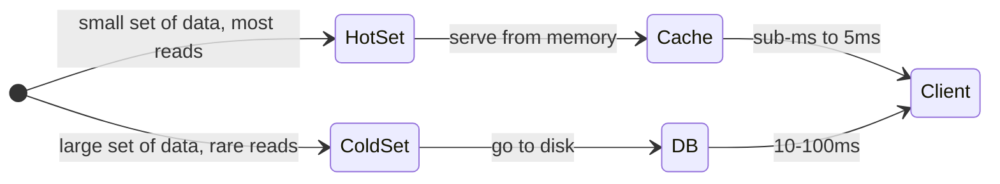

Every read-heavy system has the same shape: a small hot set that gets most of the reads, and a large cold set that gets few. The whole game is keeping the hot set in memory so reads never touch disk.

> **Take this with you.** Before choosing any pattern, ask: what is the hot set? How big is it? How fresh does it need to be? Those three answers decide the tier.

---

## Step 2: Ask the right questions

In a real interview, write down your questions before drawing. Five precise ones beat twenty vague ones.

<details markdown="1">
<summary><b>Show: 5 questions that change the design</b></summary>

1. **How fresh does the data need to be?** When a price changes, how stale can the shown price be? One second? Sixty? Five minutes? *This single answer decides your TTL and your invalidation strategy. Without it every other choice is a guess.*

2. **Is traffic hot-skewed or uniform?** Do the top 1% of items get 90% of reads? Or is every item equally popular? *Hot-skewed makes caching extremely effective. Uniform makes it nearly useless.*

3. **Shared responses or personalized?** Does every user see the same page, or do you show user-specific prices and recommendations? *Shared pages cache at the CDN. Personalized ones cannot.*

4. **Where are the users?** Same country as your servers? Or spread across continents? *Same region: skip the CDN for now. Global: the CDN is the cheapest speed win money can buy.*

5. **What does a read look like?** A single-key lookup? A filter query? A full-text search? *Lookup by ID caches well. Text search needs its own index.*

The junior trap: saying "add Redis" before you have answered these. You do not know yet whether Redis is the right tool. For shared-response traffic, the CDN is cheaper and faster. For search, neither helps at all.

</details>

---

## Step 3: The caching pyramid

A request, on its way from the browser to the database, can hit up to six cache layers. Each is roughly 10x faster than the one below. Each has different rules.

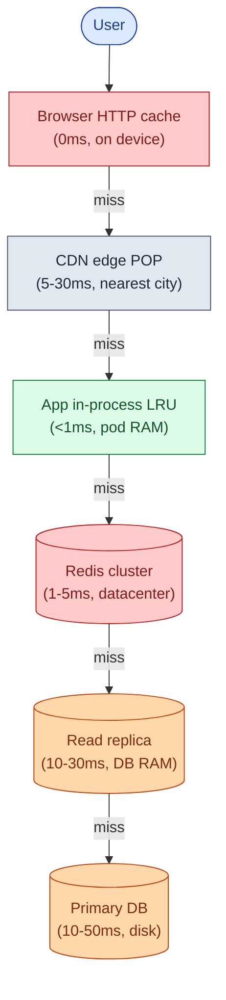

The rule is simple: try the fastest layer first, fall through on miss, populate each layer on the way back.

| Layer | Lives in | Round-trip | What it stores |
|-------|----------|------------|----------------|
| **Browser cache** | User's device | 0ms | HTTP responses with `Cache-Control` headers |
| **CDN edge** | City near the user | 5-30ms | Shared GET responses, images, assets |
| **In-process LRU** | App pod RAM | Under 1ms | Top-N hottest keys, no network hop |
| **Redis** | Datacenter, shared | 1-5ms | Warm key-value across all pods |
| **Read replica** | DB server RAM | 10-30ms | All indexed data |
| **Primary DB** | DB server disk | 10-50ms | Source of truth |

Which layers do you skip?

- **Browser cache**: always on for static assets. Rarely set for API responses. Easy win.
- **CDN**: skip if every response is personalized. Otherwise, use it.
- **In-process LRU**: great with 5-50 pods. Problematic with 500 pods (invalidation gets messy).
- **Redis**: almost always on at scale. Skip only at toy scale.
- **Read replica**: add when the primary's read load is hurting write latency. Not before.
- **Primary**: never skipped. It is the source of truth.

> **Take this with you.** The pyramid is ordered by cost, not by what is easiest to add. Start from the top. Each layer you skip costs more than the one above it.

---

## Step 4: Build it one layer at a time

We will add one pattern per step, building on a single scenario.

**The scenario.** A product catalog service. 1 million products at 5KB each. 100,000 users per day, each making 50 reads. Reads beat writes 100 to 1. Target: under 50ms globally.

### v1: no cache

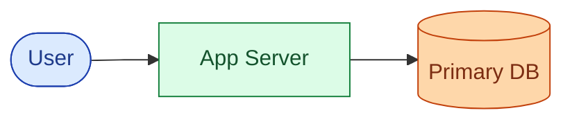

Works up to about 100 users. P95 is 30ms. A single Postgres handles it.

### v2: add Redis for the hot set

Traffic grows. The same 10,000 products get 80% of reads. Postgres is at 70% CPU. Add Redis.

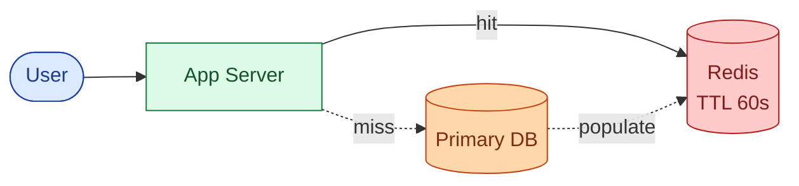

Hot set is 10k x 5KB = 50MB. Fits on one Redis node with room to spare. Cache hit rate: ~80%. DB load: 1/5th of before.

**When to use Redis:** traffic is hot-skewed, hot set fits in memory, data can tolerate seconds of staleness.

**What breaks:** low hit rate on uniform traffic. Stale data on price changes. Cache stampede when a popular TTL expires.

### v3: add CDN for shared responses

Users start complaining from Asia: 250ms load time. Your servers are in Virginia. Add a CDN.

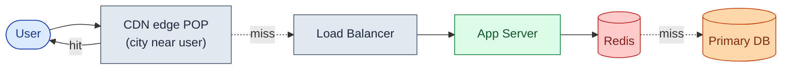

The CDN catches ~70-80% of cacheable reads. P95 from Asia drops from 250ms to 20ms.

**When to use a CDN:** responses are shared (not personalized), users are geographically distributed, the response does not change more often than the TTL.

**What breaks:** personalized responses cannot be CDN-cached. The CDN does not help API responses without explicit `Cache-Control` headers. Stale purges take 5-30 seconds.

### v4: add read replicas

The nightly catalog import spams the primary with writes. Read latency spikes because writes compete for IOPS. Add read replicas.

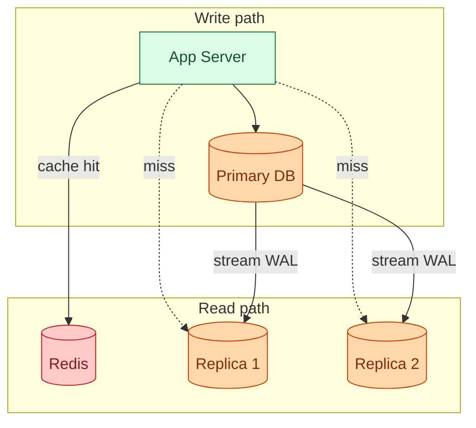

Writes still go to the primary. Reads route to replicas. Primary is now free to handle writes cleanly.

**When to use replicas:** primary's read load is hurting write latency. You need a failover target. You need a replica per region.

**What breaks:** replication is async. A write on the primary takes ~100ms to appear on a replica. If a user writes and reads immediately, they may see stale data (read-your-writes problem). Fix with a 5-second pin to the primary after any write.

> **Take this with you.** Replicas help when the primary is busy. They do not help when the cache hit rate is low. Fix the cache first. Only then consider replicas.

### v5: add denormalization for slow cache misses

Cache misses still take 200ms because the product page does a 3-table JOIN on every miss. Precompute the join into a flat table.

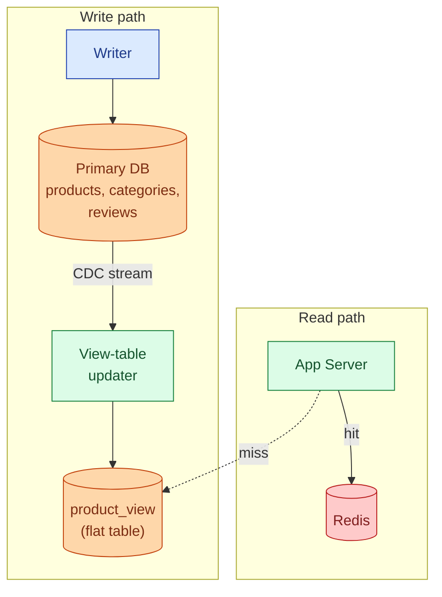

Cache-miss latency drops from 200ms to 5ms. The denormalized `product_view` table is a single-row lookup.

**When to denormalize:** the cache-miss path is slow because the query is expensive (multi-table join, aggregate). Reads beat writes heavily, so write amplification is acceptable.

**What breaks:** every write to `products`, `categories`, or `reviews` must update `product_view`. The CDC pipeline adds operational complexity. If the CDC stream falls behind, the view is stale.

---

## Step 5: Cache invalidation, the hardest problem

Four patterns. Each handles a different freshness need.

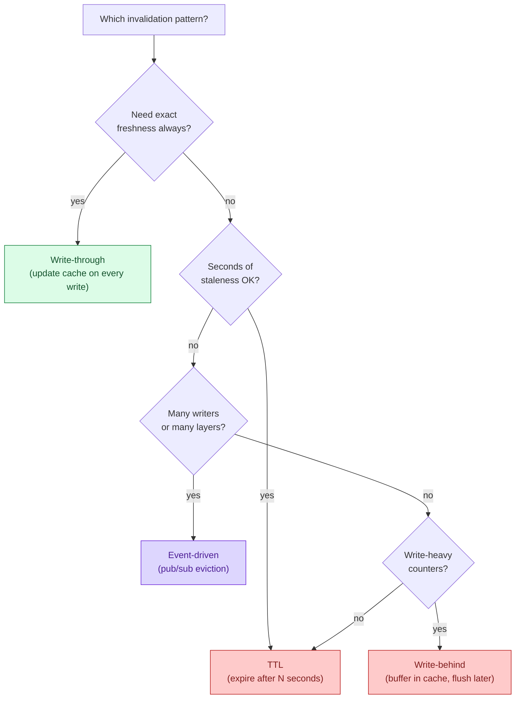

<details markdown="1">
<summary><b>Show: the four patterns, when each fits</b></summary>

### TTL (Time To Live)

```
SET product:42 "{json}" EX 60     # Redis: expires in 60 seconds
```

The simplest pattern. Each entry expires after N seconds. Whatever staleness you can accept becomes your TTL budget.

**When to use:** data that tolerates staleness (catalog descriptions, read counts, rankings). TTL also serves as a safety net for every other pattern.

**The jitter rule.** If 1,000 entries all have a 60s TTL set at the same moment, they all expire at the same second. 1,000 misses hit the DB at once. Fix: TTL = 60 ± (random 0-10s). Spreads the expiry across time.

**What breaks:** a price change takes up to 60 seconds to be visible. Unacceptable for checkout. Fine for browsing.

---

### Write-through

```python
def update_product(p):
    db.update(p)        # write to DB
    cache.set(p)        # then update cache
```

Every write updates both the DB and the cache. Cache always matches the DB.

**When to use:** writes are infrequent and read consistency matters (config services, user settings).

**The race condition.** Two writers race: A writes 5 to DB, B writes 7 to DB, B writes 7 to cache, A writes 5 to cache. Cache says 5, DB says 7. Inconsistent. Fix: invalidate instead of writing the new value. Let the next read re-populate.

**What breaks:** writes get slower (two operations). Under concurrent writes, the race above produces inconsistency.

---

### Write-behind (write-back)

```python
def increment_view_count(product_id):
    cache.incr(f"views:{product_id}")   # fast in-memory counter
    queue.publish("flush_views")        # async DB write
```

Update the cache first. Write to DB asynchronously from a queue.

**When to use:** high-frequency counters where exact accuracy does not matter and some loss is acceptable (view counts, like counts, click tracking).

**What breaks:** if the queue crashes before flushing, you lose the buffered writes. Never use for financial data or anything requiring durability.

---

### Event-driven invalidation

```python
def update_product(p):
    db.update(p)
    kafka.publish("product.changed", {"id": p.id})

# every app pod subscribes:
def on_product_changed(event):
    in_process_lru.evict(event.id)
    redis.delete(f"product:{event.id}")
    cdn.purge(f"/products/{event.id}")
```

DB write fires an event. All caches subscribe and evict the affected key.

**When to use:** multiple cache layers all need coordinated invalidation. Price changes must propagate to in-process caches on 50 pods, Redis, and the CDN within seconds.

**What breaks:** operationally heavier (needs Kafka or Redis pub/sub). If the event is missed (consumer down, Kafka lag), the cache stays stale indefinitely. Fix: always have a TTL floor. Event-driven as the fast path, TTL as the safety net.

---

**The right answer is usually a mix.** TTL everywhere as the safety net. Event-driven for time-sensitive invalidation. Write-through only for endpoints where reads must be exact. Write-behind only for counters.

</details>

> **Take this with you.** TTL handles most cases. Add event-driven invalidation when the TTL window is too slow for your freshness budget. They are not mutually exclusive.

---

## Step 6: The full architecture

All five patterns together. The invalidation path runs off the primary via CDC.

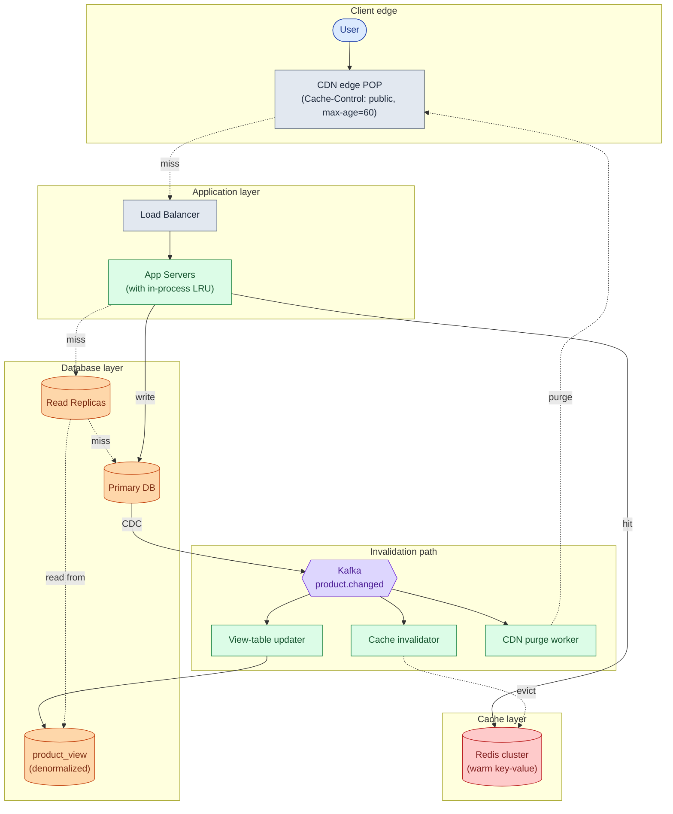

Each box in one line:

| Box | What it does |
|-----|-------------|
| **CDN** | Catches ~70-80% of cacheable reads. Closest layer to the user. |
| **Load Balancer** | Routes to a healthy app pod. Stateless. |
| **App + in-process LRU** | Holds the hottest ~1,000 keys in pod RAM. Zero network. |
| **Redis** | Shared warm cache across all pods. Holds the next ~50k keys. |
| **Read Replicas** | Serve cache misses. ~1s replication lag P99. |
| **Primary DB** | Source of truth. Accepts all writes. |
| **product_view** | Flat denormalized table. Cache-miss path is 5ms, not 200ms. |
| **Kafka** | Carries write events to the invalidation consumers. |
| **View-table updater** | Recomputes `product_view` rows on write. |
| **Cache invalidator** | Evicts Redis keys. Publishes to Redis pub/sub for pod LRUs. |
| **CDN purge worker** | Calls CDN purge API for hot URLs. |

---

## Step 7: One read, all the way through

A user reads product 42. The request misses every layer and warms them on the way back.

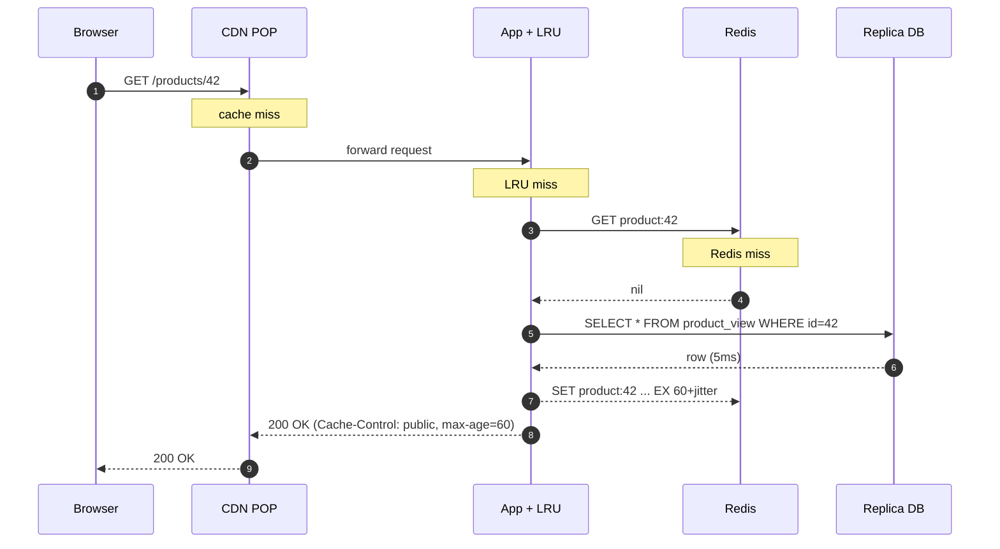

Now an admin changes the price. The invalidation runs:

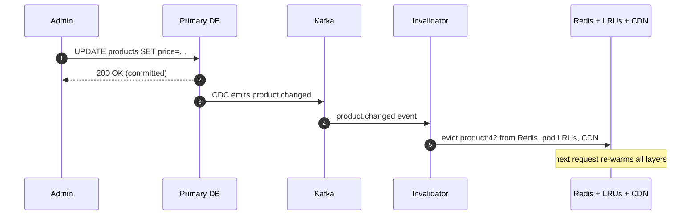

The write commits. The response goes back. The cache eviction happens asynchronously. The next request re-populates every layer.

---

## Step 8: The scaling journey

Four stages. At each stage, name what broke first, then name the smallest fix.

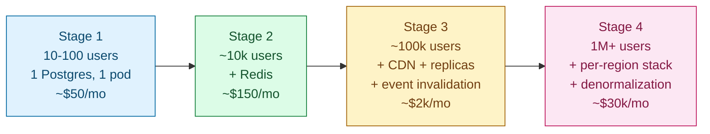

**Stage 1 (10-100 users).** Single Postgres. No cache. P95 = 30ms. One app server. Nothing to optimize. The interviewer should stop you if you add Redis here.

**Stage 2 (~10k users).** P95 climbs to 80ms because the JOIN takes 60ms on a cold read and every request goes to Postgres. Add Redis in front of `GET /products/{id}`. TTL 60s. Cache-aside. Hit rate ~80% on hot-skewed traffic. DB load falls to 1/5th. No CDN yet (users are local). No read replicas yet (DB has headroom).

**Stage 3 (~100k users).** Users in Asia see 250ms. Flash-sale price changes take 60 seconds to propagate. Primary CPU climbs during nightly import. Add CDN (global P95 to 30ms), two read replicas (primary freed for writes), event-driven invalidation (price change visible in under 2 seconds), in-process LRU on pods (sub-ms for hottest 1,000 keys).

**Stage 4 (1M+ users).** The 3-table JOIN on cache miss takes 200ms. At 5% miss rate on 3,000 req/s that is 150 slow DB queries per second. One product goes viral and saturates its Redis shard. Add denormalized `product_view` table (miss path: 5ms), per-region Redis (no cross-region invalidation latency), Redis read replicas per shard (hot-key saturation), probabilistic pre-warming before predicted-hot launches.

> **Take this with you.** At each stage, add the smallest fix for the biggest pain point. Do not add stage-4 infrastructure at stage-2 scale. The costs are not just dollar costs.

---

## Follow-up questions

Try answering each in 2 to 3 sentences before reading the solution.

1. **Cache stampede.** A popular product's cache entry expires. One thousand users refresh at the same second. All miss, all hit the DB, DB CPU spikes. What patterns prevent this?

2. **Redis is down.** Your Redis cluster is unreachable for 10 minutes. Every read is now a cache miss. What does the app do? How do you survive it without taking down the DB?

3. **Personalized pages.** Your product page now shows "recommended for you." You cannot CDN-cache the whole page anymore. What changes? Can you still cache parts of it?

4. **Read-your-writes.** A user updates their profile and refreshes immediately. The replica has not applied the write yet. They see their old name. How do you fix this without routing all reads to the primary?

5. **Hot key.** One product gets 10,000 req/s. The Redis shard that owns that key is at 100% CPU. The other shards are idle. What do you do?

6. **CDN thundering herd on launch.** A new product launches. 100,000 users hit the URL at the same second. The CDN is cold. They all fall through to the origin. How do you handle this?

7. **Cache key design.** You cache `product:42`. Then you add a feature where staff users see internal pricing. Do you cache `product:42:role:staff` separately? What is the trade-off?

8. **Replication lag during a bulk import.** You load 10M products overnight. Replication lag spikes to 5 minutes. Reads from the replica serve very stale data. What do you do?

9. **Cache size.** 1M products at 5KB = 5GB of data. Your Redis node has 8GB of RAM. Is that enough? What do you forget when sizing?

10. **Endpoint that must never be cached.** Inventory at checkout must be exact. You have 30 engineers on the team. How do you enforce "never cache this" across the whole team?

---

## Related problems

- **[Distributed Cache (009)](../009-distributed-cache/question.md).** The Redis tier from this doc, in depth. Eviction policies, consistent hashing, hot-key handling.
- **[URL Shortener (001)](../001-url-shortener/question.md).** The simplest read-heavy system. Single-key lookup, CDN, hot-key problem.
- **[News Feed (002)](../002-news-feed/question.md).** The personalized read-heavy case. CDN-caching the page does not work; you precompute timelines per user.
- **[Approval Management (011)](../011-approval-management/question.md).** The "my pending approvals" dashboard uses the same Redis-backed read path described here.
- **[Write-Heavy System Patterns (018)](../018-write-heavy-patterns/question.md).** The write side of the same coin. The invalidation consumers in this doc are exactly write-heavy workloads.
