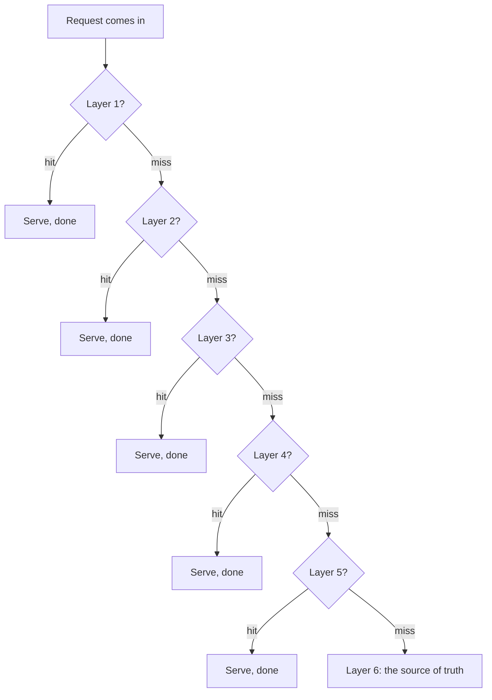
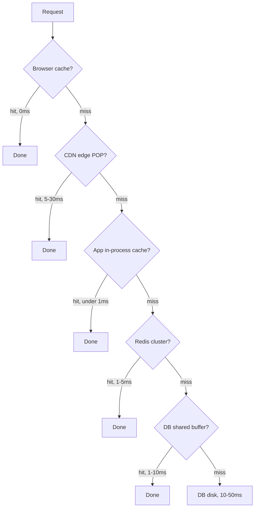
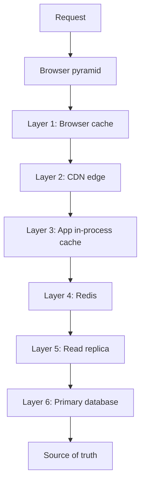
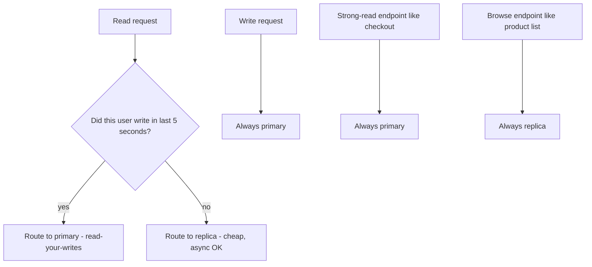
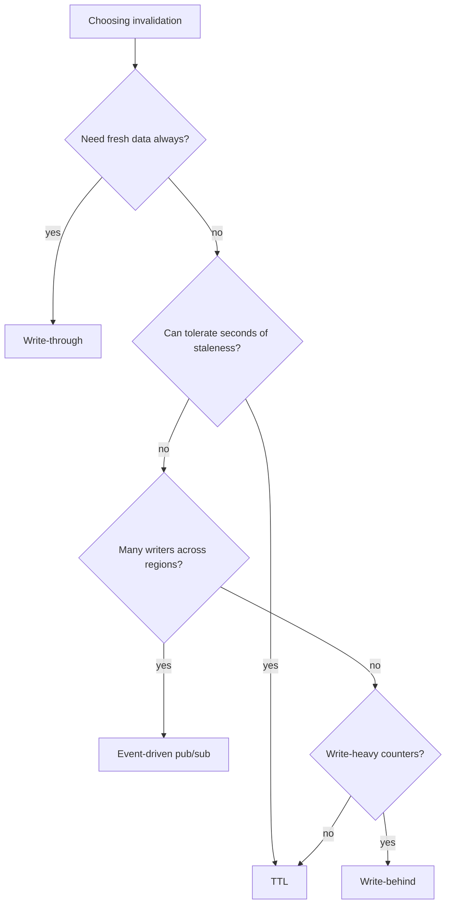

## The scene

You sit down. The interviewer slides a sketch across the desk.

> *"I have a small service. It shows a product catalog. Today: 100 users, one Postgres database, everything works. A product page loads in 30ms. My PM just told me a partner deal will bring in 100,000 users next month. Reads are 100 times more common than writes. What do you do, in order?"*

She pauses. *"Walk me through the read path as it grows. Name what breaks first. Name the fix. And tell me when NOT to use each fix."*

This is the most common shape of a "scale this" interview. The interviewer is not looking for a perfect final architecture. She is looking for whether you reach for a cache before you understand the read pattern. Whether you add Redis (a fast in-memory key-value store) before checking if a CDN (a network of servers that stores copies of pages near users) would do the same job for less money. And whether you know the difference between a read replica that helps and a read replica that just moves the problem.

The point of the problem is the toolkit. Browser cache. CDN. In-process cache. Distributed cache. Read replicas. Materialized views. Denormalization. And the **order** in which you apply them.

We will walk this from a 100-user toy to a 1M-user product. At every step we will name what breaks first, then add the smallest fix that solves it.

A few definitions before we begin, so the rest of the problem reads cleanly:

- **Cache.** Fast storage in memory, much faster than disk. The price of speed is that the data might be a few seconds out of date.
- **CDN (Content Delivery Network).** A network of servers spread around the world. Each one stores a copy of your page. Users get served from the nearest one, so the page arrives fast.
- **Read replica.** A copy of the database that handles reads but not writes. The original database (called the "primary") still handles all writes.
- **TTL (Time To Live).** How long a cached value lives before it expires. After the TTL, the cache forgets it.
- **Hit rate.** The fraction of requests that the cache could answer without going to the database. 90% hit rate means 9 out of 10 requests are served fast.

---

## Step 1: Ask the right questions

Before you draw anything, sit for five minutes. Write down questions you would ask the interviewer.

A good answer here is not "20 questions about every edge case." It is the small handful of questions that change the design if answered differently.

<details markdown="1">
<summary><b>Show: 8 questions that matter</b></summary>

1. **What is the target page load time?** Today it is 30ms. What should it be at 100k users? 50ms? 100ms? *(If the target is 200ms you can solve a lot with one Redis. If it is 20ms worldwide, you need a CDN.)*

2. **How fresh does the data need to be?** When the price changes, how stale can the shown price be? One second? Sixty seconds? Five minutes? *(This single answer decides your TTL and your invalidation strategy. Without this number, every other choice is a guess.)*

3. **What does a read look like?** Is every request a lookup by product ID? Or are there filter queries and text search too? *(Lookup by ID caches well. Text search wants its own search index.)*

4. **Is traffic uniform or hot-skewed?** Does every product get the same number of views? Or do the top 1% of products get 90% of the views? *(Hot-skewed traffic makes caching very effective. Uniform traffic makes caching almost useless.)*

5. **Where are the users?** Same country as your servers? Or spread across continents? *(Same region: skip the CDN, use Redis. Spread across the world: a CDN is the cheapest speed win money can buy.)*

6. **Same page for everyone, or personalized?** Does every user see the same product page? Or do you show user-specific prices and recommendations? *(Shared pages cache at the CDN. Personalized pages cannot.)*

7. **Are writes steady or bursty?** Is the 100x ratio always true? Or do you have a nightly batch that loads 1 million products at once? *(Bursty writes break cache invalidation strategies that assume a slow trickle.)*

8. **Does every endpoint have the same freshness need?** The product page might tolerate staleness. But the checkout price has to be exact. *(Different endpoints get different cache rules. Some get none at all.)*

The junior trap here is starting with "add Redis." You do not know yet whether Redis is even the right tool. The CDN might do 90% of the work. The in-process cache might do the other 9%. Redis might never be needed at all.

</details>

---

## Step 2: How big is this thing?

The interviewer tells you:

- 100,000 users per day, each making about 50 reads per visit.
- Reads are 100x more common than writes.
- Catalog: 1 million products. Each product is about 5KB of JSON.
- Target read time: under 50ms.
- Freshness: 60 seconds is fine for price. 5 minutes is fine for stock. The description never changes.
- Traffic is hot-skewed. The top 10,000 products serve about 80% of reads.

Compute these on paper before opening the answer:

- Reads per second (sustained and peak).
- Writes per second.
- Size of the "hot set" (the small group of products that get most of the views).
- What hit rate do you need to keep the database under 200 queries per second?

<details markdown="1">
<summary><b>Show: the math</b></summary>

**Reads.** 100,000 users x 50 reads = 5,000,000 reads per day. Divide by 86,400 seconds in a day = about **58 reads per second** sustained. For consumer traffic, peak is usually 5x sustained, so about **300 reads per second** at peak.

**Writes.** 58 / 100 = about **0.6 writes per second** sustained. About 3 per second at peak. Tiny. The catalog is updated by a few admins, not by users.

**Hot set.** Top 10,000 products x 5KB = **50MB**. This fits in a single Redis node easily. It fits in an in-process cache. It even fits in the browser cache for repeat visitors.

**Hit rate needed.** Goal: keep database under 200 QPS at the 300 reads/sec peak. The database can serve at most 200/300 = 67% of traffic. So the cache must catch at least 33%. In real life you aim for 80 to 95% so the database has room to breathe. With hot-skewed traffic and a cache holding the top 10,000 products, an 80%+ hit rate is easy to reach.

**Bandwidth.** 300 reads/sec x 5KB = 1.5 MB/sec = 12 Mbps. Tiny. No bandwidth pressure anywhere.

**What the math is telling you:**

This is a textbook read-heavy system. Small hot set. Low QPS. Almost any caching scheme works. The interview is not about *whether* to cache. It is about *which layer* to cache at, in what order, and why.

The real number to remember: reads beat writes 100 to 1. You will design for the read path. The write path is almost an afterthought.

</details>

---

## Step 3: The caching pyramid

Before drawing any architecture, draw the layers. A read request, on its way from the browser to the database, passes through up to **six tiers of cache**. Each one is roughly 10x faster than the one below it. Each one also needs its own invalidation rules and its own size budget.

Try to fill in the six layers, from fastest to slowest. For each one, name where it lives, how long the round-trip takes, and what it stores.



<details markdown="1">
<summary><b>Show: the six tiers</b></summary>



| Layer | Where it lives | Round-trip | What it stores |
|-------|----------------|------------|----------------|
| 1. Browser cache | User's own browser | 0ms (no network) | HTTP responses with cache headers |
| 2. CDN edge | Hundreds of POPs around the world | 5-30ms | Cacheable shared responses |
| 3. App in-process cache | RAM on the app server | Under 1ms | Top-N hottest items, no network hop |
| 4. Distributed cache (Redis) | Redis cluster in your datacenter | 1-5ms | Shared key-value across all pods |
| 5. DB shared buffer | RAM on the database host | 1-10ms | Hot disk pages held in memory |
| 6. Database disk | SSD on the database host | 10-50ms | The source of truth |

> **Why does each layer matter?** Because they catch different kinds of traffic. The browser cache is instant but only helps the same user on the same device. The CDN helps users in distant places. The in-process cache helps the same pod serve hot items fast. Redis shares the hot set across all your pods. The replica handles cold reads. The primary handles writes. Each layer takes a slice off the layer below it.

The pattern is simple. Try the fastest layer first. On miss, fall through to the next. On the way back, populate each layer above so the next request hits faster.



Each layer has the same three concerns:

1. **What goes in it.** Not everything is cacheable. Personalized pages cannot sit in the CDN. Live counters do not belong in long-TTL caches.
2. **How long it lives.** TTL is the simplest rule. Pub/sub events are the most accurate. Write-through is the most consistent.
3. **How big it is.** Browser is limited by the user's disk. CDN is paid by GB-month. Redis is paid by RAM. In-process is limited by your pod's RAM.

Which layers do you skip? Depends on the workload:

- **Browser cache:** always on for images and CSS. Skipped for dynamic API responses unless you set headers.
- **CDN:** skip if every response is personalized. Otherwise it is the cheapest win.
- **In-process:** great with 10 to 50 pods. Bad with 1000 pods because invalidation gets messy.
- **Redis:** almost always on at scale. Skip only at toy scale.
- **DB shared buffer:** you do not control it directly. You tune `shared_buffers` to fit your hot set.
- **Database:** never skipped. It is the source of truth.

</details>

---

## Step 4: Draw the system

You know the layers. Now draw the boxes that connect them.

Try to fill in the missing pieces below. Five boxes are missing. Think about: where does the user's request first touch a server, what sits between the app and the database, and what is the actual source of truth.

```
                     User browser
                          |
                          v
                  +---------------+
                  |  [ ? 1 ]      |  spread around the world; caches
                  |               |  shared GET responses
                  +-------+-------+
                          |  cache miss
                          v
                  +---------------+
                  |  Load Balancer|
                  +-------+-------+
                          |
                          v
                  +---------------+
                  |  App Server   |
                  |  +---------+  |
                  |  | [ ? 2 ] |  |  RAM on the server,
                  |  |         |  |  sub-millisecond
                  |  +---------+  |
                  +---+-------+---+
                      |       |
            on miss   |       |  on miss
                      v       |
              +-------------+ |
              |  [ ? 3 ]    | |  cluster, shared across pods
              +------+------+ |
                     | on miss|
                     v        |
                      +---------------+
                      |  [ ? 4 ]      |  read traffic only;
                      |               |  async replicated
                      +-------+-------+
                              |  writes only
                              v
                      +---------------+
                      |  [ ? 5 ]      |  single source of truth;
                      |               |  accepts writes
                      +---------------+
```

<details markdown="1">
<summary><b>Show: the full read-path architecture</b></summary>

```
                     User browser
                          |
                          | (browser HTTP cache checked first;
                          |  always present, not shown)
                          v
                  +---------------+
                  |      CDN      |  CloudFront / Fastly / Cloudflare.
                  |  (edge POPs)  |  Caches GET responses tagged
                  |               |  Cache-Control: public, max-age=N
                  +-------+-------+  About 80% of reads end here.
                          |  cache miss
                          v
                  +---------------+
                  |  Load Balancer|  ALB / Envoy / nginx. Stateless.
                  +-------+-------+
                          |
                          v
                  +---------------+
                  |  App Server   |  Stateless. Horizontal.
                  |  +---------+  |
                  |  | LRU in- |  |  Per-pod RAM map. 10-50 MB.
                  |  | process |  |  Hit: under 1ms. No network.
                  |  | cache   |  |
                  |  +---------+  |
                  +---+-------+---+
                      |       |
            on miss   |       |
                      v       |
              +-------------+ |
              |   Redis     | |  Cluster, 1-5ms. Shared across
              |  (cluster)  | |  all pods. ~10 GB hot set.
              +------+------+ |
                     | on miss|
                     v        |
                      +---------------+
                      | Read Replicas |  Postgres async replicas.
                      |  (Postgres)   |  Replication lag ~1s P99.
                      |               |  Routed by region.
                      +-------+-------+
                              |  writes only
                              v
                      +---------------+
                      |   Primary DB  |  Postgres single primary.
                      |  (Postgres)   |  Accepts all writes.
                      +-------+-------+
                              |
                              | change events (CDC)
                              v
                      +---------------+
                      |  Invalidator  |  Reads writes, publishes
                      |   service     |  cache-purge events.
                      +---------------+
                              |
                              v
                      Redis pub/sub channel; app pods subscribe
                      and evict their in-process entries. CDN
                      gets purge calls for hot keys.
```

What each piece does, in one line:

- **CDN.** Cheapest latency win. Stores shared responses near the user. Catches ~80% of reads.
- **Load Balancer.** Stateless. Routes to a healthy pod.
- **App Server with in-process LRU.** Holds the top 1000 hottest keys in RAM. Zero network. Sub-ms.
- **Redis.** Shared across all pods in the region. Holds the next 10k to 100k warm keys.
- **Read Replicas.** Serve cache misses. Replication lag is about 1 second.
- **Primary DB.** Source of truth. Handles all writes.
- **CDC + Invalidator.** Listens to writes. Publishes "evict this key" events to all caches.

> **Why a CDN before Redis?** Because for shared responses the CDN is cheaper and faster. A CDN POP is closer to the user than your Redis is. And the CDN often comes free up to a tier. Add it first. Then add Redis to catch what the CDN cannot (cache misses, personalized parts, fast-changing data).

</details>

---

## Step 5: Read replicas

A **read replica** is a copy of the database that accepts only reads. The primary takes writes. The replica streams the write-ahead log (WAL) and applies the same writes. Reads route to the replica, freeing the primary.

Three things to know:

1. **Replication is async.** A write committed on the primary is not yet visible on the replica. Typical lag: 10-500ms. Can spike to seconds under load.
2. **Read-your-writes problem.** A user submits a form (write to primary), then refreshes the page (read from replica), and sees the old data because the write has not propagated yet.
3. **Routing matters.** You have to decide which reads go to the replica and which must go to the primary anyway.

When do you add a replica? How many? How do you handle the read-your-writes case?

<details markdown="1">
<summary><b>Show: replica strategy</b></summary>

**Add the first replica when:**

- Read QPS on the primary is over 50% of capacity, OR
- Read latency on the primary is bad because writes are competing for IOPS, OR
- You need a failover target.

**Add more replicas when:**

- Reads on existing replicas exceed 50% of capacity, OR
- You need a replica per region for latency.

Typical numbers: 1 primary + 2 replicas for redundancy. 1 primary + N replicas (N per region) for global apps.

**Do NOT add replicas when:**

- Your database is bottlenecked on **writes**. Replicas do not help writes. They amplify them.
- Your cache hit rate is already 95%+. The database barely sees traffic. Fix the cache instead.
- Your queries are slow due to bad indexes. Replicating bad queries just spreads the pain.

**Routing rule of thumb:**



The **5-second pin** is a common pattern. After a user writes, their next reads go to the primary for a short window. You set a session cookie like `pin_to_primary_until=<timestamp>`. After 5 seconds, replica routing resumes.

> **Why 5 seconds?** Because typical replication lag is well under 1 second, but you want a safety margin. 5 seconds is long enough to cover even a slow replica, short enough that the primary does not get overloaded by all the pinned users.

**Monitor `replication_lag_seconds`** per replica. P99 should stay under 1s. Alert at >5s. Page at >30s. If lag is bigger than your pin window, you have a correctness bug. Either fix the lag (more IOPS, faster replication) or increase the pin window.

When a replica falls behind, route around it. Most connection pools (pgbouncer, RDS Proxy) support this. When all replicas are gone, fall back to primary. Accept the load increase. Alert loudly.

</details>

---

## Step 6: Denormalization and materialized views

Sometimes caching is not enough. The query itself is slow. A 4-table JOIN that recomputes for every request. An aggregate that scans millions of rows. A search that needs full-text matching.

Two patterns precompute the answer so the read is a flat lookup:

- **Denormalization.** Fold the result of a JOIN into one wider table. Update it on writes via trigger or CDC.
- **Materialized view.** Store the result of a query like a cached query result. Refresh on a schedule.

When do you reach for these? How do they interact with the caching pyramid?

<details markdown="1">
<summary><b>Show: when to denormalize vs materialize</b></summary>

**The normalized version**, the kind that runs on every product page view:

```sql
SELECT
  p.product_id, p.name, p.description,
  c.category_name,
  AVG(r.rating) AS avg_rating,
  COUNT(r.review_id) AS review_count
FROM products p
JOIN categories c ON c.category_id = p.category_id
LEFT JOIN reviews r ON r.product_id = p.product_id
WHERE p.product_id = ?
GROUP BY p.product_id, c.category_name;
```

Even cached, the cache-miss path is slow (200-500ms for popular products with many reviews).

**The denormalized version** is a single-row lookup:

```sql
CREATE TABLE product_view (
    product_id     BIGINT PRIMARY KEY,
    name           TEXT NOT NULL,
    description    TEXT NOT NULL,
    category_name  TEXT NOT NULL,      -- denormalized from categories
    avg_rating     NUMERIC(2,1),       -- precomputed
    review_count   INTEGER,            -- precomputed
    last_updated   TIMESTAMPTZ
);
```

Sub-millisecond, even uncached.

**Three ways to keep it fresh:**

1. **Triggers** on `products`, `categories`, or `reviews` recompute `product_view` for the affected `product_id`. Simple. But couples writes, so writes get slower.
2. **CDC stream** (Debezium or similar) reads the WAL and publishes change events. A consumer recomputes the row asynchronously. Writes stay fast.
3. **Scheduled refresh** recomputes nightly. Coarse. Up to 24h staleness. Fine for cold data, not for a live catalog.

**Postgres materialized views** are a separate tool:

```sql
CREATE MATERIALIZED VIEW top_products_by_category AS
SELECT category_id, product_id, view_count
FROM product_views
WHERE view_count > 1000
ORDER BY view_count DESC;

REFRESH MATERIALIZED VIEW CONCURRENTLY top_products_by_category;
```

Stored physically like a table. Indexes work. REFRESH re-runs the underlying query. CONCURRENTLY lets reads continue during refresh. Best for analytics queries that are read often and updated rarely.

**Quick decision guide:**

| Scenario | Pick |
|----------|------|
| Single-row lookup that joins 3 tables, often updated | Denormalize with CDC |
| Aggregate across millions of rows, updated nightly | Materialized view, scheduled REFRESH |
| Search across all products | Separate search index (Elasticsearch, Postgres FTS) |
| Per-user feed | Neither. Different problem. |
| Top-N leaderboard | Materialized view refreshed every minute |

**The trade-off is write amplification.** Denormalization makes reads faster and writes slower. Every write to `products` triggers a recompute of `product_view`. At a 100x read-to-write ratio this is a clear win. At 10x or less, reconsider.

**Where this fits in the pyramid.** Denormalized tables sit *below* the cache. The cache still caches the result. The denormalization makes the cache-miss path fast. Without it, a cache miss costs 200ms. With it, 5ms. Both layers compound.

</details>

---

## Step 7: Cache invalidation, the hardest problem

Phil Karlton's famous quote: *"There are only two hard things in computer science: cache invalidation and naming things."*

Four patterns to know:

1. **TTL.** Each cached entry expires after N seconds. Simple. Tolerates up to N seconds of staleness.
2. **Write-through.** Update the cache on every write. Always consistent with the DB. But writes get slower.
3. **Write-behind.** Update the cache, queue the DB write asynchronously. Fast writes, but queue loss equals data loss.
4. **Event-driven invalidation.** Publish events on writes. Caches subscribe and evict affected keys.

When do you use each?



<details markdown="1">
<summary><b>Show: invalidation patterns, when each fits</b></summary>

### TTL

```
SET product:42 "{json}" EX 60     # Redis: expires in 60 seconds
```

Use when staleness is acceptable up to the TTL. Simplest pattern. Most predictable to run. The TTL becomes the staleness contract with the user.

> **Add jitter.** If 1000 entries all have a 60s TTL set at the same moment, they all expire at the same second. 1000 misses hit the database at once. Solution: TTL = 60s ± 10%. Spreads the expiry.

Good fit: product catalog with 60s TTL. Price changes visible within a minute. Fine for browse. Not for checkout.

### Write-through

```python
def update_product(p):
    db.update(p)        # write to DB
    cache.set(p)        # then update cache
```

Use when read consistency matters and writes are infrequent. Cache stays consistent. But writes are slower because two operations happen.

**The race condition:** two writers. Writer A writes 5 to DB. Writer B writes 7 to DB. Then A writes 5 to cache. Then B writes 7 to cache. Cache ends with 7, matches DB. But reorder: A writes DB(5), B writes DB(7), B writes cache(7), A writes cache(5). Now cache has 5; DB has 7. Inconsistent.

Fix: cache-aside (invalidate instead of writing the cache). Let the next read populate the cache fresh.

Good fit: a config service where writes are rare and reads must see the latest config right away.

### Write-behind

```python
def update_product(p):
    cache.set(p)              # update cache first
    queue.publish(p)          # async DB write
```

Use when writes are very frequent and some data loss is acceptable. Risk: queue loss = data lost from the source of truth. Often used for counters (view counts, like counts) where exact accuracy matters less than throughput.

Good fit: page view counter. Buffer in Redis. Flush to DB every minute.

### Event-driven invalidation

```python
def update_product(p):
    db.update(p)
    kafka.publish("product.updated", {"product_id": p.id})

# Subscribers (every app pod):
def on_product_updated(event):
    in_process_cache.evict(event.product_id)
    redis.delete(f"product:{event.product_id}")
    cdn.purge(f"/products/{event.product_id}")
```

Use when multiple cache layers all need invalidating. More accurate than TTL. Staleness is bounded by event propagation lag (usually under 1 second). Operationally heavier. Needs a pub/sub system like Kafka or Redis pub/sub.

Good fit: a price change has to propagate to in-process caches on 50 app pods, Redis, and the CDN within seconds. TTL alone could take a minute. Event-driven gets it down to seconds.

> **The right answer is usually a mix.** TTL as the safety net (caps staleness even if the event system fails). Event-driven as the primary path (fast and accurate). Write-through only for endpoints where consistency is non-negotiable. Write-behind only for fire-and-forget counters.

**The CDN twist.** CDN invalidation is slow (seconds to minutes) and not free. Two approaches:

- **Versioned URLs.** Instead of `/products/42`, serve `/products/42?v=17`. On update, bump the version. Old URL stays cached but never requested again. New URL is uncached, fetched fresh. Effectively instant invalidation.
- **Purge API.** Call CloudFront/Fastly purge with the affected URL. Takes 5-30 seconds to propagate. Free at low volume, paid at high.

For a catalog: versioned URLs for product pages. Purge API for hot pages you need to drop immediately (legal takedown, mispriced item).

</details>

---

## Follow-up questions

Try answering each in 2 to 4 sentences before reading the solution.

1. **Cache stampede.** A popular product's cache entry expires at exactly the moment 1000 users hit refresh. They all miss, they all hit the DB, the DB CPU spikes, some requests time out. What patterns prevent this?

2. **Cache fallback when Redis is down.** Your Redis cluster is unreachable for 10 minutes. Every read is now a cache miss. What does the app do? Does it just slam the DB? How do you survive this gracefully?

3. **Personalized pages and the CDN.** Your product page now shows "recommended for you" based on browsing history. You cannot cache the page at the CDN anymore. What changes? Can you still cache *parts* of the page?

4. **Read-your-writes.** A user updates their profile and refreshes immediately. The replica has not applied the write. They see their old name. How do you fix this without sending all reads to the primary?

5. **Hot key in Redis.** One specific product key gets 10,000 req/s. Redis is single-threaded. That key's shard pegs at 100% CPU while others sit idle. What do you do?

6. **CDN cache miss thundering herd.** A new product launches. 100,000 users hit the launch page at the same second. None of them hit the CDN cache. They all hit the origin. How do you survive this?

7. **Cache key design.** You cache `product:42`. Then you add a feature where staff users see internal pricing. Should you cache `product:42:staff` separately? `product:42:role:<role>`? What is the trade-off?

8. **Replication lag spike during a backfill.** You import 10M products overnight. Replication lag balloons to 5 minutes. Reads from the replica start serving very stale data. What do you do during the backfill?

9. **Cache size estimation.** You have 1M products at 5KB each = 5GB. Your Redis node has 8GB of RAM. Is that enough? What do you forget when sizing?

10. **The endpoint that should never be cached.** Inventory count at checkout must be exact (you cannot oversell). Everything else (browse, search, recommendation) can be cached. How do you enforce "this endpoint must always hit the source of truth" across a team of 30 engineers?

---

## Related problems

- **[URL Shortener (001)](../001-url-shortener/question.md).** The canonical read-heavy system. A single shortcode mapped to a key-value lookup, cached. The hot-key problem and the CDN strategy both show up there.
- **[Distributed Cache (009)](../009-distributed-cache/question.md).** The Redis layer of this design, in depth. Eviction policies, replication, hot-key handling.
- **[News Feed (002)](../002-news-feed/question.md).** The personalized read-heavy case. The CDN-friendly catalog approach in this problem does not work for feeds. That one needs precomputed timelines per user.
- **[Approval Management (011)](../011-approval-management/question.md).** The "my pending approvals" dashboard is a read-heavy view that benefits from exactly the patterns in this problem.
