## What this is

Read-heavy systems share a small set of patterns. The same tools that make a URL shortener fast make a product catalog fast, a social feed fast, and an approval dashboard fast. The patterns are not the hard part. Knowing the order, the conditions under which each one helps, and when to stop is.

This doc names the six patterns, shows what each one looks like, and gives the trade-offs. The patterns in order:

1. **Read-through cache** (Redis, cache-aside) - hot set in memory
2. **Write-through cache** - cache always matches the DB
3. **Write-behind cache** - counters and high-frequency writes
4. **CDN** - edge-cached shared responses
5. **Read replicas** - split the read load off the primary
6. **Materialized views** - fast cache-miss path

---

## The shape of every read-heavy system

Before choosing a pattern, draw the shape of the traffic.

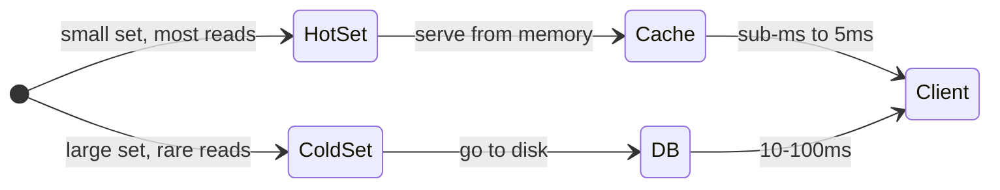

Every read-heavy system has a hot set (a small slice of data that gets most of the reads) and a cold set (the rest). The whole game is keeping the hot set in memory so reads never touch disk.

Before drawing boxes, answer these three questions:

1. **What is the hot set?** How big is it? Does it fit in a single Redis node?
2. **Is traffic hot-skewed?** Do the top 1% of items get 90% of reads, or is every item equally popular? Hot-skewed traffic makes caching effective. Uniform traffic makes it nearly useless.
3. **How fresh does the data need to be?** The answer becomes your TTL and your invalidation strategy. Without it, every caching decision is a guess.

> **Take this with you.** Check traffic shape before designing the cache tier. A uniform traffic workload gets almost no benefit from Redis. A hot-skewed one with a 50 MB hot set is almost entirely served from memory.

---

## Pattern 1: Read-through cache

The app checks the cache first. On a miss, it queries the DB, populates the cache, and returns.

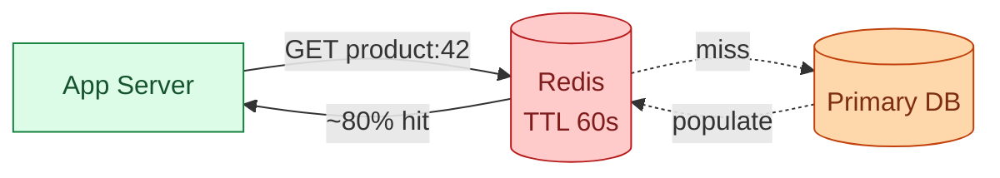

**When to use.** Traffic is hot-skewed, the hot set fits in memory, and data can tolerate a few seconds of staleness. A product catalog with 1 million items where the top 10,000 get 80% of reads is the ideal case: 50 MB of hot data in Redis, cache hit rate around 80%, DB load at one-fifth of what it would be otherwise.

**What breaks.**
- Low hit rate on uniform traffic. If every item is equally popular, the hot set is the entire catalog. It does not fit in memory. Adding Redis barely helps.
- Cache stampede. A popular key expires. A thousand concurrent requests all miss and hit the DB at once. DB CPU spikes. Fix with TTL jitter (±10% random), single-flight per key (only the first miss queries the DB, the rest wait), or stale-while-revalidate.
- Stale data. A price change takes up to 60 seconds to be visible if the TTL is 60 seconds. Acceptable for browsing, not for checkout.

> **Take this with you.** Confirm the traffic shape before adding Redis. If the hit rate will be low, the DB still gets hammered. Redis is not a universal speed-up.

---

## Pattern 2: Write-through cache

Every write updates both the DB and the cache at the same time.

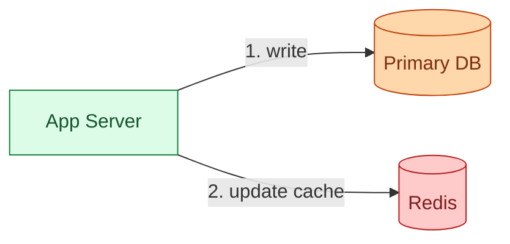

**When to use.** Writes are infrequent and reads must always see the latest value. Configuration services, feature flags, and user settings are good fits: the data is small, writes are rare, and stale reads cause visible bugs.

**What breaks.**
- Writes slow down. Two operations instead of one. On every write path.
- Race condition under concurrent writers. Writer A writes 5 to DB, writer B writes 7 to DB, writer B writes 7 to cache, writer A writes 5 to cache. Cache says 5, DB says 7. Inconsistent. Fix: on write, delete the cache key instead of setting the new value. Let the next read re-populate from DB. The race disappears.

---

## Pattern 3: Write-behind cache

Write to the cache first. Flush to the DB asynchronously from a queue.

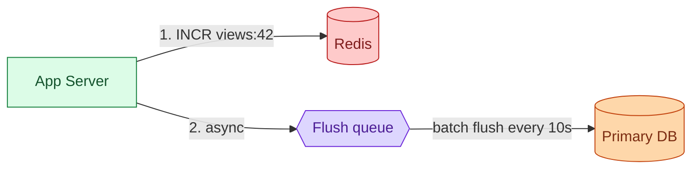

**When to use.** Very high-frequency writes where exact accuracy is not required and some data loss is acceptable. Page view counters, like counts, and click tracking are the canonical use case. A million increments per minute that flush to the DB in batches every 10 seconds.

**What breaks.**
- If the queue crashes before flushing, the buffered writes are lost. The cache was the source of truth and it is gone.
- Never use for financial data, inventory, or anything requiring durability. The write is not durable until it reaches the DB.
- A Redis failure between write and flush is a data loss event, not a slowdown.

---

## Pattern 4: CDN

Static and cacheable responses are stored at edge servers near each user. A user in Tokyo gets the response from a CDN point-of-presence in Tokyo, not from a datacenter in Virginia.

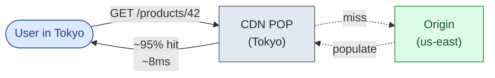

**When to use.** Responses are shared across all users (no personalization), users are geographically distributed, and you want the largest latency win for the lowest cost. A product catalog page with the same content for every visitor is the ideal case. The CDN absorbs 70-95% of reads without touching origin at all.

**What breaks.**
- Personalized responses cannot sit in the CDN. A CDN will serve user A's session data to user B if you cache a request that includes auth incorrectly. Always inspect `Vary` headers.
- CDN purges take 5-30 seconds. Too slow for a flash sale price change. Fix: versioned URLs (`/products/42?v=5`). When the price changes, bump the version. The old URL expires naturally. The new URL fetches fresh.
- The CDN gives zero benefit if the API returns `Cache-Control: no-store` or nothing. Explicit headers are required.

> **Take this with you.** For shared responses, add the CDN before Redis. The CDN is cheaper, physically closer to the user, and absorbs more traffic. Redis handles the misses the CDN cannot catch.

---

## Pattern 5: Read replicas

A replica is a copy of the DB that accepts only reads. The primary streams writes to it via the WAL.

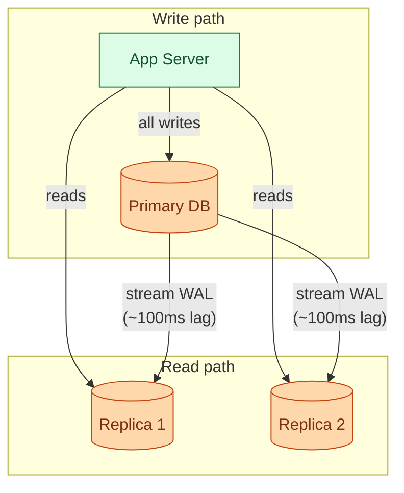

**When to use.** The primary's read load is competing with write latency. A nightly catalog import spams the primary with writes; adding read replicas routes user reads away from it. Also useful as a per-region read path and as a failover target.

**What breaks.**
- Replication is async. Typical lag is ~100ms, but it spikes to seconds under write load. Reads from a replica can be stale.
- Read-your-writes. A user submits a form (write to primary) and refreshes (read from replica). The write has not replicated yet. They see their old data. Fix: 5-second cookie pin to primary after any write. Once the cookie expires, replica routing resumes.
- Replicas do not fix slow queries. A query taking 200ms on the primary takes 200ms on the replica. Fix the query first.

> **Take this with you.** Replicas help when the primary is busy. They do not help when the cache hit rate is low. Fix the cache first. Only then add replicas.

---

## Pattern 6: Materialized views and denormalization

Pre-compute expensive joins or aggregates into a flat table. A cache miss hits the flat table, not the expensive query.

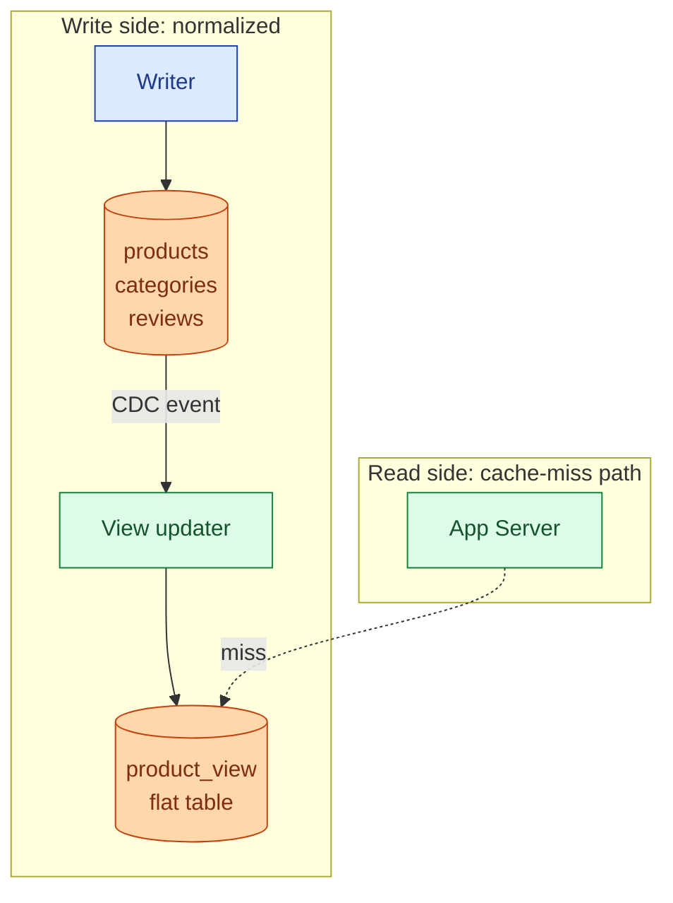

**When to use.** The cache-miss path is provably slow. A product page that joins `products`, `categories`, and `reviews` on every miss takes 200ms. The denormalized `product_view` table makes it a single-row lookup at 5ms. Reads must heavily outweigh writes, because every write to any source table now triggers an update to the flat table.

**What breaks.**
- Every write to any source table must update the denormalized table. CDC pipeline adds operational complexity.
- If the CDC stream falls behind, the flat table is stale.
- If the cache miss path already takes 30ms, denormalization is not worth the complexity. Measure before adding it.

> **Take this with you.** Denormalization makes reads fast and writes expensive. At 100x reads to writes it is a good trade. At 5x reads to writes, reconsider.

---

## Deciding which pattern to apply first

The answer depends on what is actually breaking. The patterns are not a checklist to apply all at once.

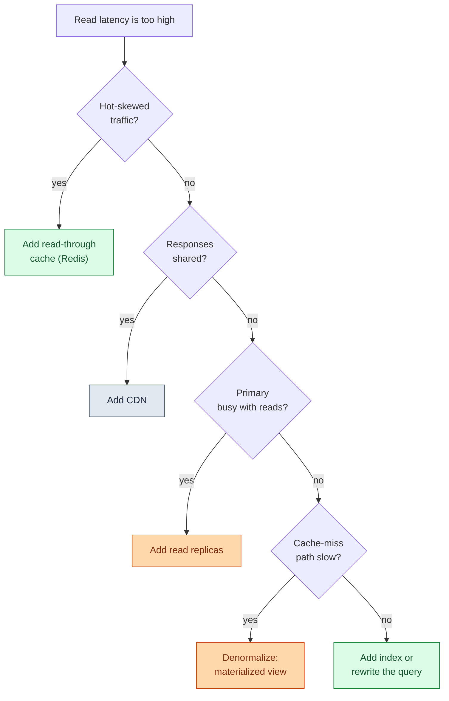

The junior trap is reaching for Redis before answering the first question. For shared-response traffic, the CDN is cheaper and absorbs more. For uniform traffic, Redis barely helps. For a slow query, a better index might solve the problem for free.

---

## Cache invalidation patterns

Adding a cache layer raises an immediate question: when a write happens, how do you get the stale value out of every cache layer that holds it?

Four patterns. Each handles a different freshness need.

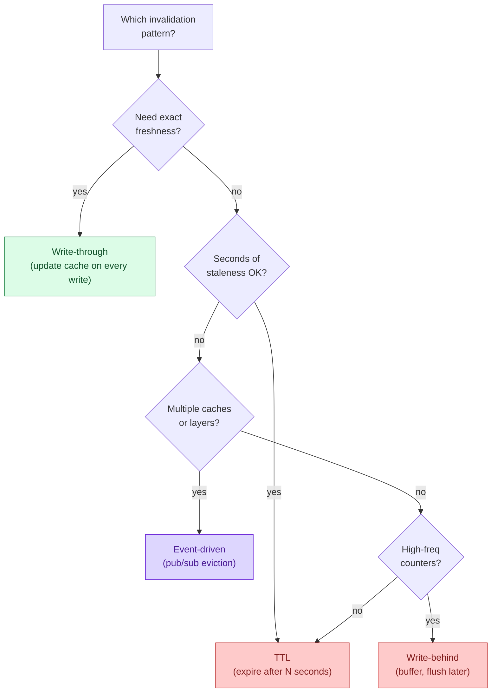

<details markdown="1">
<summary><b>Show: the four invalidation patterns in detail</b></summary>

**TTL.** Each entry expires after N seconds. Whatever staleness you can accept becomes your TTL budget.

The jitter rule: if 1,000 entries all have a 60s TTL set at the same moment, they all expire at the same second. 1,000 misses hit the DB at once. Fix: `TTL = 60 ± random(0, 10s)`. Spreads expiry across time.

Use TTL everywhere as a safety net, even when using other patterns. If an event is missed, the stale entry will eventually expire.

**Write-through.** Every write updates both DB and cache. Simpler but slower writes and the concurrent-writer race described in Pattern 2. Safe to use with invalidate-on-write instead: delete the key, let the next read populate fresh.

**Write-behind.** Write to cache, flush async. For counters only. Not for anything requiring durability.

**Event-driven invalidation.** DB write fires a CDC event. All caches subscribe and evict the affected key.

```python
# every pod subscribes to this:
def on_product_changed(event):
    in_process_lru.evict(event.id)
    redis.delete(f"product:{event.id}")
    cdn.purge(f"/products/{event.id}")
```

Use when multiple cache layers all need coordinated invalidation. A price change must propagate to in-process caches on 50 pods, Redis, and the CDN within seconds.

**What breaks:** if the event is missed (consumer down, Kafka lag), the cache stays stale indefinitely. Fix: always have a TTL floor. Event-driven as the fast path, TTL as the safety net. They are not mutually exclusive.

</details>

> **Take this with you.** TTL handles most cases. Add event-driven invalidation when the TTL window is too slow for your freshness budget.

---

## The full picture: all patterns together

A product catalog at 100,000 users per day with all patterns applied.

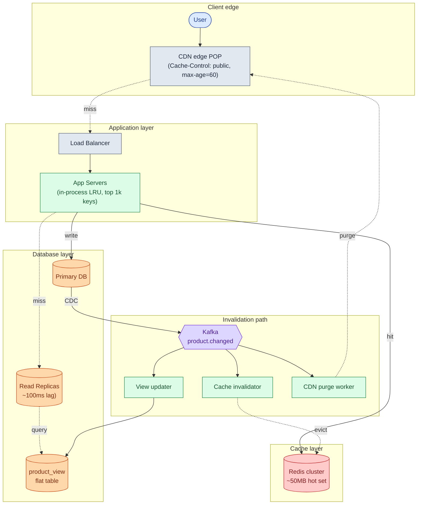

| Component | Pattern | What it does |
|-----------|---------|--------------|
| **CDN** | CDN | Catches ~70-80% of cacheable reads. Closest layer to the user. |
| **In-process LRU** | Read-through | Hottest ~1,000 keys in pod RAM. Zero network hop. |
| **Redis** | Read-through | Warm key-value for the next ~50,000 keys. |
| **Read Replicas** | Read replicas | Serve cache misses. Primary freed for writes. |
| **product_view** | Materialized view | Cache-miss path is 5ms, not 200ms. |
| **Kafka** | Event invalidation | Carries write events to the invalidation consumers. |
| **Cache invalidator** | Event invalidation | Evicts Redis keys and pod LRUs. |
| **CDN purge worker** | Event invalidation | Calls CDN purge API for hot URLs. |

---

## One read, all the way through

A user reads product 42. The request misses every layer and warms them on the way back.

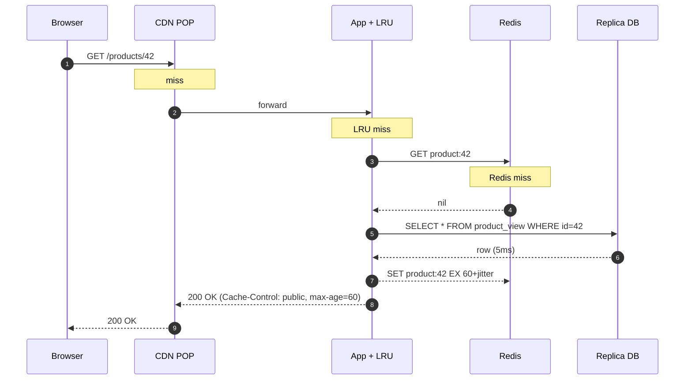

An admin changes the price. Invalidation runs:

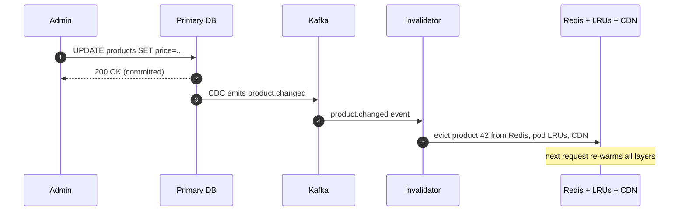

---

## The scaling journey

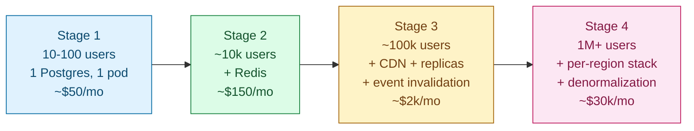

**Stage 1 (10-100 users).** Single Postgres, one app server, P95 = 30ms. Nothing to optimize. Adding Redis here is over-engineering.

**Stage 2 (~10k users).** What breaks: the 3-table JOIN takes 60ms on a cold read, Postgres is at 70% CPU. Fix: Redis in front of `GET /products/{id}`, TTL 60s, cache-aside. Hot set is 50 MB. Hit rate ~80%. DB load drops to one-fifth. Do not add CDN (users are local), replicas (DB has headroom), or denormalization yet.

**Stage 3 (~100k users).** What breaks: users in Asia see 250ms, flash-sale price changes take 60 seconds to propagate, primary CPU climbs during nightly import. Fix: CDN (global P95 to 30ms), two read replicas (primary freed), event-driven invalidation (price change visible in under 2 seconds), in-process LRU on pods (sub-ms for hottest 1,000 keys).

**Stage 4 (1M+ users).** What breaks: cache-miss path takes 200ms (3-table JOIN). At 5% miss rate on 3,000 req/s, that is 150 slow DB queries per second. One product goes viral and saturates its Redis shard. Fix: denormalized `product_view` (miss path to 5ms), per-region Redis, Redis read replicas per shard, pre-warm CDN before predicted launches.

> **Take this with you.** At each stage, add the smallest fix for the biggest pain point. Do not add stage-4 infrastructure at stage-2 scale. The costs are not just dollar costs.

---

## Follow-up questions

Try answering each in 2 to 3 sentences before reading the solution.

1. **Cache stampede.** A popular product's cache entry expires. One thousand users refresh at the same second. All miss, all hit the DB, DB CPU spikes. What patterns prevent this?

2. **Redis is down.** Your Redis cluster is unreachable for 10 minutes. Every read is now a cache miss. What does the app do? How do you survive it without taking down the DB?

3. **Personalized pages.** Your product page now shows "recommended for you." You cannot CDN-cache the whole page anymore. What changes? Can you still cache parts of it?

4. **Read-your-writes.** A user updates their profile and refreshes immediately. The replica has not applied the write yet. They see their old name. How do you fix this without routing all reads to the primary?

5. **Hot key.** One product gets 10,000 req/s. The Redis shard that owns that key is at 100% CPU. The other shards are idle. What do you do?

6. **CDN thundering herd on launch.** A new product launches. 100,000 users hit the URL at the same second. The CDN is cold. They all fall through to origin. How do you handle this?

7. **Cache key design.** You cache `product:42`. Then you add a feature where staff users see internal pricing. Do you cache `product:42:role:staff` separately? What is the trade-off?

8. **Replication lag during a bulk import.** You load 10M products overnight. Replication lag spikes to 5 minutes. Reads from the replica serve very stale data. What do you do?

9. **Cache size.** 1M products at 5KB = 5GB of data. Your Redis node has 8GB of RAM. Is that enough? What do you forget when sizing?

10. **Endpoint that must never be cached.** Inventory at checkout must be exact. You have 30 engineers on the team. How do you enforce "never cache this" across the whole team?

---

## Related problems

- **[Distributed Cache (009)](../009-distributed-cache/question.md).** The Redis tier from this doc, in depth. Eviction policies, consistent hashing, hot-key handling.
- **[URL Shortener (001)](../001-url-shortener/question.md).** The simplest read-heavy system. Single-key lookup, CDN, hot-key problem.
- **[News Feed (002)](../002-news-feed/question.md).** The personalized read-heavy case. CDN-caching the page does not work; you precompute timelines per user.
- **[Approval Management (011)](../011-approval-management/question.md).** The "my pending approvals" dashboard uses the same Redis-backed read path described here.
- **[Write-Heavy System Patterns (018)](../018-write-heavy-patterns/question.md).** The write side of the same coin. The invalidation consumers in this doc are exactly write-heavy workloads.
