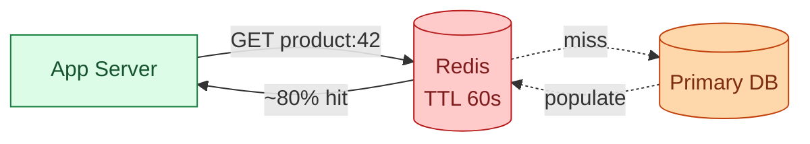
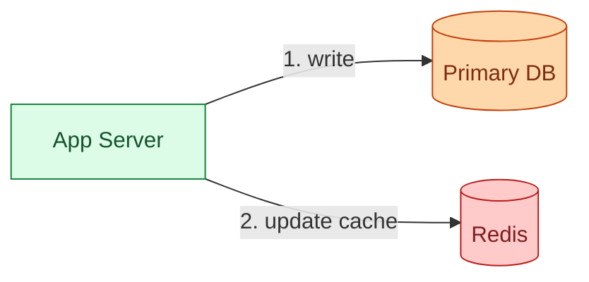
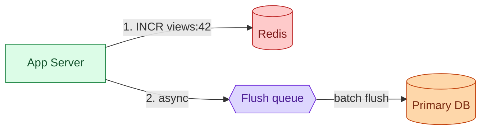
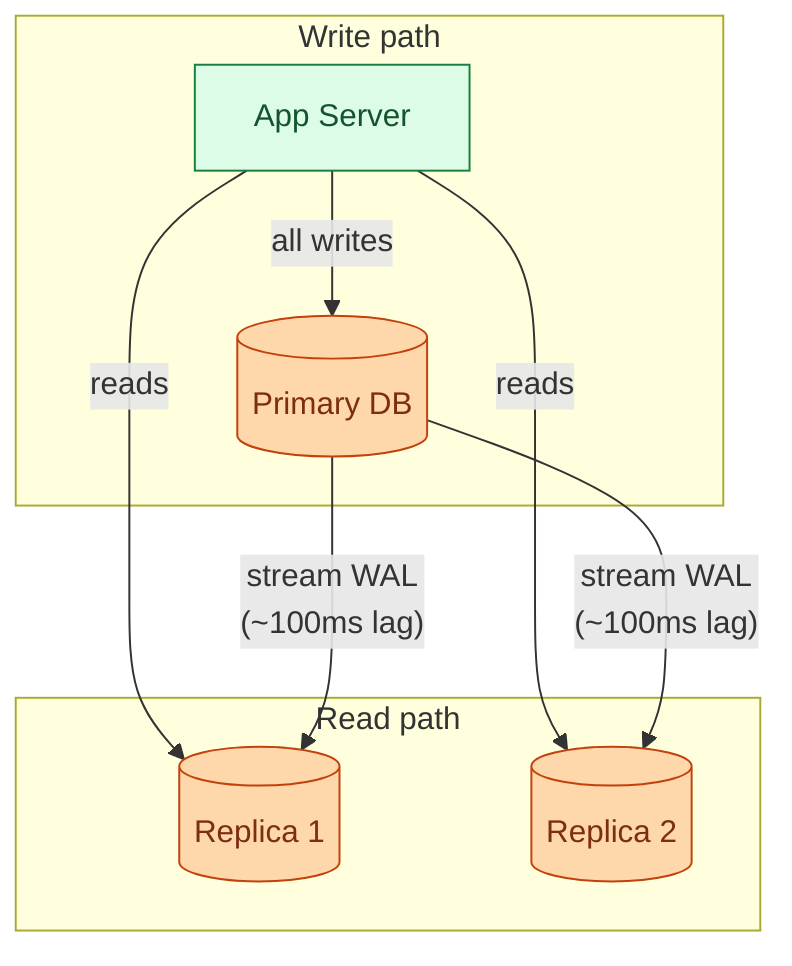
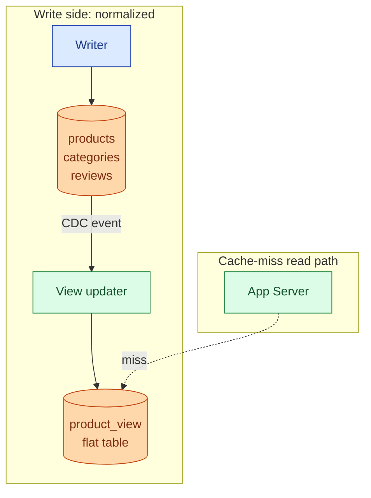
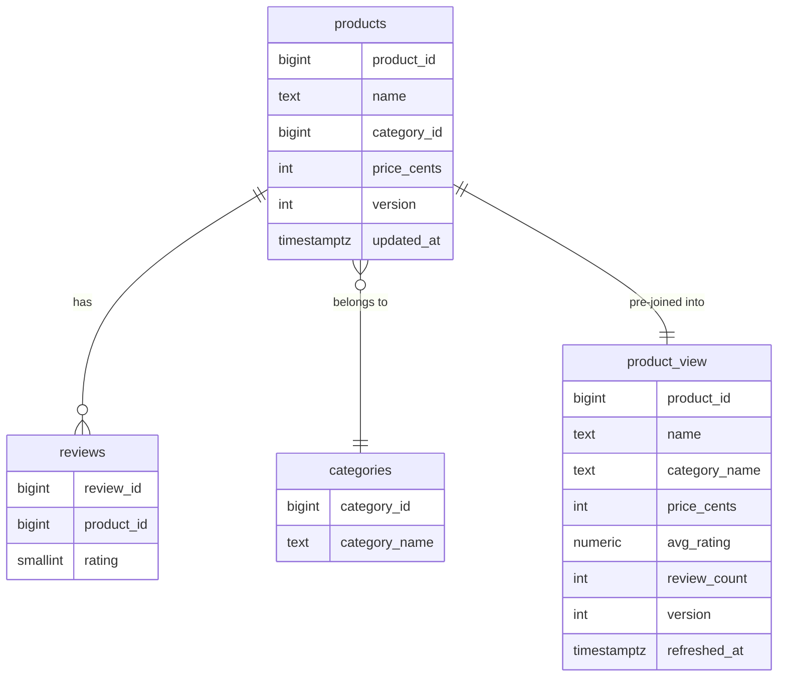
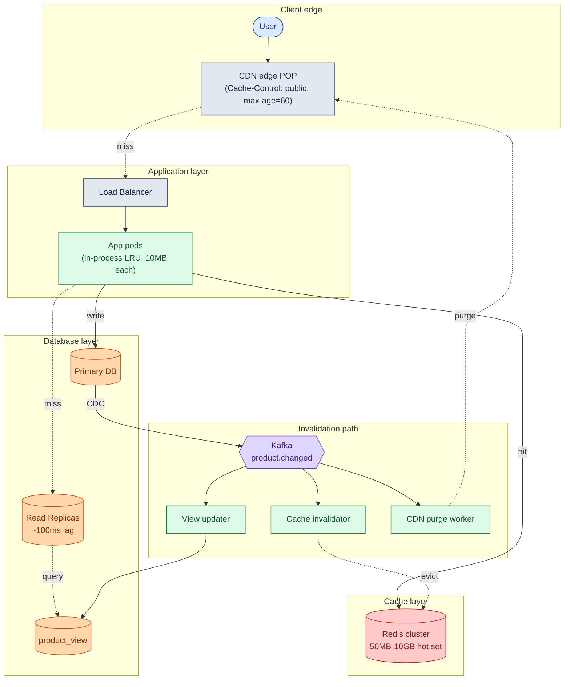
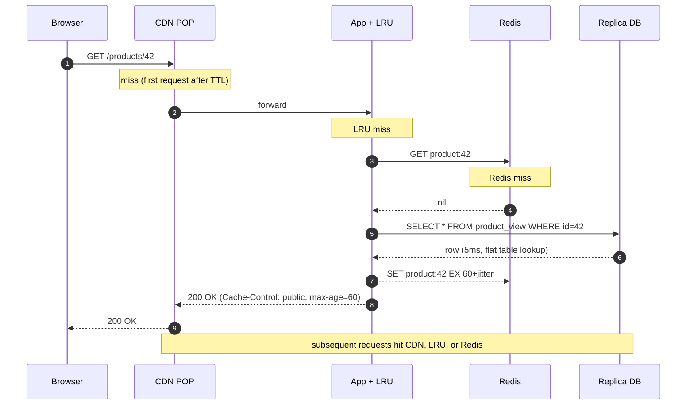
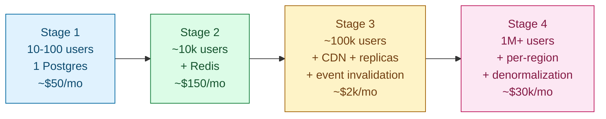

## Solution: Read-Heavy System Patterns

### What this is

A read-heavy system is solved by stacking caches in front of the source of truth. Each layer is about 10x faster than the one below. Each handles a different slice of traffic.

The CDN catches shared cacheable responses near the user. The in-process cache catches the hottest keys per pod with zero network. Redis catches the warm tail, shared across all pods. Read replicas serve cache misses. The primary handles writes.

The hard work is not knowing the tools. It is knowing the order. CDN before Redis, because for shared responses the CDN is cheaper and absorbs more traffic. Replicas after fixing the cache hit rate, not before. Denormalization only when the cache-miss path is provably slow. Event-driven invalidation on top of TTL, not instead of it.

Most real read-heavy systems never need more than a CDN, Redis, two read replicas, and one denormalized view table. Past that, the answers become regional.

---

### 1. The two questions that matter most

**How fresh does the data need to be?** Without this number, every caching decision is a guess. The answer becomes the TTL budget and the invalidation contract. For a product catalog, 60 seconds is fine for browsing, but checkout must be exact. For a social feed, 5 seconds is usually fine.

**Is traffic hot-skewed or uniform?** Hot-skewed traffic makes caching extremely effective. The top 10,000 products get 80% of reads, and they fit in 50 MB of RAM. Uniform traffic (every item equally popular) makes caching nearly useless. Before adding Redis, confirm the traffic shape.

---

### 2. The math

Using a product catalog: 100,000 users per day, 50 reads each, 1M products at 5 KB each, reads 100x writes.

| What | Number |
|------|--------|
| Reads per day | 5 million |
| Reads per second, sustained | ~58 |
| Reads per second, peak | ~300 |
| Writes per second, sustained | ~0.6 |
| Writes per second, peak | ~3 |
| Full catalog size | 1M x 5KB = 5GB |
| Hot set (top 10k products) | 10k x 5KB = 50MB |
| Cache hit rate to keep DB under 200 QPS | at least 33%, target 80-95% |

Three numbers to remember:

- **50MB hot set** fits in any Redis node, any app pod's RAM, easily.
- **Reads beat writes 100 to 1.** Every design decision flows from the read path.
- **80%+ hit rate is easy** because traffic is hot-skewed. The system stays cheap because of this single fact.

---

### 3. The six patterns

#### Pattern 1: Read-through cache

The app checks Redis first. On miss, queries the DB and populates Redis.



**When to use.** Hot-skewed traffic, single-key lookups, data that tolerates seconds of staleness.

**What breaks.**
- Low hit rate on uniform traffic (every item equally popular).
- Cache stampede: popular key expires, 1,000 concurrent misses hit the DB at once.
- Stale data for time-sensitive values (prices, inventory).

Fix cache stampede with TTL jitter (±10%), single-flight locks, or stale-while-revalidate.

> **Take this with you.** Check traffic shape before adding Redis. Uniform traffic means low hit rate. Low hit rate means the DB still gets hammered.

---

#### Pattern 2: Write-through cache

Every write updates both the DB and the cache at the same time.



**When to use.** Writes are infrequent and reads must always see the latest value. Config services, user settings, feature flags.

**What breaks.** Writes slow down (two operations). Two concurrent writers can produce an inconsistency: writer A writes 5 to DB, writer B writes 7 to DB, writer B writes 7 to cache, writer A writes 5 to cache. Cache says 5, DB says 7.

Fix: invalidate instead of updating. Let the next read populate the cache fresh. The race disappears.

---

#### Pattern 3: Write-behind cache

Write to the cache first. Flush to the DB asynchronously.



**When to use.** Very high-frequency writes where some data loss is acceptable and exact accuracy does not matter. Page view counters, like counts, click tracking.

**What breaks.** If the queue crashes before flushing, the buffered writes are lost. Never use for financial data, inventory, or anything requiring durability. A Redis failure between write and flush is a data loss event.

---

#### Pattern 4: CDN

Static and cacheable responses are stored at edge servers near each user.


**When to use.** Responses are shared across users (no personalization), users are geographically distributed, and you want the biggest latency win for the lowest cost.

**What breaks.**
- Personalized responses cannot sit in the CDN. A CDN will serve user A's data to user B if you cache auth-tagged responses incorrectly.
- CDN purges take 5-30 seconds. Too slow for prices during a flash sale.
- CDN is useless without explicit `Cache-Control` headers.

Fix slow purges with versioned URLs (`/products/42?v=5`). When the price changes, bump the version. Old URL expires naturally. New URL fetches fresh.

> **Take this with you.** Add the CDN before Redis for shared responses. The CDN is cheaper, closer to the user, and absorbs more traffic. Redis handles the misses the CDN cannot catch.

---

#### Pattern 5: Read replicas

A replica accepts only reads. The primary streams writes to it via the WAL.



**When to use.** The primary's read load is hurting write latency. You need a per-region read path. You need a failover target.

**What breaks.**
- Replication is async. Typical lag is 100ms, can spike to seconds under load.
- Read-your-writes: a user submits a form (write to primary) and refreshes (read from replica). The write has not propagated yet. They see their old data.
- Replicas do not help with slow queries. A query that takes 200ms on the primary takes 200ms on the replica. Fix the query first.

Fix read-your-writes with a 5-second pin to the primary. On any write, set a cookie `pin_to_primary_until=<now+5s>`. Reads from that client route to primary until the cookie expires.

---

#### Pattern 6: Materialized views and denormalization

Pre-compute expensive joins or aggregates into a flat table. A cache miss hits the flat table, not the expensive query.



**When to use.** The cache-miss path is provably slow (multi-table join or large aggregate). Reads heavily outweigh writes, so write amplification is acceptable.

**What breaks.**
- Every write to any source table must update the denormalized table. CDC pipeline adds operational complexity.
- If the CDC stream falls behind, the flat table is stale.
- If the cache-miss path takes 30ms, denormalization is not worth the complexity. Measure first.

> **Take this with you.** Denormalization makes reads fast and writes expensive. At 100x reads to writes it is a good trade. At 5x reads to writes, reconsider.

---

### 4. The data model

Two halves. Normalized source tables on the write side. Denormalized view on the read side.



<details markdown="1">
<summary><b>Show: the full SQL</b></summary>

```sql
CREATE TABLE products (
    product_id   BIGINT PRIMARY KEY,
    name         TEXT NOT NULL,
    description  TEXT,
    category_id  BIGINT REFERENCES categories(category_id),
    price_cents  INT NOT NULL,
    currency     CHAR(3) NOT NULL,
    updated_at   TIMESTAMPTZ NOT NULL DEFAULT NOW(),
    version      INT NOT NULL DEFAULT 1
);
CREATE INDEX idx_products_category ON products (category_id);
CREATE INDEX idx_products_updated  ON products (updated_at);

CREATE TABLE categories (
    category_id   BIGINT PRIMARY KEY,
    category_name TEXT NOT NULL,
    parent_id     BIGINT REFERENCES categories(category_id)
);

CREATE TABLE reviews (
    review_id  BIGINT PRIMARY KEY,
    product_id BIGINT REFERENCES products(product_id),
    rating     SMALLINT NOT NULL CHECK (rating BETWEEN 1 AND 5),
    created_at TIMESTAMPTZ NOT NULL DEFAULT NOW()
);
CREATE INDEX idx_reviews_product ON reviews (product_id);

CREATE TABLE product_view (
    product_id    BIGINT PRIMARY KEY,
    name          TEXT NOT NULL,
    description   TEXT,
    category_name TEXT NOT NULL,
    price_cents   INT NOT NULL,
    currency      CHAR(3) NOT NULL,
    avg_rating    NUMERIC(2,1),
    review_count  INT NOT NULL DEFAULT 0,
    version       INT NOT NULL,
    refreshed_at  TIMESTAMPTZ NOT NULL DEFAULT NOW()
);

CREATE MATERIALIZED VIEW top_products_per_category AS
SELECT
    p.category_id,
    p.product_id,
    p.name,
    pv.avg_rating,
    pv.review_count
FROM products p
JOIN product_view pv ON pv.product_id = p.product_id
ORDER BY p.category_id, pv.review_count DESC;

CREATE UNIQUE INDEX idx_top_products ON top_products_per_category (category_id, product_id);
```

</details>

Cache key conventions:

| Key | Value | TTL | Invalidated by |
|-----|-------|-----|----------------|
| `product:{id}` | full product JSON | 60s + jitter | TTL + pub/sub event |
| `product:{id}:v{ver}` | full product JSON | 1h | versioned URL (no explicit purge) |
| `category:{id}:top` | top product ID list | 5min | nightly materialized view refresh |
| `user:{uid}:pinned_until` | timestamp | 5s | TTL only |

**Versioned key pattern.** When a product is updated, its `version` column is bumped. Old cached responses use the old version in the key. New requests use the new version. The old key expires naturally with no explicit purge. CDN URLs get `?v={ver}` for the same reason.

---

### 5. The architecture



Five things to notice:

- The write commits and returns before any cache invalidation happens. The write path stays fast.
- The CDC pipeline decouples writes from invalidation. If Kafka is slow, staleness is bounded by TTL.
- The in-process LRU handles the hottest keys without any network hop. It needs a pub/sub eviction channel, or it diverges from other pods.
- CDN purges are fire-and-forget. They take 5-30s. Use versioned URLs for instant invalidation on hot pages.
- Replicas read from `product_view`. The join is gone.

---

### 6. A request, end to end



P95 latencies by where the request ends:

| Resolved by | P95 |
|-------------|-----|
| Browser cache | 0ms |
| CDN hit | 10-20ms |
| In-process LRU | under 1ms |
| Redis hit | 2-5ms |
| Replica hit (flat table) | 15-30ms |
| Primary fallback | 50-100ms |

---

### 7. The scaling journey: 100 to 1 million users



#### Stage 1: 10-100 users

Single Postgres. One app pod. P95 = 30ms. No cache. Adding Redis here is over-engineering.

#### Stage 2: ~10,000 users

**What broke.** P95 climbs to 80ms. The catalog page does a 3-table JOIN. Postgres is at 70% CPU during peak hours.

**The fix.** Redis in front of `GET /products/{id}`. TTL 60s ± 6s jitter. Cache-aside. Hot set is 50 MB. Hit rate ~80% because traffic is hot-skewed. DB load drops to one-fifth.

Do not add yet: CDN (users are local), read replicas (DB has headroom), denormalization (cache miss is 60ms).

#### Stage 3: ~100,000 users

**What broke.** Users in Asia see 250ms. Flash-sale price changes take 60 seconds to propagate. Primary CPU climbs during the nightly catalog import.

**The fixes.**
1. CDN in front of all GET endpoints. `Cache-Control: public, max-age=60`. Global P95 to 30ms. ~70% of reads end at the CDN.
2. Two read replicas. Route reads to replicas. Primary freed for writes.
3. Event-driven invalidation via Kafka CDC. Price changes propagate to Redis, pod LRUs, and CDN within 2 seconds.
4. In-process LRU on app pods (10 MB, top 1,000 keys). Sub-ms for the hottest products.

Do not add yet: per-region Redis, denormalization (cache miss is 30ms at this stage).

#### Stage 4: 1M+ users

**What broke.** Cache-miss path takes 200ms (3-table JOIN). At 5% miss rate on 3,000 req/s, that is 150 slow DB queries per second. One product goes viral: its Redis shard pegs at 100% CPU. The others are idle.

**The fixes.**
1. Denormalized `product_view` table updated by CDC. Miss path: 5ms instead of 200ms.
2. Per-region Redis cluster. No cross-region invalidation latency.
3. Per-region read replicas.
4. Redis read replicas per shard to spread hot-key reads.
5. Pre-warm CDN before predicted-hot product launches.
6. `stale-while-revalidate` on CDN: serve the just-expired value for up to 5 more minutes while one worker refreshes in the background.

---

### 8. Reliability

**Cache stampede.** A popular key expires. 1,000 concurrent users miss. All hit the DB.

Fixes in order of cost:

1. TTL jitter (±10%). Staggered expiry. The stampede becomes a slope.
2. Single-flight per key. First miss queries the DB. All other concurrent misses wait on the same in-flight request. 1,000 misses become 1 DB query.
3. Stale-while-revalidate. Serve the just-expired value while one worker refreshes. Users never see the miss.
4. Probabilistic early refresh. Each read has a small probability (proportional to proximity to expiry) of triggering a background refresh before the TTL hits.

**Redis goes down.** Every read is now a cache miss. The DB cannot absorb 3,000 req/s.

- In-process LRU is the first line. Top 1,000 keys still served from pod RAM.
- Read replicas absorb the miss traffic.
- Circuit breaker on the DB: if P99 latency exceeds 200ms, shed load (503 with `Retry-After: 30`, or serve the last-known stale value).
- Do not let all traffic cold-start Redis the instant it recovers. Pre-warm with a scan or use Redis AOF persistence to recover the hot set.

**Replica falls behind.** Stop routing to that replica. Fall back to other replicas. If all are gone, fall back to primary. Alert immediately.

**Cold start dogpile.** The whole pod fleet restarts. All in-process LRUs are cold. All requests fall through to Redis. LRUs warm within a minute. Fix: rolling restarts. On pod start, pre-warm the LRU with the top 1,000 keys from Redis.

---

### 9. Observability

| Metric | Why it matters |
|--------|----------------|
| `cache.hit_rate` per layer (cdn, lru, redis) | The headline. A drop in any layer precedes a latency regression. |
| `cache.miss_path.latency.p99` | If this regresses, the underlying query or flat table is slow. |
| `replica.lag.seconds.p99` | Should be under 1s. Spikes during bulk imports. |
| `read.latency.p50/p95/p99 by route` | Per-endpoint SLO tracking. |
| `db.qps.primary` and `db.qps.replica` | Primary should be writes-only. Replicas should match the expected miss rate. |
| `redis.hot_key.requests_per_sec` | Detects shard saturation before it causes outages. |
| `invalidation.lag.p99` | Time from DB write to cache eviction. Target under 2s. |
| `cdn.purge.latency.p99` | Time from purge call to full propagation across all POPs. |
| `circuit_breaker.tripped` | Counts of times protection fired. Non-zero is a signal. |

Page on: cache hit rate < 70% for 5 minutes. DB QPS spike > 10x baseline. Replica lag > 30s.

Ticket on: any new hot-key signal. CDN miss rate trending upward. Invalidation lag P99 > 5s.

Track each layer separately. "Hit rate is good" can hide one layer at 30% while another is at 99%.

---

### 10. Follow-up answers

**1. Cache stampede.**

Combine four patterns. TTL jitter so entries do not expire in lockstep. Single-flight so 1,000 concurrent misses become 1 DB query. Stale-while-revalidate so users never wait. Probabilistic early refresh so the cache is refreshed before expiry. Single-flight fixes the immediate spike. Stale-while-revalidate makes it invisible to users.

**2. Redis is down.**

Every cache has a defined fallback. In-process LRU as first line (top 1,000 keys from pod RAM). Read replicas absorb the rest. Circuit breaker on the DB: shed load if P99 latency exceeds a threshold (503 with `Retry-After`, or serve a cached-stale response). Per-pod concurrency cap on the miss path. Critically: do not cold-start Redis under load. Warm it via a scan or use AOF persistence. The first 60 seconds of post-recovery traffic would be 100% miss otherwise.

**3. Personalized pages.**

Personalization does not kill caching. It shifts what you cache. Find the seam between shared and personal content. Cache the shared part. Options:

- Two requests: `GET /products/42` (cacheable) and `GET /products/42/recommendations` (personalized, `private` cache). Browser stitches them.
- Edge personalization: CloudFlare Workers or Fastly Compute@Edge runs light logic at the POP and injects user-specific data into an otherwise cached page.
- Segment-based caching: if recommendations are bucket-based (10 user segments), cache 10 variants per product instead of one per user. Still cacheable.

**4. Read-your-writes.**

5-second pin to primary after any write. On write, set a cookie `pin_to_primary_until=<now+5s>` on the response. Subsequent reads from that client inspect the cookie. If the timestamp is in the future, route to primary. After 5 seconds, the cookie expires and replica routing resumes. At 3 writes/sec, at most 15 users are pinned concurrently. Negligible primary load.

For cross-device read-your-writes (phone writes, laptop reads) the cookie does not work. Either accept the inconsistency (usually fine) or use a server-side per-user version vector that the routing layer reads.

**5. Hot key in Redis.**

One product gets 10,000 req/s. Its Redis shard pegs at 100% CPU.

Mitigations in order:

- In-process LRU on pods. At 50 pods each with a 1,000-key LRU, 10k req/s at the application level becomes ~200 req/s at the Redis shard.
- Redis read replicas. Each primary has 1-3 read-only replicas. Reads round-robin. Throughput per key scales linearly.
- Key splitting. Replace `product:42` with `product:42:{shard}` where shard is 0-9 chosen randomly on reads. Writes update all shards. Spreads the load across 10 keys on 10 shards.
- CDN. If the URL is cacheable, the CDN absorbs most of the traffic before it reaches Redis at all.

For a genuinely viral product, you need all four.

**6. CDN thundering herd.**

100,000 users hit a new product URL at the same second. CDN is cold. All fall through to origin.

- Pre-warm the CDN before launch. A script geo-distributes GET requests to all major CDN POPs. By launch time every POP has the response cached.
- Origin shield: designate one POP as the "shield" that all other POPs ask on miss. Origin sees at most one request per shield per TTL, not one per POP per user.
- Stale-while-revalidate: if any prior version of the page existed in the CDN, serve it stale while the new version populates.
- Single-flight at origin: even when the CDN does not coalesce, the app server can.

The operational lesson: every large product launch is preceded by a cache warming run.

**7. Cache key design.**

Two options when responses differ by role:

- Separate keys: `product:42:role:public` and `product:42:role:staff`. Two cache entries per product. Clean. If staff is less than 1% of traffic, this doubles cache entries for almost no benefit.
- Skip cache for staff: staff reads always hit the DB. Staff is 0.1% of traffic. One entry per product. Simple.
- Wrap approach: cache the shared `product:42` without prices. At read time overlay the role-specific price from a small per-role cache. One entry per product but slightly more compute per read.

The right answer depends on the traffic ratio. If staff is under 1%, skip caching for them. If staff is 50%, use separate keys. Cache key cardinality is a budget. Spend it on dimensions that actually matter.

**8. Replication lag during a bulk import.**

During the import:

- Pause reads from replicas where lag exceeds the TTL of your cache (e.g., lag > 60s means replica is serving data older than cached Redis entries).
- Throttle the import to a rate the replicas can keep up with.
- Use a dedicated "backfill replica" that accepts lag and never serves user reads.
- As a last resort, pin all reads to primary for the duration.

After the import: verify cache state. Redis entries written before the import may be stale. Bulk-invalidate the affected key range or wait for TTL. Check the CDC pipeline. If the view-table updater was lagging, `product_view` may need a reconciliation pass.

Bulk writes are a different workload from steady-state. They need their own write path and their own monitoring.

**9. Cache size estimation.**

1M products x 5KB = 5GB of data. Redis has 8GB RAM. Not enough, for several reasons:

- Redis per-key overhead: ~100 bytes for metadata, TTL, encoding. 1M keys = ~100 MB.
- Memory fragmentation (jemalloc overhead): real usage is 30-50% higher than data size.
- Replication backlog buffer: 256 MB default.
- Client buffers: with 1,000 connections, potentially hundreds of MB.
- OS page cache and other processes.
- Eviction headroom: with `allkeys-lru`, you need ~10% free for clean eviction.

Realistic: an 8 GB node holds 4-5 GB of actual user data. The 5 GB hot set needs at least a 10 GB node or a two-shard cluster. Rule of thumb: size for hot set + 50% headroom. Plan for cluster mode from the start so you can add shards without re-architecting.

**10. Endpoint that must never be cached.**

Enforced at multiple levels so no single mistake breaks it:

- A `get_strong(key)` function that explicitly bypasses cache. All checkout code must use it.
- Framework-set `Cache-Control: no-store` on checkout routes, applied in middleware, not in handlers. Handlers cannot override it.
- A linter rule that flags any code under `checkout/` calling the generic cached-read helper. Fails CI.
- A nightly job that samples production HTTP responses for `/checkout/*` routes and alerts on any non-`no-store` cache header.
- A naming convention: routes that must hit primary are prefixed `/strong/` or annotated `@StrongRead`. Stands out in code review.

Correctness rules need systematic enforcement. A team of 30 includes at least one engineer who has not read the caching docs.

---

### 11. Trade-offs worth saying out loud

**CDN vs Redis.** For shared responses, the CDN is cheaper, closer to the user, and handles more traffic. Add it first. Redis handles the cases the CDN cannot: personalized data, fast-changing values, API responses where CDN caching is impractical.

**TTL vs event-driven invalidation.** TTL is simple and self-healing. If the event system fails, TTL eventually expires the entry. Event-driven is fast and accurate but operationally heavier. Use both: event-driven as the fast path, TTL as the floor.

**In-process LRU vs Redis.** In-process is faster and free. But invalidation is harder: each pod's LRU is independent. A write must notify all pods. Use in-process for the hottest 1,000 keys only. Redis for everything else.

**Replicas vs cache.** Replicas offload reads from the primary. But if the cache hit rate is 5%, adding replicas just spreads bad reads across more servers. Fix the cache first.

**Denormalization vs query optimization.** Denormalization makes reads faster and writes more complex. Sometimes a better index on the normalized schema solves the same problem for free. Measure the cache-miss query time before denormalizing.

**Write-through vs invalidate-on-write.** Write-through keeps the cache consistent but is vulnerable to the concurrent-writer race. Invalidate-on-write avoids the race at the cost of one extra cache miss. For a catalog, invalidate-on-write is safer.

---

### 12. Common mistakes

**Reaching for Redis without checking the traffic shape.** Uniform traffic means every key is equally popular. A cache holding 50,000 entries catches no more traffic than one holding 50. Ask about hot-skew before designing the cache.

**Adding read replicas before fixing the cache.** If the hit rate is 10%, 90% of reads hit the DB. Adding two replicas means three servers getting hammered instead of one. Fix the cache hit rate first.

**Uniform TTL across all endpoints.** Different endpoints need different freshness. A product description can be stale for 5 minutes. A checkout price must be exact. A single TTL is either too long (correctness bugs) or too short (wasted DB load).

**Trusting TTL alone for invalidation.** TTL means a write takes up to N seconds to be visible. For a flash sale or a legal takedown, that is unacceptable. Add event-driven invalidation.

**No fallback when the cache is down.** When Redis dies, the DB sees every request. If you have not prepared, the DB also dies. Always have a circuit breaker, in-process LRU as a fallback, and a degraded mode.

**Caching personalized responses without `Vary`.** User A's response served to user B. Silent correctness bug until a customer notices.

**In-process cache without a pub/sub eviction channel.** Works at 1 pod. At 100 pods, a write invalidates 1 pod's LRU. The other 99 keep serving stale. Always combine with a Redis pub/sub eviction channel.

**Sizing Redis for the full catalog, not the hot set.** You cache the 10,000 items that get 80% of reads, not 1 million. Size for the hot set plus headroom.

**No per-layer observability.** "Cache hit rate is good" can hide one layer at 30% while another is at 99%. Instrument each layer separately.

**Designing read-your-writes for endpoints that do not need it.** Most reads tolerate 1-second staleness. Pinning all users to the primary for a profile picture change is wasteful. Pin only where it visibly matters.

**Building per-region from day one.** Regional infrastructure is 3-10x the operational cost. Most products never need it. Build single-region first. Add regions when you have latency data from a real geography.

If you can name 9 of these 11 without prompting, you are interviewing at staff level. The pattern that separates senior from mid-level: senior candidates name the order in which to apply the patterns AND the conditions under which each one is the wrong answer.
