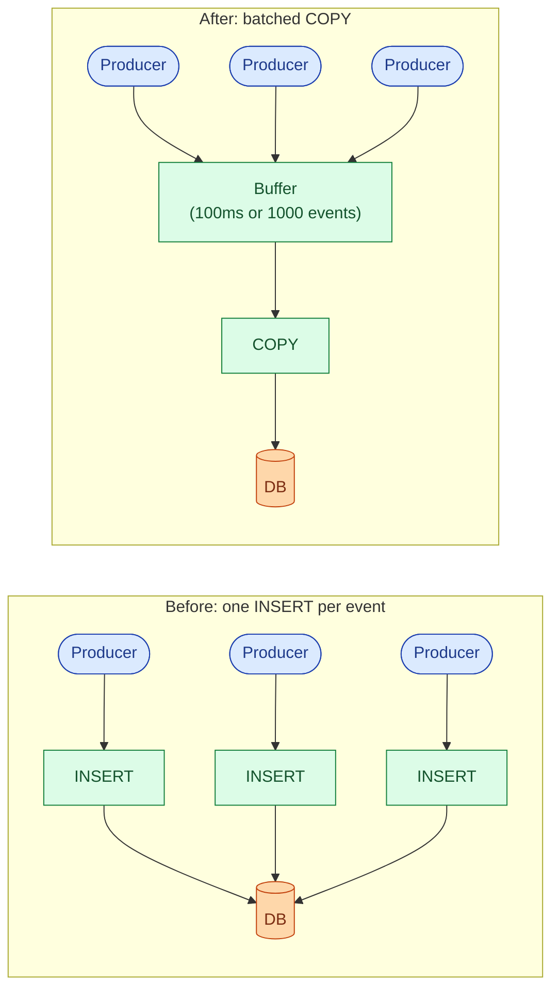
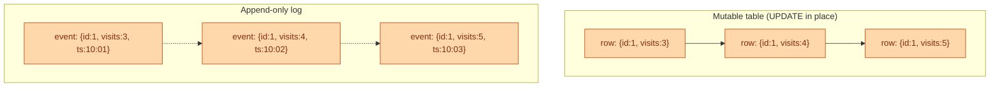
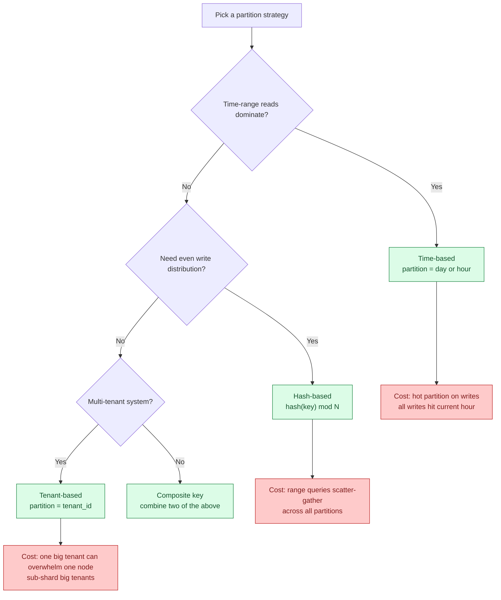
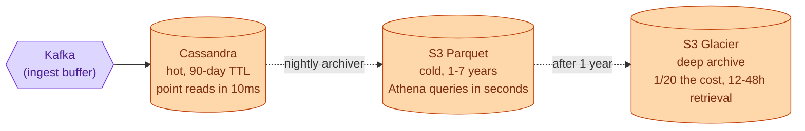
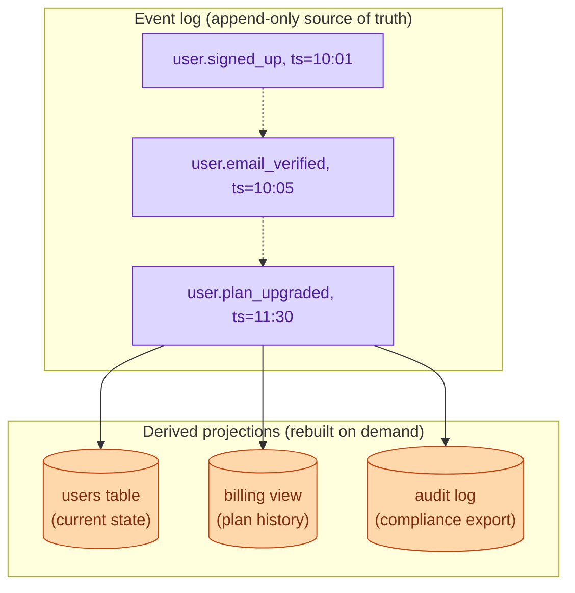
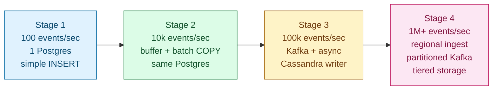
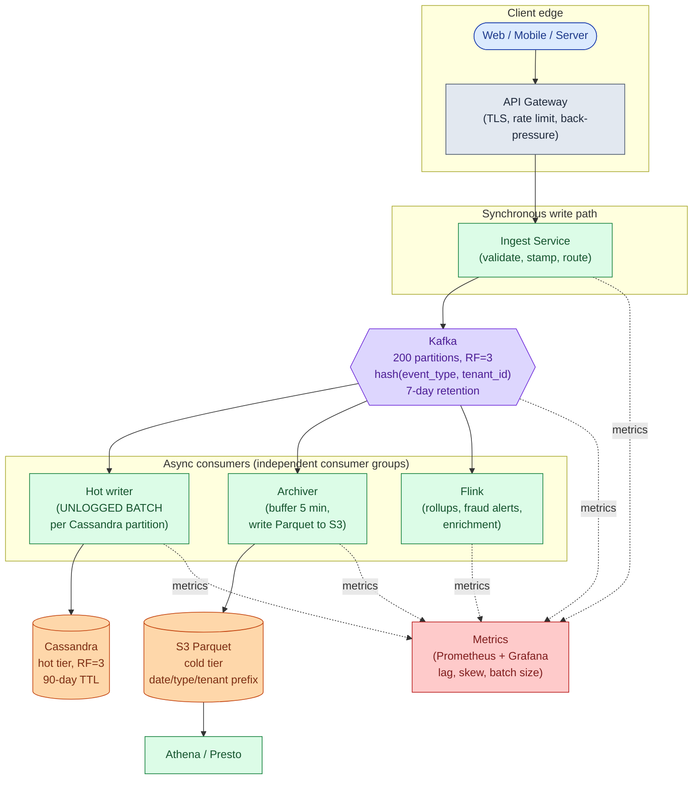
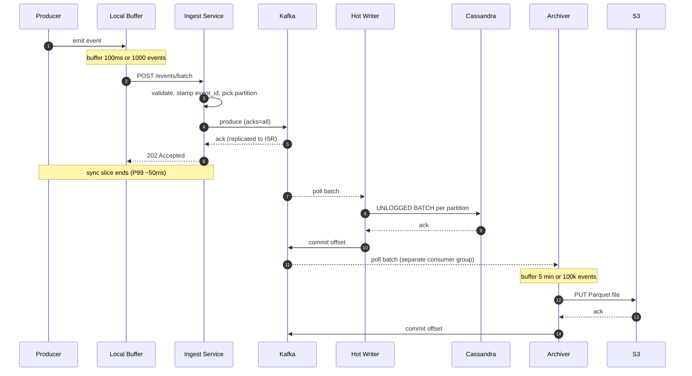
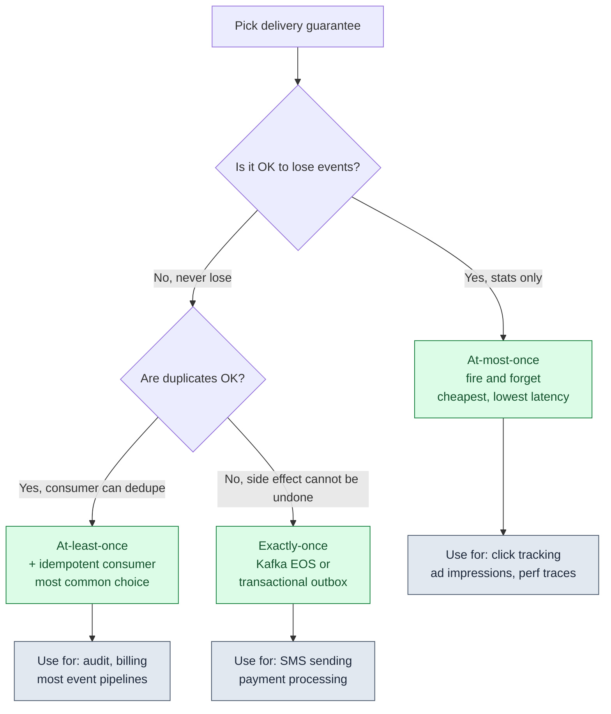

## What this is

Write-heavy systems share a small set of problems that show up at nearly every scale: a single node cannot absorb the write rate, per-write overhead kills throughput, or the data layout makes reads expensive later. The same handful of patterns solve these problems every time.

This doc names them, shows how they work, and explains the trade-offs. The patterns are not a checklist to apply all at once. They are a toolkit you reach into as each previous thing breaks.

The seven patterns:

1. **Batching** - amortize fsync and network round-trip cost across many writes
2. **Append-only log** - make every write sequential; never update in place
3. **Queue-based ingestion** - decouple producer speed from storage speed
4. **LSM trees** - a storage engine built for sequential writes
5. **Sharding and partition keys** - spread writes across many nodes
6. **Tiered storage** - match storage cost to access frequency
7. **Event sourcing** - model state as an ordered stream of immutable facts

Each pattern below has a diagram, a "when to use" section, and a "what breaks" section.

---

## The fundamental problem

Before any patterns, picture what write-heavy actually means. Every write is unique. Every write must hit disk. Caching does not help.

A read-heavy system can serve a million reads from one cached copy. A write-heavy system cannot: every write is unique and every write must persist. There are only two levers: **batch** (amortize per-write cost over many writes) and **spread** (route writes to many nodes so no one node melts).

> **Take this with you.** Every pattern in this doc is either batching, spreading, or both.

---

## Pattern 1: Batching

Instead of writing one event per database call, accumulate events in memory and flush them together.

**When to use.** Any time per-write overhead (network round-trip, TLS handshake, fsync) dominates the actual write cost. Practical threshold: above ~1k events/sec when latency starts climbing.

**What breaks.** Events in the in-memory buffer are lost on a crash. At 100ms flush intervals and 10k events/sec, that is up to 1,000 events. For click tracking this is acceptable. For audit logs it is not. Fix: move the buffer to a durable queue (Pattern 3).

> **Take this with you.** Batching is the first 10x. It costs nothing but a timer and an array. Use it before reaching for Kafka.

---

## Pattern 2: Append-only log

Stop updating rows in place. Only ever append. This is how Kafka, Cassandra's LSM tree, and every good audit log work.

**When to use.** Audit trails where you need the full history. Time-series data where events are immutable facts. Any system where "what happened" matters as much as "what the current state is."

**What breaks.** You cannot undo a row. GDPR deletions need a tombstone approach, not a `DELETE`. Storage grows without bounds until you add retention and compaction. Reads that want current state must aggregate across all events, which is expensive without materialized views.

> **Take this with you.** Sequential disk writes are 10x to 100x faster than random writes on any hardware. An append-only log turns every write into a sequential one.

---

## Pattern 3: Queue-based ingestion

Separate the producer's write speed from the storage layer's write speed. Producers fill a durable queue. Storage drains it at its own pace.

**When to use.** When storage cannot absorb the ingest rate in real time. When multiple consumers (audit archive, fraud detection, analytics) all need the same events. When a downstream service restart should not cause event loss.

**What breaks.** End-to-end lag jumps from milliseconds to seconds. Events are not queryable until the consumer has flushed them to storage. A stuck consumer builds lag. If lag grows past Kafka's retention window (typically 7 days), events are gone.

> **Take this with you.** The queue is the shock absorber. Producers fill it. Storage drains at its own pace. One consumer falling behind does not affect the others.

---

## Pattern 4: LSM trees

Postgres uses a B-tree. Cassandra uses an LSM tree. For write-heavy work, LSM wins consistently. Here is why.

```mermaid
flowchart TB
    subgraph BTree["B-tree insert (Postgres)"]
        BW1["1. Find leaf page<br/>(random disk read)"]:::app
        BW2["2. Insert, maybe split page<br/>(random disk write)"]:::app
        BW3["3. Write WAL<br/>(sequential)"]:::app
        BW4["4. fsync on commit<br/>(blocks until durable)"]:::bad
        BW1 --> BW2 --> BW3 --> BW4
    end

    subgraph LSM["LSM insert (Cassandra, RocksDB)"]
        LW1["1. Append to commit log<br/>(sequential)"]:::app
        LW2["2. Insert into memtable<br/>(in RAM)"]:::app
        LW3["3. Flush to SSTable<br/>(big sequential write)"]:::app
        LW4["4. Compact SSTables<br/>(background, off-peak)"]:::ok
        LW1 --> LW2 --> LW3 --> LW4
    end

    classDef app fill:#dcfce7,stroke:#15803d,color:#14532d
    classDef ok  fill:#dcfce7,stroke:#15803d,color:#14532d
    classDef bad fill:#fecaca,stroke:#b91c1c,color:#7f1d1d
```

**When to use LSM.** Write-heavy work, time-series, logs, telemetry. Cassandra, ScyllaDB, RocksDB, LevelDB, HBase, and InfluxDB all use LSM variants. Above ~50k writes/sec on a single node, Cassandra or ScyllaDB are the standard choice.

**What breaks.** Reads are slower because the engine must check the memtable plus several SSTables. Compaction causes write amplification: the same byte may be written 5-10 times over its life. Until compaction runs, you have several copies of the same data on disk (space amplification).

**When B-tree wins.** OLTP with frequent updates to the same rows. Read-heavy workloads. Many secondary indexes. Postgres and MySQL.

> **Take this with you.** LSM turns many random writes into sequential appends. Sequential disk I/O is 10x to 100x faster than random I/O. That is the whole trick.

---

## Pattern 5: Sharding and partition keys

One node cannot absorb 1M writes/sec. You spread writes across many nodes by picking a partition key. The choice determines whether load spreads evenly or whether one node gets 10x the traffic of the rest.

**When to use.** Any time one node cannot absorb the write rate, or you need to drop old data cheaply (time-based partitions let you drop whole partitions instead of running deletes).

**What breaks.** Every partition strategy has a failure mode. Time-based: all writes hit the current partition. Hash-based: range queries scatter across all shards. Tenant-based: one large tenant overwhelms one node. The fix is usually a composite key that combines two strategies. For a 1M events/sec audit system: Kafka key `hash(event_type, tenant_id)`, Cassandra primary key `((tenant_id, day), event_id)`, S3 path `date=YYYY-MM-DD/event_type=X/tenant_id=Y/`.

> **Take this with you.** The partition key is the most important design decision in write-heavy storage. A wrong key gives you a hot node. A hot node negates all the scaling work.

---

## Pattern 6: Tiered storage

Not all data is accessed equally. Events from the last hour are read often and must be fast. Events from three years ago are read rarely and must be cheap. Match storage cost to access frequency.

**When to use.** Any system with a retention requirement beyond what fits cheaply in a fast store. The break-even is usually around 30 days: recent data in a fast key-value or columnar store, older data on object storage.

**What breaks.** A query that spans tiers (last 6 months plus the past 2 years) must be split and the results merged at query time. Operational complexity increases: you now run the archiver job, manage Parquet file sizes, and ensure Glacier retrieval SLAs match compliance needs.

> **Take this with you.** Tiered storage matches cost to access frequency. Hot queries pay hot prices. Cold queries pay cold prices. Keeping 7 years of events in Cassandra is structurally wrong, not just expensive.

---

## Pattern 7: Event sourcing

Model the system as an ordered stream of immutable events. Current state is derived by replaying them. The event log is the source of truth; everything else is a projection.

**When to use.** Audit trails where you need to reconstruct any historical state. Systems where the history of changes matters as much as current state. Any domain with complex compliance or replay requirements.

**What breaks.** Replaying millions of events to rebuild a projection is slow without periodic snapshots. GDPR "right to be forgotten" conflicts with append-only: you need tombstone events and projection logic that respects them. Storage grows without tiering. Event schemas evolve, so old projections must handle old event versions.

> **Take this with you.** Event sourcing gives you time travel for free. The cost is that every read becomes a projection. Use it when the audit trail is a first-class requirement, not a side effect.

---

## How the patterns stack as scale grows

These patterns are not applied all at once. Each stage handles roughly 10x the throughput of the one before.

<b>Show: what breaks at each transition</b>

**Stage 1 to 2 (add batching).** Postgres CPU climbs to 80%. WAL fsync is the bottleneck: every INSERT must flush to disk before returning. Switching to a 100ms in-memory buffer and `COPY` gives 10x throughput on the same hardware. Cost: up to 1,000 events lost on crash.

**Stage 2 to 3 (add queue and LSM store).** Postgres hits its I/O ceiling. Vertical scaling is exhausted. The crash-loss problem also grows at 100k/sec (100ms x 100k = 10k events lost per crash), which is now unacceptable. Kafka decouples producers from storage. Cassandra's LSM tree handles write rates that Postgres cannot. Multiple independent consumers read the same topic.

**Stage 3 to 4 (partition and tier).** Single-region Kafka hits NIC and disk limits. One large tenant saturates one Kafka partition and one Cassandra node. Cold-tier costs grow unbounded if you keep everything in Cassandra. Regional ingest tiers, sub-sharding for hot tenants, Flink for derived data, and S3 Parquet for cold storage are the answers.

**The discipline.** Name the limit of stage N before reaching for stage N+1. A system that starts at 100 events/sec does not need Kafka. Building it with Kafka adds operational weight before it can carry any load.

---

## The full pipeline at 1M events/sec

| Box | What it does |
|-----|--------------|
| **API Gateway** | Terminates TLS, applies per-tenant rate limits, returns 429 when Kafka is unhealthy. |
| **Ingest Service** | Stateless. Validates schema, stamps event_id and server timestamp, routes to Kafka. Returns 202. |
| **Kafka** | The shock absorber. Producers fill it. Consumers drain independently. Buffers 5-minute stalls without affecting producers. |
| **Hot writer** | Reads Kafka, writes UNLOGGED BATCHes per Cassandra partition. Commits offset after storage ack. |
| **Archiver** | Separate consumer group. Buffers 5 minutes or 100k events. Writes one Parquet file to S3. |
| **Flink** | Derived data: per-minute rollups, anomaly scores, fraud alerts. Same Kafka topic as others. |
| **Cassandra hot tier** | Recent events. Query by `(tenant_id, day)` range. 90-day TTL, auto-deleted by compaction. |
| **S3 Parquet cold tier** | 7-year archive. Partitioned by date/event_type/tenant_id. Queried by Athena. |
| **Metrics** | Consumer lag, throughput, batch size, partition skew. These diagnose every common failure. |

> **Take this with you.** Three consumer groups read the same Kafka topic independently. The archiver can fall behind without affecting Cassandra. Flink can crash without affecting the archiver. Kafka is what makes this possible.

---

## One event, all the way through

Three things to notice:

1. The 202 goes back to the producer after Kafka ack, not after Cassandra ack. If Kafka has it, the event is safe. Cassandra is just the queryable view.
2. The hot writer commits the Kafka offset *after* Cassandra ack. On a crash between write and commit, it replays the batch on restart. Cassandra's primary-key UPSERT makes the replay a no-op.
3. End-to-end lag to Cassandra is 1-3 seconds. Lag to S3 is up to 5-6 minutes (the archiver's flush window).

---

## Delivery guarantees

At small scale, every event is in one Postgres. One ACID transaction. Either on disk or not.

At 1M events/sec, that promise is gone. Pick one of three delivery models.

At-least-once with idempotent storage gives the same correctness as exactly-once at a tenth of the cost. Most systems should pick this.

<b>Show: the cost of each guarantee</b>

**At-most-once.** Producer sends, returns immediately, does not retry. If the broker is down, the event is lost. Zero retry cost. No idempotency machinery. Use when the data is statistical: page views, click tracking, performance traces.

**At-least-once.** Producer retries on any failure to ack. A network blip may cause the broker to write a second copy. Consumer commits offsets after processing.

Handle duplicates by using `event_id` as the primary key in storage. The second write is a no-op via Cassandra UPSERT or `INSERT ON CONFLICT DO NOTHING`. This is what 80% of production pipelines do.

**Exactly-once.** Kafka EOS via transactional producers and read-committed consumers. Throughput drops 20-40% compared to at-least-once. Latency increases. Use only when the downstream effect cannot be deduped (SMS, payment processing).

Most "we need exactly-once" requirements are actually "we need at-least-once with idempotent processing." At-least-once is 10x cheaper and covers 95% of cases.

> **Take this with you.** At-least-once with idempotent storage gives you the same correctness as exactly-once at a tenth of the cost. Most systems should pick this.

---

## Follow-up questions

Try answering each in 2 to 4 sentences before reading the solution.

1. **Back-pressure.** Producers are sending 2x the rate Kafka can absorb. Brokers are healthy but disk is at 80%. What does the ingest service do? What does the producer SDK do?

2. **Hot tenant.** One tenant's mobile app has a bug and is sending 200k events/sec when the average is 100. They are saturating one Kafka partition. How do you find them? What do you do in the next 5 minutes vs the next 5 days?

3. **Clock skew.** Two producers disagree about "now" by 3 minutes. Downstream reports show events arriving "in the future." How do you fix it without requiring nanosecond-precision NTP everywhere?

4. **Duplicate events.** A producer retried after a broker timeout that actually succeeded. Cassandra now has two copies of every event in that batch. Walk through detection and dedup.

5. **Consumer fell behind.** A Cassandra writer consumer has been stuck for 30 minutes. Kafka has buffered 1.8 billion events for that consumer group. What happens when you fix the bug and restart? How do you keep it from melting storage?

6. **Schema evolution.** A team added a new field. Old producers send 5 fields, new producers send 6. Cassandra has a fixed table schema. How do you handle migration without dropping events or breaking old consumers?

7. **Recent-event reads.** A consumer wants "all events for user U in the last 30 seconds." Your storage path is Kafka batched every 5 minutes into Cassandra. The event might still be in Kafka. How do you make the read see both?

8. **A region goes down.** The US-East Kafka cluster is offline. Producers there cannot publish. What is your DR plan? How much data could be lost?

9. **Cold-tier query cost.** A user wants "every event for tenant X for the past 3 years." A naive Athena query scans 3 PB of Parquet. How do you make this both fast and cheap?

10. **Exactly-once for a side effect.** One downstream consumer sends an SMS for every fraud alert. SMS is not idempotent (the user gets two texts if you send twice). How do you guarantee exactly one SMS without paying Kafka EOS cost on the whole pipeline?

---

## Related problems

- **[Approval Management (011)](../011-approval-management/question.md).** The audit log in that design is exactly a write-heavy append-only system. The tiered storage and batching patterns here apply directly.
- **[News Feed (002)](../002-news-feed/question.md).** Timeline write fan-out is the classic write-heavy problem at consumer scale: each post produces N writes, one per follower's timeline.
- **[Todo List Sharing (013)](../013-todo-list-sharing/question.md).** The change-log sync pipeline for collaborative edits is the same shape at smaller scale: every edit is a small append-only event partitioned by list_id.
- **[Read-Heavy System Patterns (017)](../017-read-heavy-patterns/question.md).** The mirror image of this problem. Read-heavy is cached. Write-heavy is batched and partitioned.
