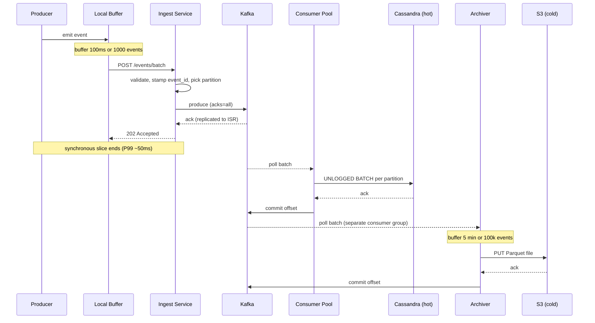
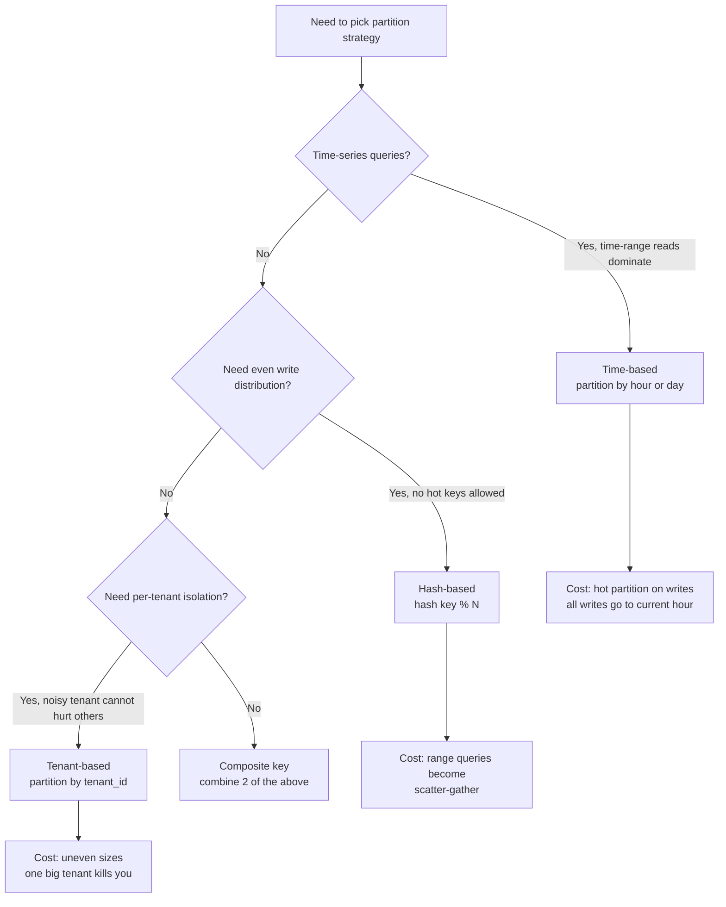
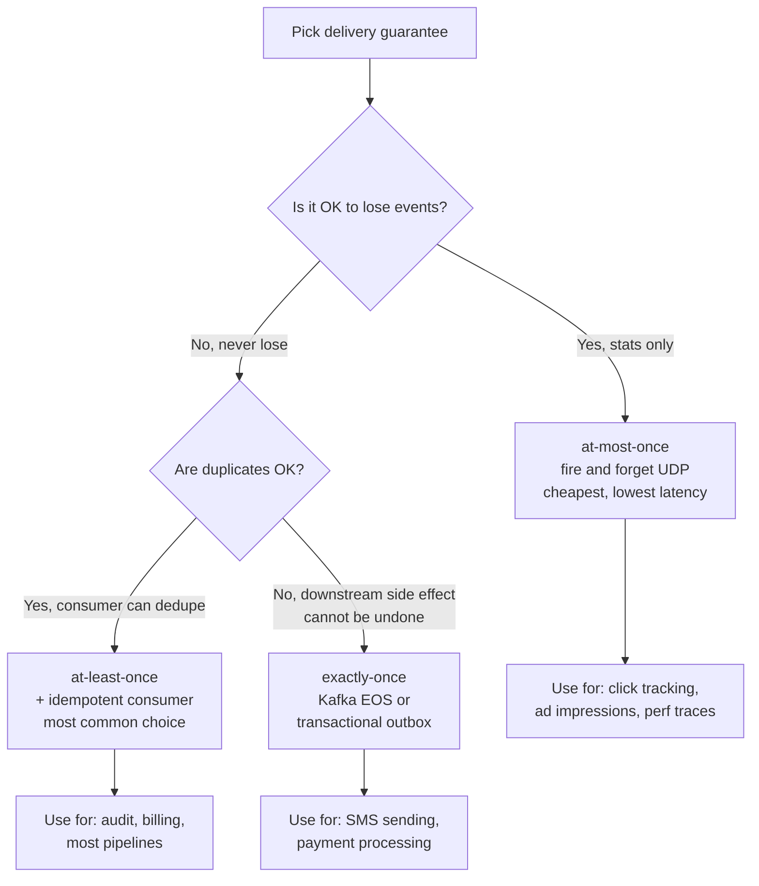

## The scene

You sit down. The interviewer skips the small talk.

> *"I have an audit logging service. Today it does 100 events per second. One Postgres database. It works fine. My PM just told me we are going to log every user click across the company. About 1 million events per second. Walk me through what you do, in order."*

This is not a question about a finished system. It is a question about how you *grow* a system from "one Postgres handles it" to "a million events per second." The interviewer wants to see you reach for one tool at a time. Buffering. Batching. Queues. Partitioning. Append-only logs. The moment you give up strong consistency.

A write-heavy system is the opposite of a read-heavy one. The cost comes from taking in data, not from serving it. Each event is small. Queries are simple. The storage engine has one job: absorb writes faster than a normal database can.

If you say "use Kafka and Cassandra" in the first minute, you fail. The interviewer wants you to reach for each tool *at the moment the previous one breaks*. Not all at once.

We will walk this from 100 events per second to 1 million per second. At every step we name what breaks first, then add the smallest fix.

---

## Step 1: Ask the right questions

Take five minutes. Do not draw anything yet.

The dumb instinct is "just send it to Kafka." That is wrong until you have answers to the questions below. Aim for about 8 questions that change the design if answered differently.

<details markdown="1">
<summary><b>Show: 8 questions that matter</b></summary>

1. **How much loss is OK?** "If we drop 0.1% of events when a node crashes, is that fine?" Audit logging for SOX accepts zero loss. Click tracking accepts 1%. That one answer decides if you need `acks=all` on Kafka, a transactional outbox, or fire-and-forget UDP.

2. **How fresh must reads be?** "When we save an event, when must a query see it? 100ms? 10 seconds? 5 minutes?" Real-time forces you to index right away. 5-minute lag lets you batch into Parquet files and pay 1% of the cost.

3. **Does order matter?** "Do events need to be ordered globally, ordered per user, or unordered?" Global ordering means one writer (slow). Per-user ordering means partition by user (medium). Unordered is the cheapest.

4. **How do consumers read this data?** "By single event ID, or by aggregating?" Point lookups want an LSM tree with a primary key. Scans and counts want a columnar layout like Parquet or ClickHouse.

5. **How long do we keep it?** "30 days hot, 7 years cold? Forever?" Time-based partitions are easy to drop. That fact alone often picks the partition scheme.

6. **How big is one event?** A 200-byte event is a totally different system from a 50KB event. Fixed schemas can use columnar formats. Random JSON forces you to store the raw bytes.

7. **How bursty is the traffic?** "Is 1M/sec steady or a peak? Black Friday spike? Log storm risk?" A 5x burst is normal. Some systems see 50x bursts when a logging loop goes wild. Your queue size depends on this.

8. **What delivery promise do we need?** At-most-once (lose on failure), at-least-once (may duplicate), or exactly-once. Exactly-once is expensive and almost never worth it. At-least-once with idempotent consumers is the usual answer.

A strong candidate adds one more: *"What does the consumer actually do with these events?"* If it is a dashboard, you optimize for aggregation. If it is fraud detection, you optimize for low latency. If it is compliance storage, you optimize for cheap durable disk. The downstream decides the upstream.

</details>

---

## Step 2: How big is this thing?

The interviewer hands you the numbers. 1M events per second, steady. 3x that at peak. 500 bytes per event. Keep 90 days hot, 7 years cold. No global ordering needed. 10 seconds of lag is fine.

Compute six numbers on paper before peeking:

1. Bytes per second at steady state
2. Bytes per second at peak
3. Events per day
4. Hot storage size (90 days)
5. Cold storage size (7 years, assume 5x compression)
6. Queue size if downstream stalls for 5 minutes

<details markdown="1">
<summary><b>Show: the math</b></summary>

**Steady bandwidth.** 1M events/sec * 500 bytes = 500 MB/sec = **4 Gbps**. A 10G network card maxes out around 80%. You need more than one ingest machine just for network throughput, not for CPU.

**Peak bandwidth.** 3x steady = 1.5 GB/sec = **12 Gbps**. Several machines per region just to accept the bytes.

**Daily volume.** 1M * 86,400 seconds = **86 billion events per day**. At 500 bytes each, that is **43 TB per day raw**.

**Hot storage (90 days).** 43 TB * 90 = **about 3.9 PB**. Not one machine. This is a 10 to 30 node Cassandra cluster with RF=3 (three copies of each row).

**Cold storage (7 years, 5x compression).** 43 TB * 365 * 7 / 5 = **about 22 PB** in S3 as Parquet files. Standard S3 costs about $500k/month for that. Glacier Deep Archive cuts it to 1/20 the price if you rarely read it.

**Queue size on 5-minute stall.** 1M events/sec * 300 seconds = **300 million events** = **150 GB**. Kafka with 7-day disk retention handles this easily. An in-memory queue cannot.

**What this means.** Bandwidth and storage dominate. CPU is not the bottleneck. One Postgres maxes out around 10k-50k writes/sec. We are 20x to 100x past that on a single shard. Almost the whole design exists to *spread* writes across many machines and *batch* small writes into bigger ones.

> Why is this so different from a read-heavy system? Reads can be cached. The same data can be served a million times from one cached copy. Writes cannot. Every write is unique. Every write must hit disk. Caching does not help. You can only batch and spread.

</details>

---

## Step 3: The write pipeline grows in 4 stages

Here is how a write path evolves. Each stage handles roughly 10x the throughput of the one before. Fill in the limits.

```
Stage A:  producer -- INSERT --> Postgres            limit: [ ? ] writes/sec
                                                     fails because: [ ? ]

Stage B:  producer -- INSERT --> app -- buffer --> Postgres
                                  (in-memory                limit: [ ? ] writes/sec
                                   flush every 100ms)       fails because: [ ? ]

Stage C:  producer -- HTTP --> ingest --> [ ? ] --> batch writer -- COPY --> storage
                                                                              (Postgres
                                                                               or Cassandra)
                                  limit: [ ? ] writes/sec
                                  fails because: [ ? ]

Stage D:  producer --> regional ingest --> regional Kafka --> stream processor --> [ ? ]
                                                  (partitioned                  (Flink /
                                                   by key)                       Spark)
                                  limit: 1M+ writes/sec
                                  fails because: [ ? ]
```

<details markdown="1">
<summary><b>Show: the 4 stages with limits</b></summary>

```
Stage A:  producer -- INSERT --> Postgres            limit: ~1k writes/sec
                                                     fails because: every INSERT must
                                                                    flush the WAL to disk
                                                                    (fsync). Disk fsync
                                                                    is slow.

Stage B:  producer -- INSERT --> app -- buffer --> Postgres
                                  (flush 100ms,             limit: ~10k writes/sec
                                   COPY in batches          fails because: single Postgres
                                   of 1000)                                still chokes;
                                                                           buffer is lost
                                                                           on app crash

Stage C:  producer -- HTTP --> ingest --> Kafka --> batch writer -- COPY --> Cassandra
                                                                              (sharded)
                                  limit: ~100k writes/sec
                                  fails because: one Cassandra cluster or
                                                 one Kafka topic hits hot
                                                 partition limits;
                                                 consumers fall behind

Stage D:  producer --> regional ingest --> regional Kafka --> Flink --> Cassandra (hot)
                                                  (partitioned                + S3 Parquet
                                                   by event_type                (cold)
                                                   + tenant_id)
                                  limit: 1M+ writes/sec
                                  fails because: cross-region replication lag;
                                                 cold-tier query slowness;
                                                 bursts past Kafka capacity
```

**What each transition buys you:**

- **A to B (buffer + batch).** Stops paying fsync cost on every event. One fsync now covers 1000 events. 10x throughput, same hardware. The cost: if the app crashes, you lose the in-memory buffer. About 100ms * 10k events/sec = up to 1000 lost events.

- **B to C (durable queue).** Separates producer speed from storage speed. Producers cannot crush storage. They fill the queue. Storage drains the queue at its own pace. Cassandra's LSM tree absorbs sequential writes far better than Postgres's B-tree (more on that in Step 5). Another 10x. The cost: end-to-end lag jumps from milliseconds to seconds. Events are not queryable until the consumer has flushed them.

- **C to D (partitioning + stream processing).** Scales sideways with no single bottleneck. Each Kafka partition has its own consumer. Each Cassandra node owns a slice of the keys. A stream processor like Flink does extra work like enrichment and routing. Cold tier on S3 Parquet is bottomless and cheap. 10x more, and you can keep going by adding partitions. The cost: strong consistency is gone. Cross-region replication is eventually consistent.

> The discipline: name the limit of stage N *before* you reach for stage N+1. Junior engineers jump straight to stage D. They build the cathedral before they have any worshippers.

</details>

---

## Step 4: Draw the full pipeline

Here is the 1M events/sec design with 5 boxes missing. Fill them in.

```
                                +-------------------+
   producer apps  --HTTPS-->    |  [ ? ]            |  TLS, load balance,
   (web, mobile,                |                   |  per-tenant rate limit
   server)                      +---------+---------+
                                          |
                                          v
                                +-------------------+
                                |  Ingest Service   |  validate schema,
                                |  (stateless)      |  assign event_id,
                                |                   |  pick partition key
                                +---------+---------+
                                          |
                                          v
                                +-------------------+
                                |  [ ? ]            |  durable, partitioned,
                                |                   |  7-day retention,
                                |                   |  absorbs bursts
                                +---------+---------+
                                          |
                       +------------------+------------------+
                       |                  |                  |
                       v                  v                  v
                +-------------+   +-------------+    +-------------+
                |  [ ? ]      |   |  archiver   |    |  realtime   |
                |  (hot       |   |  (writes    |    |  consumer   |
                |   storage,  |   |   Parquet   |    |  (fraud,    |
                |   point     |   |   to S3     |    |   alerts)   |
                |   reads)    |   |   every     |    |             |
                |             |   |   5 min)    |    |             |
                +-------------+   +------+------+    +-------------+
                                         |
                                         v
                                +-------------------+
                                |  [ ? ]            |  cold tier, queried
                                |                   |  by Athena / Presto
                                +-------------------+

                                +-------------------+
                                |  [ ? ]            |  every stage reports
                                |                   |  rate, queue depth,
                                |                   |  lag, batch size
                                +-------------------+
```

<details markdown="1">
<summary><b>Show: the full architecture</b></summary>

```
                                +----------------------+
   producer apps  --HTTPS-->    |  Edge LB + WAF +     |  TLS, anycast,
   (web, mobile,                |  API Gateway         |  per-tenant rate limit,
   server)                      |                      |  back-pressure
                                +----------+-----------+    (429 if downstream full)
                                           |
                                           v
                                +----------------------+
                                |  Ingest Service      |  validate schema,
                                |  (stateless, N pods) |  assign event_id (ULID),
                                |                      |  add server timestamp,
                                |                      |  pick partition key
                                |                      |  hash(event_type, tenant_id)
                                +----------+-----------+
                                           |
                                           v
                                +----------------------+
                                |  Kafka cluster       |  partitioned by
                                |  (or Kinesis,        |  hash(event_type, tenant_id),
                                |   Pulsar, NATS)      |  RF=3, 7-day retention,
                                |                      |  acks=all
                                +----------+-----------+
                                           |
                       +-------------------+-------------------+
                       |                   |                   |
                       v                   v                   v
                +--------------+   +--------------+    +--------------+
                |  Cassandra   |   |  Archiver    |    |  Flink       |
                |  hot tier    |   |  (consumes,  |    |  stream      |
                |  90-day TTL  |   |   buffers    |    |  processor   |
                |  RF=3        |   |   5 min,     |    |  fraud,      |
                |  sharded by  |   |   writes     |    |  alerts,     |
                |  (tenant,    |   |   Parquet)   |    |  rollups     |
                |   day)       |   |              |    |              |
                +--------------+   +------+-------+    +--------------+
                                          |
                                          v
                                +----------------------+
                                |  S3 / GCS Parquet    |  partitioned by
                                |  + Athena / Presto / |  date=YYYY-MM-DD/
                                |  BigQuery on top     |  event_type=X/
                                |                      |  tenant_id=Y/
                                +----------------------+

                                +----------------------+
                                |  Metrics + Logs      |  Prometheus,
                                |  Prometheus,         |  every stage reports:
                                |  Grafana,            |  throughput, queue
                                |  OpenTelemetry       |  depth, lag, skew
                                +----------------------+
```

What each piece does, in one line:

- **Edge LB + Gateway.** Several ingest pods needed just to terminate TLS at 12 Gbps. Per-tenant rate limit prevents one noisy tenant from drowning the rest. Back-pressure (429 when Kafka is sick) protects the cluster from cascading failure.
- **Ingest Service.** Stateless. Validate. Stamp. Route. Put event in Kafka. Return 202 Accepted. That is it.
- **Kafka.** The shock absorber. Producers fill it. Consumers drain it. If a consumer stalls for 5 minutes, Kafka buffers the backlog without affecting producers.
- **Cassandra hot tier.** Recent events. Query by key (event_id, or `(tenant_id, day)` range). LSM tree shape: writes are sequential, no read-modify-write per insert.
- **Archiver.** Reads Kafka. Buffers 5 minutes or 100k events. Writes one big Parquet file to S3. Trades latency for cost.
- **Flink (stream processor).** Derived data: per-minute rollups, anomaly scores, alerts. Reads the same Kafka topic as the others.
- **S3 + query layer.** Bottomless storage. Athena/Presto/BigQuery query Parquet without a dedicated cluster.
- **Observability.** Without metrics on queue depth, batch size, and lag, you learn about problems from customer complaints.

</details>

---

## Step 5: The journey of one event (sequence diagram)

Picture a single event going from a phone to disk. It hops through buffer, batch, queue, hot store, then nightly to cold store.



End-to-end lag from producer to "queryable in Cassandra" is 1 to 3 seconds, with P99 around 10 seconds. Lag to S3 Parquet is up to 5 to 6 minutes (the archiver's flush window dominates).

The sync part is small. Producer to Kafka ack, P99 about 50 ms. Everything after Kafka happens at its own pace.

---

## Step 6: Append-only logs and why LSM beats B-tree here

Postgres uses a B-tree for its primary index. Cassandra uses an LSM tree. RocksDB, ScyllaDB, HBase, and Kafka's log are all LSM-flavored. For write-heavy work, LSM wins. Why?

Define the terms first:

> **B-tree.** A balanced tree on disk. Each node is a page. Inserts find the right leaf page, write into it, and may split the page if it is full. Postgres and MySQL use B-trees.
>
> **LSM tree.** Log-Structured Merge tree. Optimized for fast writes by appending instead of updating in place. Writes go to an in-memory table (memtable). When it fills, it flushes to disk as a new immutable file (SSTable). Background compaction merges files later.

<details markdown="1">
<summary><b>Show: B-tree vs LSM for writes</b></summary>

**A B-tree insert (Postgres, MySQL) does 5 things:**

1. Find the leaf page for this key. Often a random disk read if the page is not cached.
2. Insert the key. If the page is full, split it (write 2 pages instead of 1).
3. Update parent pages if the split goes up.
4. Write to WAL (sequential), then update the data page later (often random).
5. On commit, fsync the WAL to disk.

Random keys are the worst case. Each insert touches a different leaf page. The cache churns. You pay a random read plus a random write per insert. A single Postgres tops out around 1k-10k writes/sec for keyed inserts that do not fit in memory.

**An LSM insert (Cassandra, RocksDB) is simpler:**

1. Append to a commit log (sequential disk write).
2. Insert into an in-memory memtable (sorted in RAM).
3. When the memtable fills, flush it as a new SSTable file (one big sequential write).
4. Compaction merges old SSTables in the background to free space.

> Why is LSM faster? All disk writes are sequential. Append is the fastest thing a disk can do. Sequential disk throughput is 10-100x random disk throughput on spinning disks, and even on SSDs sequential beats random for sustained writes. There is no read-before-write. SSTables are immutable, so no page locks for concurrency. The cost is paid later, when the system is less busy, during compaction.

**What LSM costs:**

- **Read amplification.** A read might check the memtable plus several SSTables. Bloom filters help, but reads are slower than B-tree reads for the same data.
- **Write amplification.** Compaction rewrites SSTables. The same byte may be written 5-10 times over its life.
- **Space amplification.** Until compaction runs, you have several copies of the same data.

**LSM wins for:** write-heavy work, time-series, logs, telemetry. Cassandra, ScyllaDB, RocksDB, LevelDB, HBase, BigTable, DynamoDB under the hood, InfluxDB.

**B-tree wins for:** OLTP with frequent updates to the same rows, read-heavy work, lots of secondary indexes. Postgres, MySQL.

**The append-only log extreme is even simpler than LSM.** Kafka is pure append to a segment file. No compaction unless you turn it on. Reads are by offset (O(1) seek). This is why Kafka can ingest millions of messages per second per partition on cheap hardware. The trade-off: you cannot query by arbitrary key. Only by offset or time.

For our 1M events/sec audit pipeline, the storage layers stack up like this:

- **Kafka log.** Pure append. Infinite write throughput per partition until disk fills.
- **Cassandra hot tier.** LSM. Query by key. 90-day retention.
- **S3 Parquet cold tier.** Immutable columnar files. Queried by partition.

Each is optimized for write throughput at its scale.

</details>

---

## Step 7: Picking a partition strategy

You have to pick a partition key for Kafka and a shard key for Cassandra. The choice decides if load spreads evenly or if one partition gets 10x the traffic of the rest.

Three families. For each, name when it works and when it does not.

| Strategy | How it works | Good for | Fails when |
|----------|--------------|----------|------------|
| Time-based | partition = day or hour | [ ? ] | [ ? ] |
| Hash-based | partition = hash(key) % N | [ ? ] | [ ? ] |
| Tenant-based | partition = tenant_id | [ ? ] | [ ? ] |

Here is a flowchart to help you pick:



<details markdown="1">
<summary><b>Show: the 3 partition families filled in</b></summary>

| Strategy | How it works | Good for | Fails when |
|----------|--------------|----------|------------|
| **Time-based** | Each hour or day gets its own partition. Files named `events/2026-05-24/...` | Time-range queries ("events from last week"). Cheap to drop old data (delete the directory). Cold-storage archiving (move yesterday to S3 Glacier). Natural fit for Parquet on S3. | **Hot partition on writes.** All writes go to the current hour. Older partitions are cold. The hot one melts. Fix: combine with another key (hour + hash). |
| **Hash-based** | `partition_id = hash(event_id) % N` or `hash(user_id) % N` | Even write distribution. No hotspots if the key has high cardinality. Easy to scale: add nodes, rebalance. | **Range queries become scatter-gather.** "All events for user X in last hour" hits every partition unless you hash by user_id (then "all events between A and B" is the scatter case). Cannot drop old data without scanning. Adding nodes moves data across the network. |
| **Tenant-based** | `partition_id = tenant_id` or hash(tenant_id) | Multi-tenant isolation. Noisy tenant contained (one tenant's spike does not hurt others). Easy per-tenant deletion (GDPR). Per-tenant SLAs. | **Uneven sizes.** Your biggest tenant might be 1000x bigger than the median. That tenant's partition is hot. Classic "one big customer" problem. Fix: sub-shard the biggest tenants with a random suffix (`tenant_42_0`, `tenant_42_1`, ..., `tenant_42_15`). |

**The right answer is usually a mix.**

For 1M events/sec audit logging:

- **Kafka partition key:** `hash(event_type, tenant_id)`. Spreads load across partitions while keeping per-key ordering inside a single `(event_type, tenant_id)` stream. Start at 100 partitions, scale to 1000+ as needed. Each partition handles about 10k events/sec at the high end.

- **Cassandra primary key:** `((tenant_id, day), event_id)`. The partition key `(tenant_id, day)` puts all events for a tenant on a given day in one place (cheap range scan). The clustering column `event_id` gives uniqueness and ordering inside the partition. The day component bounds partition size: even a huge tenant only writes one day at a time per partition.

- **S3 Parquet prefix:** `date=YYYY-MM-DD/event_type=X/tenant_id=Y/`. Time-based at the top (cheap to drop old data). Hash-friendly subdirs for query pruning. Athena uses partition pruning to skip whole prefixes when the query filters on date or tenant.

**The hot partition problem in real life:**

Say one tenant's mobile app has a bug. It emits 100k events/sec instead of the normal 100. Their `(event_type, tenant_id)` partition gets 100k/sec. Every other partition gets 100. That partition's Kafka broker pegs CPU. Lag grows. Consumers cannot keep up. Eventually the broker disk fills.

**Fixes, in order:**

1. Detect early with per-partition rate monitoring. Alert on `max(partition_rate) / median(partition_rate) > 10x`.
2. Sub-shard the hot key by adding a random suffix for that one tenant: `(event_type, tenant_id, random(0..15))`. Load spreads across 16 partitions. Cost: you lose per-key ordering for that tenant during the spike.
3. Apply a per-tenant rate limit at the ingest tier. Cap any single tenant at 50k events/sec. Excess gets 429. The tenant fixes their bug.
4. Long term: quota and isolation. Premium tenants get reserved capacity. Long-tail tenants share a pool.

For Cassandra, hot partition = hot row = hot node. Same fixes apply: sub-shard the key, monitor for skew, throttle at ingest.

</details>

---

## Step 8: Pick a delivery guarantee

At small scale, every event is in one Postgres. One ACID transaction. Either it is on disk or it is not. Easy.

At 1M events/sec, that promise is gone. You cannot have linearizable writes across a distributed Kafka cluster, Cassandra, and S3 at 10 Gbps without paying huge latency. So you trade.

Three delivery guarantees. Every write-heavy system has to pick one.

- **At-most-once.** Send and forget. If anything fails, the event is lost. Cheapest. Fastest. Lowest latency.
- **At-least-once.** Wait for ack. Retry on failure. May produce duplicates. Most common in practice.
- **Exactly-once.** Each event lands in storage exactly once. No duplicates. No losses. Expensive. Slow.

Here is a flowchart to pick:



<details markdown="1">
<summary><b>Show: when each guarantee is right</b></summary>

**At-most-once.** Use when the data is statistical, not transactional. Page views, click tracking, performance traces, ad impressions. Losing 0.1% does not change the answer. Use when latency matters more than completeness.

> *How it works:* Producer sends, returns immediately, does not retry. If the broker is down or a packet drops, the event is gone forever. Zero retry cost. No idempotency machinery. Cheapest pipeline you can build.

Do not use for anything where a missing event has user-facing impact (audit, billing, security alerts, orders).

**At-least-once.** The default for almost every modern event pipeline. Use when loss is unacceptable but duplicates can be handled, usually because the consumer is idempotent. Kafka producers with `acks=all` plus commit-after-process at the consumer gives you at-least-once.

> *How it works:* Producer retries on any failure to ack. Network blip? Producer did not see the ack but the broker may have written it. Producer retries. Broker writes a second copy. Event appears twice. Consumer commits offsets after processing. If consumer crashes between processing and commit, it reprocesses on restart. Event processed twice.

**How to handle the duplicates:**

- **Idempotent consumer.** Use the event's `event_id` as the primary key in storage. Second write is a no-op via `INSERT ON CONFLICT DO NOTHING`, Cassandra's `IF NOT EXISTS`, or dedup at Parquet compaction.
- **Dedup window.** Keep recent event_ids in a Bloom filter or Redis set. Reject duplicates seen in the last N minutes. Cheap. Probabilistic.
- **Idempotent producer.** Kafka's idempotent producer (transactional ID + sequence numbers) prevents duplicates inside a producer session.

> Why "back-pressure" matters here: the system tells producers to slow down when consumers cannot keep up. Without back-pressure, producers keep retrying. The retry storm doubles or triples the load. The cluster collapses. Back-pressure usually means returning HTTP 429 with `Retry-After` and letting the producer SDK back off.

This is what 80% of production pipelines do. Acknowledge the duplication risk. Design consumers to be idempotent. Move on.

**Exactly-once.** Use when the downstream effect cannot be deduped and money is involved. Payment processing. Order fulfillment. Inventory deduction. Audit logging *sometimes* claims to need this. In practice, at-least-once with idempotent storage (event_id as primary key) gives you the same result for 10x less cost.

> *How it works in Kafka:* "Kafka EOS" (Exactly-Once Semantics) via transactional producers + read-committed consumers. The producer wraps writes to multiple partitions in a transaction. The consumer only sees committed messages.

**What it costs:** throughput drops 20-40% vs at-least-once. Latency goes up. Operational complexity goes up.

**The transactional outbox pattern** is the non-Kafka version. Producer writes the event to its local DB in the same transaction as the business state change, into an outbox table. A separate process reads the outbox and ships to Kafka with retries. Same idempotent-consumer requirement on the read side.

**The honest take:** most "we need exactly-once" requirements are actually "we need at-least-once with idempotent processing." The latter is much easier and cheaper. Exactly-once is only for side effects that you literally cannot dedupe (like sending an SMS).

**What we pick for the 1M events/sec audit pipeline.** At-least-once. Audit needs durability, so at-most-once is out. Storage is Cassandra keyed by `event_id`, so idempotency is free. Second write is a no-op. Exactly-once via Kafka EOS would cost about 30% throughput and would not help (we already dedupe at storage).

</details>

---

## Follow-up questions (10)

Try answering each in 2 to 4 sentences before reading the solution.

1. **Back-pressure.** Producers are sending 2x the rate Kafka can absorb. Brokers are healthy but disk is at 80%. What does the ingest service do? What does the producer SDK do?

2. **Hot tenant.** One tenant's mobile app has a bug and is sending 200k events/sec when the average is 100. They are saturating one Kafka partition and that partition's broker is at 100% CPU. How do you find them? What do you do in the next 5 minutes vs the next 5 days?

3. **Clock skew.** Two producers on different machines disagree about "now" by 3 minutes. They both send events with their local timestamps. Your downstream reports show events arriving "in the future." How do you fix it without forcing every producer to NTP-sync to nanosecond precision?

4. **Duplicate events.** A producer retried a batch after a broker timeout. The broker had actually committed the first attempt. Now Cassandra has two copies of every event in that batch. Walk me through detection and dedup.

5. **Consumer fell behind.** A Cassandra writer consumer has been stuck for 30 minutes due to a bad deploy. Kafka has buffered 1.8 billion events for that consumer group. What happens when you fix the bug and restart? How do you keep it from melting the storage layer when it catches up?

6. **Schema evolution.** A team added a new field. Old producers send 5 fields, new producers send 6. Cassandra has a fixed table schema. How do you handle the migration without dropping events or breaking old consumers?

7. **Recent-event reads.** A consumer wants "all events for user U in the last 30 seconds." Your storage path is Kafka, then batched 5 min into Cassandra. The event might still be in Kafka. How do you make the read see both?

8. **A region goes down.** US-East Kafka cluster is offline. Producers there cannot publish. Producers in other regions are fine. What is your DR play? How much data could be lost?

9. **Cold-tier query cost.** A user wants "every event for tenant X for the past 3 years." Naive Athena query scans 3 PB of Parquet. How do you make this both fast and cheap?

10. **Exactly-once for a side effect.** One downstream consumer sends an SMS for every fraud alert. SMS is not idempotent (the user gets two texts if you send twice). How do you guarantee exactly one SMS without paying Kafka EOS cost on the whole pipeline?

---

## Related problems

- **[Approval Management (011)](../011-approval-management/question.md).** The audit log in that design is a write-heavy append-only system. The patterns here (tiered storage, append-only log, batched writes) apply directly.
- **[Todo List Sharing (013)](../013-todo-list-sharing/question.md).** The change-log sync pipeline for collaborative todo edits is the same shape at smaller scale: every edit is a small append-only event, partitioned by list_id.
- **[News Feed (002)](../002-news-feed/question.md).** Timeline write fan-out is the classic write-heavy problem at consumer scale: each post produces N writes (one per follower's timeline).
- **[Read-Heavy System Patterns (017)](../017-read-heavy-patterns/question.md).** The mirror image of this problem. Read-heavy is cached. Write-heavy is batched and partitioned.
