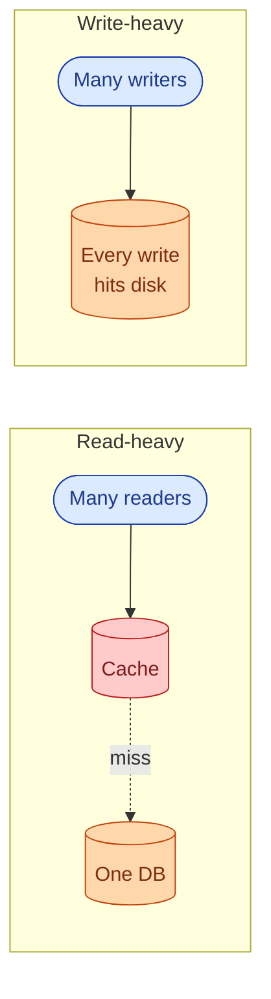
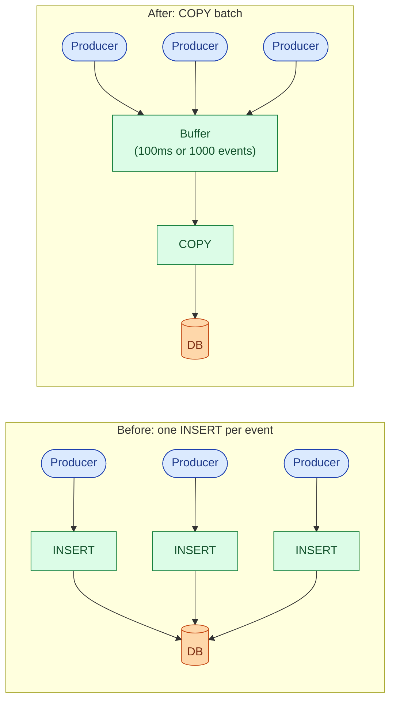
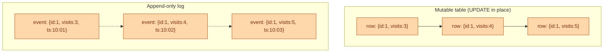
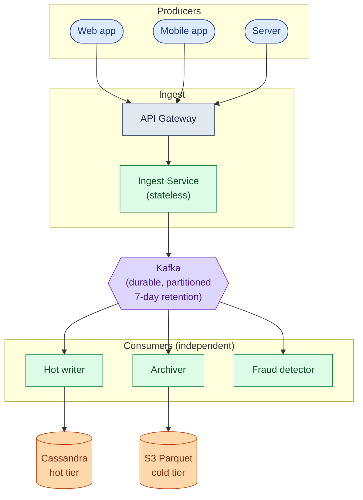
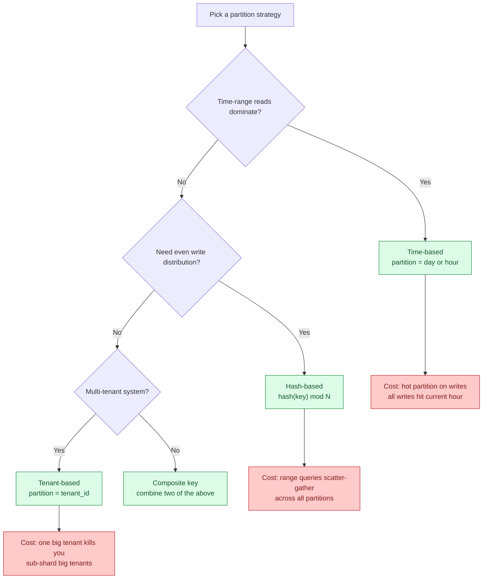
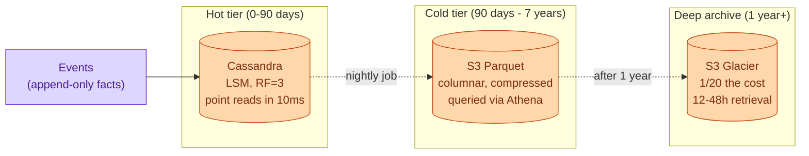
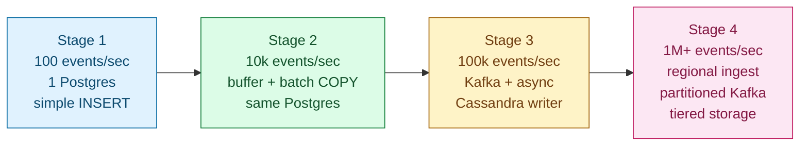
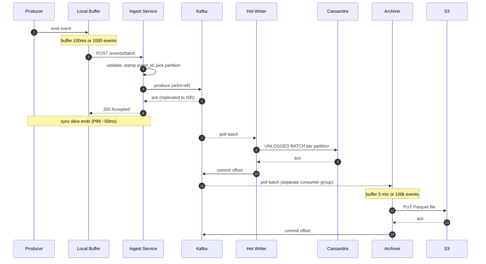
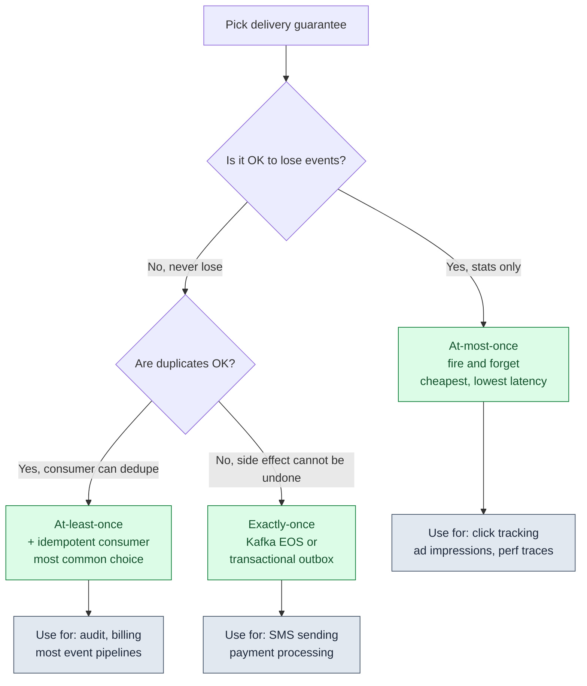

## The scene

You sit down. The interviewer skips the small talk.

> *"I have an audit logging service. Today it does 100 events per second. One Postgres. It works fine."*
>
> *"My PM just told me we are going to log every user click across the company. About 1 million events per second."*
>
> *"Walk me through what you do, in order."*

This is not a question about a finished system. It is a question about how you *grow* one. The interviewer wants to see you reach for one tool at a time. Buffering. Batching. Queues. Partitioning. Append-only logs. The moment you give up strong consistency.

The word **write-heavy** sounds like a throughput problem. It is not, exactly. The cost comes from taking in data, not from serving it. Each event is small. Queries are simple. The storage engine has one job: absorb writes faster than a normal database can.

If you say "use Kafka and Cassandra" in the first minute, you fail. The interviewer wants each tool reached for *at the moment the previous one breaks*. Not all at once.

We will walk six patterns, each with a diagram, a "when to use" note, and a "what breaks" note. Then we will stack them into a real pipeline growing from 100 events per second to 1 million.

---

## Step 1: Picture the fundamental problem

Before any patterns, picture what write-heavy actually means. Every write is unique. Every write must hit disk. Caching does not help.

A read-heavy system can serve a million reads from one cached copy. A write-heavy system cannot: every write is unique, every write must persist. The only two levers are **batch** (amortize per-write cost over many writes) and **spread** (route writes to many machines so no one machine melts).

> **Take this with you.** Every pattern in this doc is either batching, spreading, or both.

---

## Step 2: Ask the right questions

Before drawing any boxes, take five minutes with these questions. The answers decide everything.

<b>Show: 8 questions that change the design</b>

1. **How much loss is OK?** "If we drop 0.1% of events when a node crashes, is that fine?" SOX audit needs zero loss. Click tracking accepts 1%. That one answer decides whether you need `acks=all` on Kafka, a transactional outbox, or fire-and-forget UDP.

2. **How fresh must reads be?** "When we save an event, when must a query see it? 100ms? 10 seconds? 5 minutes?" Real-time forces you to index right away. 5-minute lag lets you batch into Parquet files and pay 1% of the cost.

3. **Does order matter?** Global ordering means one writer (slow). Per-key ordering means partition by key (medium). Unordered is cheapest.

4. **How do consumers read this data?** Point lookups want an LSM tree with a primary key. Scans and counts want a columnar layout like Parquet or ClickHouse.

5. **How long do we keep it?** "30 days hot, 7 years cold? Forever?" Time-based partitions are easy to drop. That fact alone often picks the partition scheme.

6. **How big is one event?** A 200-byte event is a different system from a 50KB event. Fixed schemas can use columnar formats. Random JSON forces you to store raw bytes.

7. **How bursty is the traffic?** A 5x burst is normal. Some systems see 50x bursts when a logging loop goes wild. Your queue size depends on this.

8. **What delivery promise do we need?** At-most-once (lose on failure), at-least-once (may duplicate), or exactly-once. Exactly-once is expensive and almost never worth it. At-least-once with idempotent consumers is the usual answer.

A strong candidate also asks: *"What does the consumer actually do with these events?"* If it is a dashboard, optimize for aggregation. If it is fraud detection, optimize for low latency. If it is compliance storage, optimize for cheap durable disk. The downstream decides the upstream.

---

## Step 3: How big is this thing?

The interviewer hands you numbers: 1M events per second, steady. 3x that at peak. 500 bytes per event. Keep 90 days hot, 7 years cold.

| Number | Value | Why it matters |
|--------|-------|----------------|
| Steady bandwidth | 500 MB/sec (4 Gbps) | Multiple ingest nodes needed just for NIC, not CPU |
| Peak bandwidth | 1.5 GB/sec (12 Gbps) | Several machines per region just to accept bytes |
| Daily volume | 86 billion events, 43 TB raw | Hot tier is petabytes |
| Hot storage (90 days) | ~3.9 PB | 10-30 node Cassandra cluster |
| Cold storage (7 years, 5x compression) | ~22 PB on S3 | Standard tier costs ~$500k/month |
| Queue size on 5-min stall | 300M events, 150 GB | Kafka handles easily, in-memory does not |

<b>Show: how the numbers come out</b>

**Steady bandwidth.** 1M events/sec x 500 bytes = 500 MB/sec = 4 Gbps. A 10G NIC maxes out around 80%. You need more than one ingest machine just for network throughput, not for CPU.

**Daily volume.** 1M x 86,400 seconds = 86 billion events per day. At 500 bytes each, that is 43 TB per day raw.

**Hot storage.** 43 TB x 90 = 3.9 PB. Not one machine. This is a 10-30 node Cassandra cluster with RF=3.

**Cold storage.** 43 TB x 365 x 7 / 5 = 22 PB in S3 as Parquet files.

**Queue size on 5-minute stall.** 1M events/sec x 300 seconds = 300 million events = 150 GB. Kafka with 7-day disk retention handles this easily. An in-memory queue cannot.

**The headline.** Bandwidth and storage dominate. CPU is not the bottleneck. One Postgres maxes out around 10k-50k writes/sec. At 1M/sec we are 20x-100x past that on a single shard.

---

## Step 4: The six patterns

Here are the six patterns to know. Each one answers a specific failure of the thing before it.

### Pattern 1: Batching

The simplest win. Instead of writing one event per database call, accumulate events in memory and flush them together.

**When to use.** Any time per-write overhead (network round-trip, TLS, fsync) dominates. Typical threshold: when you are above ~1k events/sec and latency starts rising.

**What breaks.** If the app crashes, events in the in-memory buffer are lost. At 100ms flush intervals and 10k events/sec, that is up to 1,000 events. For click tracking, fine. For audit, not fine. Fix: move the buffer to a durable queue (Pattern 3).

> **Take this with you.** Batching is the first 10x. It costs nothing but a timer and an array. Use it before reaching for Kafka.

---

### Pattern 2: Append-only log

Stop updating rows in place. Only ever append. This is how Kafka, Cassandra's LSM tree, and every audit log work.

**When to use.** Audit trails (you need history). Time-series data (events are immutable facts). Any data where you care about what happened, not just the current state.

**What breaks.** You cannot "undo" a row. GDPR deletions need a logical tombstone approach, not a DELETE. Storage grows unboundedly until you add retention and compaction. Reads that want current state must aggregate across all events (expensive without materialized views).

> **Take this with you.** An append-only log is the cheapest write path. Disk is sequential. Sequential writes are 10x-100x faster than random writes on any hardware.

---

### Pattern 3: Queue-based ingestion

Separate the producer's write speed from the storage layer's write speed. Producers fill a durable queue. Storage drains it at its own pace.

**When to use.** When storage cannot absorb the ingest rate in real time. When you have multiple consumers (audit archive, fraud detection, analytics) that all need the same events. When a downstream service restart should not cause event loss.

**What breaks.** End-to-end lag jumps from milliseconds to seconds. Events are not queryable until the consumer has flushed them. A stuck consumer builds lag. If lag grows past Kafka's retention window (typically 7 days), events are lost.

> **Take this with you.** The queue is the shock absorber. Producers cannot crush storage. They fill the queue. Storage drains at its own pace.

---

### Pattern 4: LSM trees vs B-trees

Postgres uses a B-tree. Cassandra uses an LSM tree. For write-heavy work, LSM wins. Here is why.

```mermaid
flowchart TB
    subgraph BTree["B-tree insert (Postgres)"]
        BW1["1. Find leaf page<br/>(random disk read)"]:::app
        BW2["2. Insert + maybe split page<br/>(random disk write)"]:::app
        BW3["3. Write WAL<br/>(sequential)"]:::app
        BW4["4. fsync on commit<br/>(slow)"]:::bad
        BW1 --> BW2 --> BW3 --> BW4
    end

    subgraph LSM["LSM insert (Cassandra, RocksDB)"]
        LW1["1. Append to commit log<br/>(sequential)"]:::app
        LW2["2. Insert into memtable<br/>(in RAM)"]:::app
        LW3["3. Flush to SSTable<br/>(big sequential write)"]:::app
        LW4["4. Compact SSTables<br/>(background, off peak)"]:::ok
        LW1 --> LW2 --> LW3 --> LW4
    end

    classDef app fill:#dcfce7,stroke:#15803d,color:#14532d
    classDef ok  fill:#dcfce7,stroke:#15803d,color:#14532d
    classDef bad fill:#fecaca,stroke:#b91c1c,color:#7f1d1d
```

**When to use LSM.** Write-heavy work, time-series, logs, telemetry. Cassandra, ScyllaDB, RocksDB, LevelDB, HBase, InfluxDB all use LSM variants. The append-only extreme is Kafka: pure sequential writes to a segment file. No compaction unless you turn it on. This is why Kafka can ingest millions of messages per second per partition on cheap hardware.

**What breaks.** Reads are slower (must check memtable plus several SSTables). Compaction causes write amplification: the same byte may be written 5-10 times over its life. Space amplification: until compaction runs, you have several copies of the same data.

**When B-tree wins.** OLTP with frequent updates to the same rows. Read-heavy workloads. Many secondary indexes. Postgres, MySQL.

> **Take this with you.** LSM turns many random writes into sequential appends. Sequential disk I/O is 10x-100x faster than random I/O. That is the whole trick.

---

### Pattern 5: Sharding and partition keys

One node cannot absorb 1M writes/sec. You spread writes across many nodes by picking a partition key. The choice decides whether load spreads evenly or whether one node gets 10x the traffic of the rest.

**When to use.** Any time one node cannot absorb the write rate, or you need to drop old data cheaply (time-based partitions).

**What breaks.** Every partition strategy has a failure mode. Time-based: all writes hit the current partition (hot write node). Hash-based: range queries scatter across all shards. Tenant-based: one big tenant kills the cluster. The fix is usually a composite key that combines two strategies.

For 1M events/sec: Kafka partition key `hash(event_type, tenant_id)`, Cassandra primary key `((tenant_id, day), event_id)`, S3 path `date=YYYY-MM-DD/event_type=X/tenant_id=Y/`.

> **Take this with you.** The partition key is the most important design decision in write-heavy storage. A wrong key gives you a hot node. A hot node negates all the scaling work.

---

### Pattern 6: Event sourcing and tiered storage

Events are facts. Facts do not change. Model the system as an append-only stream of events. Derive current state by replaying them.

**When to use.** Audit trails (rebuild history at any point in time). Long retention requirements (SOX 7 years, HIPAA). Any system where "what happened" matters as much as "what is current state."

**What breaks.** Replaying millions of events to rebuild state is slow without snapshotting. GDPR deletions are hard ("right to be forgotten" conflicts with append-only). Storage grows without tiering. Hot queries on 3-year-old data are expensive if everything stays in one tier.

Tiered storage is the standard fix: keep recent events in a fast, queryable store (Cassandra) with a TTL. Nightly archiver moves old partitions to S3 Parquet. Deep archive for anything over a year.

> **Take this with you.** Tiered storage matches the cost of storage to the frequency of access. Hot queries pay hot prices. Cold queries pay cold prices.

---

## Step 5: The write pipeline grows in 4 stages

Every write path starts simple and grows in stages. Each stage handles roughly 10x the throughput of the one before.

<b>Show: what breaks at each stage and why</b>

**Stage 1 to 2 (buffer + batch).** Postgres CPU climbs to 80%. WAL fsync is the bottleneck: every INSERT must flush to disk before returning. Adding a 100ms in-memory buffer and switching to `COPY` gives 10x throughput on the same hardware. The cost: up to 1000 events lost if the app crashes.

**Stage 2 to 3 (durable queue).** Single Postgres hits I/O ceiling. Vertical scaling is exhausted. The buffer-on-crash problem also grows (100k/sec x 100ms = 10k events lost on crash, which is now unacceptable). Adding Kafka decouples producers from storage. Cassandra's LSM tree handles the write rate that Postgres cannot. Multiple independent consumers read the same topic.

**Stage 3 to 4 (partitioning + stream processing).** Single-region Kafka hits NIC and disk limits. One big tenant saturates one Kafka partition and one Cassandra node, hurting others. Cold-tier costs explode if you keep everything in Cassandra. Solution: regional ingest tiers, partitioned topics, sub-sharding for hot tenants, Flink for derived data, S3 Parquet for cold storage.

**The discipline.** Name the limit of stage N before reaching for stage N+1. Junior engineers jump to stage 4. They build the cathedral before they have any worshippers.

---

## Step 6: The full architecture at 1M events/sec

Each box, in one line:

| Box | What it does |
|-----|--------------|
| **API Gateway** | Terminates TLS, applies per-tenant rate limits, returns 429 when Kafka is unhealthy (back-pressure). |
| **Ingest Service** | Stateless. Validates schema, stamps event_id and server timestamp, routes to Kafka partition. Returns 202. |
| **Kafka** | The shock absorber. Producers fill it. Consumers drain it independently. Buffers 5-minute stalls without affecting producers. |
| **Hot writer** | Reads Kafka, writes UNLOGGED BATCHes per Cassandra partition. Commits offset after storage ack. |
| **Archiver** | Reads Kafka (separate consumer group). Buffers 5 minutes or 100k events. Writes one Parquet file to S3. |
| **Flink** | Derived data: per-minute rollups, anomaly scores, fraud alerts. Reads same Kafka topic as others. |
| **Cassandra hot tier** | Recent events. Query by `(tenant_id, day)` range. 90-day TTL, auto-deleted by compaction. |
| **S3 Parquet cold tier** | 7-year archive. Partitioned by date/event_type/tenant_id. Queried by Athena. |
| **Metrics** | Throughput, consumer lag, batch size, partition skew. Without this, you learn about failures from customer complaints. |

> **Take this with you.** Three consumer groups read the same Kafka topic independently. The archiver can fall behind without affecting Cassandra. Flink can crash without affecting the archiver. Kafka is what makes this possible.

---

## Step 7: One event, all the way through

Three details worth pointing at:

1. The 202 goes back to the producer after Kafka ack, not after Cassandra ack. If Kafka has it, the event is safe. Cassandra is just the queryable view.
2. Hot writer commits the Kafka offset *after* Cassandra ack. At-least-once: crash between write and commit means a replay on restart. Cassandra primary-key dedup makes the replay a no-op.
3. End-to-end lag to Cassandra is 1-3 seconds, P99 ~10 seconds. Lag to S3 is up to 5-6 minutes (archiver's flush window dominates).

---

## Step 8: Delivery guarantees

At small scale, every event is in one Postgres. One ACID transaction. Either on disk or not. Easy.

At 1M events/sec, that promise is gone. Pick one of three delivery models.

<b>Show: when each guarantee is right</b>

**At-most-once.** Producer sends, returns immediately, does not retry. If the broker is down or a packet drops, the event is gone forever. Zero retry cost. No idempotency machinery. Use when the data is statistical: page views, click tracking, performance traces, ad impressions. Losing 0.1% does not change the answer.

**At-least-once.** Producer retries on any failure to ack. Network blip? Producer did not see the ack but the broker may have written it. Producer retries. Broker writes a second copy. Event appears twice. Consumer commits offsets after processing.

How to handle duplicates: use `event_id` as the primary key in storage. Second write is a no-op via Cassandra UPSERT or `INSERT ON CONFLICT DO NOTHING` in Postgres. This is what 80% of production pipelines do.

**Exactly-once.** Kafka EOS (Exactly-Once Semantics) via transactional producers and read-committed consumers. Throughput drops 20-40% vs at-least-once. Latency goes up. Use when the downstream effect cannot be deduped (SMS, payment processing).

The honest take: most "we need exactly-once" requirements are actually "we need at-least-once with idempotent processing." At-least-once is 10x cheaper. Exactly-once is only for side effects you literally cannot deduplicate.

**What we pick for 1M events/sec audit.** At-least-once. Audit needs durability, so at-most-once is out. Storage is Cassandra keyed by `event_id`, so idempotency is free. Exactly-once via Kafka EOS would cost ~30% throughput and give no additional benefit.

> **Take this with you.** At-least-once with idempotent storage gives you the same correctness as exactly-once at a tenth of the cost. Most systems should pick this.

---

## Follow-up questions

Try answering each in 2 to 4 sentences before reading the solution.

1. **Back-pressure.** Producers are sending 2x the rate Kafka can absorb. Brokers are healthy but disk is at 80%. What does the ingest service do? What does the producer SDK do?

2. **Hot tenant.** One tenant's mobile app has a bug and is sending 200k events/sec when the average is 100. They are saturating one Kafka partition. How do you find them? What do you do in the next 5 minutes vs the next 5 days?

3. **Clock skew.** Two producers disagree about "now" by 3 minutes. Your downstream reports show events arriving "in the future." How do you fix it without requiring nanosecond-precision NTP everywhere?

4. **Duplicate events.** A producer retried after a broker timeout that actually succeeded. Cassandra now has two copies of every event in that batch. Walk through detection and dedup.

5. **Consumer fell behind.** A Cassandra writer consumer has been stuck for 30 minutes. Kafka has buffered 1.8 billion events for that consumer group. What happens when you fix the bug and restart? How do you keep it from melting storage?

6. **Schema evolution.** A team added a new field. Old producers send 5 fields, new producers send 6. Cassandra has a fixed table schema. How do you handle migration without dropping events or breaking old consumers?

7. **Recent-event reads.** A consumer wants "all events for user U in the last 30 seconds." Your storage path is Kafka, then batched 5 min into Cassandra. The event might still be in Kafka. How do you make the read see both?

8. **A region goes down.** US-East Kafka cluster is offline. Producers there cannot publish. What is your DR plan? How much data could be lost?

9. **Cold-tier query cost.** A user wants "every event for tenant X for the past 3 years." Naive Athena query scans 3 PB of Parquet. How do you make this both fast and cheap?

10. **Exactly-once for a side effect.** One downstream consumer sends an SMS for every fraud alert. SMS is not idempotent (user gets two texts if you send twice). How do you guarantee exactly one SMS without paying Kafka EOS cost on the whole pipeline?

---

## Related problems

- **[Approval Management (011)](../011-approval-management/question.md).** The audit log in that design is exactly a write-heavy append-only system. The tiered storage and batching patterns here apply directly.
- **[News Feed (002)](../002-news-feed/question.md).** Timeline write fan-out is the classic write-heavy problem at consumer scale: each post produces N writes (one per follower's timeline).
- **[Todo List Sharing (013)](../013-todo-list-sharing/question.md).** The change-log sync pipeline for collaborative edits is the same shape at smaller scale: every edit is a small append-only event partitioned by list_id.
- **[Read-Heavy System Patterns (017)](../017-read-heavy-patterns/question.md).** The mirror image of this problem. Read-heavy is cached. Write-heavy is batched and partitioned.
