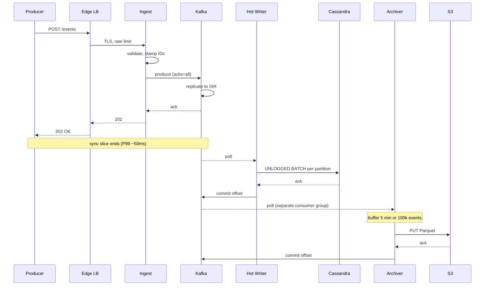

## Solution: Write-Heavy System Patterns

### The short version

A write-heavy system is one where the cost comes from taking in data, not from serving it. Each event is small. Queries are simple. The database's job is to absorb writes faster than a normal database can.

The interesting work is at the seams. When do you add a buffer? When do you add a queue? When do you give up linearizability? When do you stop adding pieces because what you have is already enough?

The toolkit, in the order you reach for it as scale grows:

1. **One Postgres** at about 1k writes/sec.
2. **In-memory buffer + batched commits** at 10k writes/sec.
3. **Durable queue + async LSM writer** at 100k writes/sec.
4. **Partitioned queue + stream processing + tiered storage** at 1M writes/sec and beyond.

Each step trades latency, consistency, or operational complexity for throughput. The senior move is to name the limit of stage N *before* reaching for stage N+1. Not to pre-emptively build stage 4.

Three big decisions decide the final shape:

- **Partition key.** Time, hash, or tenant. Usually a composite like `(event_type, tenant_id, day)`.
- **Append-only storage.** LSM at the hot tier. Parquet on object storage at the cold tier.
- **Delivery guarantee.** At-least-once with idempotent storage is right for 95% of cases. At-most-once is for stats. Exactly-once is only for non-idempotent side effects.

---

### 1. The clarifying questions, in one paragraph

The four that change the design are covered in `question.md`. **Durability** decides whether you need `acks=all` and a transactional outbox, or whether UDP fire-and-forget is fine. **Acceptable lag** decides whether you write synchronously or batch into Parquet at 1% of the cost. **Ordering** picks the partition strategy. **Read pattern** picks the storage engine.

If you walked in without asking durability and lag, you have no basis to choose between Kafka EOS (expensive, exactly-once) and fire-and-forget UDP (cheap, lossy). They are 1000x apart in cost.

---

### 2. The math, in plain numbers

| Number | Value | Why it matters |
|--------|-------|----------------|
| Sustained bandwidth | 500 MB/sec (4 Gbps) | Multiple ingest nodes per region needed for NIC, not CPU |
| Peak bandwidth | 1.5 GB/sec (12 Gbps) | Several machines per region just to accept bytes |
| Daily volume | 86 billion events, 43 TB raw | Hot tier is petabytes |
| Hot storage (90 days) | 3.9 PB | 10-30 node Cassandra cluster |
| Cold storage (7 years, 5x compression) | 22 PB on S3 | ~$500k/month standard, ~$25k/month Glacier Deep |
| Queue size on 5-min stall | 300M events, 150 GB | Kafka handles easily, in-memory does not |

The headline takeaway: **bottleneck is bandwidth and storage layout, not CPU.** A single Postgres maxes out around 10k writes/sec. We are 100x past that on a single shard. We need to spread writes across nodes and batch them so per-write overhead amortizes.

> Why "events per day" is the wrong KPI: it sounds big (86 billion!) but byte count is what kills servers. A pipeline that does 86 billion events of 50 bytes each is a completely different system from one that does 86 billion events of 5 KB each. Always do bytes too.

---

### 3. The API

Reads are out of scope here. Focus on ingest.

**Single-event ingest** for low-volume producers:

```
POST /api/v1/events
Content-Type: application/json
X-Tenant-Id: tenant_42
Authorization: Bearer <token>
Idempotency-Key: <uuid>           # optional; if set, server dedupes on this key

{
  "event_type": "user.login",
  "user_id": "u_8201",
  "timestamp": "2026-05-24T10:14:02.331Z",   # producer clock
  "attributes": { ... }                       # arbitrary JSON
}
```

| Status | Meaning |
|--------|---------|
| 202 Accepted | Event in durable queue, queryable within 10s |
| 400 Bad Request | Schema invalid |
| 401 Unauthorized | Missing or bad token |
| 413 Payload Too Large | Single event > 1 MB |
| 429 Too Many Requests | Rate limited (per tenant), or back-pressure |
| 503 Service Unavailable | Ingest degraded, producer should retry |

**Batched ingest** for everyone else:

```
POST /api/v1/events/batch
Content-Encoding: gzip
Content-Type: application/json

{
  "events": [
    { ...event 1... },
    { ...event 2... },
    ...up to 1000 events or 1 MB compressed...
  ]
}
```

| Status | Meaning |
|--------|---------|
| 202 Accepted | Whole batch durably queued |
| 207 Multi-Status | Partial success, per-event errors in response |
| 429 / 503 | Same as single-event |

**A few load-bearing choices:**

- **202, not 200.** The event is not durably stored at the time of the response. It is durably queued. 200 implies "we have it." 202 communicates "we have accepted responsibility, you can stop retrying."
- **Idempotency-Key is optional.** Most producers do not need it (event_id dedup at storage handles most dups). For producers that cannot retry safely (one-shot lambdas), an Idempotency-Key gives end-to-end dedup.
- **The batch endpoint is recommended.** Per-event HTTP at 1M/sec is 1M TLS handshakes/sec (impossible). Batches of 1000 cut that to 1k req/sec. Same bytes, 1000x cheaper.
- **Server stamps a server timestamp** in addition to producer timestamp. Both are kept. Producer time is "when did the event happen." Server time is "when did we accept it." Clock-skew analysis uses the gap.
- **Rate limits are visible.** 429 responses include `Retry-After` and `X-RateLimit-Remaining` so well-behaved producers throttle themselves.

---

### 4. The data model

**The canonical event:**

```json
{
  "event_id": "01H8K2X...",            // ULID or snowflake, server-generated if missing
  "tenant_id": "tenant_42",
  "event_type": "user.login",
  "user_id": "u_8201",
  "producer_ts": "2026-05-24T10:14:02.331Z",
  "server_ts":   "2026-05-24T10:14:02.412Z",
  "attributes": { ... },
  "schema_version": 3
}
```

**Hot tier in Cassandra:**

```cql
CREATE TABLE events_by_tenant_day (
    tenant_id     text,
    day           date,                    -- derived from server_ts
    event_id      timeuuid,                 -- sortable, unique
    event_type    text,
    user_id       text,
    producer_ts   timestamp,
    server_ts     timestamp,
    attributes    text,                     -- JSON serialized
    schema_version int,
    PRIMARY KEY ((tenant_id, day), event_id)
) WITH CLUSTERING ORDER BY (event_id DESC)
  AND default_time_to_live = 7776000;      -- 90 days
```

Three small things doing real work:

**`PRIMARY KEY ((tenant_id, day), event_id)`.** The partition key `(tenant_id, day)` bounds partition size. Even the biggest tenant only writes one day at a time into one partition. The clustering column `event_id` keeps rows sorted inside the partition, so "latest events" is a prefix scan. The same key also gives natural dedup: same `event_id` inserted twice = same row.

**`default_time_to_live = 7776000`.** 90 days. Cassandra auto-deletes old rows during compaction. No nightly delete job needed. No tombstone storm if you keep deletes minimal otherwise.

**Why not a foreign key from the events table to anything?** Audit-shaped data is reference-free. The event captures who/what/when. If the user account is later deleted, the audit must still survive. Foreign keys would cascade-delete the audit, which is exactly what you do not want.

**A second table for the per-user access pattern:**

```cql
CREATE TABLE events_by_user_day (
    user_id       text,
    day           date,
    event_id      timeuuid,
    event_type    text,
    tenant_id     text,
    attributes    text,
    PRIMARY KEY ((user_id, day), event_id)
);
```

Same data, different partition key. Supports "events for user U" lookups. Written by the stream processor (Flink) reading the Kafka topic and writing both tables. Cost: 2x write amplification. Benefit: O(1) lookups for both access patterns.

**Cold tier on S3** sits at path `s3://events-cold/date=YYYY-MM-DD/event_type=X/tenant_id=Y/file_N.parquet`. Columnar layout inside each Parquet file. Column-pruned reads (only read `user_id` and `event_type` from a 50-column event) are free. Partition pruning at the file-prefix level means Athena/Presto skip whole directories that do not match the query.

> Why Cassandra and not Postgres at the hot tier? Postgres B-tree does read-modify-write on every insert: find the page, update it, write it back. Cassandra's LSM tree just appends to a log. Append is the fastest thing a disk can do. The cost is paid later, during background compaction, when the system is less busy.

---

### 5. The write pipeline, code level

Four stages. Each with a clear contract with the next.

**Stage 1: Ingest service** (the sync part of the producer's request).

```python
def handle_batch(request):
    tenant = authenticate(request)
    rate_limiter.check(tenant)                       # 429 if over quota
    queue_health.check()                              # 503 if Kafka is unhealthy

    events = parse_and_validate(request.body)         # 400 on schema errors
    for e in events:
        e.event_id = e.event_id or new_ulid()
        e.server_ts = now()
        e.tenant_id = tenant.id

    # Group by partition key for fewer Kafka send calls
    by_partition = group_by(events, lambda e: partition_for(e))

    futures = []
    for partition, group in by_partition.items():
        futures.append(kafka_producer.send_async(
            topic="events",
            partition=partition,
            value=group,
            acks="all",                               # wait for all replicas
            timeout_ms=5000
        ))

    wait_all(futures, timeout_ms=10000)               # wait for ack
    return 202_accepted(batch_id=request.id)
```

The HTTP response is sent only after Kafka confirms durable replication. If the producer sees 202, the event is on disk on multiple brokers. There is no DB write at ingest. Kafka is the only durable hop. P99 ingest target: 50 ms.

**Stage 2: Kafka** (the durable queue).

Start with 200 partitions. Each handles ~5k events/sec comfortably. RF=3. `min.insync.replicas=2` with producer `acks=all` gives "no loss as long as 2 brokers survive." Retention 7 days, long enough to replay a full week if consumers fall behind. Compression zstd, which trades a bit of CPU for ~60% smaller on-disk footprint.

Per-partition ordering is preserved. Cross-partition ordering is not. That is the trade we made when picking the partition strategy.

**Stage 3: Hot-tier writer** (Cassandra consumer).

```python
def consume_loop(consumer, cass_session):
    while True:
        records = consumer.poll(timeout_ms=100, max_records=1000)
        if not records:
            continue

        # Build a Cassandra UNLOGGED BATCH per partition
        batches_by_partition = defaultdict(list)
        for r in records:
            event = json.loads(r.value)
            pk = (event["tenant_id"], date(event["server_ts"]))
            batches_by_partition[pk].append(event)

        for pk, events in batches_by_partition.items():
            batch = BatchStatement(batch_type=BatchType.UNLOGGED)
            for e in events:
                batch.add(insert_stmt, params_for(e))
            cass_session.execute(batch)               # one network roundtrip

        consumer.commit()                             # only after Cassandra ack
```

The UNLOGGED BATCH per Cassandra partition is the throughput trick. Cassandra's UNLOGGED batches that hit a single partition are a single coordinated write, 10-100x faster than single-event INSERTs.

Commit Kafka offset *after* Cassandra ack. At-least-once: if the consumer crashes between Cassandra write and offset commit, it reprocesses on restart. Primary-key dedup in Cassandra catches the duplicates.

Bound the batch size: do not let a single Cassandra BATCH exceed ~5 KB. Limit to ~50 events per batch as a safety bound.

**Stage 4: Cold-tier archiver** (S3 Parquet).

```python
def archive_loop(consumer):
    buffer = []
    last_flush = now()
    while True:
        records = consumer.poll(timeout_ms=1000, max_records=10000)
        buffer.extend(records)

        if len(buffer) >= 100_000 or now() - last_flush > 300:    # 100k or 5 min
            flush(buffer)
            buffer = []
            last_flush = now()

def flush(records):
    # Group by partition path: date / event_type / tenant_id
    grouped = group_by(records, lambda r: parquet_path(r))
    for path, group in grouped.items():
        write_parquet(s3_client, path, group)
    consumer.commit()
```

Flush every 5 minutes or every 100k events, whichever first. Small batches waste S3 PUT operations ($0.005 per 1000). 5-min batches keep cost manageable. Parquet over S3 is columnar, compressed, Athena-queryable, cheap. Group by partition path so each S3 key is one Parquet file with one `(date, event_type, tenant_id)`. Lets queries prune entire prefixes.

---

### 6. The architecture, drawn out

The whole picture as ASCII boxes:

```
   Client                                   Hot tier              Cold tier
   +------+                              +-----------+         +-----------+
   |Phone | --HTTPS-->                   |           |         |           |
   |Web   |              +---------+     |           |         |           |
   |Server| ---batch---> |  Edge   |     |           |         |           |
   +------+              |  LB +   |     |           |         |           |
                         |  WAF    |     |           |         |           |
                         +----+----+     |           |         |           |
                              |          |           |         |           |
                              v          |           |         |           |
                         +---------+     |           |         |           |
                         | Ingest  |     |           |         |           |
                         | Service |     |           |         |           |
                         | (N pods)|     |           |         |           |
                         +----+----+     |           |         |           |
                              |          |           |         |           |
                              v          |           |         |           |
                         +---------+     |           |         |           |
                         |  Kafka  |     |           |         |           |
                         | cluster |     |           |         |           |
                         | 200 par |     |           |         |           |
                         | RF=3    |     |           |         |           |
                         | 7d ret  |     |           |         |           |
                         +----+----+     |           |         |           |
                              |          |           |         |           |
              +---------------+--------+--+-------+  |           |         |
              |                        |          |  |           |         |
              v                        v          v  |           |         |
         +---------+              +---------+ +---------+         |         |
         | Cassan- | <-- writes --| Consumer| | Flink   |         |         |
         | dra hot |              | Pool    | | rollups |         |         |
         | tier    |              | (writes | | alerts  |         |         |
         | RF=3    |              | UNLOG-  | |         |         |         |
         | 90d TTL |              | GED     | +---------+         |         |
         +---------+              | BATCH)  |                     |         |
                                  +---------+                     |         |
                                                                  |         |
                                  +---------+                     |         |
                                  |Archiver |   5-min batches     |         |
                                  |(buffers |   100k events       |         |
                                  | 5 min)  |   per Parquet       |         |
                                  +----+----+                     |         |
                                       |                          |         |
                                       v                          |         |
                                  +---------+                     |         |
                                  |   S3    | <------------------ |         |
                                  | Parquet |    7-year archive   |         |
                                  | date/   |                     |         |
                                  | type/   |                     |         |
                                  | tenant/ |                     |         |
                                  +----+----+                     |         |
                                       |                          |         |
                                       v                          |         |
                                  +---------+                     |         |
                                  | Athena/ |   ad-hoc queries    |         |
                                  | Presto/ |   over cold data    |         |
                                  | BigQuery|                     |         |
                                  +---------+                     |         |
```

A few things worth pointing out:

- **Ingest pods are stateless.** Their only durability is Kafka. If a pod dies mid-request, the producer's connection drops, the producer retries, and either the second attempt lands or the idempotency key (if present) deduplicates the first.
- **Three separate consumer groups read the same Kafka topic.** Independent: the archiver can fall behind without affecting Cassandra writes; Flink can crash without affecting the archiver. Each maintains its own Kafka offsets.
- **Cassandra and S3 are not redundant.** They serve different access patterns. Cassandra answers "give me events for tenant X on day D" in 30ms. S3 answers "give me everything for tenant X over 2 years" in minutes. Picking one or the other gives you the wrong cost/performance curve for at least one query.
- **Observability is on every box.** Without it, the first thing you learn about a stuck consumer is a customer complaint two hours later.

**Concrete tech choices:**

- **Edge LB:** AWS ALB or Cloudflare + Envoy. Redis-backed token bucket for per-tenant rate limits.
- **Ingest pods:** Go or Rust for low GC overhead.
- **Queue:** Kafka via Confluent, AWS MSK, or Aiven. Alternatives: Kinesis (simpler ops), Pulsar (better multi-tenant), Redpanda (Kafka-compatible, lower latency).
- **Hot store:** Cassandra or ScyllaDB (better per-node performance), or DynamoDB (fully managed).
- **Archiver:** Kafka consumer writing Parquet, often a Flink job.
- **Stream processor:** Flink for stateful work, KSQL or Spark Structured Streaming for SQL-flavored, Materialize for incremental views.
- **Cold tier:** S3 + Athena. Glacier Deep Archive for >1 year.

---

### 7. An event's journey, end to end



**End-to-end lag:**
- Producer to Cassandra-queryable: 1-3 seconds, P99 ~10 seconds.
- Producer to S3 Parquet: up to 5-6 minutes (archiver flush window dominates).

**Sync slice is small.** Producer to Kafka ack, P99 50 ms. Everything after Kafka happens at its own pace.

**Read latencies (target):**
- Point read by event_id: P99 ~10ms.
- Per-user range scan: P99 ~30ms.
- Analytics over 1 year via Athena: seconds to minutes depending on scope.

**A read that crosses tiers** ("last 30 seconds for user U") might still be in Kafka. Three options:

1. Accept the lag and tell users "data has ~5s lag" (cheapest, fits most audit workloads).
2. Dual-write to a real-time store (Redis hash per user) in parallel for sub-second visibility (pay 2x writes).
3. Query Kafka directly via kSQL (operationally awkward, Kafka is not a key-value store).

Pick based on the user-facing SLA.

---

### 8. The scaling journey: 100 events/sec to 1M

This is the section the interviewer cares about most. At every stage, name what just broke and what fixes it. Build nothing preemptively.

#### Stage 1: 100 events/sec

A single Postgres (db.t3.medium, 4 GB RAM). One Go or Python app instance with a `/events` endpoint doing `INSERT INTO events_table (...) VALUES (...)`. One table, indexed by `event_id` and `(user_id, created_at)`. No queue, no cache, no replicas. Cost: ~$50/month for the DB, ~$30/month for the app.

**Why this is enough:** 100 events/sec is 8.6M events/day. Postgres handles this with room to spare, about 5ms per insert, using maybe 50% of one core. One table at 30 GB/year fits on disk easily. Reads are easy because writes are easy.

> The lesson: at 100 events/sec, the simplest possible system *is* the right system. Anything else is a portfolio piece, not engineering.

#### Stage 2: 10k events/sec

**What breaks:** Postgres CPU is at 80%. WAL fsync is the bottleneck (each commit fsyncs to disk). Inserts land in random pages, so the buffer pool churns. The app does one network round-trip per event. Even at 1ms each, 10k of them is 10 cores of round-trip waiting.

**Fixes:**

- Add in-app buffering. Accumulate events in memory, flush every 100ms or every 1000 events.
- The flush is a Postgres `COPY` instead of `INSERT`. 10-20x faster.
- Partition the table by day (`CREATE TABLE events_2026_05_24 PARTITION OF events_master FOR VALUES FROM ('2026-05-24') TO ('2026-05-25')`). Old partitions drop cheaply. Newer indexes stay small.
- Add a second app instance behind a load balancer.
- Add a read replica for the analytics queries.

**What you accept:** buffered events lost on app crash, worst case 100ms of events (~1000 events at 10k/sec). Tolerable for most use cases. Document it. End-to-end lag goes from immediate to ~100ms.

**What you do NOT build:** no Kafka, no Cassandra, no multi-region. The buffer + batch trick gets you to 10k/sec on one Postgres. Cost: ~$500/month.

> This is where most teams overengineer. They jump to Kafka because "we'll need it eventually." That is true at stage 3, not stage 2. The buffer-and-batch pattern buys 10x runway with minimal complexity.

#### Stage 3: 100k events/sec

**What breaks:**

- Postgres cannot keep up even with batching. Single instance at IO ceiling. Vertical scaling has hit its limit (largest RDS Postgres does maybe 30k writes/sec).
- The app process holding the buffer is a single point of failure. Tolerable at 10k/sec with 1000 events in flight. Scary at 100k/sec because a restart loses 100k events of buffer.
- Read replica lags by 30 seconds because the primary is saturated.
- A bad consumer query takes down the primary, which is also serving writes.

**Fixes:**

- **Kafka in front of storage.** Events go to Kafka first. Storage writes are async. Producers get 202 immediately. Kafka buffers if storage falls behind.
- **Switch storage to Cassandra.** LSM tree is the right shape: sequential writes, horizontal scaling by adding nodes, RF=3 across three AZs.
- **A separate Kafka consumer process** reads events and writes to Cassandra in batched UNLOGGED BATCH per partition. Stateless. Run N of them for redundancy. Crashes do not lose data because Kafka holds the events.
- **First pass at partitioning:** Kafka topic with 50 partitions, hash by `(event_type, tenant_id)`. Cassandra primary key `((tenant_id, day), event_id)`.
- **First pass at observability:** Kafka consumer lag, partition rate, batch size, Cassandra write latency. You will use these constantly.

**What you accept:**

- End-to-end lag jumped from 100ms to ~5 seconds.
- Strong consistency is gone (use a unique event_id like ULID to avoid conflicts).
- One Kafka consumer crash = a few seconds of replay, handled by idempotent storage.

**Cost:** ~$10-20k/month for Kafka cluster + Cassandra (5-10 nodes), self-hosted or managed.

> Stage 3 is the inflection point. You introduced asynchrony, accepted eventual consistency, and now have an actual distributed system. Operational complexity went 10x. Worth it because the alternative is sharded Postgres, which is its own nightmare.

#### Stage 4: 1M events/sec

**What breaks:**

- Single-region Kafka hits NIC and disk limits.
- Cross-region producers add latency.
- Cassandra cluster at 30 nodes: one node failure no longer self-heals fast enough; repairs take days.
- A hot tenant (one team's mobile app is misbehaving) saturates one Kafka partition and one Cassandra node, hurting other tenants.
- Cold-tier costs explode if you keep everything in Cassandra.
- Compliance asks for 7-year retention. Cassandra is the wrong tier at petabyte scale.

**Fixes:**

- **Regional ingest + regional Kafka clusters.** Each region (us-east, eu-west, ap-south) has its own ingest tier and Kafka. Events written to producer's home region. Cross-region replication for events that need to be globally visible (a separate "global" topic populated by MirrorMaker).
- **Shard Kafka topics** by `event_type + tenant_id`. Bigger tenants get their own topics or high-partition-count topics. Long-tail tenants share a multi-tenant topic.
- **Sub-shard hot partitions** with a random suffix when a partition exceeds a threshold: the ingest tier appends `random(0..15)` to the partition key for that tenant. Trades per-key ordering for load distribution.
- **Bring in Flink for stream processing.** Enrichment (geoip, user attribute join), routing to multiple sinks (Cassandra hot, S3 cold, ClickHouse rollups, Kafka fraud alerts).
- **Tiered storage:** hot in Cassandra (90-day TTL), cold in S3 Parquet (7-year retention). Dedicated archiver consumer writing 5-min Parquet batches. Belt and suspenders: nightly job lifts Cassandra partitions older than 90 days to Parquet if not already there.
- **Per-tenant rate limits at ingest.** Hard cap. 429 above the limit.

**What you accept:**

- Cross-region replication lag is seconds to minutes.
- Cold-tier queries are slow (Athena runs in minutes; OK for compliance, not interactive).
- Significant operational complexity. You need a Kafka team, a Cassandra team, a Flink team, or a small platform team that knows all of these.

**Cost:** roughly $200k-500k/month all-in, depending on managed vs self-hosted and retention choices.

#### What you would do at 10M events/sec

Honestly, at that point you are at the scale of a major observability vendor (Datadog, Splunk, Honeycomb). You stop building in-house and either:

1. Move to a fully managed platform (Kinesis Data Firehose + Iceberg on S3, BigQuery Storage Write API).
2. Build very specialized infrastructure (custom Kafka forks, custom storage engines like Honeycomb's Retriever).
3. Split the workload by purpose: one pipeline for security events (strict durability, long retention), one for product analytics (loose durability, short retention, aggregated only), one for performance traces (sampled, very short retention).

> The lesson of the 4 stages: each stage solved a specific pain. None were preemptive. The most common interview failure is to build stage-4 architecture for a stage-1 problem. The second most common is to refuse to evolve past stage 2 because "Postgres handles everything."

---

### 9. Reliability

**Queue overflow.** Kafka is at 90% disk. Producers keep sending.

- **Back-pressure at ingest.** When Kafka send latency P99 exceeds 1 second or any broker is unhealthy, ingest returns 429. Producers back off.
- **Shed less-important traffic.** Premium tenants get reserved Kafka capacity. Free-tier tenants get throttled first.
- **Emergency disk add.** Kafka brokers can have storage expanded. Painful but possible. 30-60 min fix.

**Downstream slow.** Cassandra writer lag is at 5 minutes and climbing.

- Scale Cassandra writer consumers horizontally (adding consumers spreads partitions across them).
- If Cassandra is at IO ceiling, you need more Cassandra nodes (hours for redistribution).
- Temporarily pause the archiver (it can catch up later from Kafka), freeing Kafka broker IO for the hot writer.
- Worst case: drop or sample (write 1 in 10) until backlog clears. Audit-grade systems cannot do this; product-telemetry systems can.

**Partial batch loss.** A Kafka consumer crashes after writing 800 of 1000 events to Cassandra but before committing the offset. On restart, it reprocesses the entire batch. Idempotent storage saves you: the 800 already-written events are no-op on re-insert (Cassandra UPSERT with same primary key). The 200 not-yet-written events get written for the first time. No data loss.

**Ingest pod crash.** Pod crashes between accepting a request and sending to Kafka. Producer's HTTP connection drops with no response. Producer must retry. With idempotency key, second submission is deduped; without, you get a duplicate. Mitigation: ingest pod sends to Kafka before returning 202.

**Region failure.** Producers in failed region cannot publish. Their SDK should fail over to the next-nearest region. Data loss window: events buffered in the producer's local SDK that were never sent. Typically <1 second.

**Cassandra node failure.** RF=3 means surviving 1 node failure with no data loss. Surviving 2 with degraded consistency. Failed node is auto-replaced. Data rebuilds from replicas over hours to days.

**Total Kafka cluster loss.** Catastrophic. Producers cannot send. Data in flight is lost. Mitigations: multi-region Kafka (different cluster per region, failover automatic); MirrorMaker for cross-region replication; producer-side buffering (producers buffer locally to a disk-backed queue when broker is unreachable, replay when broker recovers).

---

### 10. Observability

| Metric | Why it matters | Alert threshold |
|--------|----------------|------------------|
| `ingest.requests.rate` | Top-line throughput | Drop >50% in 5 min |
| `ingest.latency.p99` | Producer-facing SLO | >100 ms for 5 min |
| `ingest.4xx.rate` | Producer misbehavior | >1% sustained |
| `ingest.5xx.rate` | Our problem | >0.1% sustained |
| `kafka.producer.ack.latency.p99` | Kafka health | >1s for 5 min |
| `kafka.partition.rate.max / median` | Partition skew (hot partition) | >10x ratio |
| `kafka.consumer.lag` per group | Are consumers keeping up? | >30s lag for any group |
| `kafka.broker.disk.used.pct` | Storage capacity | >80% |
| `cassandra.write.latency.p99` | Storage health | >50 ms |
| `cassandra.batch.size.p99` | Are we batching effectively? | <10 events = too small |
| `cassandra.partition.size.max` | Hot partition at storage layer | >100 MB |
| `archiver.lag` | Cold tier behind real-time | >10 min |
| `archiver.parquet_file.size.p50` | Small file problem? | <10 MB = too many small files |
| `flink.checkpoint.duration.p99` | Stream processing health | >30 sec |
| `dedup.collision.rate` | Are we seeing duplicate event_ids? | Any non-zero is interesting |

**Four golden signals** for the pipeline:

1. Ingest throughput (events/sec at the API).
2. End-to-end lag (event ingest timestamp to Cassandra-readable timestamp).
3. Consumer lag per Kafka consumer group.
4. Error rates at each stage.

**Distributed tracing:** every event gets a trace ID stamped at ingest. The trace follows it through Kafka, consumer, Cassandra. Lets you debug "why did this specific event take 2 minutes to land." Sample at 0.1%; the rest you have metrics for.

**Page on:** ingest 5xx > 0.5%, ingest p99 > 200 ms for 10 min, consumer lag > 5 min for any group, Kafka broker disk > 90%.

**Ticket on:** partition skew > 10x for 1 hour, Parquet file size < 10 MB sustained, dedup collisions > 100/hour.

---

### 11. Gotchas the senior interviewer is listening for

Some of these only come out when the interviewer asks "what happens if...". The senior candidate brings them up unprompted.

**Back-pressure done wrong.** Without back-pressure at the ingest tier, a downstream slowness becomes a cascading failure. Producers keep retrying. The retry storm doubles or triples the load. The cluster collapses. The correct response is to start refusing new traffic (429) when downstream is unhealthy, not to absorb infinite buffer until you fall over.

**Hot partition.** One key (a tenant, a user, a topic) gets 100x the traffic of others. Detection: per-partition rate metric, alert on `max / median > 10x`. Mitigation: sub-shard with random suffix (cost: per-key ordering broken for that tenant), per-tenant rate limit at ingest, dedicated capacity for premium tenants.

**Clock skew.** Producer A's clock is 3 minutes ahead. Producer B's is 30 seconds behind. Events from A look like they happened in the future. Always stamp server time. Producer time is for user reference; server time is the source of truth for ordering and bucketing. NTP everywhere. Late-event tolerance in stream processing (Flink watermarks). Detect outliers: events with `producer_ts > server_ts + 5 min` get flagged.

**Duplicate events.** Producer retried after a broker timeout that actually succeeded. Now Kafka has two copies. Detection: monitor `event_id` collision rate at storage. Dedup: deterministic event_id (ULID), Cassandra primary-key conflict makes duplicate inserts a no-op, Kafka idempotent producer prevents duplicates within a session.

**Tombstone proliferation.** Cassandra deletes do not free space immediately. They write tombstones cleaned up at compaction. Many deletes can dominate the read path. Mitigation: avoid deletes in the write-heavy path. Use TTL. Run regular compaction.

**Small file problem on S3.** Archiver flushes too often. Many small Parquet files. Each Athena query opens thousands. Queries become slow and expensive. Mitigation: bigger archiver batches (5+ minutes, 100k+ events). Periodic compaction job: merge files smaller than 64 MB into larger files. Standard Iceberg/Delta Lake feature.

**Producer-side buffering bugs.** Producer SDK buffers events to coalesce network calls. Producer process crashes. Buffer lost. User thought their event was sent; it was not. Mitigations: disk-backed producer buffer for critical events; sync mode for critical events; for telemetry-grade events, accept the loss and document it.

**Re-partition rebalance storm.** You add a Kafka consumer to a consumer group. Kafka rebalances. Every consumer briefly pauses. Lag spikes. Mitigation: cooperative rebalancing (Kafka 2.4+) instead of eager rebalancing. Scale consumers during low-traffic windows. Static membership (`group.instance.id`) for long-running consumers.

---

### 12. Follow-up answers

**1. Back-pressure.**

The ingest service checks Kafka health: broker reachability, producer ack latency, consumer lag for any group falling behind. When thresholds are crossed, it returns 429 with `Retry-After`. Producers back off and retry with exponential backoff.

The producer SDK respects 429 and 503. It caches events locally (in-memory or disk-backed) and replays when health returns. Without producer-side backoff, the 429 storm just becomes a retry storm.

If Kafka is so unhealthy that even 429s are slow, the ingest tier can shed load by closing connections (TCP RST), forcing producers to back off at a lower level. Brutal but protects the cluster.

**2. Hot tenant.**

Find them: the per-partition rate metric points at one Kafka partition. Cross-reference with the partition key. Dashboard shows tenant_42 at 200k events/sec when average is 100/sec.

Next 5 minutes: hard rate limit at the ingest tier, capping tenant_42 at 50k events/sec. Excess gets 429. If the Kafka partition is still saturated, sub-shard them by hashing `(tenant_42, random(0..15))`. Spreads across 16 partitions. They lose per-key ordering during the spike but the cluster survives.

Next 5 days: contact tenant_42, diagnose the bug (often a retry loop, log misconfig, or runaway script). Establish a per-tenant quota policy with documented limits. Build per-tenant isolation: premium tenants get reserved capacity, long-tail in a shared pool, hot tenants auto-detected and isolated.

**3. Clock skew.**

The fix is structural, not "make every producer perfect." Always stamp server time at ingest; that is the timestamp used for partitioning, bucketing, and ordering downstream. Producer time is kept for user display.

NTP-sync producers to the second (achievable everywhere; reduces skew enough that producer_ts is useful as a sanity check). Detect outliers: any event with `producer_ts` more than 5 minutes off from `server_ts` is logged as suspicious. Stream processor tolerates late events: Flink watermarks define a "lateness budget" (typically 1 minute).

The trap: do not use producer time for anything that requires precise ordering. Use server time always.

**4. Duplicate events.**

Detection: Cassandra primary-key conflict on insert is the most direct signal. Consumer counts `cassandra.dedup.collisions` per minute. A separate audit: nightly job runs `SELECT event_id, count(*) FROM events GROUP BY event_id HAVING count(*) > 1`. Should be zero.

Dedup: the `event_id` is the dedup key. Generated by the producer if possible (ULID is good: time-ordered, unique, no coordination). If absent, server generates one at ingest, but then producer retries get *different* event_ids and dedup is impossible. Always prefer producer-generated event_ids. Cassandra UPSERT semantics make duplicate inserts a no-op for the same primary key.

For at-most-once semantics at the consumer (do not process a dup), a Bloom filter of recent event_ids in the consumer. Memory bounded, probabilistic.

**5. Consumer fell behind.**

Kafka has 1.8 billion events buffered. Consumer restarts. Two failure modes to avoid:

1. Resource exhaustion at storage (consumer wakes up, polls Kafka at full speed, sends 1.8B events to Cassandra as fast as Cassandra accepts, melts the cluster).
2. Out-of-order processing of derived data (if the consumer was computing rolling metrics, 1.8B events arriving in the next hour skews every metric).

Strategies:

- **Throttled catch-up.** Configure consumer to ingest at 2x normal throughput, not unbounded. At 100k/sec normal and 200k/sec catch-up, 1.8B events take 2.5 hours to drain.
- **Parallel consumers.** Scale the consumer group up temporarily. Watch storage, do not scale past what storage can absorb.
- **Watermark-aware downstream.** If derived consumers care about "now-time" processing, give them a flag to skip events older than X. Bulk-replay the historical events into a separate batch job.

> The general principle: catch-up is a separate workload. Do not pretend it is normal traffic.

**6. Schema evolution.**

Old producers send 5 fields. New producers send 6. Cassandra has 5 columns plus a JSON blob column for the rest.

Strategies:

- **Schema-flexible storage.** Keep raw event as JSON. Use Avro/Protobuf with backward/forward compatibility rules. Old consumers ignore unknown fields. New consumers know the field is optional for old records.
- **Schema registry** (Confluent Schema Registry or similar). Producers register schema version. Consumers fetch the schema. Compatibility checks enforced at registration.
- **Versioned event type** (`user.login.v1`, `user.login.v2`). Old consumers stick to v1, new ones handle v2. Trade-off: data fragmentation across versions.
- **Cassandra schema add.** `ALTER TABLE` adds a column. Old data has NULL. New data has the value. Generally safe but coordinate with rolling consumer deploys.

The discipline: never make a backward-incompatible schema change without versioning. Adding fields is fine. Removing or renaming is not without a migration plan.

**7. Recent-event reads.**

Three real approaches:

1. **Document the lag** ("data has ~5s lag"). Most use cases accept this. Cheapest.
2. **Dual write to a real-time store.** Second consumer reads Kafka and writes to Redis (per-user list, capped at 1000 recent events). Queries that need <1s freshness hit Redis, older data falls through to Cassandra. Costs 2x writes at the consumer tier.
3. **Query Kafka directly via kSQL.** Operationally awkward. Kafka is not a key-value store. Works only for narrow windows.

For most audit pipelines, option 1 is correct. For fraud or live-dashboard use cases, option 2 is worth the cost.

**8. Region down.**

If the producer SDK is well-designed: it detects local Kafka unreachable, buffers events locally, fails over to the next-nearest region's Kafka. When local cluster recovers, it drains the buffer. Data loss window: events in the producer buffer when the producer process dies. Typically <1 second.

If the producer SDK is naive (no failover): producer gets timeouts on Kafka send. Producer either accepts the loss or holds events in memory until OOM. All events generated during the outage are lost.

DR play: cross-region Kafka replication (MirrorMaker) so events that did land in the failed region's Kafka eventually replicate elsewhere. When the failed region comes back, consumers replay; downstream catches up.

For zero-data-loss DR: write events to two Kafka clusters synchronously. Doubles producer cost but guarantees survival of one region's loss.

**9. Cold-tier query cost.**

"Every event for tenant X for 3 years" scans naively across 3 years * 365 partitions * all event_type subdirectories.

Optimizations:

- **Partition pruning by tenant_id at the prefix level.** Path is `date=Y/event_type=X/tenant_id=Z/`. Athena prunes paths that do not match. Critical that tenant_id is in the path, not buried inside Parquet.
- **File-level statistics.** Parquet's per-row-group statistics let Athena skip row groups that cannot match the filter.
- **Pre-aggregated cube for hot queries.** If "events per tenant per day" is a common query, materialize it nightly into a small summary table. Original Parquet stays for ad-hoc.
- **Cold-cold storage.** Events older than 1 year move to S3 Glacier or Glacier Deep Archive. Queries against deep archive take 12-48 hours to retrieve files but cost 1/20 of standard S3.
- **Tenant-specific extracts.** When a tenant requests their data for GDPR or audit, pre-build a single Parquet extract for them.

For interactive queries on 3 years of data: build an OLAP layer (ClickHouse, BigQuery, or Snowflake) and pre-load the data there. S3 Parquet via Athena is for ad-hoc, not for sub-second analytics.

**10. Exactly-once for a side effect.**

SMS is non-idempotent. You cannot dedup at the receiver. So you have to make sure the side effect runs exactly once.

Pattern: **transactional outbox + idempotent sender.** The consumer reads Kafka events and writes "send SMS" records to a local DB table `pending_sms` keyed by event_id, with `status = 'pending'`. A separate sender process picks pending rows, calls the SMS API with `idempotency_key = event_id` (the SMS provider must support idempotency keys; Twilio does), then marks the row `status = 'sent'`.

Crash safety: if the sender crashes between API call and status update, on restart it sees the row as still pending and retries. The SMS provider's idempotency key prevents a second SMS.

Cost: one extra DB write per event. Adds maybe 5 ms per event at the consumer. Cheap insurance.

> The general lesson: when you need exactly-once at a specific downstream, use a transactional outbox at that consumer rather than paying Kafka EOS cost on the whole pipeline. The expensive guarantee is local to where you need it.

---

### 13. Trade-offs worth saying out loud

**Sync vs async.** Sync writes (producer waits for storage) give you immediate consistency and simpler reasoning. They cap throughput at the storage layer's speed. Async (via queue) decouples producer rate from storage rate. Higher throughput at the cost of end-to-end lag and weaker consistency. The right call depends on the lag SLA. <100ms = sync. >1s acceptable = async.

**Batch vs stream.** Batching amortizes per-write overhead (TLS, fsync, network round-trip). Larger batches = higher throughput but higher latency per event. The sweet spot is "batch enough to amortize, small enough to land within the lag SLA." Typical: 100ms or 1000 events.

**Exactly-once cost.** Kafka EOS drops throughput 20-40% and adds operational complexity. The right move is usually "at-least-once with idempotent storage." Reserve true exactly-once for non-idempotent side effects.

**Why Cassandra over Postgres at the hot tier.** Postgres B-tree is bad at write-heavy random-key inserts. Cassandra LSM is built for it. At <50k writes/sec, Postgres is fine and operationally simpler. Above that, Cassandra wins on throughput per node. At scale, Cassandra also gives easier horizontal scaling (add a node, rebalance automatically) versus Postgres which requires manual sharding.

**Why Kafka and not Kinesis / Pulsar / NATS.** Kafka has the largest ecosystem, deepest tooling, best operational docs. Kinesis is simpler to operate (fully managed) but harder to migrate off. Pulsar has a better multi-tenant story. NATS JetStream is lighter. At 1M events/sec, all of them work. Pick what your team can operate.

**Why S3 Parquet for cold tier.** Cheap, durable, columnar, queryable with serverless tools (Athena/BigQuery). The alternative (keep everything in Cassandra) costs 100x more for events accessed once a year.

**What I would revisit at 10M events/sec.** Specialized vendor (Datadog, Splunk, Honeycomb) or specialized infrastructure (Honeycomb's Retriever, ClickHouse for everything). Or split into purpose-specific pipelines (security, analytics, traces). The "one pipeline for everything" pattern stops scaling cleanly past ~1M events/sec.

---

### 14. Common mistakes

Most weak answers fall into one of these.

**Reaching for Kafka and Cassandra immediately.** The interviewer started you at 100 events/sec. If you propose a Kafka cluster in minute one, you have not earned the architecture. Walk the stages. Justify each addition with a specific failure of the previous one.

**Confusing buffering with batching.** Buffering means holding events in memory before writing. Batching means writing many events in one storage call. You usually do both. Articulate the difference.

**Not addressing partitioning.** "Use Cassandra" without specifying the partition key is a hand-wave. The partition key determines whether your cluster has hot nodes. It is the most important decision in the storage layer.

**Claiming exactly-once without paying the cost.** Senior interviewers will probe. If you say "exactly-once," you must explain how (Kafka EOS, transactional outbox) and what it costs. If you say "at-least-once with idempotent storage," you score the same correctness with a tenth the operational pain.

**Forgetting back-pressure.** A write-heavy system without back-pressure cascades on the first downstream slowness. The 429 / retry-with-backoff loop is mandatory.

**Not designing for the hot partition.** "It will distribute evenly" is a hope, not a design. Real systems have one tenant 1000x bigger than the median. Have an answer (sub-sharding, rate limiting, dedicated capacity).

**No tiered storage.** Keeping 7 years of events in Cassandra is wasted money. Cold tier (S3 Parquet) is the standard play. Mention it.

**Treating lag as a bug.** End-to-end lag is the *price* you pay for async ingestion. Some consumers want lag (cheap batch processing). Some do not (fraud alerts). Acknowledge the spectrum.

**Ignoring observability.** "We'll add monitoring later" loses senior credit. Queue depth, consumer lag, batch size, and partition skew are the metrics that diagnose every common failure. They are part of the design, not an afterthought.

**Building the 1M/sec architecture at 100/sec scale.** Junior engineers love this mistake. The system collapses under its own operational weight before it ever sees the traffic it was built for. The discipline is "design for one stage past current, not three."

If you hit 7 of these 10 cleanly, you are interviewing well. The two that separate staff-level candidates from senior: addressing the hot partition problem unprompted, and explaining the exact moment you would *not* yet introduce Kafka (the stage 1 to 2 transition). Both demonstrate that you understand cost as well as throughput.
