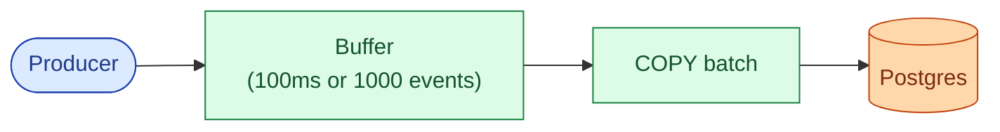
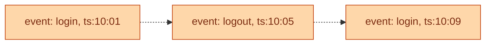
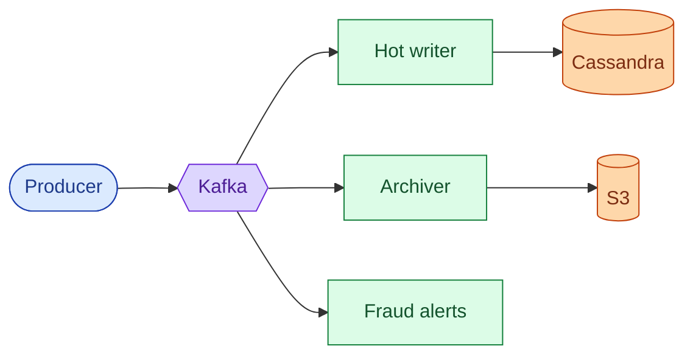
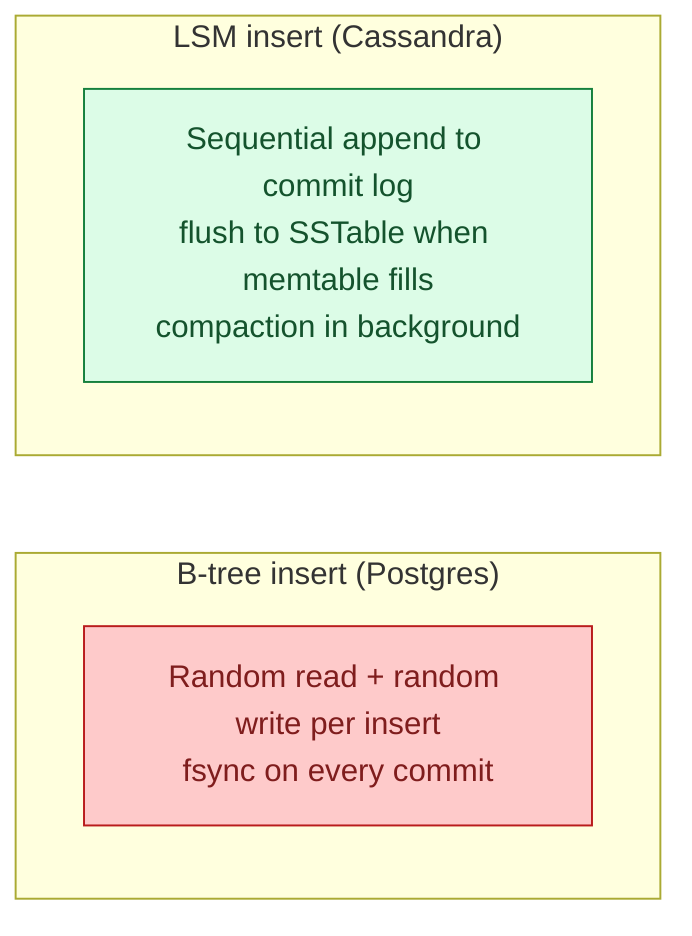
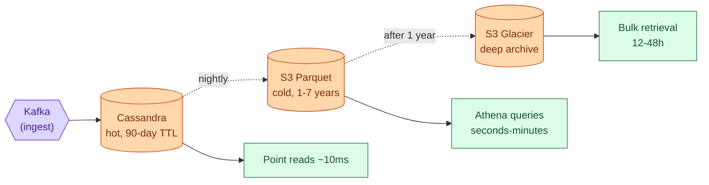
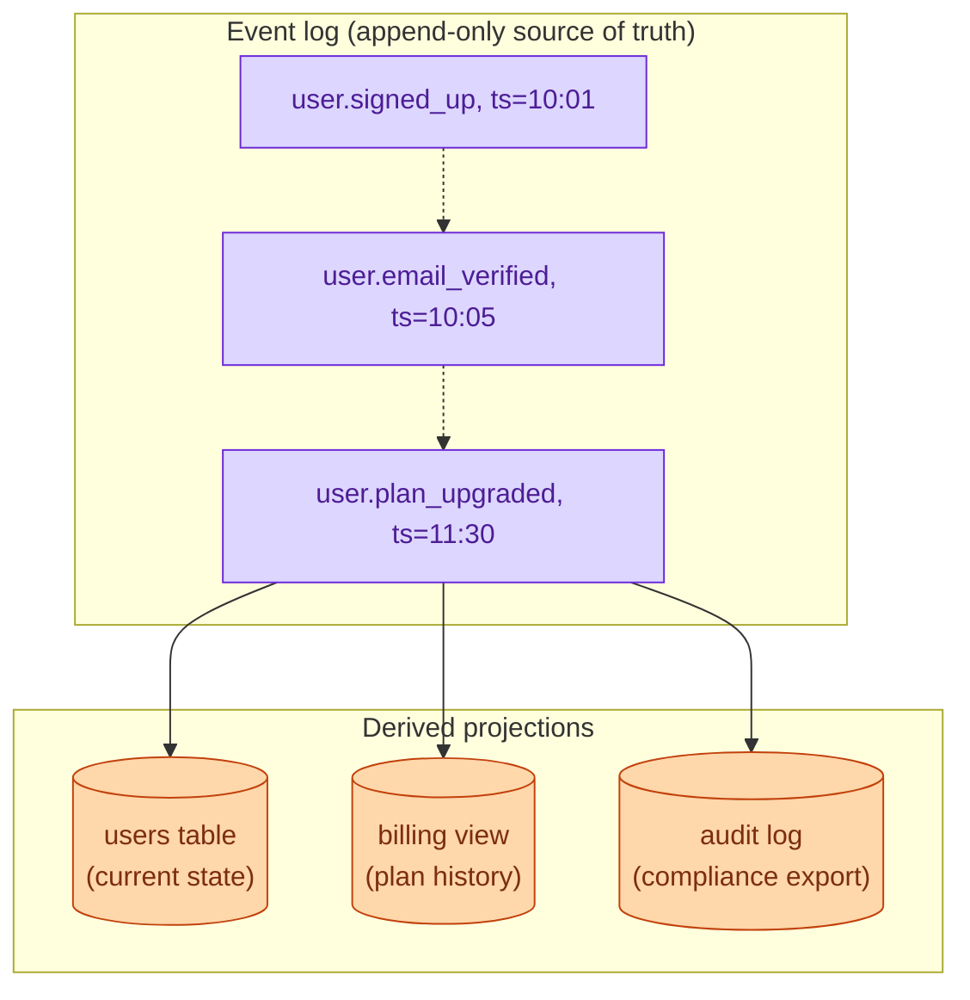
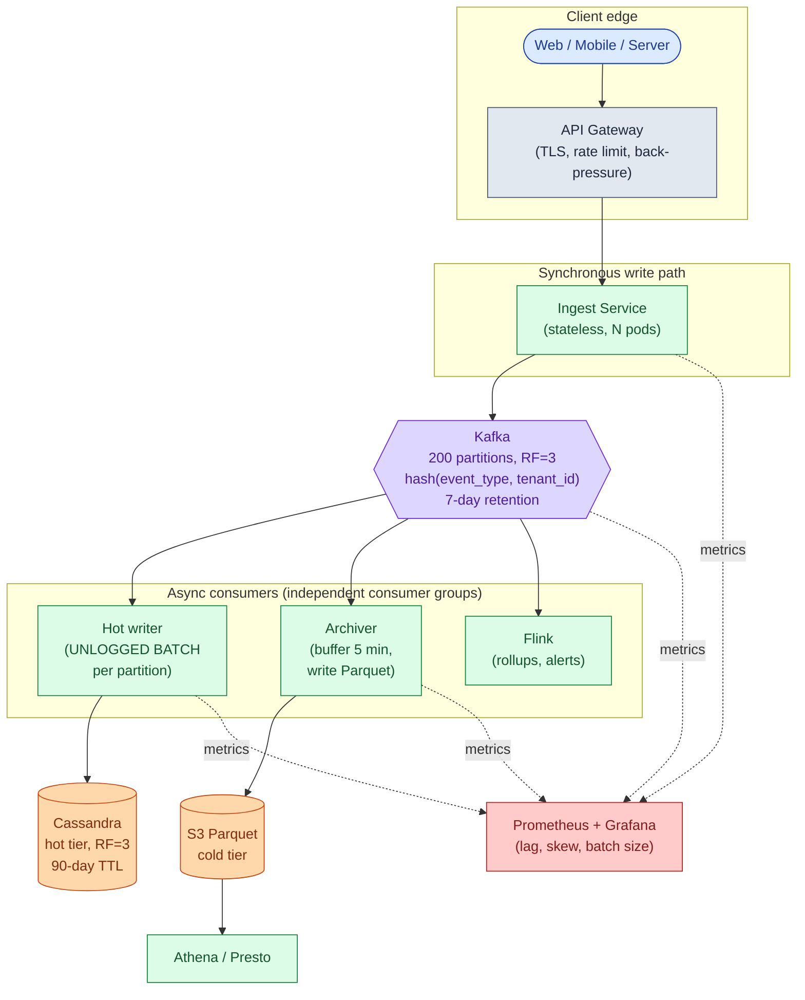
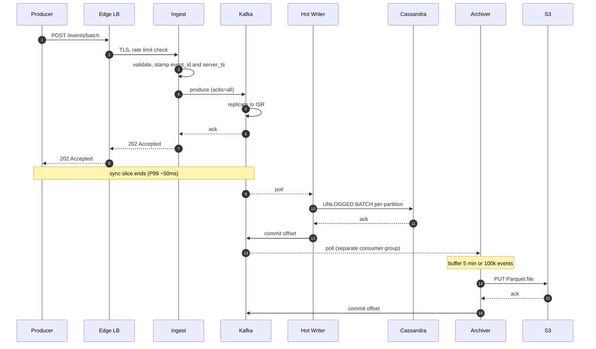
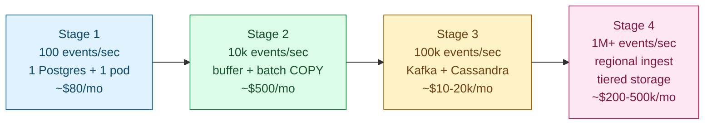

## Solution: Write-Heavy System Patterns

### What this is

A write-heavy system is one where the cost comes from taking in data, not from serving it. Each event is small. Queries are simple. The storage engine has one job: absorb writes faster than a normal database can.

The patterns that solve this fall into two categories. Batching patterns amortize per-write cost. Spreading patterns route writes across many nodes. Every tool in this space (Kafka, Cassandra, LSM trees, tiered storage) is one or the other.

The toolkit, in the order you reach for it as scale grows:

1. **One Postgres** at ~1k writes/sec.
2. **In-memory buffer + batched commits** at ~10k writes/sec.
3. **Durable queue + async LSM writer** at ~100k writes/sec.
4. **Partitioned queue + stream processing + tiered storage** at 1M+ writes/sec.

Each step trades latency, consistency, or operational complexity for throughput. The senior move is to name the limit of stage N before reaching for stage N+1.

Three big decisions shape the final design:

- **Partition key.** Time, hash, or tenant. Usually a composite like `(tenant_id, day)`.
- **Storage engine.** LSM at the hot tier. Parquet on object storage at the cold tier.
- **Delivery guarantee.** At-least-once with idempotent storage is right for 95% of cases.

---

### 1. The two questions that matter most

**How much loss is OK?** This decides the durability story. Zero loss means `acks=all` on Kafka, transactional ingest, and idempotent consumers. "0.1% loss acceptable" means fire-and-forget, no retries, no dedup. Those are 10x apart in cost and complexity.

**How fresh must reads be?** 100ms freshness forces synchronous indexing. 5-minute lag lets you batch into Parquet files and pay 1% of the cost. Most audit systems accept 5-10 seconds. Fraud detectors want under 1 second. The lag SLA decides where you put the queue and how large your batches can be.

Everything else (partition strategy, storage engine, delivery guarantee) follows from those two answers.

---

### 2. The math, in plain numbers

At 1M events/sec, 500 bytes per event, 90 days hot, 7 years cold:

| Number | Value | Why it matters |
|--------|-------|----------------|
| Steady bandwidth | 500 MB/sec (4 Gbps) | Multiple ingest nodes needed just for NIC, not CPU |
| Peak bandwidth | 1.5 GB/sec (12 Gbps) | Several machines per region just to accept bytes |
| Daily volume | 86 billion events, 43 TB raw | Hot tier is petabytes |
| Hot storage (90 days) | ~3.9 PB | 10-30 node Cassandra cluster, RF=3 |
| Cold storage (7 years, 5x compression) | ~22 PB on S3 | ~$500k/month standard, ~$25k/month Glacier Deep |
| Queue size on 5-min stall | 300M events, 150 GB | Kafka handles easily; in-memory cannot |

The bottleneck is bandwidth and storage layout, not CPU. One Postgres maxes out at 10k-50k writes/sec. At 1M/sec that is 100x past a single shard. Writes must be spread across nodes and batched to amortize per-write cost.

Always do bytes alongside event counts. A pipeline doing 86 billion events of 50 bytes each is a completely different system from one doing 86 billion events of 5 KB each.

---

### 3. The API

Reads are out of scope. Focus on ingest.

**Batched ingest** (recommended for all high-volume producers):

```
POST /api/v1/events/batch
Content-Encoding: gzip
Content-Type: application/json

{
  "events": [
    { "event_type": "user.login", "user_id": "u_8201", "timestamp": "...", "attributes": {...} },
    { "event_type": "user.click", "user_id": "u_8202", "timestamp": "...", "attributes": {...} }
  ]
}
```

| Status | Meaning |
|--------|---------|
| **202 Accepted** | Events in durable queue, queryable within ~10s |
| **400 Bad Request** | Schema invalid |
| **413 Payload Too Large** | Batch exceeds size limit |
| **429 Too Many Requests** | Rate limited or back-pressure |
| **503 Service Unavailable** | Ingest degraded, producer should retry |

Four load-bearing choices:

- **202, not 200.** The event is in durable queue, not yet in storage. 202 means "we accepted responsibility; stop retrying."
- **Batch endpoint.** Per-event HTTP at 1M/sec means 1M TLS handshakes/sec. Batches of 1000 cut that to 1k req/sec.
- **Server stamps `server_ts`** alongside `producer_ts`. Both are kept. Producer time is "when did the event happen." Server time is "when did we accept it." Clock-skew analysis uses the gap.
- **429 includes `Retry-After`.** Well-behaved producers throttle themselves. Without this, the 429 storm becomes a retry storm.

---

### 4. The data model

**Canonical event in Kafka:**

```json
{
  "event_id":       "01H8K2X...",
  "tenant_id":      "tenant_42",
  "event_type":     "user.login",
  "user_id":        "u_8201",
  "producer_ts":    "2026-05-24T10:14:02.331Z",
  "server_ts":      "2026-05-24T10:14:02.412Z",
  "attributes":     { ... },
  "schema_version": 3
}
```

**Hot tier in Cassandra:**

```cql
CREATE TABLE events_by_tenant_day (
    tenant_id      text,
    day            date,
    event_id       timeuuid,
    event_type     text,
    user_id        text,
    producer_ts    timestamp,
    server_ts      timestamp,
    attributes     text,
    schema_version int,
    PRIMARY KEY ((tenant_id, day), event_id)
) WITH CLUSTERING ORDER BY (event_id DESC)
  AND default_time_to_live = 7776000;
```

Three things doing real work:

**`PRIMARY KEY ((tenant_id, day), event_id)`.** The partition key `(tenant_id, day)` bounds partition size. Even the largest tenant only writes one day at a time into one partition. The clustering column `event_id` keeps rows sorted inside the partition, so "latest events" is a cheap prefix scan.

**`default_time_to_live = 7776000`.** 90 days. Cassandra auto-deletes old rows during compaction. No nightly delete job needed.

**No foreign keys.** Audit-shaped data is reference-free. The event captures who, what, and when. If a user account is later deleted, the audit must survive.

**Cold tier on S3** sits at path `s3://events-cold/date=YYYY-MM-DD/event_type=X/tenant_id=Y/fileN.parquet`. Columnar layout inside each file. Column-pruned reads are free. Partition pruning at the prefix level means Athena skips whole directories that do not match the query filter.

---

### 5. The seven patterns

#### Pattern 1: Batching

Accumulate events in memory. Flush together. One `COPY` statement covers what used to be 1,000 individual `INSERT` calls. Amortizes fsync, network round-trips, and TLS overhead.



**Limit.** ~10k writes/sec on one Postgres. Events in the buffer are lost on crash.

> **Take this with you.** Batching is the first 10x. It costs nothing but a timer and an array. Use it before reaching for Kafka.

---

#### Pattern 2: Append-only log

Only ever append. Never update in place. All writes are sequential. Sequential disk I/O is 10x to 100x faster than random I/O.



**Limit.** Storage grows without bounds. Reads that want current state must aggregate across all events. Fix with tiered storage and materialized views.

> **Take this with you.** An append-only log is the cheapest write path. Disk is sequential. Sequential writes are 10x to 100x faster than random writes on any hardware.

---

#### Pattern 3: Queue-based ingestion

Decouple producer speed from storage speed. Producers write to a durable queue. Storage drains at its own pace. Multiple consumers read the same events independently.



**Limit.** End-to-end lag jumps from ms to seconds. If consumer lag grows past Kafka's retention window, events are lost.

> **Take this with you.** The queue is the shock absorber. If the Cassandra writer dies at 3am, ingest still works. Events just queue up.

---

#### Pattern 4: LSM trees

Postgres uses a B-tree: every insert finds a page, writes in-place, pays a random I/O cost. Cassandra uses an LSM tree: every insert appends to a commit log (sequential), then flushes to an SSTable (sequential). Compaction happens in the background.



**When LSM wins.** Write-heavy work, time-series, logs, telemetry. Above ~50k writes/sec on a single node, Cassandra or ScyllaDB are the standard choice.

**When B-tree wins.** OLTP with frequent updates to the same rows. Read-heavy workloads. Many secondary indexes.

> **Take this with you.** LSM turns many random writes into sequential appends. That single change is why Cassandra can absorb write rates that would melt Postgres.

---

#### Pattern 5: Sharding and partition keys

Spread writes across many nodes. The partition key decides which node gets which writes. A bad key creates a hot node.

| Strategy | Good for | Fails when |
|----------|----------|------------|
| **Time-based** (`day`) | Time-range reads, cheap data expiry | Hot write partition (current hour or day) |
| **Hash-based** (`hash(key) % N`) | Even write distribution, no hotspots | Range queries scatter-gather |
| **Tenant-based** (`tenant_id`) | Per-tenant isolation and deletion | One big tenant overwhelms one node |
| **Composite** (`(tenant_id, day)`) | Bounds partition size, cheap expiry | Slightly more complex routing |

For 1M events/sec: Kafka key = `hash(event_type, tenant_id)`. Cassandra primary key = `((tenant_id, day), event_id)`. S3 path = `date=Y/event_type=X/tenant_id=Z/`.

> **Take this with you.** The partition key is the most important design decision in write-heavy storage. A wrong key gives you a hot node. A hot node negates all the scaling work.

---

#### Pattern 6: Tiered storage

Not all data is accessed equally. Match storage cost to access frequency.



**Cost at 1M events/sec:**
- Cassandra hot tier (90 days, 3.9 PB): ~$50k/month on managed clusters.
- S3 Parquet standard (7 years, 22 PB compressed): ~$500k/month.
- S3 Glacier Deep Archive: ~$25k/month for the same 22 PB.

Keeping 7 years in Cassandra is not just expensive. It is structurally wrong: Cassandra is optimized for fast point reads, not for Athena-style columnar scans across years of data.

> **Take this with you.** Hot queries pay hot prices. Cold queries pay cold prices. Match storage to access pattern.

---

#### Pattern 7: Event sourcing

Model state as an ordered stream of immutable events. Derive current state by replaying them. The event log is the source of truth; everything else is a projection.



**Limit.** Replaying millions of events to rebuild state is slow without snapshots. GDPR deletions need tombstone events and projection logic that respects them. Event schemas evolve, so old projections must handle old event versions.

> **Take this with you.** Event sourcing gives you time travel for free. The cost is that every read is a projection. Use it when the audit trail is a first-class requirement, not a side effect.

---

### 6. The architecture at 1M events/sec



Five things to notice:

- Ingest pods are stateless. Their only durability hop is Kafka. A pod crash causes the producer's connection to drop. The producer retries. The idempotency key deduplicates if present.
- Three consumer groups read the same Kafka topic independently. The archiver falls behind without affecting Cassandra. Flink crashes without affecting the archiver.
- Cassandra and S3 are not redundant. They serve different access patterns. Cassandra answers "give me events for tenant X on day D" in 30ms. S3 answers "give me everything for tenant X over 2 years" in minutes.
- Observability is on every box. Without consumer lag and partition-skew metrics, failures surface as customer complaints.
- Concrete technology choices: API Gateway via AWS ALB or Cloudflare, ingest pods in Go or Rust, Kafka via Confluent or MSK, hot store via Cassandra or ScyllaDB, Flink for stateful stream processing.

---

### 7. An event, end to end



**End-to-end lag:**
- Producer to Cassandra-queryable: 1-3 seconds, P99 ~10 seconds.
- Producer to S3 Parquet: up to 5-6 minutes (archiver flush window dominates).

**Read latencies:**
- Point read by event_id: P99 ~10ms.
- Per-tenant range scan: P99 ~30ms.
- Analytics over 1 year via Athena: seconds to minutes.

---

### 8. The scaling journey: 100 events/sec to 1M



#### Stage 1: 100 events/sec

One Postgres (db.t3.medium, 4 GB RAM). One app instance. One table, indexed by `event_id` and `(user_id, created_at)`. No queue. No cache. No replicas. ~$80/month.

100 events/sec is 8.6M events/day. Postgres handles this with room to spare, at maybe 50% of one core. Anything more is over-built.

#### Stage 2: 10k events/sec

**What breaks.** Postgres CPU at 80%. WAL fsync is the bottleneck: every commit flushes to disk. Inserts land in random pages, so the buffer pool churns.

**Fixes:** In-app buffer: accumulate events, flush every 100ms or 1000 events via `COPY` instead of `INSERT`. 10-20x faster. Partition the table by day. Add a second app instance and a read replica.

**What you accept.** Buffered events lost on crash: worst case 100ms x 10k/sec = ~1,000 events. End-to-end lag goes from immediate to ~100ms.

**What you do NOT build.** No Kafka, no Cassandra, no multi-region.

#### Stage 3: 100k events/sec

**What breaks.** Postgres cannot keep up even with batching. App crash loses 10k events (100k/sec x 100ms). Read replica lags 30 seconds because primary is saturated.

**Fixes:** Kafka in front of storage (producers get 202 immediately, Kafka buffers if storage falls behind). Switch to Cassandra for the hot tier. Separate Kafka consumer process writes in UNLOGGED BATCHes per partition. 50 Kafka partitions, hash by `(event_type, tenant_id)`.

**What you accept.** End-to-end lag jumped from 100ms to ~5 seconds. Strong consistency is gone.

#### Stage 4: 1M events/sec

**What breaks.** Single-region Kafka hits NIC and disk limits. One large tenant saturates one Kafka partition and one Cassandra node. Cold-tier costs explode if everything stays in Cassandra. Compliance requires 7-year retention.

**Fixes:** Regional ingest and Kafka clusters per region. Sub-shard hot partitions with a random suffix. Flink for enrichment and routing. Tiered storage (hot Cassandra TTL 90 days, cold S3 Parquet 7 years). Per-tenant rate limits with hard caps.

---

### 9. Reliability

**Queue overflow.** Kafka at 90% disk. Back-pressure at ingest: when Kafka send latency P99 exceeds 1 second, ingest returns 429. Producers back off. Premium tenants get reserved Kafka capacity. Free-tier tenants get throttled first.

**Consumer fell behind.** Scale consumer group up temporarily. Configure throttled catch-up at 2x normal rate. Catch-up is a separate workload and should not be mixed with normal traffic.

**Partial batch loss.** A Kafka consumer crashes after writing 800 of 1000 events to Cassandra, before committing the offset. On restart it reprocesses the full batch. Cassandra primary-key UPSERT semantics make the 800 already-written events a no-op. No data loss.

**Ingest pod crash.** Pod crashes between accepting a request and sending to Kafka. Producer's HTTP connection drops with no response. Producer retries. With an idempotency key, the second submission is deduped. Fix: ingest pod sends to Kafka before returning 202.

**Region failure.** Producers in the failed region cannot publish. The SDK should fail over to next-nearest region. Data loss window: events buffered in the producer's local SDK that were never sent. Typically under 1 second. DR play: cross-region Kafka replication via MirrorMaker.

---

### 10. Observability

| Metric | Why it matters | Alert threshold |
|--------|----------------|-----------------|
| `ingest.requests.rate` | Top-line throughput | Drop >50% in 5 min |
| `ingest.latency.p99` | Producer-facing SLO | >100ms for 5 min |
| `ingest.5xx.rate` | Our problem | >0.1% sustained |
| `kafka.producer.ack.latency.p99` | Kafka health | >1s for 5 min |
| `kafka.partition.rate.max / median` | Hot partition skew | >10x ratio |
| `kafka.consumer.lag` per group | Are consumers keeping up? | >30s lag for any group |
| `kafka.broker.disk.used.pct` | Storage capacity | >80% |
| `cassandra.write.latency.p99` | Storage health | >50ms |
| `cassandra.batch.size.p99` | Batching effectively? | <10 events is too small |
| `archiver.lag` | Cold tier behind real-time | >10 min |
| `archiver.parquet_file.size.p50` | Small file problem | <10 MB is too many files |

**Four golden signals:** ingest throughput (events/sec at the API), end-to-end lag (ingest timestamp to Cassandra-readable timestamp), consumer lag per Kafka consumer group, and error rates at each stage.

Page on: ingest 5xx > 0.5%, ingest P99 > 200ms for 10 min, consumer lag > 5 min for any group, Kafka broker disk > 90%.

---

### 11. Follow-up answers

**1. Back-pressure.**

When Kafka send latency P99 exceeds 1 second or any broker is unhealthy, ingest returns 429 with `Retry-After`. The producer SDK backs off with exponential backoff and caches events locally until health returns. Without producer-side backoff, the 429 storm becomes a retry storm. If Kafka is so unhealthy that even 429s are slow, ingest can close connections (TCP RST), forcing producers to back off at the TCP level.

**2. Hot tenant.**

Find them: the per-partition rate metric points at one Kafka partition. Cross-reference with the partition key. Next 5 minutes: hard rate limit at the ingest tier, capping the tenant at their agreed quota. Excess gets 429. Sub-shard them by appending `random(0..15)` to the partition key, spreading load across 16 partitions. They lose per-key ordering during the spike, but the cluster survives. Next 5 days: diagnose the bug (often a retry loop, log misconfiguration, or a runaway script) and establish per-tenant quota policy.

**3. Clock skew.**

Always stamp `server_ts` at ingest. That is the timestamp used for partitioning, bucketing, and ordering downstream. `producer_ts` is kept for display only. NTP-sync producers to the second. Flag any event where `producer_ts` is more than 5 minutes off from `server_ts`. The stream processor tolerates late events via Flink watermarks. Never use `producer_ts` for anything that requires precise ordering.

**4. Duplicate events.**

Detection: Cassandra primary-key conflict on insert is the direct signal. Count `cassandra.dedup.collisions` per minute. A nightly audit of `SELECT event_id, count(*) GROUP BY event_id HAVING count(*) > 1` should always return zero.

Dedup: use `event_id` as the primary key. Prefer producer-generated ULIDs (time-ordered, unique, no coordination needed). If the producer cannot generate one, the server generates at ingest, but then producer retries get different event_ids and dedup is impossible. Cassandra UPSERT semantics make duplicate inserts with the same primary key a no-op.

**5. Consumer fell behind.**

Two failure modes to avoid on restart: resource exhaustion (consumer wakes up, polls Kafka at full speed, melts storage) and out-of-order derived data (rolling metrics get skewed by 1.8B events arriving in one hour). Fix: throttled catch-up at 2x normal throughput. 1.8B events at 200k/sec takes ~2.5 hours to drain. Scale the consumer group up temporarily, but watch storage. If derived consumers care about "now-time" processing, flag them to skip events older than X and replay historical events as a separate batch job.

**6. Schema evolution.**

Options: keep the raw event as JSON (flexible, no columnar benefits); use Avro or Protobuf with backward/forward compatibility rules enforced by a Schema Registry (old consumers ignore unknown fields); use versioned event types (`user.login.v1`, `user.login.v2`) so old consumers stick to v1. Never make a backward-incompatible change without versioning. Adding fields is fine. Removing or renaming fields without a migration plan is not.

**7. Recent-event reads.**

Three approaches. (1) Document the lag ("data has ~5s lag"). Most use cases accept this. Cheapest. (2) Dual-write to a real-time store. A second consumer reads Kafka and writes to Redis (per-user list, capped at 1000 recent events). Queries that need <1s freshness hit Redis; older data falls through to Cassandra. Costs 2x writes at the consumer tier. (3) Query Kafka directly via kSQL. Operationally awkward; Kafka is not a key-value store. For most audit pipelines, option 1 is correct. For fraud or live-dashboard use cases, option 2 is worth the cost.

**8. Region goes down.**

If the producer SDK has failover: it detects local Kafka as unreachable, buffers events locally, and fails over to the next-nearest region. When the local cluster recovers, it drains the buffer. Data loss window: events buffered in the producer process at the moment of failure, typically under 1 second.

If the SDK is naive: producer gets timeouts. All events generated during the outage are lost. DR play: cross-region Kafka replication via MirrorMaker so events that landed in the failed region's Kafka eventually replicate elsewhere. For zero-data-loss DR: write to two Kafka clusters synchronously. Doubles producer latency.

**9. Cold-tier query cost.**

"Every event for tenant X for 3 years" scans naively across 3 years x 365 date partitions x all event_type subdirectories.

Optimizations: `tenant_id` must be in the S3 prefix path, not buried inside Parquet (critical for partition pruning). Parquet's per-row-group statistics let Athena skip row groups that cannot match the filter. For hot queries, pre-aggregate nightly into a small summary table. Events older than 1 year move to Glacier Deep Archive (1/20 the cost, 12-48h retrieval for compliance queries). For interactive sub-second analytics: load data into ClickHouse, BigQuery, or Snowflake. S3 Parquet via Athena is for ad-hoc queries, not interactive dashboards.

**10. Exactly-once for a side effect.**

SMS is not idempotent. Use a transactional outbox at the fraud-alert consumer specifically: the consumer reads Kafka events and writes `(event_id, status='pending')` rows to a local DB table. A separate sender process picks pending rows, calls the SMS API with `idempotency_key = event_id` (Twilio supports this), then marks the row `status='sent'`. If the sender crashes between the API call and the status update, it retries on restart. The SMS provider's idempotency key prevents a second message from sending. Apply the expensive exactly-once guarantee only to the consumer that needs it, not to the whole pipeline.

---

### 12. Trade-offs worth saying out loud

**Sync vs async.** Sync writes give immediate consistency and simpler reasoning. They cap throughput at the storage layer's speed. Async via queue decouples producer rate from storage rate. Higher throughput at the cost of end-to-end lag and weaker consistency. Under 100ms lag target means sync. Over 1 second acceptable means async.

**Batch vs stream.** Batching amortizes per-write overhead. Larger batches mean higher throughput but higher latency per event. The sweet spot: batch enough to amortize fsync, small enough to land within the lag SLA. Typical: 100ms or 1000 events, whichever comes first.

**Exactly-once cost.** Kafka EOS drops throughput 20-40% and adds operational complexity. The right move is usually "at-least-once with idempotent storage." Reserve true exactly-once for non-idempotent side effects.

**Why Cassandra over Postgres at the hot tier.** Postgres B-tree is poor at write-heavy random-key inserts. Cassandra LSM is built for it. Under 50k writes/sec, Postgres is fine and operationally simpler. Above that, Cassandra wins on throughput per node and horizontal scaling (add a node, rebalance automatically).

**Why S3 Parquet for cold tier.** Cheap, durable, columnar, queryable with serverless tools. Keeping 7 years of events in Cassandra costs 100x more for data accessed once a year.

**What to revisit at 10M events/sec.** A specialized vendor (Datadog, Splunk, Honeycomb) or purpose-specific pipelines: one for security events (strict durability, long retention), one for product analytics (loose durability, aggregated only), one for traces (sampled, very short retention). The "one pipeline for everything" pattern stops scaling cleanly past ~1M events/sec.

---

### 13. Common mistakes

**Reaching for Kafka and Cassandra immediately.** The problem starts at 100 events/sec. Proposing a Kafka cluster in minute one means you have not earned the architecture. Walk the stages. Justify each addition by naming what the previous stage broke.

**Confusing buffering with batching.** Buffering means holding events in memory before writing. Batching means writing many events in one storage call. You usually do both. Articulate the difference.

**Not specifying the partition key.** "Use Cassandra" without a partition key is a hand-wave. The partition key determines whether your cluster has hot nodes. It is the most important decision in the storage layer.

**Claiming exactly-once without paying the cost.** If you say "exactly-once," explain how (Kafka EOS, transactional outbox) and what it costs. If you say "at-least-once with idempotent storage," you score the same correctness with a tenth of the operational pain.

**Forgetting back-pressure.** A write-heavy system without back-pressure cascades on the first downstream slowness. The 429 and retry-with-backoff loop is mandatory.

**Not designing for the hot partition.** "It will distribute evenly" is a hope, not a design. Real systems have one tenant 1000x bigger than the median. Have an answer: sub-sharding, rate limiting, dedicated capacity.

**No tiered storage.** Keeping 7 years of events in Cassandra is wasted money. Cold tier (S3 Parquet) is the standard play.

**Treating lag as a bug.** End-to-end lag is the price you pay for async ingestion. Some consumers want lag (cheap batch processing). Some do not (fraud alerts). Acknowledge the spectrum.

**Ignoring observability.** Queue depth, consumer lag, batch size, and partition skew diagnose every common failure mode. They are part of the design, not an afterthought.

**Building the 1M/sec architecture at 100/sec scale.** The system collapses under its own operational weight before it ever sees the traffic it was built for. Design for one stage past current, not three.

If you hit 7 of these 10 cleanly, you are interviewing well. The two that separate staff-level candidates: addressing the hot partition problem unprompted, and explaining the exact moment you would not yet introduce Kafka (the stage 1 to 2 transition). Both show that you understand cost as well as throughput.
