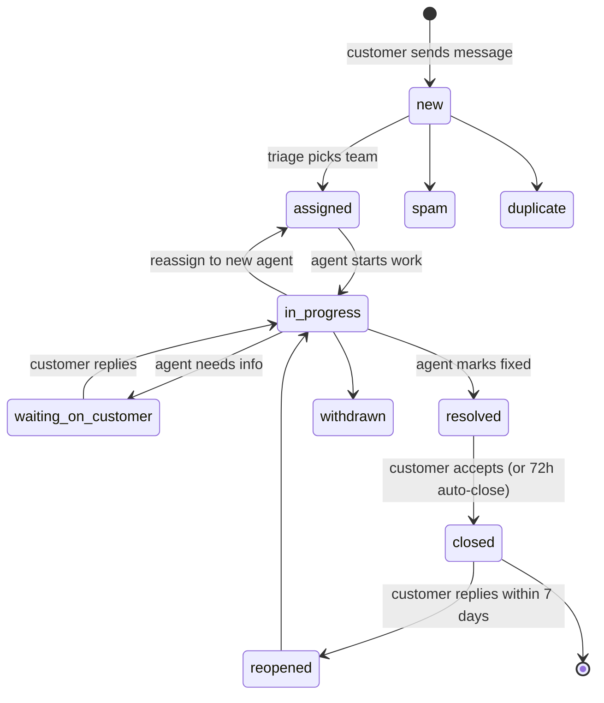
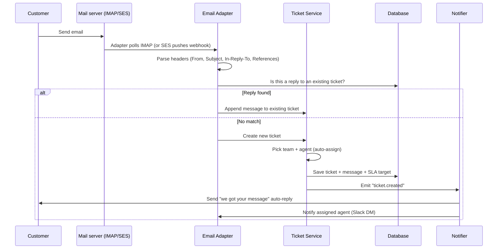
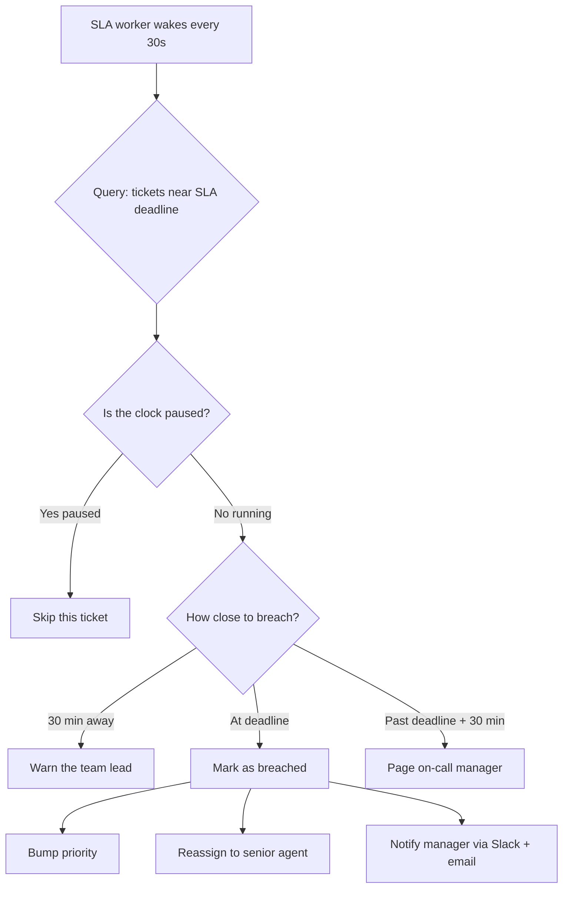

## The scene

You sit down. The interviewer reads from a sheet of paper.

> *"Customers have problems. They send emails. They use chat. They fill out web forms. They message you on Slack. You need a system that turns all of these into tickets. Agents answer the tickets. Some tickets get fixed fast. Some take days. Some are urgent. Build a basic Zendesk."*

This sounds like a list with a "status" column. It is not.

The hard parts are:

- An email comes in. Is it a new problem, or a reply to an old one?
- 200 agents are working. Who gets the new ticket? The least busy one? The one with the right skill?
- You promised "we reply in 1 hour." How do you know when you are about to miss that promise? What if the ticket came in on Friday night?
- A customer goes silent for 6 months, then replies to an old ticket. Do you reopen it? Or start a new one?

Real products (Zendesk, Freshdesk, ServiceNow, Intercom) all solve the same five problems: intake, ticket state, assignment, SLA timers, and reporting. We will walk through them one by one.

We start with a 3-agent startup. We end with 2,000 agents across the world. At every step we name what breaks, then add the smallest fix.

A few words we will use a lot:

- **SLA** = "service level agreement." A promise like "we respond within 1 hour."
- **Intake** = the front door. Where tickets come in.
- **Adapter** = a small piece of code that talks to one channel (email, chat, etc).
- **Push assignment** = the system picks an agent and gives them the ticket.
- **Pull assignment** = tickets sit in a queue. Agents click "give me the next one" when they are ready.

---

## Step 1: Ask the right questions

Before you draw anything, sit for five minutes. Write down questions.

A good answer is not "20 questions about every edge case." It is the small handful of questions that change the design.

<details markdown="1">
<summary><b>Show: 9 questions that matter</b></summary>

1. **Which channels?** Email only? Or also chat, web form, Slack, SMS, Twitter? *(Each channel needs its own adapter. Email is the messiest because of reply threading. Chat is the easiest because the chat session already groups messages.)*

2. **How many tickets per day, and how many agents?** 50 tickets a day with 3 agents is tiny. 50,000 tickets a day with 2,000 agents is a real system.

3. **What does the SLA look like?** "Respond in 1 hour, resolve in 24 hours" is common. Big question: is the clock 24/7, or does it pause at night and on weekends? *(Business-hour SLAs are the single most error-prone part of the whole system.)*

4. **How does the system pick an agent?** Round robin? By skill? Pull queue? Least busy? *(The wrong choice makes a few agents burn out while others sit idle.)*

5. **Can a ticket move between teams?** Billing takes it first, then sends it to engineering. Who is in charge at each step?

6. **What does the customer see?** A portal to check status? Email replies? A "rate the agent" survey?

7. **What happens when a ticket breaches SLA?** Email the manager? Move to a senior agent? Page someone?

8. **Is there a knowledge base?** Should we show the customer 3 articles before they submit, hoping they find the answer themselves? *(This is the cheapest win in any help desk. It is called "deflection.")*

9. **Compliance?** Do we need to redact credit card numbers? How long do we keep closed tickets? GDPR? HIPAA?

Also ask: **what is NOT in scope?** Phone calls are usually a separate beast (Twilio or Aircall). Automatic reply rules ("macros") can be a v2. Workforce scheduling is a different product.

The meta-question to ask: *"Is the notification system part of this design, or separate?"* The right answer is separate. The ticket system emits events. The notification service listens.

</details>

---

## Step 2: How big is this thing?

The interviewer gives you two scales. Do the math for each.

**A. Small startup**
- 50 tickets per day
- 3 agents
- One channel: email
- 9 AM to 6 PM, weekdays

**B. Enterprise**
- 50,000 tickets per day
- 2,000 agents across 4 regions
- 5 channels: email, web form, chat, Slack, SMS
- 24/7 support

For each, work out: tickets per second (average and peak), messages per ticket, total messages per second, how many tickets are open at any moment, and 5 years of storage.

<details markdown="1">
<summary><b>Show: the math</b></summary>

**Small startup (50/day, 3 agents):**

- 50 tickets / 9 hours = about 1 ticket every 11 minutes. Tiny.
- About 5 messages per ticket (customer asks, agent answers, customer follows up, agent fixes, close). So 250 messages a day.
- With a 2-day average resolution, around 100 tickets are open at any moment.
- 5 years of data: about 1 GB. Fits anywhere.

You could literally run this on a Google Sheet plus a Gmail label. We will not, because we want a design that grows.

**Enterprise (50,000/day, 2,000 agents):**

- 50,000 / 86,400 seconds = about 0.6 tickets per second on average. At peak hours, around 3 per second.
- 8 messages per ticket (enterprise tickets are longer). That's 400,000 messages per day, around 5 per second average, 15 at peak.
- Open tickets at any moment: 50,000 per day x 3-day average lifecycle = around 150,000 open at all times.
- 2,000 agents refreshing their dashboard every 30 seconds = about 65 reads per second.
- 5 years of data: around 5 TB of text plus 50 TB of attachments in S3.

**What the math tells you:**

This is not a high-traffic system. Even at the top end, you write 15 things per second. That is small.

The hard problems are not throughput. They are:

1. **Correctness.** Don't lose tickets. Don't double-assign. Don't break the SLA promise.
2. **Read speed.** Dashboards refresh constantly. Reads beat writes 10-to-1.
3. **Fair assignment.** Don't burn out one agent while another sits idle.
4. **SLA accuracy.** Especially across timezones and business hours.

> Why so few writes? Because humans are slow. Even a busy agent handles maybe 30 tickets a day. Real "scale" problems live in feeds, payments, ads. Help desks are a state-correctness problem dressed up as a scale problem.

</details>

---

## Step 3: The ticket lifecycle

A ticket is a small state machine. It has a few states, and rules for moving between them.

Here is the lifecycle as a diagram. Some arrows are missing. See if you can fill them in.



<details markdown="1">
<summary><b>Show: what each transition means (in plain English)</b></summary>

- **new -> assigned**: A new email arrives. The system (or a human) picks a team to own it.
- **assigned -> in_progress**: An agent clicks "I'll take this" and starts working.
- **in_progress -> waiting_on_customer**: The agent needs more info from the customer ("can you share the error screenshot?"). The SLA clock pauses here. Why? Because you can't blame the agent for waiting on the customer.
- **waiting_on_customer -> in_progress**: The customer replies. The clock resumes.
- **in_progress -> resolved**: The agent thinks they fixed it.
- **resolved -> closed**: The customer agrees, OR 72 hours pass with no complaint.
- **closed -> reopened**: The customer replies within 7 days saying "it's still broken." The ticket comes back to life.
- **After 7 days, any reply opens a NEW ticket** (with a link back to the closed one). Why? Because if we let people reopen tickets from 6 months ago, conversations get confusing.
- **spam, duplicate, withdrawn**: Dead ends. The ticket is closed and won't come back.

> Why a 7-day reopen window? It's a balance. Too short (1 day) means customers get frustrated when their fix didn't work. Too long (90 days) means you reopen ancient tickets where the agent doesn't remember the context. 7 days is the industry default.

> Why pause the clock on "waiting_on_customer"? Picture this: the agent asks "what's your account ID?" at 10 AM. The customer doesn't reply until 6 PM. If the SLA is "respond in 1 hour," the ticket would breach at 11 AM through no fault of the agent. Pausing the clock keeps the metric honest.

</details>

---

## Step 4: How does email become a ticket?

This is the hardest single part of the system. Let's walk through it.

A customer types into Gmail and clicks Send. Now what?



The trick is the "is this a reply" check. Emails don't come with a "this is reply to ticket #4521" tag. You have to figure it out from the headers.

<details markdown="1">
<summary><b>Show: how to thread an email reply</b></summary>

Three ways to thread, in order of trust:

**Layer 1: The `In-Reply-To` and `References` headers.**

Every email has a unique `Message-ID` header. When you reply, your email client sets `In-Reply-To: <original-message-id>`. The `References` header lists the whole chain.

```
From: alice@example.com
Subject: Re: Cannot log in
Message-ID: <abc123@gmail.com>
In-Reply-To: <our-original@helpdesk.com>
References: <our-original@helpdesk.com> <earlier-reply@helpdesk.com>
```

When we send the first agent reply, we save its `Message-ID`. When a reply comes back with that ID in `In-Reply-To`, we know which ticket it belongs to.

This catches about 85% of replies.

**Layer 2: The subject line tag.**

Some email servers strip headers. So we also add a tag to the subject:

```
Subject: Re: [TKT-4521] Cannot log in
```

If the headers fail, we look for `[TKT-NNNN]` in the subject. This catches another 10%.

**Layer 3: Heuristics (off by default).**

Same sender + similar subject + within the last 7 days. This is dangerous. Two unrelated emails with the same subject can get merged. So most help desks leave this off and let agents merge tickets manually.

**The other 5%** open new tickets. An agent can merge duplicates with a "merge" button.

> Why is email so messy? Email was designed in 1982. It was never meant to be a help desk channel. Phones from a customer get stripped subjects. Outlook adds "FW:" and "RE:". Spam filters mangle headers. You build defense in depth or you lose threading.

</details>

---

## Step 5: Draw the system

You know the lifecycle. You know how email becomes a ticket. Now draw the boxes.

Think about: where do messages come in, who runs the state machine, who picks the agent, who watches the clock, where does data live, who feeds the search box.

<details markdown="1">
<summary><b>Show: the full architecture</b></summary>

```
   Email   Web form   Chat   Slack   SMS
     |       |         |       |      |
     +-------+---------+-------+------+
                       |
                       v
              +------------------------+
              |  Intake Adapters       |  one per channel:
              |  (email, form, chat,   |  parses, threads replies,
              |   slack, sms)          |  emits common event
              +-----------+------------+
                          |
                          v
              +------------------------+
              |  Ticket Service        |  the brain:
              |  (stateless pods)      |  runs state machine,
              |                        |  writes to Postgres
              +-+----------+---------+-+
                |          |         |
                |          |         +-----> +-------------------+
                |          |                 |  Assignment Svc   |
                |          |                 |  (skill + load +  |
                |          |                 |   pull queue)     |
                |          |                 +-------------------+
                |          |
                |          +-----------------> +-------------------+
                |                              |  SLA Worker       |
                |                              |  (sweeps every    |
                |                              |   30s, pauses on  |
                |                              |   waiting + off   |
                |                              |   hours)          |
                |                              +-------------------+
                v
        +---------------------+
        |  Postgres            |
        |   tickets            |
        |   ticket_messages    |
        |   assignments        |
        |   sla_targets        |
        |   ticket_audit       |
        +----------+-----------+
                   |
                   |  (CDC / outbox)
                   v
        +---------------------+
        |  Kafka               |  events:
        |                      |  ticket.created
        |                      |  ticket.replied
        |                      |  ticket.assigned
        |                      |  sla.breached
        +-+-------+--------+---+
          |       |        |
          v       v        v
    +--------+ +--------+ +--------------+
    | Index  | | Notify | | Cache        |
    | to ES  | | (email,| | invalidator  |
    |        | | Slack, | | (Redis)      |
    |        | | push)  | |              |
    +---+----+ +--------+ +------+-------+
        |                        |
        v                        v
    +-----------+         +--------------+
    | Search    |         | Dashboards   |
    | (ES/OS)   |         | (agent +     |
    | + KB      |         |  customer)   |
    +-----------+         +--------------+
```

What each box does:

- **Intake Adapters.** One per channel. The email adapter polls Gmail or accepts SES webhooks, parses headers, threads replies, and emits a common "TicketIntakeEvent." The web form adapter accepts JSON. The chat adapter keeps websockets open. They all dump into the same pipe.

- **Ticket Service.** The brain. Runs the state machine. Refuses bad transitions ("you can't go from closed to in_progress without going through reopened"). Writes to Postgres in transactions.

- **Assignment Service.** Picks the team and agent. Knows who is on shift, who has which skills, who is overloaded.

- **SLA Worker.** A separate process that wakes up every 30 seconds, scans the SLA table, and fires events when tickets are close to breaching. Pauses outside business hours.

- **Postgres.** The source of truth. Five tables (we'll see them in the solution).

- **Kafka.** A pipe that carries events away from the database. Notifications, search indexing, and cache updates all listen.

- **Search index (Elasticsearch).** Fast full-text search. Also holds knowledge base articles.

- **Notifier.** Sends emails, Slack DMs, push notifications. Lives downstream of Kafka so it never blocks the write path.

> Why a SEPARATE SLA worker, not a timer per ticket? With 150,000 open tickets, you'd have 150,000 pending timers. Canceling them when the ticket pauses or resolves becomes a coordination nightmare. A boring sweep query that runs every 30 seconds is simpler, more reliable, and easy to debug. The cost is up to 30 seconds of breach-detection lag. Nobody cares.

</details>

---

## Step 6: How do you pick an agent?

A ticket arrives. 2,000 agents are logged in. Who gets it?

Four strategies. Each has a sweet spot and a failure mode.

Try to write down how each works and where it breaks, before peeking.

<details markdown="1">
<summary><b>Show: the four assignment strategies</b></summary>

**1. Round robin.**

Walk a pointer through the agent list. First ticket goes to agent 0, next to agent 1, and so on.

- Good: dead simple. Fair if every ticket is equally hard.
- Bad: ignores who is busy and who has the right skill. An agent in the middle of a 2-hour ticket still gets new ones.
- Best for: teams under 10 people with similar skills.

**2. Skill-based.**

Tag tickets at intake (`billing`, `technical`, `mobile-app`). Match to agents with the right skill tag.

- Good: hard tickets go to people who can solve them.
- Bad: needs accurate tags on both sides. Stale tags route silently wrong.
- Best for: specialized teams with 5+ skill areas.

**3. Pull queue.**

Tickets sit in a queue. Agents click "Next Ticket" when free. They get the oldest one in their team's queue.

- Good: self-paced. Nobody gets crushed.
- Bad: scary tickets ("the angry customer") sit forever. Agents cherry-pick easy ones.
- Best for: mature teams that prefer autonomy.

**4. Load-balanced push.**

Track how many open tickets each agent has. New ticket goes to the agent with the lowest count.

- Good: even load by design.
- Bad: ignores skill. Ignores ticket complexity (one ticket can be 10x harder than another).
- Best for: medium teams with similar skills.

**In real life, most help desks combine:**

- Skill-based to pick the candidates.
- Then load-balanced within the candidate pool.
- Pull queue as a fallback when push fails.

**The race to watch:**

Two agents click "Next Ticket" at the same instant. Both queries return ticket TKT-100. They both think it's theirs. Now what?

Fix: use `SELECT ... FOR UPDATE SKIP LOCKED` in Postgres. Agent A locks TKT-100. Agent B's query sees the lock and SKIPS to TKT-101. Both win. This is the textbook use case for `SKIP LOCKED`.

> Push vs pull, in one line: push gives every ticket an owner instantly (better for SLA), pull avoids assigning to agents who just logged off (better for autonomy). Most teams push by default, with pull as fallback.

</details>

---

## Step 7: SLA timers and business hours

A common SLA: "high-priority tickets get a response in 1 hour, full fix in 24 hours." On breach, escalate.

Two things make this much harder than it looks.

**Problem 1: Business hours.**

A ticket arrives Friday at 5 PM. The SLA says "respond in 1 hour." Does the SLA fail at 6 PM Friday? Of course not. Nobody is working. The clock should pause at 6 PM and resume Monday at 9 AM.

**Problem 2: Pauses.**

When the agent moves the ticket to `waiting_on_customer`, the clock pauses. When the customer replies, it resumes.

Here is the escalation flow.



> Why business-hour-aware SLA timers? Because if a ticket arrives at 6 PM Friday with a "4-hour first response" SLA, you don't want to fail the SLA at 10 PM Friday when no one is working. Pause the timer outside business hours and on weekends. Otherwise you're punishing yourself for the customer's bad timing.

> Whose business hours? If the customer is in Tokyo and the team is in San Francisco, which clock applies? Industry default: the team's clock, unless the contract says "follow the sun" or "customer timezone." Always show both clocks in the agent UI to avoid arguments.

<details markdown="1">
<summary><b>Show: a small SLA table and the worker</b></summary>

The SLA target lives in its own table. Each ticket gets one row.

```sql
CREATE TABLE sla_targets (
    ticket_id           UUID PRIMARY KEY,
    priority            TEXT NOT NULL,
    first_response_due  TIMESTAMPTZ,   -- when must we reply by?
    resolution_due      TIMESTAMPTZ,   -- when must it be fixed by?
    paused_at           TIMESTAMPTZ,   -- when did we pause?
    pause_reason        TEXT,          -- 'waiting_on_customer' or 'out_of_hours'
    business_hours_id   TEXT NOT NULL, -- which schedule applies?
    first_response_at   TIMESTAMPTZ,   -- when did we actually reply?
    resolved_at         TIMESTAMPTZ,
    breach_state        TEXT NOT NULL DEFAULT 'on_track'
);
```

The deadline is NOT just `created_at + 1 hour`. It is `created_at + 1 hour of BUSINESS time`. You compute it by walking forward through the schedule, skipping nights and weekends.

```python
def add_business_time(start, duration, schedule):
    """Walk forward, skipping non-business windows."""
    cursor = start
    remaining = duration
    while remaining > 0:
        if not schedule.is_business_time(cursor):
            cursor = schedule.next_business_window_start(cursor)
            continue
        window_end = schedule.current_window_end(cursor)
        chunk = min(remaining, window_end - cursor)
        cursor += chunk
        remaining -= chunk
    return cursor
```

The worker runs every 30 seconds:

```python
def sla_sweep():
    near_breach = db.query("""
      SELECT ticket_id, first_response_due
      FROM sla_targets
      WHERE first_response_at IS NULL
        AND paused_at IS NULL
        AND first_response_due < NOW() + interval '30 minutes'
        AND breach_state != 'breached'
    """)
    for t in near_breach:
        if t.first_response_due < now():
            emit("sla.breached", t.ticket_id)
        else:
            emit("sla.warning", t.ticket_id)
```

When the ticket pauses:

```python
def pause_sla(ticket_id, reason):
    db.update("sla_targets", ticket_id,
              paused_at=NOW(), pause_reason=reason)

def resume_sla(ticket_id):
    target = db.get("sla_targets", ticket_id)
    if target.paused_at is None:
        return
    paused_duration = NOW() - target.paused_at
    # Push the deadline forward by however long we paused
    db.update("sla_targets", ticket_id,
              paused_at=None,
              first_response_due=target.first_response_due + paused_duration,
              resolution_due=target.resolution_due + paused_duration)
```

The escalation rules live in config, not code:

```yaml
escalation_policy: high_priority_default
rules:
  - on: sla.warning              # 30 min before breach
    action: notify
    recipient: team_lead

  - on: sla.breached             # at deadline
    action: reassign
    target: senior_agent_pool
    keep_original_assignee_cc: true

  - on: sla.breached + 30min     # 30 min after breach
    action: notify
    recipient: support_manager
    via: [email, slack, pagerduty]
```

> Why config and not code? Because the support manager wants to change escalation rules without filing a ticket with engineering. YAML in a database table, editable through an admin UI, is the standard pattern.

</details>

---

## Follow-up questions

Try answering each in 3 to 4 sentences before opening the solution.

1. **Email threading when the subject is stripped.** A customer replies to "Re: [TKT-4521] payment failed" from their phone, which strips the subject prefix. How do you still thread it into the right ticket?

2. **The intake adapter crashes mid-batch.** The email adapter pulled 50 messages from IMAP. It crashed after processing 30. On restart, how do you avoid reprocessing the first 30 AND avoid losing the last 20?

3. **Two agents claim the same queued ticket.** Both click "Next Ticket" within the same second. The query returns the same ticket to both. How do you make sure only one gets it?

4. **SLA business hours across timezones.** Customer in Tokyo. Team in San Francisco. Whose hours apply? What if the contract says "follow the sun"?

5. **Reopen after long silence.** A customer replies to a ticket that was closed 6 months ago. What does the system do?

6. **New issue from an existing customer.** A customer with an open billing ticket emails again about a totally different issue (login broken). Do you append to the old ticket, or open a new one? How does the system decide?

7. **Agent vacation handover.** Bob has 47 open tickets and starts a 2-week vacation. How do you hand them off?

8. **Spam at the front door.** Your support email gets 10,000 spam messages a day. How do you keep them out of the ticket database?

9. **Knowledge base suggestions at intake.** When a customer fills out the web form, you want to show 3 KB articles that might solve their issue before they hit submit. How do you do this without slowing the form?

10. **"Average time to resolve" is wrong.** Management says the dashboard reports 2 hours, but tickets really take days. What's wrong, and how do you fix it?

---

## Related problems

- **[Approval Management (011)](../011-approval-management/question.md).** Same state machine + role routing + escalation patterns. If you have built one, the other is mostly relabeling.
- **[Notification System (010)](../010-notification-system/question.md).** Every state change (assigned, replied, breached, resolved) fans out to email, Slack, push. The retry and quiet-hours machinery there is what consumes ticket events.
- **[Comment System (015)](../015-comment-system/question.md).** Ticket messages are shaped like comments: threaded, paginated, with attachments. Reuse the same storage and indexing patterns.
- **[Read-Heavy System Patterns (017)](../017-read-heavy-patterns/question.md).** Agent dashboards and customer portals load tickets thousands of times per day. Cache tiering and read replicas from that problem apply here directly.
