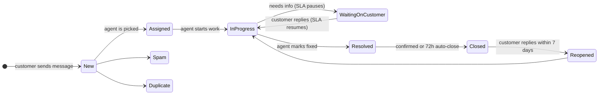
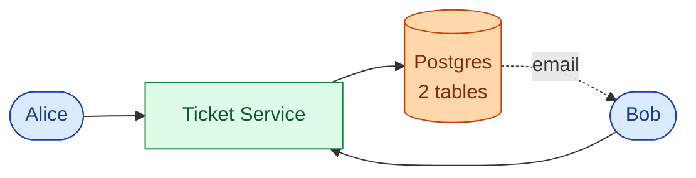
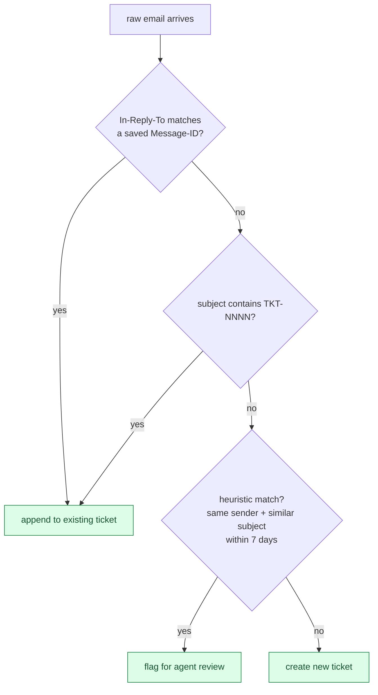
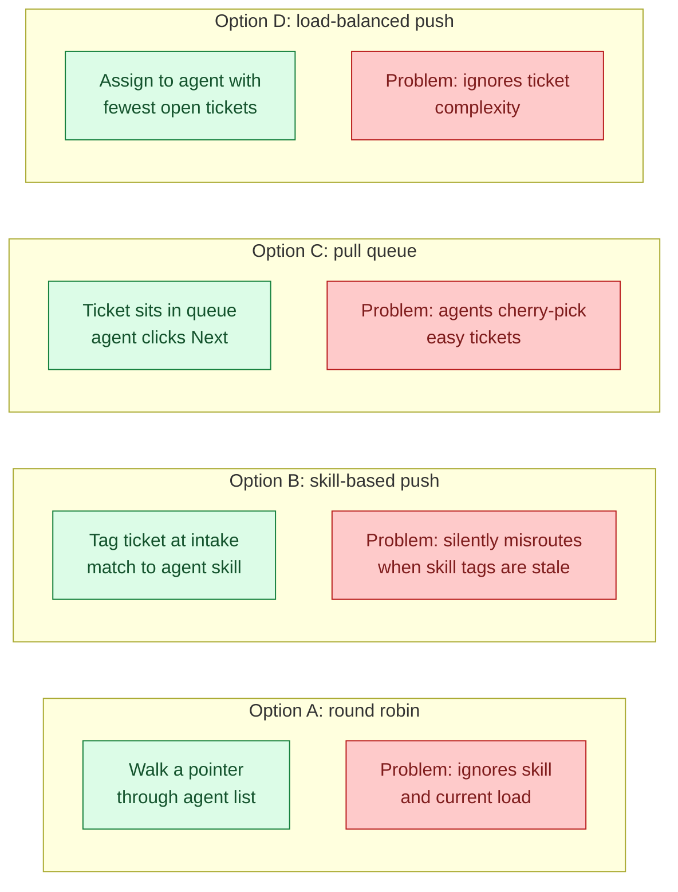
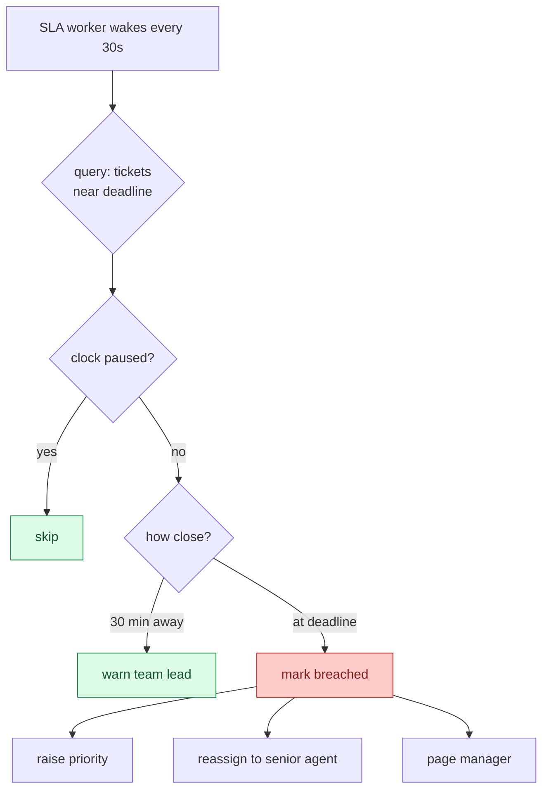
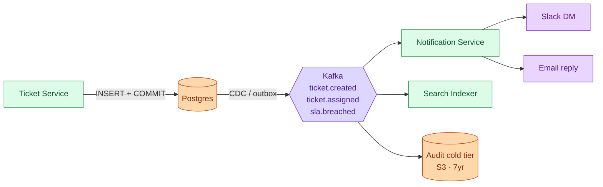
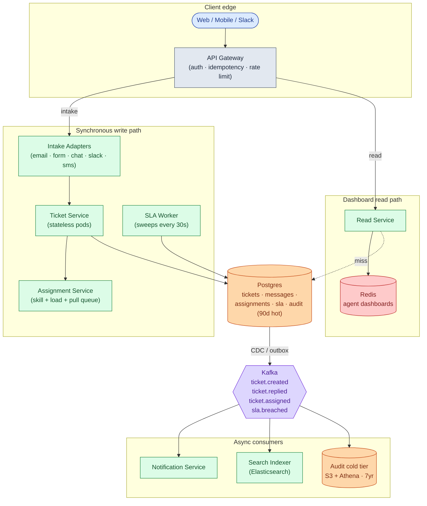
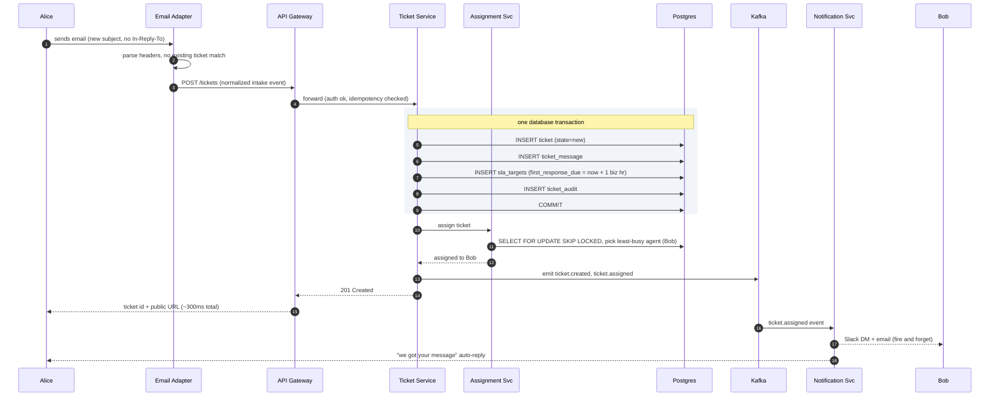
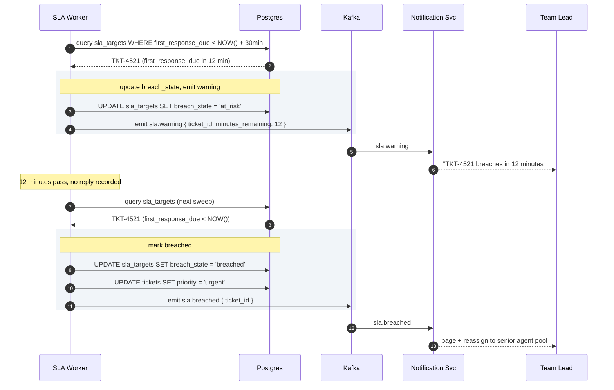
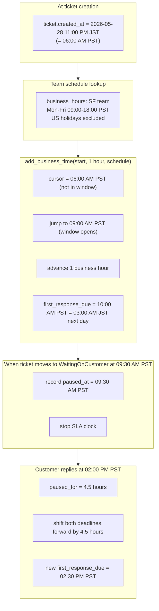

## What we are building

A customer emails support@acme.com: "My order is wrong, I got the wrong size." The email arrives, the system creates a ticket, routes it to the Orders queue, and an agent picks it up. The agent replies, the customer writes back, and the conversation continues on the same thread until the issue is resolved. A timer runs the whole time, tracking whether the team responded within the one-hour window they promised.

That is Zendesk. It sounds like a to-do list with a status column. The interesting problems are hiding inside:

1. **Conversation threading.** Is this incoming email a new problem, or a reply to a ticket from last week?
2. **Routing rules.** Which team gets this ticket? Which agent within that team?
3. **SLA timers.** The timer started Friday at 5 PM. Does it count Saturday and Sunday?
4. **Agent assignment races.** Two agents click "Next Ticket" at the same instant. Who gets it?
5. **Multi-channel ingest.** Email, web form, chat, Slack. Different wire formats, same internal model.

We will start with a 3-agent startup on one database, then scale to 2,000 agents across four regions. At each step, we name what just broke and add the smallest fix.

---

## The lifecycle of one ticket

Every ticket travels through a small set of states. Picture it before drawing any boxes.



A ticket spends most of its life cycling between `InProgress` and `WaitingOnCustomer`. Everything else (SLA, routing, caching, audit) exists to support that loop correctly.

> **Take this with you.** A help desk is a state machine running on many conversations at once. The interesting problems are not about throughput. They are about correctness at every transition.

---

## How big this gets

Same product, two very different companies.

| Company | Agents | Tickets/day | Writes/sec (peak) | Open at once |
|---------|--------|-------------|-------------------|--------------|
| Startup | 3 | 50 | negligible | ~100 |
| Enterprise | 2,000 | 50,000 | ~15 | ~150,000 |

<details markdown="1">
<summary><b>Show: how the numbers come out</b></summary>

Assume each ticket takes an average of 3 days to resolve, and 8 messages total (customer ask, agent reply, follow-ups, close).

**Startup (50 tickets/day)**
- 50 / 86,400 = ~0.0006 tickets/sec. Nearly nothing.
- 8 messages each = 400 messages/day.
- 50 tickets/day x 3-day average = ~100 open at any moment.
- 5 years of data: about 1 GB total. Fits anywhere.

**Enterprise (50,000 tickets/day)**
- 50,000 / 86,400 = ~0.6 tickets/sec average, ~3 at peak.
- 8 messages each = 400,000 messages/day, ~5/sec average, ~15 at peak.
- 50,000/day x 3-day average = ~150,000 open at any moment.
- 2,000 agents refreshing dashboards every 30 seconds = ~65 reads/sec.
- 5 years: ~5 TB of text, ~50 TB of attachments in S3.

**What the math tells you.** This is not a high-throughput system. Even at enterprise scale, you write about 15 things per second. A single Postgres handles that. The design pressure is on read latency (65 agent dashboard reads/sec) and correctness (no lost tickets, no double-assigns).

Reads beat writes about 10 to 1. The read path matters more than the write path.

</details>

---

## The smallest version that works

Forget enterprise. Three agents, one channel: email. Tickets go to whoever is next in the rotation. No SLA timer yet.



Three endpoints carry the whole product.

| Endpoint | What it does |
|----------|--------------|
| `POST /tickets` | Create a new ticket from an intake event |
| `POST /tickets/{id}/messages` | Add a reply (public) or internal note |
| `POST /tickets/{id}/status` | Transition state (assign, resolve, close, reopen) |

<details markdown="1">
<summary><b>Show: the two core tables</b></summary>

```sql
CREATE TABLE tickets (
    ticket_id       UUID PRIMARY KEY,
    public_ref      TEXT NOT NULL UNIQUE,   -- "TKT-1234" shown to customer
    subject         TEXT NOT NULL,
    customer_email  TEXT NOT NULL,
    assignee_id     TEXT,
    team_id         TEXT,
    status          TEXT NOT NULL DEFAULT 'new',
    priority        TEXT NOT NULL DEFAULT 'medium',
    created_at      TIMESTAMPTZ NOT NULL DEFAULT NOW(),
    first_response_at TIMESTAMPTZ,
    resolved_at     TIMESTAMPTZ
);

CREATE TABLE ticket_messages (
    message_id          UUID PRIMARY KEY,
    ticket_id           UUID NOT NULL REFERENCES tickets(ticket_id),
    author_type         TEXT NOT NULL,   -- 'customer' | 'agent' | 'system'
    author_id           TEXT,
    visibility          TEXT NOT NULL DEFAULT 'public',
    body                TEXT NOT NULL,
    inbound_message_id  TEXT,           -- email Message-ID header
    created_at          TIMESTAMPTZ NOT NULL DEFAULT NOW()
);
CREATE UNIQUE INDEX ON ticket_messages (inbound_message_id)
    WHERE inbound_message_id IS NOT NULL;
```

The unique index on `inbound_message_id` is load-bearing: when the email adapter crashes and reprocesses the same message, the duplicate insert fails silently. No duplicate messages on the ticket.

</details>

> **Take this with you.** Start with the smallest thing that works. The interview is really about what you add next, and why.

---

## Decision 1: how do we thread email replies?

The first crack shows up fast. A customer replies to a closed ticket from two weeks ago. The adapter has no idea this is a reply. It creates a new ticket. The customer is furious because the new agent has no context.

Threading an inbound email into the correct ticket requires checking multiple signals in order of trust.



The three layers and what they catch:

| Layer | Signal | Catch rate | Risk |
|-------|--------|------------|------|
| RFC 5322 headers | `In-Reply-To` / `References` | ~85% | Low, headers are reliable |
| Subject tag | `[TKT-1234]` in subject | ~10% | Low, tag is injected by us |
| Heuristic | Same sender, similar subject | ~3% | Medium, can merge unrelated tickets |

The heuristic layer is off by default. Turn it on only after the first two cover the easy cases.

When the adapter sends an outbound message, it saves the outgoing `Message-ID`. Inbound replies carry `In-Reply-To: <that-message-id>`. A single index lookup on `ticket_messages.inbound_message_id` finds the match.

> **Take this with you.** Email threading by header is the single hardest part of a help desk. Build it in three layers: header match first, subject tag second, heuristics never on by default.

---

## Decision 2: how do we pick an agent?

A ticket arrives. 200 agents are logged in. Who gets it?



In practice, most systems combine B and D: skill-based to narrow the candidate pool, load-balanced to pick within that pool, pull queue as fallback when push fails.

The race to solve: two agents click "Next Ticket" at the same instant. Both queries return TKT-100. Both think it is theirs.

Fix: `SELECT ... FOR UPDATE SKIP LOCKED` in Postgres. Agent A locks TKT-100. Agent B's query sees the lock, skips it, and gets TKT-101. Both succeed. No application-level coordination needed.

<details markdown="1">
<summary><b>Show: pull-queue assignment with SKIP LOCKED</b></summary>

```python
def claim_next_ticket(agent):
    with db.transaction():
        ticket = db.query("""
            SELECT ticket_id FROM tickets
            WHERE team_id = ? AND assignee_id IS NULL
              AND status IN ('new', 'assigned')
            ORDER BY priority DESC, created_at ASC
            FOR UPDATE SKIP LOCKED
            LIMIT 1
        """, agent.team_id)
        if not ticket:
            return None
        db.update("tickets", ticket.id,
                  assignee_id=agent.id, status='assigned')
        db.insert("assignments",
                  ticket_id=ticket.id, agent_id=agent.id, reason='pulled')
        return ticket
```

</details>

> **Take this with you.** `FOR UPDATE SKIP LOCKED` is the standard Postgres pattern for work queues. One query, no locks at the application layer, no double-assigns.

---

## Decision 3: how do SLA timers work?

The CEO asks: "We promised enterprise customers a 1-hour first reply. How do we track that?"

Two things make this much harder than they look.

**Problem 1: business hours.** A ticket arrives Friday at 5 PM. The 1-hour SLA must pause at close of business and resume Monday at 9 AM. Deadlines are not `created_at + 1 hour`. They are `created_at + 1 business hour`, which requires walking forward through the team's schedule.

**Problem 2: clock pauses.** When an agent moves a ticket to `WaitingOnCustomer`, the clock must pause. If it keeps running, every ticket that needs customer input eventually breaches through no fault of the agent.



The SLA table is narrow by design. The worker scans it every 30 seconds with a tight index. Keeping SLA columns out of the wide tickets row makes the sweep fast.

<details markdown="1">
<summary><b>Show: SLA table, business-hour math, and the sweep worker</b></summary>

```sql
CREATE TABLE sla_targets (
    ticket_id           UUID PRIMARY KEY REFERENCES tickets(ticket_id),
    priority            TEXT NOT NULL,
    first_response_due  TIMESTAMPTZ,
    resolution_due      TIMESTAMPTZ,
    paused_at           TIMESTAMPTZ,
    pause_reason        TEXT,          -- 'waiting_on_customer' | 'out_of_hours'
    business_hours_id   TEXT NOT NULL,
    first_response_at   TIMESTAMPTZ,
    resolved_at         TIMESTAMPTZ,
    breach_state        TEXT NOT NULL DEFAULT 'on_track'
);
CREATE INDEX idx_sla_first ON sla_targets (first_response_due)
    WHERE first_response_at IS NULL AND paused_at IS NULL;
```

Business-hour-aware deadline computation:

```python
def add_business_time(start, duration, schedule):
    cursor = start
    remaining = duration
    while remaining > 0:
        if not schedule.is_business_time(cursor):
            cursor = schedule.next_window_start(cursor)
            continue
        window_end = schedule.current_window_end(cursor)
        chunk = min(remaining, window_end - cursor)
        cursor += chunk
        remaining -= chunk
    return cursor
```

The sweep worker runs every 30 seconds:

```python
def sla_sweep():
    rows = db.query("""
        SELECT ticket_id, first_response_due
        FROM sla_targets
        WHERE first_response_at IS NULL
          AND paused_at IS NULL
          AND first_response_due < NOW() + interval '30 minutes'
          AND breach_state != 'breached'
    """)
    for row in rows:
        if row.first_response_due < now():
            emit("sla.breached", row.ticket_id)
        else:
            emit("sla.warning", row.ticket_id)
```

Pause when ticket moves to `WaitingOnCustomer`:

```python
def pause_sla(ticket_id, reason):
    db.update("sla_targets", ticket_id, paused_at=now(), pause_reason=reason)

def resume_sla(ticket_id):
    target = db.get("sla_targets", ticket_id)
    if target.paused_at is None:
        return
    paused_for = now() - target.paused_at
    db.update("sla_targets", ticket_id,
              paused_at=None,
              first_response_due=target.first_response_due + paused_for,
              resolution_due=target.resolution_due + paused_for)
```

</details>

> **Take this with you.** SLA timers are not `created_at + N hours`. They require business-hour-aware math, a pause/resume mechanism, and a worker that sweeps regularly. Get any one wrong and the metric becomes untrustworthy.

---

## Decision 4: how do we keep notifications off the write path?

When a ticket is assigned, Bob gets a Slack DM and an email. If Slack is down, should the ticket creation fail? No.

The answer is to separate event emission from event delivery. The Ticket Service writes to Postgres and emits events to Kafka. A Notification Service consumes those events asynchronously and fans out to Slack, email, and push.



If Slack goes down at 3 AM, new tickets still get created and assigned. Agents just do not get Slack DMs until the queue drains.

> **Take this with you.** Anything reactive lives after Kafka, not before. Tie notifications to the write path and every Slack outage becomes a support outage.

---

## The full architecture

Putting the four decisions together:



Each component in one line:

| Component | Purpose |
|-----------|---------|
| **API Gateway** | Authenticates callers, rate-limits bots, deduplicates mobile retries. |
| **Intake Adapters** | Parse channel-native format, thread replies into existing tickets, emit a common event. |
| **Ticket Service** | The state machine. Enforces valid transitions. Writes to Postgres transactionally. Stateless. |
| **Assignment Service** | "Which team? Which agent? Who is on shift right now?" |
| **SLA Worker** | Scans the SLA table every 30 seconds. Fires warnings and breach events. Pauses outside business hours. |
| **Postgres** | Source of truth. Live state plus 90 days of audit. |
| **Read Service + Redis** | Optimized for agent dashboards. Keeps the primary DB from being read constantly. |
| **Kafka** | Carries events to the async world. The boundary between synchronous writes and reactive consumers. |
| **Notification, Search Indexer, Audit cold tier** | Consumers. Not on the write path. If the notifier dies, tickets still flow. |

---

## Walk: one ticket, all the way through

Alice emails support@acme.com about a wrong order.



Three things to notice:

1. The ticket, the message, the SLA row, and the audit entry are written in one transaction. A crash mid-write rolls back cleanly.
2. Kafka is written after the commit. Slack notifications fan out from there. The write path does not wait for Slack.
3. Alice gets her confirmation in ~300ms. Bob gets notified a few seconds later via Kafka.

---

## Walk: SLA warning, then breach

48 minutes pass. Bob has not replied. The SLA worker wakes up.



---

## The hard sub-problem: SLA windows with business hours across timezones

A customer in Tokyo submits a high-priority ticket at 11 PM Japan Standard Time. The support team is in San Francisco. It is 6 AM Pacific. Business hours have not started yet.

The SLA clock must not run during off-hours for the team. But it also must not confuse the customer's timezone with the team's timezone.



Two things the naive implementation gets wrong:

| Mistake | Consequence |
|---------|-------------|
| Use wall-clock time instead of business hours | SLA breaches happen over the weekend when nobody is on shift |
| Forget to pause when waiting on customer | Agents game the system by closing and reopening tickets to reset the clock |

> **Take this with you.** SLA correctness depends on three things working together: business-hour-aware deadline math, clock pauses on `WaitingOnCustomer`, and a reliable sweep worker. Break any one and the metric becomes meaningless.

---

## Follow-up questions

Try answering each in 2-3 sentences before opening the solution.

1. **Email threading when the subject is stripped.** A customer replies from a mobile app that removes the `[TKT-4521]` prefix. The email also has no `In-Reply-To` header. How do you still thread it into the right ticket?

2. **Intake adapter crashes mid-batch.** The email adapter pulled 50 messages from IMAP and crashed after processing 30. On restart, how do you avoid reprocessing the first 30 and losing the last 20?

3. **Two agents claim the same queued ticket.** Both click "Next Ticket" within the same second. The query returns the same ticket to both. How do you make sure only one gets it?

4. **SLA business hours across timezones.** Customer in Tokyo, team in San Francisco. Whose hours apply? What if the contract says "follow the sun"?

5. **Reopen after long silence.** A customer replies to a ticket closed 6 months ago. What does the system do?

6. **New issue from an existing customer.** A customer with an open billing ticket emails again about a completely different problem (login broken). Do you append to the old ticket or open a new one?

7. **Agent vacation handover.** Bob has 47 open tickets and starts a 2-week vacation. How do you hand them off?

8. **Spam at the front door.** Your support email gets 10,000 spam messages a day. How do you stop them from becoming tickets?

9. **Knowledge base suggestions at intake.** When a customer fills out the web form, you want to show 3 relevant KB articles before they hit submit. How do you do this without slowing the form?

10. **"Average time to resolve" is wrong.** Management says the dashboard shows 2 hours, but tickets actually take days. What is wrong, and how do you fix it?

---

## Related problems

- **[Approval Management (011)](../011-approval-management/question.md).** Same state-machine + role-routing + SLA-timer patterns. A ticket's lifecycle is structurally identical to an approval's lifecycle.
- **[Notification System (010)](../010-notification-system/question.md).** Every ticket state change (assigned, replied, breached, resolved) fans out to email, Slack, and push. The retry and quiet-hours machinery there is what consumes ticket events.
- **[Comment System (015)](../015-comment-system/question.md).** Ticket messages are shaped like comments: threaded, paginated, with attachments. The same storage and indexing patterns apply.
- **[Read-Heavy System Patterns (017)](../017-read-heavy-patterns/question.md).** Agent dashboards and customer portals load tickets thousands of times per day. Cache tiering and read replicas from that problem apply directly here.
