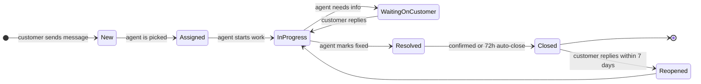
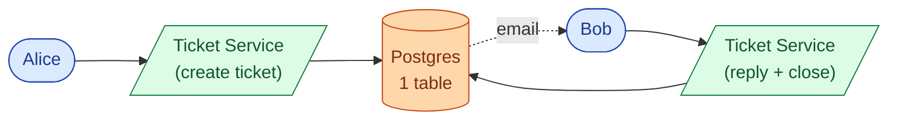
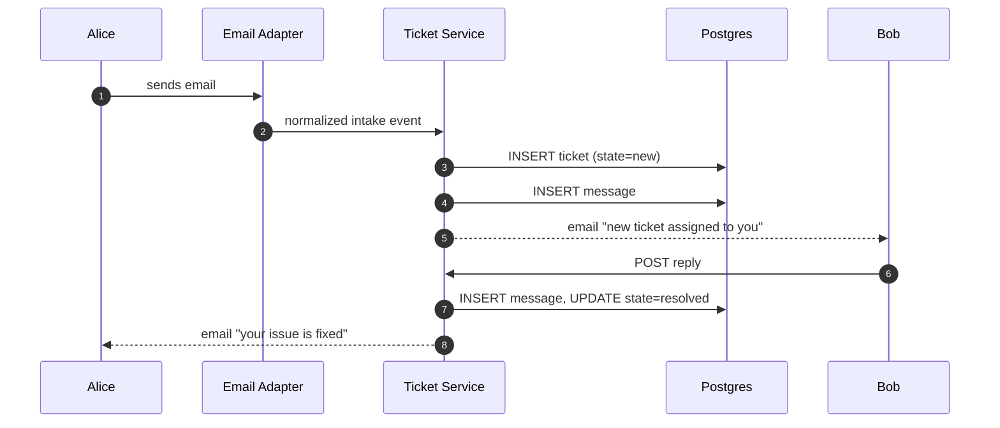
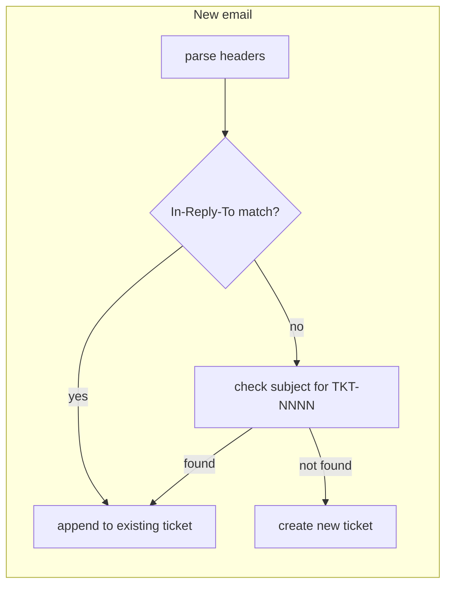
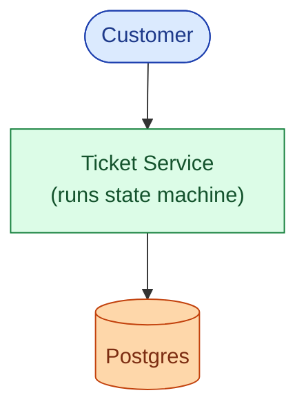
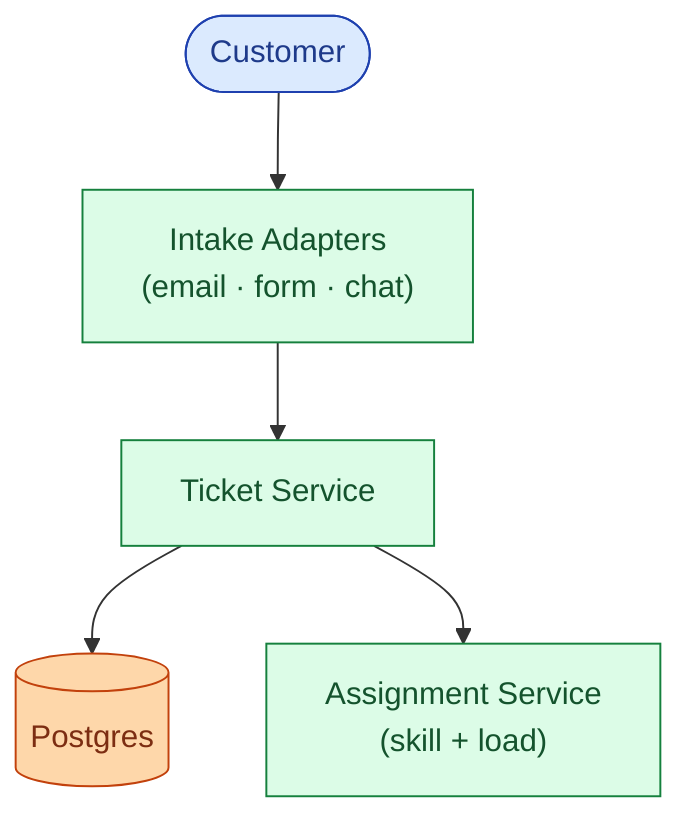
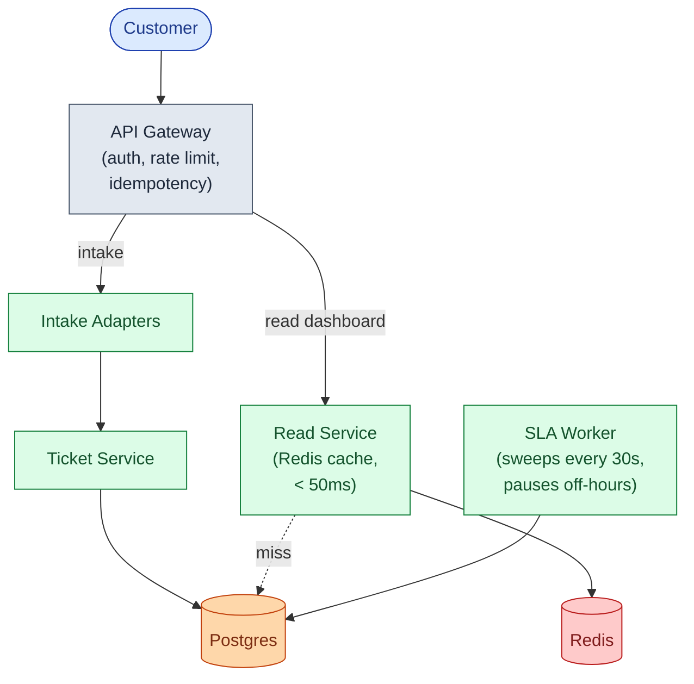
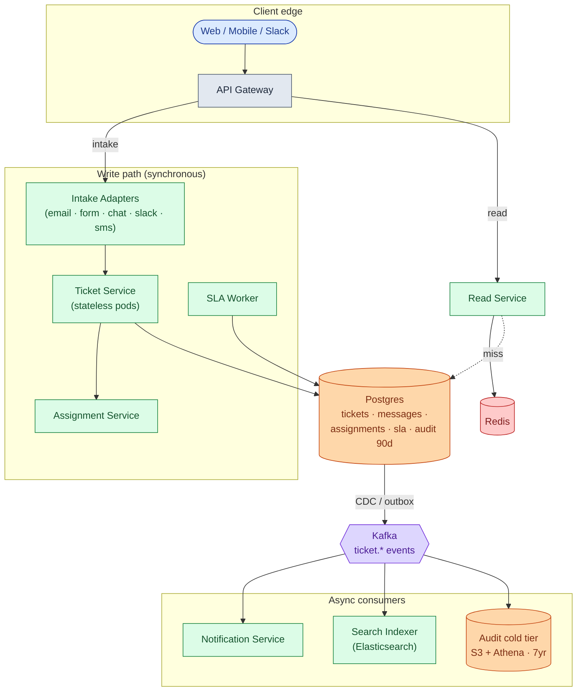
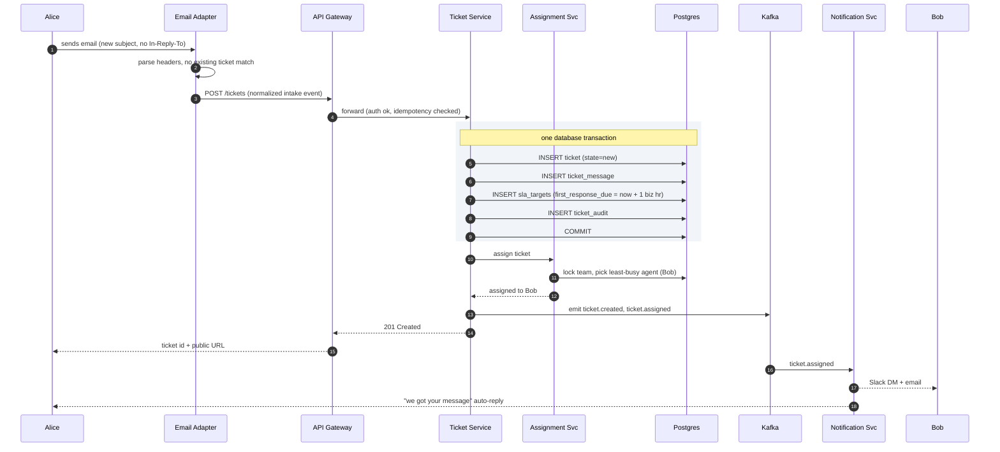
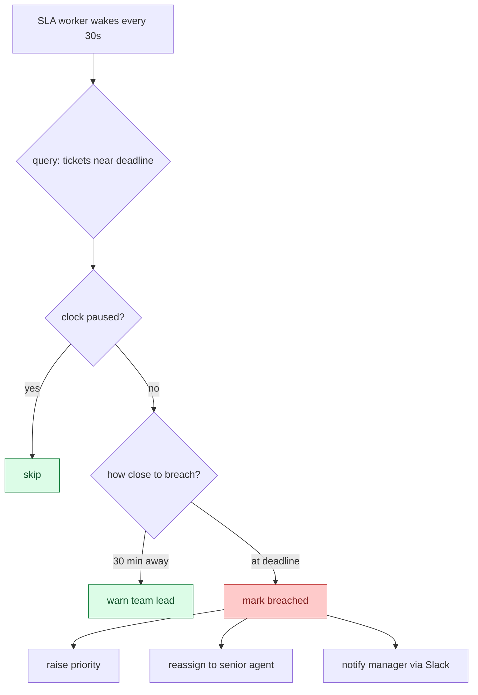

## The scene

You sit down. The interviewer leans forward.

> *"Our support team gets 500 emails a day. Some come from the web form, some from Slack, some from direct email. An agent reads each one, answers it, and closes it. Sometimes the customer writes back. Sometimes nobody responds and the ticket just sits there."*
>
> *"We need a system to manage all of this. We promised our enterprise customers: first reply within one hour, full fix within 24. If we miss that window, we want to know before it happens."*
>
> *"Build me a basic Zendesk."*

That sounds like a to-do list with a status column. It is not.

The word **ticket** sounds like a row in a table. The real questions are harder:

- An email arrives. Is it a brand-new problem, or a reply to a ticket from last week?
- 200 agents are online. Who gets this ticket? The one with the right skill? The least busy one?
- A ticket comes in Friday at 5 PM. Does the SLA clock count Saturday and Sunday?
- A customer goes silent for six months, then replies. Do you reopen the old ticket or start a new one?

Real products (Zendesk, Freshdesk, ServiceNow, Intercom) all solve the same five sub-problems: **intake, lifecycle, assignment, SLA timers, and reporting**. We will walk through each one.

We start with a 3-agent startup. We end with 2,000 agents across four regions. At every step we name what just broke and add the smallest fix.

---

## Step 1: Picture one ticket

Before any boxes, just picture what one ticket **is**. A customer reports a problem. An agent fixes it. That is the whole product.



That is the whole product in one picture. Everything we add later (SLA, assignment, multi-channel intake, audit) is a complication on top of this core loop.

> **Take this with you.** A help desk is a small state machine running on a lot of conversations. The interesting problems are not about throughput. They are about correctness at every transition.

---

## Step 2: Ask the right questions

In a real interview, pause for two minutes and write down what you want to ask. Not twenty questions. Five sharp ones.

<details markdown="1">
<summary><b>Show: 5 questions that change the design</b></summary>

1. **Which channels?** Email only, or also chat, web form, Slack, SMS? *Each channel needs its own adapter. Email is the messiest because of reply threading. Chat is the easiest because the session already groups messages.*

2. **How many tickets per day, and how many agents?** 50 tickets with 3 agents is a weekend project. 50,000 tickets with 2,000 agents is a real distributed system.

3. **What does the SLA look like?** "Respond in 1 hour, resolve in 24 hours" is common. The big question: is the clock 24/7, or does it pause outside business hours? *Business-hour SLAs are the single most error-prone part of the entire system.*

4. **How does the system pick an agent?** Round robin? By skill? Pull queue? Least busy? *The wrong choice burns out a few agents while others sit idle.*

5. **How long do we keep closed tickets?** Standard compliance is 5-7 years. HIPAA needs longer. GDPR may require deletion.

A strong candidate also asks the meta question: *"Is sending notifications part of this service, or a separate one?"* The right answer is separate. The ticket system emits events. A notification service consumes them.

</details>

---

## Step 3: How big is this thing?

Same product, two very different companies.

| Company | Agents | Tickets/day | Writes/sec | Open at once |
|---------|--------|-------------|------------|--------------|
| Startup | 3 | 50 | tiny | ~100 |
| Enterprise | 2,000 | 50,000 | ~5 avg, ~15 peak | ~150,000 |

<details markdown="1">
<summary><b>Show: how the numbers come out</b></summary>

Assume each ticket takes an average of 3 days to resolve, and 8 messages total (customer ask, agent reply, follow-ups, close).

**Startup (50 tickets/day)**
- 50 / 86,400 = ~0.0006 tickets/sec. Nearly nothing.
- 8 messages each = 400 messages/day.
- 50 tickets/day × 3-day average = ~100 open at any moment.
- 5 years of data: about 1 GB total. Fits anywhere.

**Enterprise (50,000 tickets/day)**
- 50,000 / 86,400 = ~0.6 tickets/sec average, ~3 at peak.
- 8 messages each = 400,000 messages/day, ~5/sec average, ~15 at peak.
- 50,000/day × 3-day average = ~150,000 open at any moment.
- 2,000 agents refreshing dashboards every 30 seconds = ~65 reads/sec.
- 5 years: ~5 TB of text, ~50 TB of attachments in S3.

**What the math tells you.** This is not a high-throughput system. Even at enterprise scale, you write about 15 things per second. A single Postgres handles that comfortably. The hard numbers are about read latency (65 agent dashboard reads/sec) and correctness (do not lose tickets, do not double-assign).

Reads beat writes about **10 to 1**. The read path matters more than the write path.

</details>

---

## Step 4: The smallest thing that works

Forget enterprise. We are a 3-agent startup. One channel: email. Tickets go to whoever is next in the rotation. No SLA timer yet.

Three boxes. Nothing else.



The happy path from email to close:



<details markdown="1">
<summary><b>Show: the two core tables</b></summary>

```sql
CREATE TABLE tickets (
    ticket_id       UUID PRIMARY KEY,
    subject         TEXT NOT NULL,
    customer_email  TEXT NOT NULL,
    assignee_id     TEXT,
    status          TEXT NOT NULL DEFAULT 'new',
    created_at      TIMESTAMPTZ NOT NULL DEFAULT NOW(),
    resolved_at     TIMESTAMPTZ
);

CREATE TABLE ticket_messages (
    message_id  UUID PRIMARY KEY,
    ticket_id   UUID NOT NULL REFERENCES tickets(ticket_id),
    author_id   TEXT,
    body        TEXT NOT NULL,
    created_at  TIMESTAMPTZ NOT NULL DEFAULT NOW()
);
```

Two tables. This is the right place to start. Everything we add from here is a response to a real problem that showed up in production.

</details>

> **Take this with you.** Always start from the smallest thing that works. The interview is really about what you add next, and why.

---

## Step 5: The first crack

The startup grows. Two things happen in the same week.

First, a customer replies to a closed ticket from two weeks ago. The adapter has no idea this is a reply. It creates a new ticket. The new ticket gets assigned to a different agent, who has no context. The customer is furious.

Second, the CEO asks: *"We promised enterprise customers a 1-hour first reply. How do we track that?"*

Two separate problems. Both reveal that the skeleton we built is missing something real.

For the reply problem, you need **email threading**: the ability to look at an inbound email and decide whether it is a new ticket or a reply to an existing one.

For the SLA problem, you need a **timer per ticket** that knows when the clock started and when it must stop.

Neither of these is complicated in isolation. Together they introduce a pattern that runs through the entire system: **the system must track state over time, not just state at a single moment**.



<details markdown="1">
<summary><b>Show: how email threading works, layer by layer</b></summary>

Every email has a `Message-ID` header (a globally unique string). When you reply in Gmail, the reply includes `In-Reply-To: <original-message-id>`. That is the primary threading signal.

**Layer 1: `In-Reply-To` and `References` headers (RFC 5322)**

When the help desk sends an agent reply, it saves the outgoing `Message-ID`. When a customer replies, the adapter checks whether the incoming `In-Reply-To` matches any saved `Message-ID`. If it does, the email goes onto the existing ticket. This catches about 85% of replies.

**Layer 2: Subject tag**

Some corporate mail proxies strip email headers. So every outbound message also injects a tag into the subject:

```
Subject: Re: [TKT-4521] Cannot log in
```

If the header lookup fails, the adapter checks the subject for `[TKT-NNNN]`. This catches another ~10%.

**Layer 3: Heuristics (off by default)**

Same sender + similar subject + within last 7 days. Risky because two unrelated emails with similar subjects get merged. Most help desks leave this off and let agents merge manually.

The remaining ~5% open new tickets. Agents merge duplicates via a "merge into" button.

</details>

> **Take this with you.** Email threading by header is the single hardest part of a help desk. Build it in three layers: header match first, subject tag second, heuristics never by default.

---

## Step 6: Build the architecture, one layer at a time

We have a ticket service, a threading problem, and an SLA promise to keep. Now build the system around these. One layer at a time.

### v1: ticket service + one database



Fine for ten users.

### v2: add the intake adapters and assignment

Different channels need different parsing logic. Pull that out into a thin **Intake Adapter** per channel. Each adapter normalizes to a common event. Add an **Assignment Service** that picks the right team and agent.



### v3: add the SLA worker and agent dashboards

Two things break as the team grows. Agents ask how many tickets are close to breaching SLA. The tickets table is now too big to scan on every dashboard load. Add a dedicated **SLA Worker** that sweeps every 30 seconds. Add a **Read Service** backed by Redis for agent dashboards.



### v4: notifications, search, and audit archival

These should not slow down the write path. If Slack is down, tickets must still flow. Add **Kafka**. Notifications, Elasticsearch indexing, cache invalidation, and audit archival all become consumers.



Each box, in one line:

| Box | What it does |
|-----|--------------|
| **API Gateway** | Authenticates callers, rate-limits bots, dedupes mobile retries. |
| **Intake Adapters** | Parse channel-native format, thread replies into existing tickets, emit a common event. |
| **Ticket Service** | The brain. Enforces valid state transitions. Writes to Postgres transactionally. Stateless. |
| **Assignment Service** | "Which team? Which agent? Who is on shift right now?" |
| **SLA Worker** | Scans the SLA table every 30 seconds. Fires warnings and breach events. Pauses outside business hours. |
| **Postgres** | Source of truth. Live state + 90 days of audit. |
| **Read Service + Redis** | Optimized for agent dashboards. Keeps the primary DB from being read to death. |
| **Kafka** | Carries events to the async world. |
| **Notification, Search Indexer, Audit cold tier** | Consumers. Not on the write path. If the notifier dies, tickets still flow. |

> **Take this with you.** If Slack is down at 3 a.m., new tickets still get created and assigned. Agents just do not get Slack DMs. Anything reactive lives **after** Kafka, not before.

---

## Step 7: One ticket, all the way through

Alice sends an email. Watch what happens.



Three things worth pointing at:

1. The ticket, the first message, the SLA row, and the audit entry are written in **one transaction**. A crash mid-write rolls back cleanly. Either all four exist, or none.
2. Kafka is written **after** the commit. Notifications fan out from there. The write path does not wait for Slack or email.
3. The Ticket Service is stateless. Restart any pod at any time. State lives in Postgres.

---

## Step 8: SLA timers and business hours

A common SLA: respond to high-priority tickets within 1 hour, resolve within 24. On breach, escalate.

Two things make this much harder than they look.

**Problem 1: business hours.** A ticket arrives Friday at 5 PM. Does the 1-hour clock run through the weekend? No. It must pause at 5 PM Friday and resume 9 AM Monday. That means deadlines are not `created_at + 1 hour`. They are `created_at + 1 business hour`, which requires walking forward through the team's schedule.

**Problem 2: clock pauses.** When an agent moves a ticket to `waiting_on_customer`, the clock pauses. The agent asked for information. The customer has not replied yet. Blaming the agent for that wait makes the SLA metric meaningless.



<details markdown="1">
<summary><b>Show: SLA table, business-hour math, and the sweep worker</b></summary>

```sql
CREATE TABLE sla_targets (
    ticket_id           UUID PRIMARY KEY,
    priority            TEXT NOT NULL,
    first_response_due  TIMESTAMPTZ,
    resolution_due      TIMESTAMPTZ,
    paused_at           TIMESTAMPTZ,
    pause_reason        TEXT,          -- 'waiting_on_customer' | 'out_of_hours'
    business_hours_id   TEXT NOT NULL,
    first_response_at   TIMESTAMPTZ,
    resolved_at         TIMESTAMPTZ,
    breach_state        TEXT NOT NULL DEFAULT 'on_track'
);

CREATE INDEX idx_sla_first ON sla_targets (first_response_due)
    WHERE first_response_at IS NULL AND paused_at IS NULL;
```

The deadline is not `created_at + 1 hour`. It is `created_at + 1 hour of business time`. You compute it by walking forward through the schedule:

```python
def add_business_time(start, duration, schedule):
    cursor = start
    remaining = duration
    while remaining > 0:
        if not schedule.is_business_time(cursor):
            cursor = schedule.next_window_start(cursor)
            continue
        window_end = schedule.current_window_end(cursor)
        chunk = min(remaining, window_end - cursor)
        cursor += chunk
        remaining -= chunk
    return cursor
```

The sweep worker runs every 30 seconds:

```python
def sla_sweep():
    rows = db.query("""
        SELECT ticket_id, first_response_due
        FROM sla_targets
        WHERE first_response_at IS NULL
          AND paused_at IS NULL
          AND first_response_due < NOW() + interval '30 minutes'
          AND breach_state != 'breached'
    """)
    for row in rows:
        if row.first_response_due < now():
            emit("sla.breached", row.ticket_id)
        else:
            emit("sla.warning", row.ticket_id)
```

When the clock pauses (agent sends to `waiting_on_customer`):

```python
def pause_sla(ticket_id, reason):
    db.update("sla_targets", ticket_id, paused_at=now(), pause_reason=reason)

def resume_sla(ticket_id):
    target = db.get("sla_targets", ticket_id)
    if target.paused_at is None:
        return
    paused_for = now() - target.paused_at
    db.update("sla_targets", ticket_id,
              paused_at=None,
              first_response_due=target.first_response_due + paused_for,
              resolution_due=target.resolution_due + paused_for)
```

Escalation rules live in config, not in code:

```yaml
escalation_policy: high_priority_default
rules:
  - on: sla.warning
    action: notify
    recipient: team_lead

  - on: sla.breached
    action: reassign
    target: senior_agent_pool

  - on: sla.breached + 30min
    action: notify
    recipient: support_manager
    via: [email, slack, pagerduty]
```

</details>

> **Take this with you.** SLA timers are not `created_at + N hours`. They require business-hour-aware math, a pause/resume mechanism, and a separate worker that sweeps regularly. Get any one wrong and the whole metric becomes untrustworthy.

---

## Step 9: How to pick an agent

A ticket arrives. 2,000 agents are logged in. Who gets it?

Four strategies. Each has a sweet spot and a failure mode.

| Strategy | How it works | When it breaks |
|----------|-------------|----------------|
| **Round robin** | Walk a pointer through the agent list. | Ignores who is busy. Ignores skill. |
| **Skill-based** | Tag tickets at intake. Match to agents with the right skill. | Misroutes silently when skill tags are stale. |
| **Pull queue** | Tickets sit in a queue. Agents click "give me the next one." | Agents cherry-pick easy tickets. Hard ones sit. |
| **Load-balanced push** | Assign to the agent with the fewest open tickets. | Ignores ticket complexity. One hard ticket counts the same as one easy one. |

In practice, most systems combine these: skill-based to narrow the candidate pool, load-balanced to pick within that pool, pull queue as fallback when push fails.

The race to handle: two agents click "Next Ticket" at the same instant. Both queries return TKT-100. Both think it is theirs.

Fix: use `SELECT ... FOR UPDATE SKIP LOCKED` in Postgres. Agent A locks TKT-100. Agent B's query sees the lock, skips TKT-100, and gets TKT-101. Both succeed.

<details markdown="1">
<summary><b>Show: pull-queue assignment with SKIP LOCKED</b></summary>

```python
def claim_next_ticket(agent):
    with db.transaction():
        ticket = db.query("""
            SELECT ticket_id FROM tickets
            WHERE team_id = ? AND assignee_id IS NULL
              AND status IN ('new', 'assigned')
            ORDER BY priority DESC, created_at ASC
            FOR UPDATE SKIP LOCKED
            LIMIT 1
        """, agent.team_id)
        if not ticket:
            return None
        db.update("tickets", ticket.id,
                  assignee_id=agent.id, status='assigned')
        db.insert("assignments",
                  ticket_id=ticket.id, agent_id=agent.id, reason='pulled')
        return ticket
```

`FOR UPDATE SKIP LOCKED` is the key. Two agents run the query at the same instant. Each gets a different ticket, because a locked row is invisible to the second query.

</details>

> **Take this with you.** `FOR UPDATE SKIP LOCKED` is the standard Postgres pattern for work queues. One query, no application-level coordination, no duplicate claims.

---

## Follow-up questions

Try answering each in 2-3 sentences before opening the solution.

1. **Email threading when the subject is stripped.** A customer replies from their phone, which removes the `[TKT-4521]` subject prefix. The email also has no `In-Reply-To` header. How do you still thread it into the right ticket?

2. **Intake adapter crashes mid-batch.** The email adapter pulled 50 messages from IMAP. It crashed after processing 30. On restart, how do you avoid reprocessing the first 30 and avoid losing the last 20?

3. **Two agents claim the same queued ticket.** Both click "Next Ticket" within the same second. The query returns the same ticket to both. How do you make sure only one gets it?

4. **SLA business hours across timezones.** Customer in Tokyo. Team in San Francisco. Whose hours apply? What if the contract says "follow the sun"?

5. **Reopen after long silence.** A customer replies to a ticket closed 6 months ago. What does the system do?

6. **New issue from an existing customer.** A customer with an open billing ticket emails again about a completely different problem (login broken). Do you append to the old ticket or open a new one?

7. **Agent vacation handover.** Bob has 47 open tickets and starts a 2-week vacation. How do you hand them off?

8. **Spam at the front door.** Your support email gets 10,000 spam messages a day. How do you stop them from becoming tickets?

9. **Knowledge base suggestions at intake.** When a customer fills out the web form, you want to show 3 relevant KB articles before they hit submit. How do you do this without slowing the form?

10. **"Average time to resolve" is wrong.** Management says the dashboard shows 2 hours, but tickets actually take days. What is wrong, and how do you fix it?

---

## Related problems

- **[Approval Management (011)](../011-approval-management/question.md).** Same state-machine + role-routing + SLA-timer patterns. A ticket's lifecycle is structurally identical to an approval's lifecycle.
- **[Notification System (010)](../010-notification-system/question.md).** Every ticket state change (assigned, replied, breached, resolved) fans out to email, Slack, and push. The retry and quiet-hours machinery there is what consumes ticket events.
- **[Comment System (015)](../015-comment-system/question.md).** Ticket messages are shaped like comments: threaded, paginated, with attachments. The same storage and indexing patterns apply.
- **[Read-Heavy System Patterns (017)](../017-read-heavy-patterns/question.md).** Agent dashboards and customer portals load tickets thousands of times per day. Cache tiering and read replicas from that problem apply directly here.
