## What we are building

A file upload and share service lets users store large files in the cloud and hand out links to other people. Think of it as Dropbox or Google Drive in miniature.

Concrete example: Alice opens the web app and uploads a 4 GB video she shot on her phone. The connection drops twice over hotel WiFi, but the upload picks up from where it left off. When it finishes, the service runs a background virus scan and marks the file ready. Alice clicks Share and gets a link. She sends it to Bob. Bob opens the link in his browser and downloads the file. Meanwhile, a hundred other users have already uploaded the exact same video file (the same software installer, perhaps). The service stores only one copy of the bytes and lets all hundred users point at it.

The problems hiding in that story:

1. **Resumable upload.** A 4 GB upload over a flaky connection cannot be one big HTTP request. If it dies at 80%, the user cannot restart from scratch.
2. **Chunking and parallelism.** Large files need to split into chunks that upload independently and in parallel.
3. **Content deduplication.** Fifty users uploading the same installer should not store it fifty times. Hash the bytes. Share one copy.
4. **Share-link permissions.** Alice can revoke one link without breaking 999 others. Bob gets view access, not download access.
5. **Virus and abuse scanning.** An infected file uploaded to a public product is a security incident. The scan should not block the upload response.

---

## The lifecycle of one file

Before drawing boxes, picture the states a file moves through.

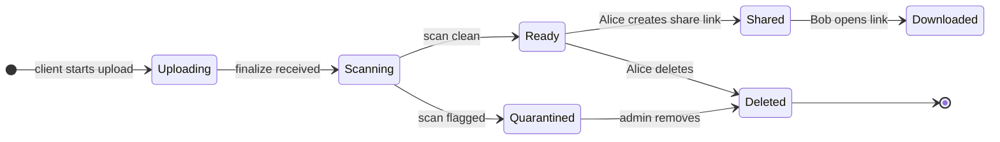

Everything we add later (chunked upload, dedup, cold tier, revocation) is a complication on top of this state machine.

> **Take this with you.** A file service is a state machine around bytes. The state lives in your database. The bytes live in object storage. They are two separate things.

---

## How big this gets

Two scales shape very different designs. Do the math before drawing anything.

| Input | 10k users | 100M users |
|-------|-----------|------------|
| Uploads per second (sustained) | ~0.08 | ~3,300 |
| Downloads per second (sustained) | ~0.8 | ~33,000 |
| Storage per year (raw) | ~13 TB | ~840 PB |
| Egress at peak | ~100 Mbps | ~6.4 Tbps |

<details markdown="1">
<summary><b>Show: how the numbers come out</b></summary>

**10k users:**
- 10,000 users, 5 uploads per week, 5 MB average.
- 50,000/week = ~7,000/day = **~0.08/sec sustained, ~0.25/sec peak.** Tiny.
- Downloads at 10x: ~0.8/sec.
- Storage: 7,000/day x 5 MB = ~13 TB/year.

One server. One Postgres. One S3 bucket. The throughput is not the challenge. The interesting part is the upload protocol for a 5 GB file and the share-link permission model.

**100M users:**
- 100M users, 20 uploads per week, 8 MB average.
- 2B/week = **~3,300/sec sustained, ~10,000/sec peak.**
- Downloads at 10x: ~33k/sec sustained, ~100k/sec peak.
- Storage: 286M/day x 8 MB = ~2.3 PB/day = ~840 PB/year raw. With ~30% dedup savings: ~**580 PB/year.**
- Egress at peak: 100k x 8 MB = 800 GB/s = **~6.4 Tbps.** CDN is not optional.

**The two numbers that dominate decisions:**

Storage cost is the headline expense. At 580 PB, $0.023/GB/month for S3 Standard is ~$160M/year. Lifecycle tiers and dedup are survival, not optimization.

Bandwidth through your servers is the scaling killer. One 10 Gbps NIC handles ~1.25 GB/s, which is only ~150 concurrent 8 MB uploads. At 10,000 concurrent uploads you need 70 servers just to forward bytes. Presigned upload URLs let the client go direct to S3. Your servers never touch the bytes.

</details>

> **Take this with you.** Reads beat writes by request count, but writes beat reads by bytes. CDN absorbs downloads. Presigned URLs remove your servers from the upload byte path. Storage lifecycle tiers are the cost model, not a nice-to-have.

---

## The smallest version that works

For 10 users, three boxes are enough.

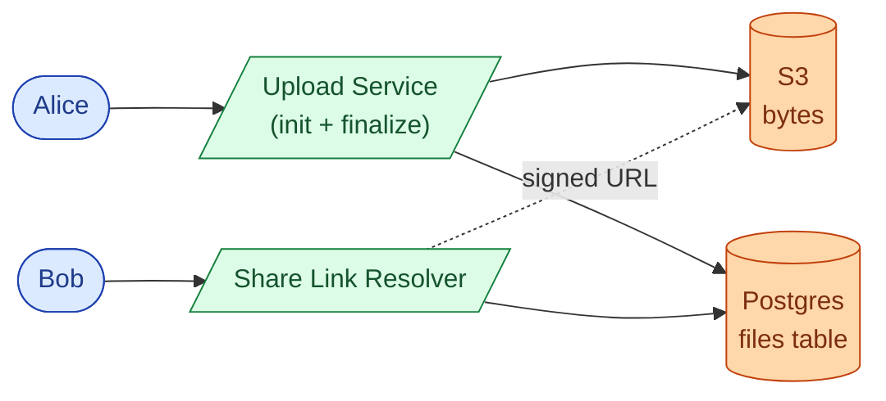

Two phases: upload, then share-link redeem.

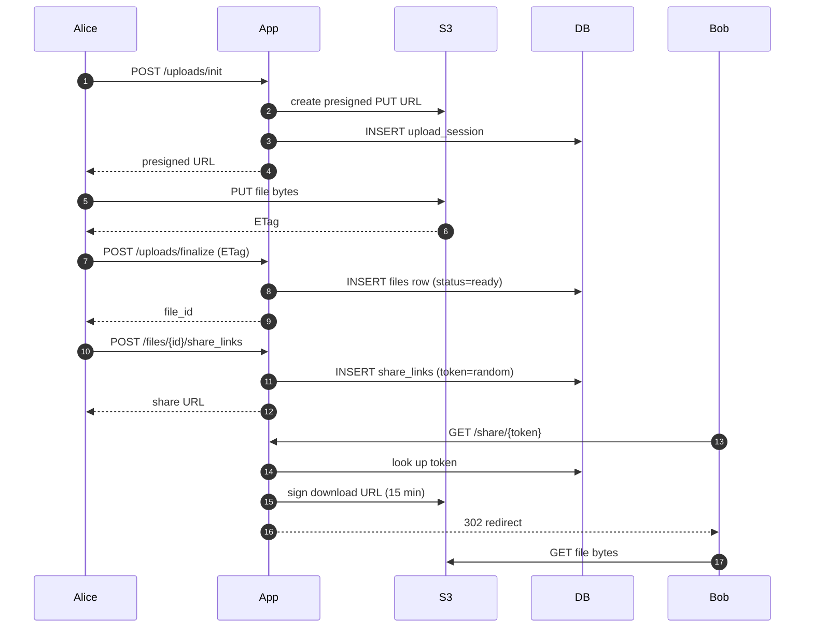

<details markdown="1">
<summary><b>Show: the two core tables</b></summary>

```sql
CREATE TABLE files (
    file_id      UUID PRIMARY KEY,
    owner_id     BIGINT NOT NULL,
    name         TEXT NOT NULL,
    size_bytes   BIGINT NOT NULL,
    content_hash BYTEA NOT NULL,
    status       SMALLINT NOT NULL DEFAULT 1,  -- 1=uploading, 2=ready, 3=quarantined, 4=deleted
    created_at   TIMESTAMPTZ NOT NULL DEFAULT NOW()
);

CREATE TABLE share_links (
    token           VARCHAR(32) PRIMARY KEY,  -- 192-bit random
    file_id         UUID NOT NULL,
    created_by      BIGINT NOT NULL,
    permission      SMALLINT NOT NULL,        -- 1=view, 2=download, 3=edit
    expires_at      TIMESTAMPTZ,
    revoked_at      TIMESTAMPTZ
);
```

</details>

---

## Decision 1: how do we make a large upload survive a bad connection?

A 4 GB upload over hotel WiFi is not a single HTTP request. Any dropped packet restarts the whole thing. The protocol has to be chunked.

Three options:

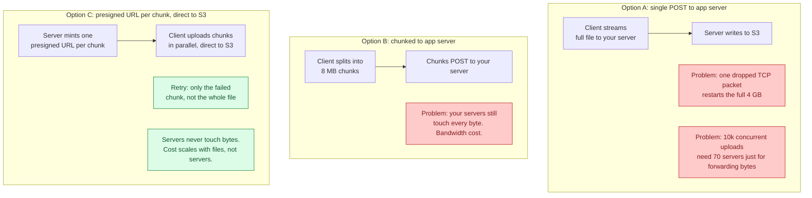

The answer is C, combined with S3 multipart upload. Each chunk gets its own presigned URL, uploading directly and in parallel. A failed chunk retries on its own. When all chunks land, the client sends a finalize call with the list of ETags and S3 stitches them together.

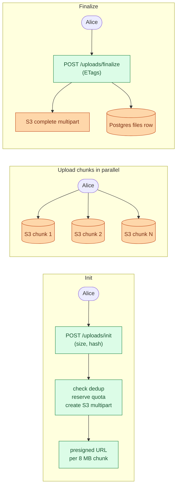

A 4 GB upload at 8 MB per chunk uses ~500 chunks. If chunk 312 fails, only chunk 312 retries.

<details markdown="1">
<summary><b>Show: the chunked upload sequence in full</b></summary>

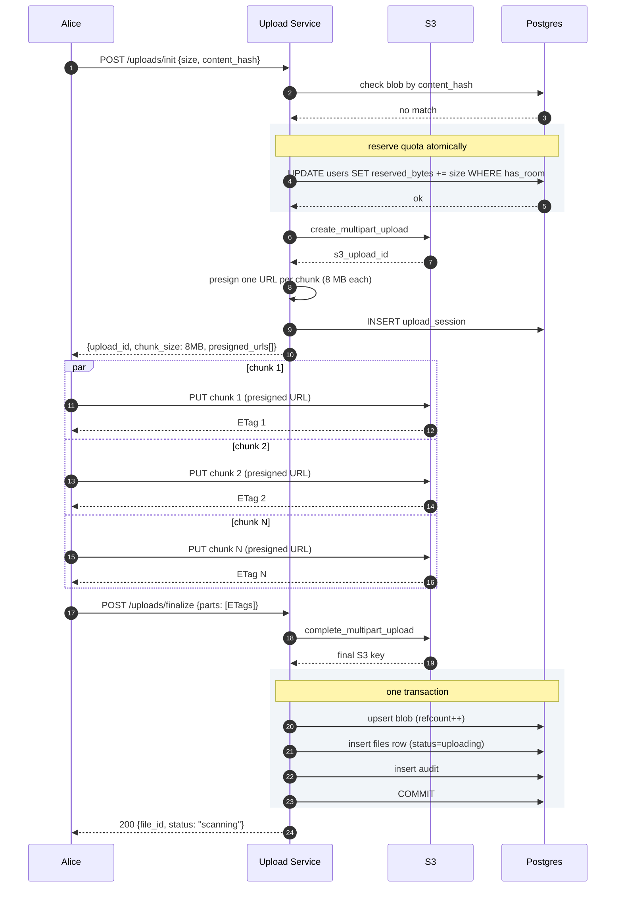

</details>

> **Take this with you.** Chunked upload with presigned URLs solves two problems at once: the client retries individual chunks (resilience), and the bytes never pass through your servers (cost).

---

## Decision 2: how do we avoid storing the same file 50 times?

Fifty users upload the same 200 MB software installer. Storing 10 GB for what is effectively one file wastes storage and money.

The fix: content-addressed dedup. Hash the bytes (SHA-256). Two files with the same bytes produce the same hash. Store the bytes once. Let many user-owned file records point at the same blob.

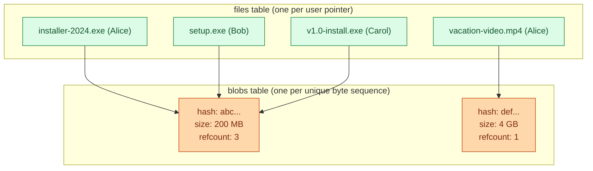

The dedup check happens at upload init. The client sends the SHA-256 hash before uploading. If a blob with that hash already exists, the server skips the upload entirely and returns the existing file ID. The client never sends a byte.

When Alice deletes her copy: decrement refcount from 3 to 2. Bob and Carol still point at the blob. Blob stays. When refcount hits zero, schedule the bytes for deletion after a 24-hour grace period.

Consumer file-sharing services see ~30% storage savings from dedup. On 580 PB that is 170 PB saved, which at $0.023/GB/month works out to roughly $50M/year.

| Operation | What happens |
|-----------|--------------|
| User uploads new file | Check hash at init. No match: proceed with S3 multipart. |
| User uploads duplicate | Match found at init: return existing file_id. No S3 call. Dedup hit rate ~30%. |
| User deletes their copy | Decrement refcount. If 0: schedule S3 delete after 24h grace. |
| Two users delete at once | `UPDATE blobs SET refcount = refcount - 1 ... RETURNING refcount`. Atomic. |

> **Take this with you.** Blob is the bytes. File is the user-named pointer. Keep them in separate tables. The rest follows from refcount.

---

## Decision 3: how do share-link permissions work?

Alice has 1,000 share links on the same file. She wants to revoke one of them. The other 999 should keep working. And she wants one link to be view-only while another is download-only.

The wrong design: make the file ID the share credential. If the URL is `/files/abc123`, every link gives the same access and you cannot revoke one without revoking all.

The right design: one row per share link, with an opaque high-entropy token.


The signed CloudFront URL expires in 15 minutes. A view-only link gets a URL scoped to that permission. A download link gets a wider URL. The permission is enforced at link creation, not at download time.

Revoke one link: `UPDATE share_links SET revoked_at = NOW() WHERE token = ?`. One row update. The other 999 rows are untouched.

Token generation: 192 bits of randomness. No relationship to the file ID, owner, or creation time. Brute force is out.

> **Take this with you.** One row per share link. Revoke by setting `revoked_at` on that row. Never make the file ID the download credential.

---

## Decision 4: how does the virus scan work without blocking the upload?

Scanning a 4 GB file takes minutes. Blocking the upload response until the scan finishes is a bad user experience.

Two options:

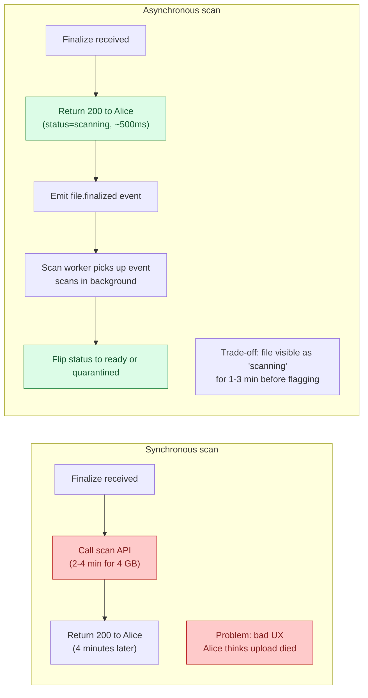

The async approach wins on UX. The trade-off: a malicious file is live for 1 to 3 minutes before the scan completes. Downloads of unscanned files return `425 Too Early` so Bob cannot download while scanning is in progress.

The scan pipeline:

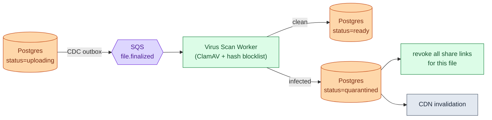

If the scan worker dies and the message goes back to the queue, another worker picks it up. The scan is idempotent. If the scan queue falls behind, uploads still succeed. Scans just lag.

> **Take this with you.** Anything reactive to an upload goes after the queue, not before the 200 response. If the worker dies at 3 a.m., uploads still work.

---

## Decision 5: how do we control storage cost as the system grows?

A file uploaded today might get downloaded 50 times this week. A file from two years ago is probably never touched again. Paying the same rate for both wastes money.

S3 has three tiers:

| Tier | Cost/GB/month | Retrieval time | Retrieval cost |
|------|---------------|----------------|----------------|
| S3 Standard (hot) | $0.023 | < 100 ms | free |
| S3 Infrequent Access (warm) | $0.0125 | < 100 ms | $0.01/GB |
| Glacier (cold) | $0.0036 | 1-5 min fast, 3-5 hr standard | $0.03/GB |

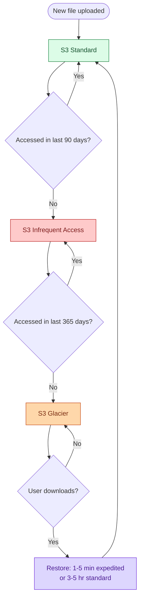

On 580 PB: Glacier is ~$25M/year. Standard is ~$160M/year. The lifecycle policy is the difference between a profitable product and a burning one.

Three gotchas to mention:

- **Glacier retrieval surprises users.** Show a "Restoring, we will email you when ready" state. Never silently make a user wait 5 hours.
- **Do not tier small files.** S3 IA charges a 128 KB minimum object size. Tiering a 10 KB file costs more than leaving it hot.
- **Cold-tier deletes carry penalties.** A file deleted from Glacier still incurs the 90-day minimum storage charge. Soft-delete first, hard-delete later.

> **Take this with you.** S3 lifecycle rules are three lines of config. At PB scale they save tens of millions of dollars per year.

---

## The full architecture

Putting all five decisions together:

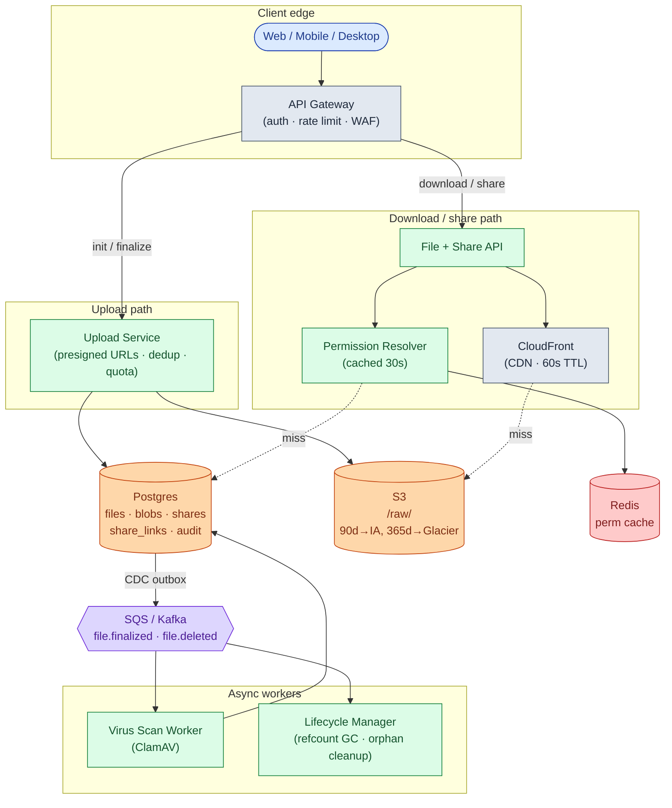

Each component, in one sentence:

| Component | Purpose |
|-----------|---------|
| API Gateway | Auth, rate limiting, WAF. Entry point for all traffic. |
| Upload Service | Mints presigned URLs, checks dedup and quota. Never touches bytes. |
| File + Share API | Generates signed CloudFront URLs. Resolves share tokens. |
| Permission Resolver | "Can user X do Y on file Z?" Combines owner, invite, and folder checks. Cached 30s. |
| CloudFront | Edge cache. Makes the first 1% of downloads pay for the other 99%. |
| Postgres | Source of truth for metadata. Sharded by owner_id at scale. |
| S3 | Source of truth for bytes. Keyed by content hash. Lifecycle rules tier cold objects. |
| Redis | Permission cache. Most access checks never reach the DB. |
| SQS / Kafka | Decouples virus scan and GC from the write path. |
| Virus Scan Worker | Runs ClamAV async. Flips status on the file row. |
| Lifecycle Manager | Decrements refcounts on delete. Aborts abandoned uploads. |

Notice what is not on the synchronous path: virus scanning, analytics, and lifecycle GC. If any of those workers die at 3 a.m., uploads and downloads keep working.

---

## Walk: one upload, end to end

Alice uploads a 1.5 GB video (~190 chunks at 8 MB each).

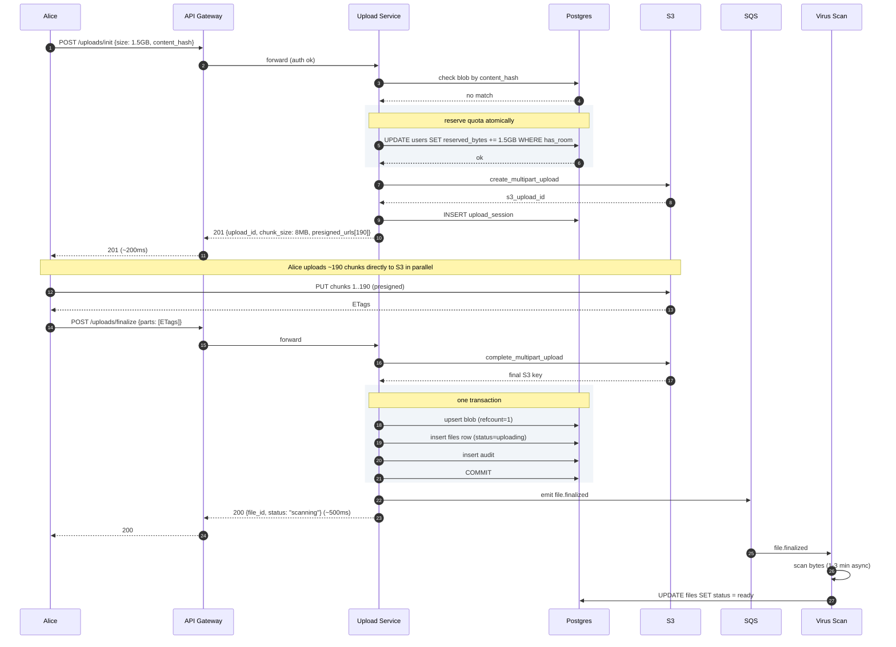

Three things to notice:

1. Quota is reserved at init, not finalize. If Alice's phone and laptop both start uploading an 80 MB file when she has only 100 MB left, the `UPDATE WHERE has_room` serializes them. Only one wins.
2. The blob upsert, file row, and audit write happen in one transaction. A crash mid-write rolls back cleanly. State is never partial.
3. Virus scan runs after Alice gets her 200. Scan results arrive asynchronously, 1-3 minutes later.

---

## The dedup race

Two users upload the same file within milliseconds. Who wins? Both should.

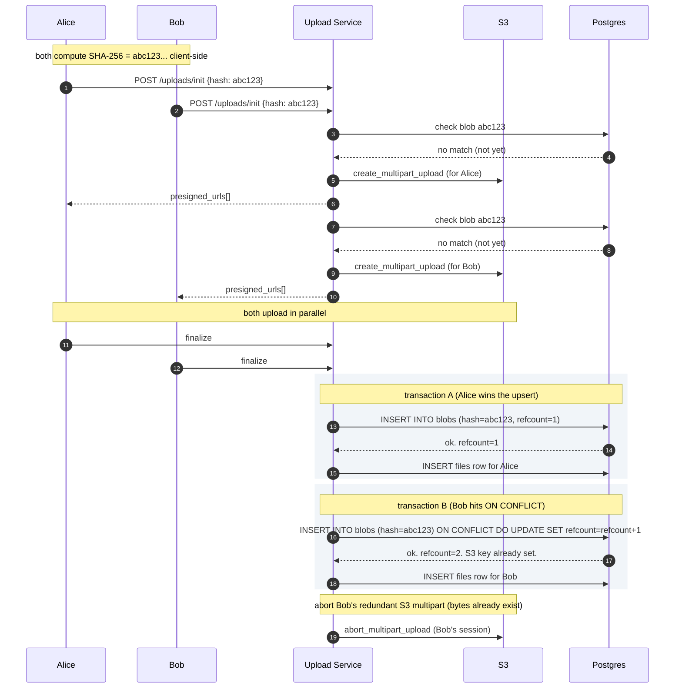

The `ON CONFLICT DO UPDATE` is the atomic guard. No matter how many concurrent finalizes race in, the blob is created once and the refcount increments correctly. The second uploader's S3 object gets aborted because the blob already has a valid storage key.

> **Take this with you.** The database unique constraint on the blob hash is what makes concurrent dedup correct. The application does not need a lock.

---

## Follow-up questions

Try answering each in 2-4 sentences before reading the solution.

1. **Resume the next day.** Alice uploads 3 GB of a 5 GB file, then closes her laptop. The next morning she reopens the app. What happens? How does the client know which chunks already landed? How long do you keep half-finished uploads around?

2. **Quota race.** Alice has 100 MB of quota left. Her phone and laptop both start uploading 80 MB files at the same instant. Both pass the quota check at init. Both upload. Now she is 60 MB over quota. How do you prevent this?

3. **Dedup details.** Three users upload the same 200 MB installer. How do you store it once? What does "delete" mean when one user deletes their copy? What about privacy across tenants?

4. **Token guessing.** Your tokens are 192 bits, so brute force is out. But a researcher finds your `created_at` timestamps in the response. Is this a real attack? What other side channels leak?

5. **Big delete.** A user with a 50 TB account deletes 10 TB in one click. Your metadata DB does 200,000 row updates and S3 issues 200,000 delete requests. What goes wrong? How do you smooth it out?

6. **Late-positive virus scan.** A scan flags a file as malware after 500 people have already downloaded it. What is your response? Can you tell who downloaded it? What about the share links?

7. **Edit conflict.** Two users with Edit permission upload a new version of the same file within 10 seconds. Whose version wins? How does the loser find out?

8. **Viral file.** A YouTuber's public share link gets 1 million downloads in 24 hours for a 200 MB tutorial video. CDN cache hits 99%, but the 1% miss rate still hammers one S3 prefix. What do you do?

9. **GDPR delete.** A user wants their data fully erased. They have 12,000 files, some deduped with other users. They also created share links and were granted shares on other users' files. How do you erase them?

10. **Per-tenant billing.** You sell this to enterprises. One customer wants a monthly bill: storage GB by tier, egress GB, virus-scan calls, API requests. How do you attribute every byte and every call to the right tenant?

---

## Related problems

- **[Video Streaming (006)](../006-video-streaming/question.md).** Same shape: bytes in S3, metadata in Postgres, CDN in front. Video adds adaptive bitrate transcoding. The storage and CDN layers overlap heavily.
- **[Distributed Cache (009)](../009-distributed-cache/question.md).** The permission resolver cache and the CDN edge cache both follow the same eviction and warming patterns.
- **[Read-Heavy System Patterns (017)](../017-read-heavy-patterns/question.md).** The "show me my files" dashboard and share-link resolution are textbook read-heavy paths.
- **[Write-Heavy System Patterns (018)](../018-write-heavy-patterns/question.md).** The audit log here is exactly a write-heavy append-only system.
