## The scene

You sit down. The interviewer pulls up a blank whiteboard.

> *"Build a smaller version of Dropbox. Users upload files up to 5 GB. They share files by invite or by link. They set permissions: view, download, or edit. Storage and bandwidth cost money, so don't waste either."*
>
> *"Start with 10 users. Walk me up to 1 million. At each step, tell me what just broke and what you'd add to fix it."*

It looks like a CRUD app sitting on top of S3. It is not. Here is where it gets hard:

- Alice uploads a 4 GB video over hotel WiFi. The connection dies at 80%. What happens?
- She shares a link with Bob. A month later she revokes that one link. The other 999 links she made should still work.
- Fifty people upload the same 200 MB software installer. Do you store it 50 times?
- A file nobody has touched in two years. Do you keep paying full price to store it?

A candidate who jumps to "POST the file to S3, write a row in Postgres" misses about 60% of the depth. We will walk through it step by step.

A few terms before we start:

- **S3.** Amazon's object storage. Put a file in, get a URL back. Cheap, durable, huge.
- **Presigned URL.** A URL your server signs that lets the client upload directly to S3, without going through your server. The signature has an expiry.
- **S3 multipart upload.** S3's native way to upload a large file in chunks. Start a session, upload chunks, call finalize, and S3 stitches them together.
- **CDN.** Content Delivery Network. A worldwide cache in front of your storage. First download fetches from S3. The next 1,000 come from a nearby edge cache.
- **Content hash.** A short fingerprint of a file's bytes (SHA-256). Two files with the same bytes have the same hash.

---

## Step 1: Picture one upload

Before any boxes, picture what one upload and one download **is**.

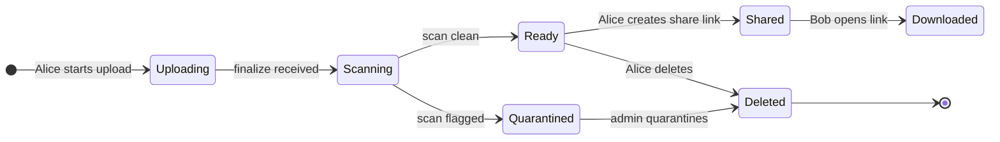

That is the whole product in one picture. Everything we add later (chunked upload, dedup, cold tier, revocation) is a complication on top of this.

> **Take this with you.** A file service is a state machine around bytes. The state lives in your database. The bytes live in object storage. They are two separate things.

---

## Step 2: Ask the right questions

Sit for two minutes. Write down the five questions that would change the design if the answer were different.

<details markdown="1">
<summary><b>Show: 5 questions that change the design</b></summary>

1. **What is the biggest file size?** 5 GB was in the brief. Anything over ~100 MB rules out a single HTTP POST. You need chunked upload.

2. **Sync or share-only?** Is this Dropbox-the-desktop-app (local folder stays in sync with the cloud), or Google-Drive-the-web-page (you upload and share)? Sync adds delta sync, conflict resolution, and file watchers. Share-only is much smaller. In an interview, the answer is almost always share-only.

3. **Do we scan for viruses?** And if yes, do we block the upload until the scan finishes, or scan after the file is saved? Synchronous scanning blocks the UX for minutes on big files. Async scanning means a file is downloadable for a short window before it might be flagged.

4. **Versioning?** When a user uploads a new version of a file, do we keep the old one? How many versions? A reasonable default is "10 versions or 30 days, whichever is shorter."

5. **Quotas?** Each user gets X GB. What happens when they hit the limit? Quota has a sneaky race condition we will come back to.

A strong candidate also names what is out of scope: real-time co-editing, full-text search inside PDFs, third-party integrations. Those are separate products that sit on top of the storage core.

</details>

---

## Step 3: How big is this thing?

Same product, two very different scales. Do the math before you design.

| Scale | Uploads/sec | Downloads/sec | Storage/year | Egress peak |
|-------|-------------|--------------|--------------|------------|
| 10k users | ~0.08 sustained | ~0.8 sustained | ~13 TB | ~100 Mbps |
| 100M users | ~3,300 sustained, ~10k peak | ~33k sustained, ~100k peak | ~580 PB (after dedup) | ~6.4 Tbps |

<details markdown="1">
<summary><b>Show: how the numbers come out</b></summary>

**10k users:**

- 10,000 users, 5 uploads/week, 5 MB average file.
- 50,000/week = ~7,000/day = **~0.08/sec sustained, ~0.25/sec peak**. Tiny.
- Downloads at 10x: ~0.8/sec.
- Storage: 7,000/day x 5 MB = ~13 TB/year.

One server. One Postgres. One S3 bucket. The throughput is boring. What is interesting is the UX for a 5 GB upload and the share-link permission model.

**100M users:**

- 100M users, 20 uploads/week, 8 MB average.
- 2B/week = **~3,300/sec sustained, ~10,000/sec peak**.
- Downloads at 10x: ~33k/sec sustained, ~100k/sec peak.
- Storage: 286M/day x 8 MB = ~2.3 PB/day = ~840 PB/year raw. With ~30% dedup savings: ~**580 PB/year**.
- Egress at peak: 100k x 8 MB = 800 GB/s = **~6.4 Tbps**. You cannot serve this without a CDN.

**The two numbers that matter:**

The system is read-heavy by request count but write-heavy by bytes. CDN absorbs most download requests. Storage cost is the headline expense.

840 PB/year at $0.023/GB/month for S3 Standard is roughly $230M/year for raw storage. Lifecycle policies (tier down to cheaper storage) and dedup (don't store duplicates) are not optional optimizations. They are survival.

Why presigned URLs save you: a 10 Gbps NIC handles ~1.25 GB/s. That is ~150 concurrent 8 MB uploads. At 10,000 concurrent uploads peak you would need 70 servers just to forward bytes. Presigned URLs let the client upload directly to S3. Your servers never touch the bytes.

The metadata database is tiny compared to the bytes. 100B file rows at ~500 bytes each is ~50 TB. Sharded Postgres handles it. The bytes go to S3. The database holds the index.

</details>

> **Take this with you.** Storage cost at scale is the real design constraint. Lifecycle tiers and dedup are the business model, not optional features.

---

## Step 4: The smallest thing that works

Forget 100M users. We have 10 users, one workflow: Alice uploads a file and shares it with Bob.

Three boxes. Nothing else.

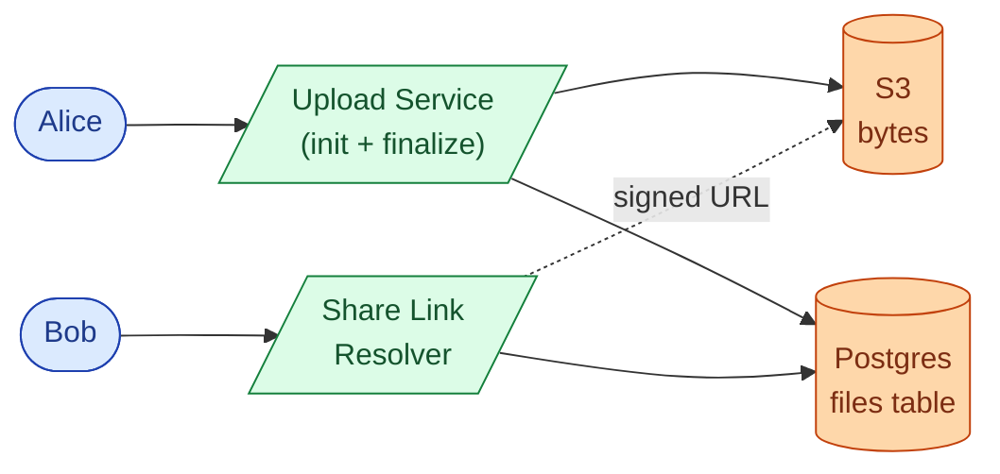

The end-to-end flow has two phases: upload and share-link redeem.

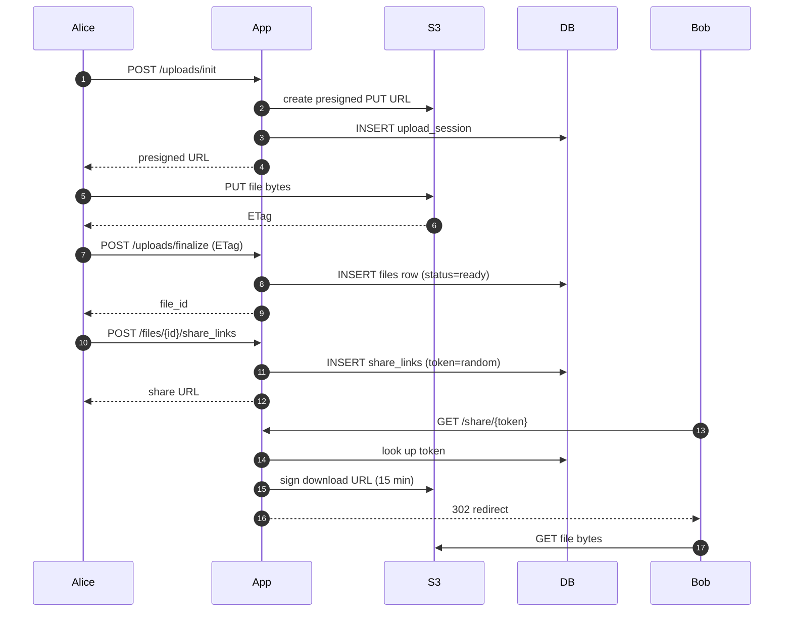

<details markdown="1">
<summary><b>Show: the two tables</b></summary>

```sql
CREATE TABLE files (
    file_id      UUID PRIMARY KEY,
    owner_id     BIGINT NOT NULL,
    name         TEXT NOT NULL,
    size_bytes   BIGINT NOT NULL,
    content_hash BYTEA NOT NULL,
    status       SMALLINT NOT NULL DEFAULT 1,  -- 1=uploading, 2=ready, 3=quarantined, 4=deleted
    created_at   TIMESTAMPTZ NOT NULL DEFAULT NOW()
);

CREATE TABLE share_links (
    token           VARCHAR(32) PRIMARY KEY,  -- 192-bit random
    file_id         UUID NOT NULL,
    created_by      BIGINT NOT NULL,
    permission      SMALLINT NOT NULL,        -- 1=view, 2=download, 3=edit
    expires_at      TIMESTAMPTZ,
    revoked_at      TIMESTAMPTZ
);
```

Five columns in each. This is the right place to start. Everything added from here is a response to a real problem.

</details>

> **Take this with you.** Start from the smallest thing that works. The interesting part of the interview is what happens next.

---

## Step 5: The first crack

The next morning the product team says: *"A user tried to upload a 3 GB file over hotel WiFi. It died at 90%. They had to start over. They left a 1-star review."*

You look at your code. `PUT file bytes` is one big HTTP request. Any network blip restarts the whole thing.

This is the trap. **Stop treating the upload as one atomic unit. Treat it as a sequence of chunks.**

Three serious options exist. Think through each before peeking.

**A. Direct upload (one big POST).** Client streams the whole file in one request to your server.

**B. Chunked resumable (S3 multipart).** Client splits the file into pieces (8 MB each). Uploads each piece separately. Retries only the failed piece.

**C. Presigned S3 URL per chunk.** Your server mints one presigned URL per chunk. Client uploads each chunk directly to S3. Your server never sees the bytes.

The right answer is **C, combined with S3 multipart**. Each chunk gets its own presigned URL. Chunks upload in parallel. A failed chunk retries on its own. After all chunks land, the client calls finalize and S3 stitches them together.

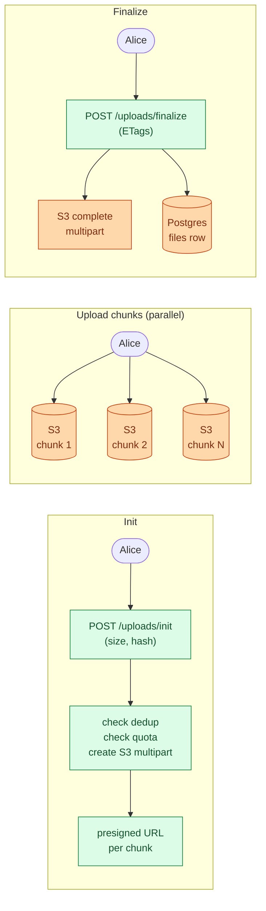

A 1 GB upload uses ~125 chunks at 8 MB each. If chunk 87 fails, you retry chunk 87. You do not restart from chunk 1.

<details markdown="1">
<summary><b>Show: the chunked upload sequence in full</b></summary>

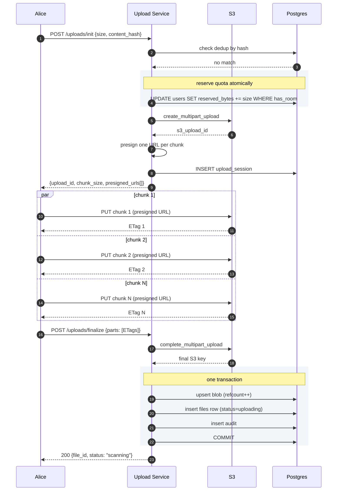

</details>

> **Take this with you.** Chunked upload with presigned URLs solves two problems at once: the client retries individual chunks (resilience) and the bytes never touch your servers (cost).

---

## Step 6: Build the architecture, one layer at a time

We have chunked upload and share links. Now build the system around them. Add one layer at a time and explain why.

### v1: the core

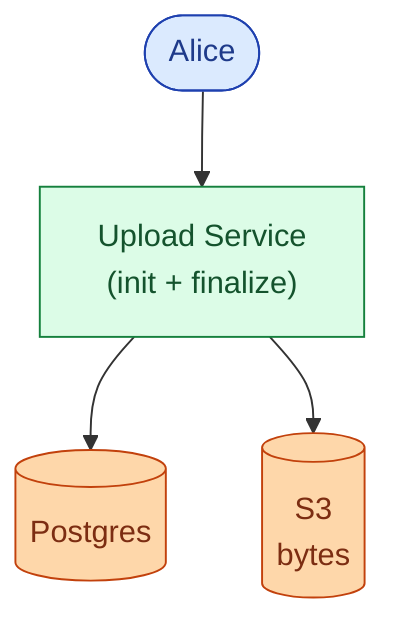

Fine for 1,000 users. Downloads stream from S3 through a signed URL. One server. One DB.

### v2: downloads go viral

A popular file gets 10,000 downloads in an hour. S3 egress at $0.09/GB turns into a $500 bill for one afternoon. Add a CDN.

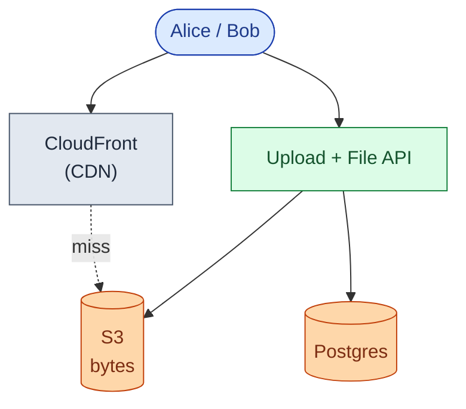

Download API returns a signed CloudFront URL (15-minute TTL). Second download of the same file comes from the CDN edge. S3 egress drops by ~90%.

### v3: malware is uploaded

An infected PDF gets shared and downloaded 500 times before anyone notices. Add async virus scanning.

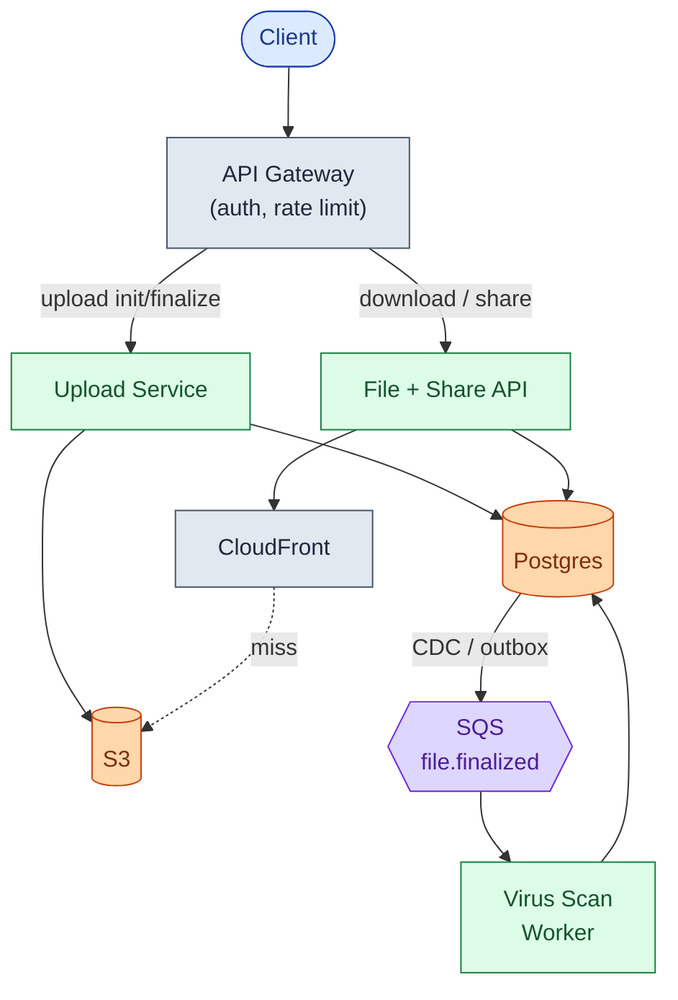

Scan runs async. Upload returns immediately with `status=scanning`. Downloads of unscanned files return 425 Too Early. Scanned-clean files flip to `status=ready`. Infected files flip to `status=quarantined` and all their share links are revoked.

### v4: cold storage and dedup

Storage cost is growing 30% per quarter. 70% of bytes haven't been touched in 90 days. And fifty people keep uploading the same software installer.

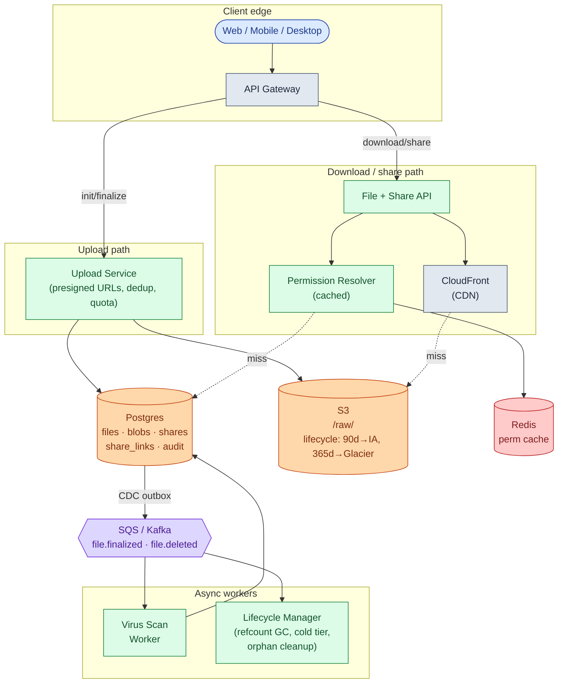

Each box, in one line:

| Box | What it does |
|-----|-------------|
| **API Gateway** | Authenticates callers, rate-limits bots, dedupes mobile retries. |
| **Upload Service** | Mints presigned URLs, checks dedup and quota. Never touches bytes. |
| **File + Share API** | Generates signed CloudFront URLs. Resolves share tokens. |
| **Permission Resolver** | "Can user X download file Y?" Combines owner, invite, and folder checks. Cached 30s. |
| **CloudFront** | Edge cache. Makes the first 1% of downloads pay for the other 99%. |
| **Postgres** | Source of truth for metadata. Sharded by owner_id at scale. |
| **S3** | Source of truth for bytes. Keyed by content hash. Lifecycle rules move cold objects cheaply. |
| **Redis** | Permission cache. Most "can I access this?" checks never hit the DB. |
| **SQS / Kafka** | Decouples virus scan and GC from the write path. |
| **Virus Scan Worker** | Runs ClamAV async. Flips status on the file row. |
| **Lifecycle Manager** | Decrements refcounts on delete. Aborts abandoned uploads. |

> **Take this with you.** If the virus scan worker dies at 3 a.m., uploads still succeed. Scans just queue up. Anything reactive lives after the queue, not before it.

---

## Step 7: One upload, end to end

Alice uploads a 1.5 GB video. Watch what happens.

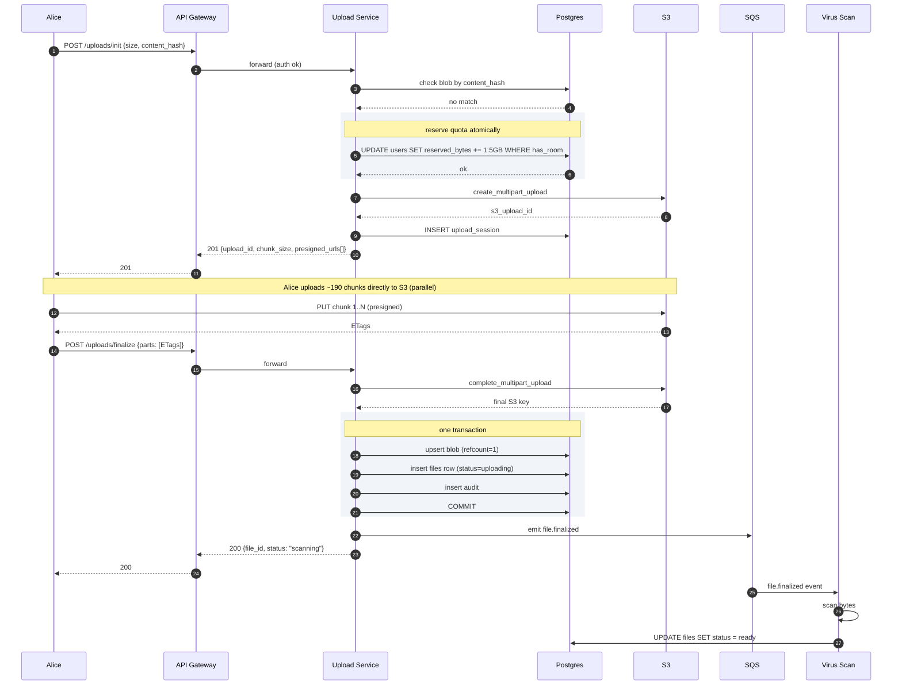

Three things worth pointing at:

1. The blob upsert, file row, and audit write happen in one transaction. Crash mid-write rolls back cleanly. State is never partial.
2. Quota is reserved at init, not finalize. If Alice's phone and laptop both start uploading at the same instant, the `UPDATE WHERE has_room` serializes them.
3. The virus scan runs after Alice gets her 200 OK. Scan results come later, asynchronously.

---

## Step 8: Share links and permissions

Sharing has two flavors and three permission levels.

**Flavors:**

- **Direct invite.** Owner enters someone's email. That user sees the file in "Shared with me."
- **Share link.** Owner generates a URL. Anyone with the URL gets in.

**Permissions:** view (preview only), download (fetch original), edit (upload new version).

Try to answer before peeking: what does the share_links table look like? How do you expire a link? Password-protect one? Stop an attacker from guessing tokens? What happens when Bob clicks the link?

<details markdown="1">
<summary><b>Show: how share links work end to end</b></summary>

**Token generation.**

```python
import secrets
token = base62(secrets.token_bytes(24))   # 24 bytes = 192 bits
```

192 bits is too large to brute-force. You will never get a collision. Just as important: the token has no relationship to the file it unlocks. Leaking the token-generation algorithm leaks nothing.

**The resolution flow:**

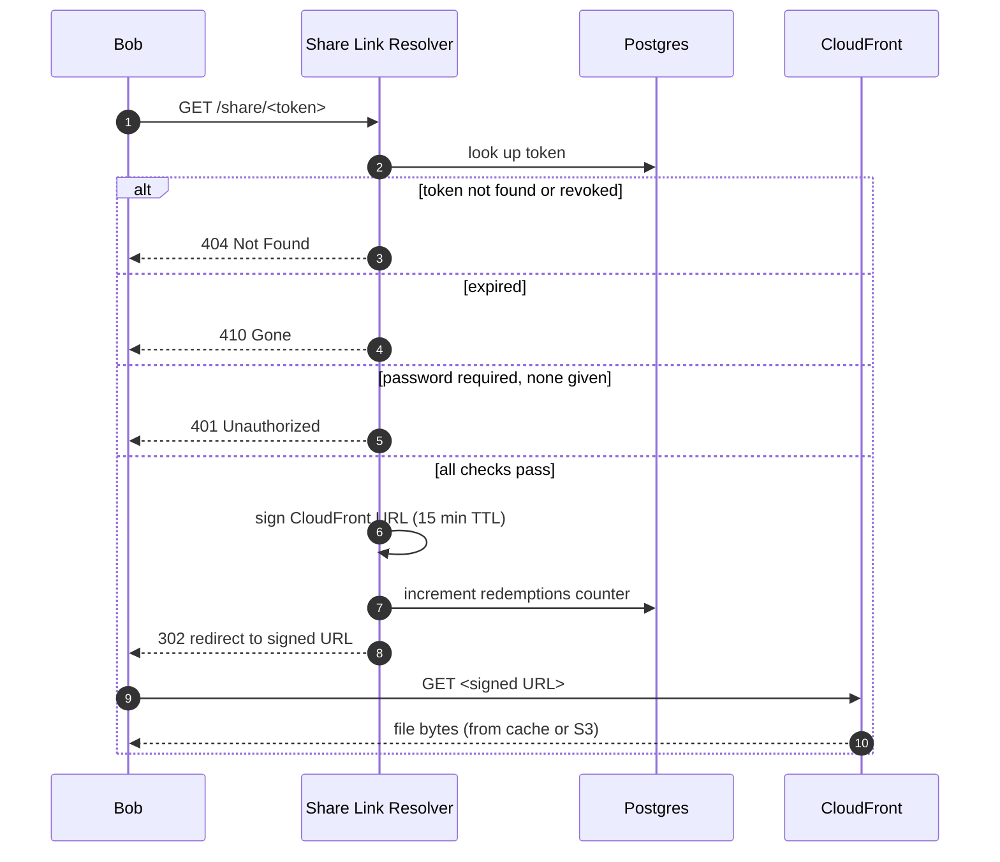

**Why the 15-minute signed URL matters.** If the share link itself was the download credential, a view-only share would leak the raw file the moment someone right-clicked "save target as." Mint a fresh signed URL on every redemption, scoped to what the permission allows.

**Password protection.** Hash the password with bcrypt when the link is created. Verify on redeem. Never put the password in the URL.

**Revoking a link.** Set `revoked_at = NOW()` on that one row. The other 999 links for the same file keep working. This is why we use one row per link, not one share per file.

**The schema:**

```sql
CREATE TABLE shares (
    share_id    UUID PRIMARY KEY,
    file_id     UUID NOT NULL,
    granted_to  BIGINT NOT NULL,
    granted_by  BIGINT NOT NULL,
    permission  SMALLINT NOT NULL,    -- 1=view, 2=download, 3=edit
    created_at  TIMESTAMPTZ NOT NULL DEFAULT NOW(),
    revoked_at  TIMESTAMPTZ
);

CREATE TABLE share_links (
    token              VARCHAR(32) PRIMARY KEY,  -- 192-bit random
    file_id            UUID NOT NULL,
    created_by         BIGINT NOT NULL,
    permission         SMALLINT NOT NULL,
    expires_at         TIMESTAMPTZ,
    password_hash      BYTEA,
    require_account    BOOLEAN DEFAULT FALSE,
    max_redemptions    INT,
    redemptions        INT NOT NULL DEFAULT 0,
    created_at         TIMESTAMPTZ NOT NULL DEFAULT NOW(),
    revoked_at         TIMESTAMPTZ
);
CREATE INDEX idx_links_file ON share_links (file_id);
```

**Folder shares.** If you share a folder, every file inside inherits the permission. At access-check time, walk the parent chain: "is any folder above this file shared with me?" Cache aggressively. This is the hottest read path in the whole system.

</details>

> **Take this with you.** One row per share link. Revoke by setting `revoked_at` on that row. Never make the file ID the share credential.

---

## Step 9: Storage tiers (saving money on cold files)

A file uploaded today might be downloaded 50 times this week. A file from two years ago is probably never touched again. Paying the same price for both is wasteful.

S3 has three tiers:

| Tier | Cost/GB/month | Retrieval time | Use case |
|------|--------------|---------------|---------|
| **S3 Standard** (hot) | $0.023 | < 100 ms | Recently active files |
| **S3 Infrequent Access** (warm) | $0.0125 | < 100 ms | Quiet 30-365 days |
| **Glacier** (cold) | $0.0036 | 1-5 min fast, 3-5 hr standard | Quiet 365+ days |

Try to draw the tiering flowchart yourself first: when does a file move from hot to warm to cold? What happens when a cold file gets accessed?

<details markdown="1">
<summary><b>Show: the tiering flow</b></summary>

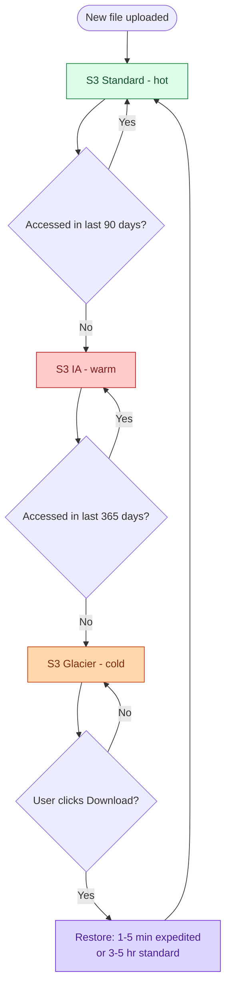

Glacier is ~6x cheaper than Standard. On 580 PB, that is the difference between $160M/year and $25M/year. Lifecycle policy is not an optimization. It is the business model.

Three gotchas:

- **Glacier retrieval surprises users.** Standard retrieval takes 3-5 hours. Show "Restoring. We will email you when ready." Users hate surprise waits more than honest ones.
- **Do not tier small files.** S3 IA has a 128 KB minimum-object-size charge. Tiering a 10 KB file actually costs more. Exclude files smaller than 128 KB from the lifecycle rule.
- **Cold-tier deletes have penalties.** A file deleted in Glacier still incurs the 90-day minimum storage charge. Soft-delete first. Hard-delete after the regret window.

</details>

> **Take this with you.** S3 lifecycle rules are three lines of config. At PB scale, they save tens of millions of dollars per year.

---

## Step 10: Content-addressed dedup

Fifty users upload the same 200 MB software installer. Do you store it 50 times?

No. Hash the file content. Two files with the same bytes have the same hash. Store the bytes once. Let many `files` rows point at the same blob.

```
             blobs table                    files table
         (one per unique bytes)         (one per user pointer)

         hash = abc...              <-- "installer-2024.exe"  (Alice)
         refcount = 3               <-- "setup.exe"           (Bob)
                                    <-- "v1.0-install.exe"    (Carol)

         hash = def...              <-- "report.pdf"          (Alice)
         refcount = 1
```

When Alice deletes her copy: decrement refcount from 3 to 2. Bob and Carol still reference the blob. Blob stays alive. When refcount finally hits zero, schedule the bytes for deletion after a 24-hour grace period.

Consumer file-sharing services see ~30% storage savings from dedup. On 580 PB that is ~170 PB saved. At $0.023/GB/month, that is ~$50M/year.

One privacy note: knowing your file's hash matches another user's tells you they have the same content. For consumer use that is fine. For high-privacy products (legal, medical), disable cross-tenant dedup.

> **Take this with you.** Blob is the bytes. File is the user-named pointer. Keep them in separate tables. Refcount the blob. The rest follows.

---

## Follow-up questions

Try answering each in 2-4 sentences before reading the solution.

1. **Resume the next day.** Alice uploads 3 GB of a 5 GB file, then closes her laptop. The next morning she reopens the app. What happens? How does the client know which chunks already landed? How long do you keep half-finished uploads around?

2. **Quota race.** Alice has 100 MB of quota left. Her phone and laptop both start uploading 80 MB files at the same instant. Both pass the quota check at init. Both upload. Now she is 60 MB over quota. How do you prevent this?

3. **Dedup details.** Three users upload the same 200 MB installer. How do you store it once? What does "delete" mean when one user deletes their copy? What about privacy?

4. **Token guessing.** Your tokens are 192 bits, so brute force is out. But a researcher finds your `created_at` timestamps in the response. Is this a real attack? What other side channels leak?

5. **Big delete.** A user with a 50 TB account deletes 10 TB in one click. Your metadata DB does 200,000 row updates and S3 issues 200,000 delete requests. What goes wrong? How do you smooth it out?

6. **Late-positive virus scan.** A scan flags a file as malware after 500 people have already downloaded it. What is your response? Can you tell who downloaded it? What about the share links?

7. **Edit conflict.** Two users with Edit permission upload a new version of the same file within 10 seconds. Whose version wins? How does the loser find out?

8. **Viral file.** A YouTuber's public share link gets 1 million downloads in 24 hours for a 200 MB tutorial video. CDN cache hits 99%, but the 1% miss rate still hammers one S3 prefix. What do you do?

9. **GDPR delete.** A user wants their data fully erased. They have 12,000 files, some deduped with other users. They also created share links and were granted shares on other users' files. How do you erase them?

10. **Per-tenant billing.** You sell this to enterprises. One customer wants a monthly bill: storage GB by tier, egress GB, virus-scan calls, API requests. How do you attribute every byte and every call to the right tenant?

---

## Related problems

- **[Video Streaming (006)](../006-video-streaming/question.md).** Same shape: bytes in S3, metadata in Postgres, CDN in front. Video adds adaptive bitrate transcoding. The storage and CDN layers overlap heavily.
- **[Distributed Cache (009)](../009-distributed-cache/question.md).** The permission resolver cache and the CDN edge cache both follow the same eviction and warming patterns.
- **[Read-Heavy System Patterns (017)](../017-read-heavy-patterns/question.md).** The "show me my files" dashboard and share-link resolution are textbook read-heavy paths.
- **[Write-Heavy System Patterns (018)](../018-write-heavy-patterns/question.md).** The audit log here is exactly a write-heavy append-only system.
