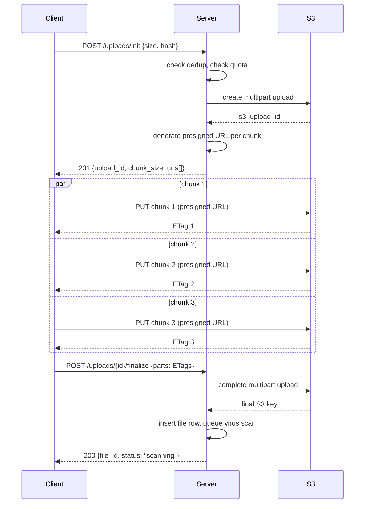
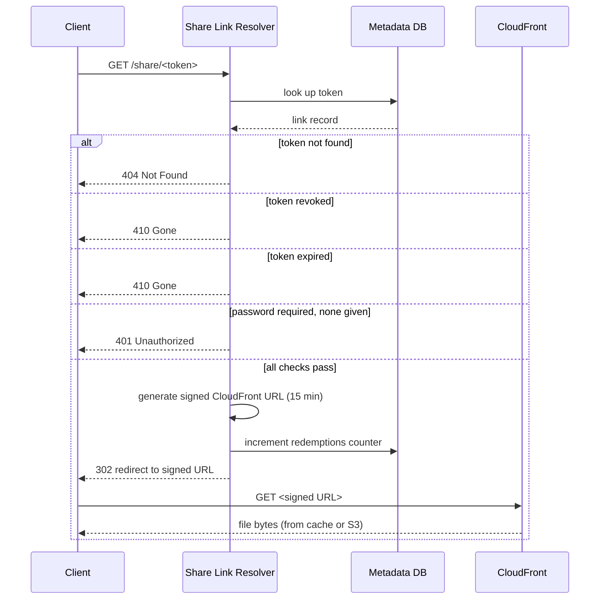
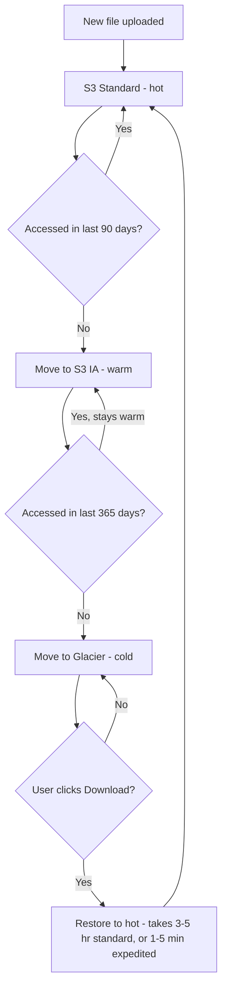

## The scene

You sit down for the interview. The interviewer writes one line on the whiteboard.

> *"Build a smaller version of Dropbox. Users upload files up to 5 GB. They share files with other users by invite or by link. They set permissions: view, download, or edit. Storage and bandwidth cost money, so do not waste either."*

Then they say: *"Start with a weekend project for 10 users. Walk me up to 1 million users. At each step, tell me what just broke and what you would add to fix it."*

It looks like a CRUD app sitting on top of S3. It is not. Here are the parts that get hard:

- A 4 GB upload over hotel WiFi. The connection drops at 80%. What happens?
- You share a link with one friend. A month later you revoke that one link. The other 999 links you created should still work.
- Fifty people upload the same 200 MB software installer. Do you store it 50 times?
- A file nobody has touched in two years. Do you keep paying full price to store it?

A candidate who jumps to *"POST the file to S3, write a row in Postgres"* misses about 60% of the depth. We will walk through it step by step.

A few terms before we start, so nothing trips you up:

- **S3.** Amazon's object storage. You put a file in, you get a URL back. Cheap, durable, huge.
- **Presigned URL.** A URL the server signs that lets the client upload directly to S3 without going through your server. The signature has an expiry. After it expires, the URL stops working.
- **TUS.** A standard protocol for resumable uploads. If your upload fails halfway, you continue from where it stopped instead of starting over.
- **S3 multipart upload.** S3's own way to upload a big file in chunks. You start a session, upload chunks, then call "finalize" and S3 stitches them together.
- **CDN.** Content Delivery Network. A worldwide cache that sits in front of your storage. The first download fetches from S3. The next 1000 downloads come from a cache close to the user.
- **Content hash.** A short fingerprint of a file's bytes (we use SHA-256). Two files with the same bytes have the same hash. Two different files have different hashes.

---

## Step 1: Ask the right questions

Before you draw a single box, sit for five minutes. Write down questions that would change the design if the answer was different.

A good answer is not "20 questions about every detail." It is the small handful of questions that change the design depending on the answer.

<details markdown="1">
<summary><b>Show: 8 questions that matter</b></summary>

1. **What is the biggest file size?** 5 GB was in the brief, but is that a hard cap? Anything above ~100 MB rules out a single HTTP POST. You have to use chunked upload.

2. **Sync or share-only?** Is this Dropbox-the-desktop-app (your local folder stays in sync with the cloud), or Google-Drive-the-web-page (you upload, you share)? Sync is a different problem: delta sync, conflict resolution, file watchers. Share-only is much smaller. In an interview, the answer is almost always share-only.

3. **Do we scan for viruses?** And if yes, do we block the upload until the scan finishes, or scan after the file is already saved? Sync scanning is slow. Async scanning means a file is downloadable for a couple of minutes before it might be flagged.

4. **Versioning?** When a user edits a file, do we keep the old version? How many versions? A reasonable default is "keep 10 versions or 30 days, whichever is shorter."

5. **Quotas?** Each user gets X GB? What happens when they hit the limit? Quota has a sneaky race condition we will come back to.

6. **What kinds of sharing?** Direct invite (owner enters someone's email), link share (owner makes a URL anyone can open), or both? What permissions: view, download, edit?

7. **Compliance?** GDPR delete? Customer-managed encryption keys for healthcare or finance? These change the storage layer.

8. **What is NOT in this design?** Real-time co-editing (like Google Docs)? Full-text search inside PDFs? Third-party integrations? Out of scope. They are separate products that sit on top.

A strong candidate also names what is out: real-time editing, search inside documents, integrations. Those are downstream products. Not part of the storage core.

</details>

---

## Step 2: How big is this thing?

Same problem, two scales. Do the math before you design.

**Weekend project (10,000 users):**

- 10,000 users
- 5 uploads per user per week
- ~5 MB average file
- Downloads run about 10x writes

**Dropbox-scale (100M users):**

- 100M active users
- 20 uploads per user per week
- ~8 MB average (photos, docs, some videos)
- Downloads run about 10x writes
- Files kept forever by default

Work out: uploads per second, downloads per second, storage growth per year, and how much storage goes cold (not touched in 90 days) by year two.

<details markdown="1">
<summary><b>Show: the math</b></summary>

**Weekend project (10k users):**

- Uploads: 10,000 x 5 = 50,000 per week = ~7,000/day = **~0.08/sec sustained, ~0.25/sec at peak**. Tiny.
- Downloads at 10x: **~0.8/sec sustained**.
- Storage: 50,000/week x 5 MB = ~13 TB/year.
- Egress at peak: ~100 Mbps.
- Cold tail by year 2: maybe 60-70% of files untouched.

One server. One Postgres. One S3 bucket. Done. The throughput is boring. What is interesting is the UX for a 5 GB upload and the share-link permission model.

**Dropbox-scale (100M users):**

- Uploads: 100M x 20 = 2B per week = **~3,300/sec sustained, ~10,000/sec at peak**.
- Downloads at 10x: **~33,000/sec sustained, ~100,000/sec at peak**.
- Storage growth: 286M/day x 8 MB = ~2.3 PB/day = **~840 PB/year raw**. With ~30% dedup savings: **~580 PB/year**.
- Egress at peak: 100,000 x 8 MB = 800 GB/s = **~6.4 Tbps**. You cannot serve this from one region without a CDN.
- Cold tail by year 2: ~70-80% of stored bytes untouched 90+ days.

What the math is telling you:

The system is **read-heavy by request count** but **write-heavy by bytes**. Lots of small reads. Big upload bytes.

**Storage cost is the headline expense.** 840 PB/year at $0.023/GB/month for S3 Standard is roughly $230M/year just for raw storage. Lifecycle policies (tier down to cheaper storage) and dedup (do not store duplicates) are not optional optimizations. They are survival.

> Why uploads through your server kill you. A 10 Gbps network card handles maybe 1.25 GB/s. That is around 150 concurrent 8 MB uploads per second. You run out of network capacity long before you run out of CPU. Now multiply by 10,000 concurrent uploads at peak. You would need 70 servers just to forward bytes. Presigned URLs let the client upload directly to S3. Your servers never touch the bytes. That single decision saves you an order of magnitude on the bandwidth bill.

The metadata DB is tiny next to the bytes. 100B file rows at ~500 bytes each is ~50 TB. Sharded Postgres handles it. The bytes go to S3. The database holds the index.

</details>

---

## Step 3: How do the bytes get from the client to your storage?

This is the biggest single decision in the design. Three serious options. Pick wrong here and the system melts at scale.

Spend ten minutes. Write down the pros and cons of each before peeking.

**A. Direct upload (one big POST).** Client streams the whole file in one HTTP POST to your server. Your server forwards to S3.

**B. Chunked resumable upload (TUS protocol, or S3 multipart).** Client splits the file into pieces (5 to 100 MB each). Uploads each piece in its own request. Retries failed pieces.

**C. Presigned S3 URL.** Your server gives the client a short-lived signed URL. The client uploads directly to S3. Your server never sees the bytes.

<details markdown="1">
<summary><b>Show: how each one stacks up</b></summary>

| Approach | How it works | Pros | Cons |
|----------|--------------|------|------|
| **Direct (one POST)** | Client does one big `POST /upload`. Server buffers or streams the bytes to S3. | Simple. One request. Works in any HTTP client. | Any network blip restarts the whole upload. A 4 GB file on hotel WiFi never finishes. Your server's network card is the bottleneck. Hard to show real progress. |
| **Chunked resumable (TUS, S3 multipart)** | Init session. Upload chunk 1, chunk 2, ..., chunk N. Failed chunks retry on their own. Call finalize. | Survives flaky networks. Real progress bars. Parallel chunks speed up big files. Pause and resume work. | More complex. Server tracks which chunks landed. Abandoned uploads need cleanup. |
| **Presigned S3 URL** | `POST /upload/init` returns a presigned URL. Client `PUT`s directly to S3. Client calls `POST /upload/finalize`. | Zero bandwidth through your servers. Cheapest at scale. S3 does the heavy lifting. | Client speaks S3 directly. Harder to enforce quota (you did not see the bytes). Virus scan happens after the upload. |

**The right answer is hybrid.** Pick based on file size:

- **Under 5 MB.** Single POST through your server. Simpler client. Worth the small bandwidth cost.
- **5 MB to 5 GB.** Presigned S3 multipart. Client splits into 8 MB chunks. Each chunk gets its own presigned URL. Chunks upload in parallel directly to S3. Client calls finalize.
- **Over 5 GB.** Same as above, but with bigger chunks (64 MB) and explicit server-side caps.

> Why this matters. A 1 GB upload uses about 125 chunks at 8 MB each. If chunk 87 fails because of a momentary network blip, you retry just chunk 87. You do not start over from chunk 1. The user sees a progress bar that actually progresses. That is the difference between a happy user and a 1-star review.

Why bring up TUS at all? TUS is an open protocol for resumable uploads. Useful if your storage is not S3 (some shops use MinIO, NetApp, or their own object store) and you want a standard client library. If you are on AWS, S3 multipart is more native. TUS is for the "not on S3" case.

Here is what the hybrid chunked upload looks like as a sequence:



</details>

---

## Step 4: Draw the system

You know how the bytes move. Now draw the boxes.

Try to fill in the five `[ ? ]` boxes. Each one is one of: upload service, object store (S3), metadata DB, share link resolver, virus scanner.

```
              Client (browser, mobile, desktop)
                          |
                          v
                +------------------+
                |  API Gateway     |  auth, rate limit
                +--------+---------+
                         |
        upload init,     |     download,
        finalize, list   |     share link redeem
                         |
            +------------+------------+
            |                         |
            v                         v
     +-------------+           +-------------+
     |  [ ? ]      |           |  [ ? ]      |  resolves /share/<token>
     |             |           |             |  to a file + permission
     +-----+-------+           +------+------+
           |                          |
           |   presigned URLs         |
           v                          v
     +-------------------------------------+
     |  [ ? ]                              |  bytes live here.
     |                                     |  cheap, durable, huge.
     +-------------------------------------+
            ^
            |
     +------+--------+
     |  [ ? ]        |  file_id, owner, name,
     |               |  size, hash, status
     +---------------+

     Background pipeline:
     +-----------------+
     |  [ ? ]          |  scans the file after upload
     +-----------------+
```

<details markdown="1">
<summary><b>Show: the full architecture</b></summary>

```
              Client (browser, mobile, desktop)
                          |
                          v
                +------------------+
                |  API Gateway     |  auth, rate limit, WAF
                +--------+---------+
                         |
        upload init,     |     download,
        finalize, list   |     share link redeem
                         |
            +------------+------------+
            |                         |
            v                         v
     +-----------------+        +------------------+
     | Upload Service  |        | Share Link       |
     | mints           |        | Resolver         |
     | presigned URLs, |        | token -> file +  |
     | tracks upload   |        | permission.      |
     | sessions        |        | checks expiry,   |
     |                 |        | password         |
     +-----+-----------+        +------+-----------+
           |                           |
           | presigned PUT URLs        | signed GET URLs
           v                           v (via CloudFront)
     +--------------------------------------+
     | Object Store (S3)                    |
     | layout:                              |
     |   /raw/<hash>          (deduped)     |
     |   /chunks/<upload_id>/<n> (in-flight)|
     | lifecycle:                           |
     |   90d -> S3 IA (cheaper)             |
     |   365d -> Glacier (cheapest)         |
     +--------------------------------------+
            ^
            | metadata reads + writes
            |
     +------+------------+
     | Metadata DB        |   files, file_versions,
     | (Postgres,         |   blobs (dedup),
     |  sharded by        |   shares, share_links,
     |  owner_id)         |   upload_sessions, audit
     +-------+-----------+
             |
             | events (CDC / outbox)
             v
     +-------------------+
     |  SQS / Kafka      |  topics: file.finalized,
     |                   |  file.deleted, share.created
     +---+---------+-----+
         |         |
         v         v
     +--------+ +------------------+
     | Virus  | | Lifecycle        |
     | Scan   | | Manager          |
     | Worker | | (refcounts, cold |
     | (Clam  | | tier transitions,|
     | AV)    | | abandoned uploads)|
     +--------+ +------------------+

     CDN for downloads:
     +-------------------+
     | CloudFront        |  edge cache.
     | in front of S3    |  short TTL so
     |                   |  revokes propagate.
     +-------------------+
```

What each piece does, in one line:

- **API Gateway + WAF.** First line of defense. Authentication. Rate limits (no client uploads 10,000 files per minute). Blocks obvious bad requests.
- **Upload Service.** Owns the upload session lifecycle. Mints presigned URLs. Tracks "you uploaded chunks 1, 3, 5, you still need 2, 4." Checks quota at init. Never touches bytes.
- **Share Link Resolver.** Its own service so it scales independently. The hot path for every shared file. Looks up the token, checks expiry and password, returns a permission.
- **Object Store (S3).** Source of truth for bytes. One bucket per environment. The key layout makes dedup and lifecycle easy.
- **Metadata DB (Postgres).** Source of truth for everything that is not bytes. Sharded by owner because almost every query is "show me my files."
- **Virus Scan Worker.** Decoupled from upload. Files are downloadable as soon as finalized. If the scan flags them later, status flips to quarantined and downloads return an error.
- **Lifecycle Manager.** Moves files from hot to cold storage as they age. Cleans up abandoned uploads. Garbage collects unused deduped blobs.
- **CloudFront (CDN).** What keeps egress affordable. Without it you pay full S3 egress every download. With it, the second download of a shared file comes from the edge cache at a fraction of the cost.

</details>

---

## Step 5: Share links and permissions

Sharing has two flavors and three permission scopes.

**Two flavors:**

- **Direct invite.** Owner enters someone's email. That user must have an account. The file shows up in their "shared with me" tab.
- **Share link.** Owner generates a URL. Anyone with the URL gets in. Account may or may not be required.

**Three permission scopes:**

- **View.** Preview only. No download button. (Determined users can still grab bytes. Treat as a soft control, not a security boundary.)
- **Download.** Can fetch the original file.
- **Edit.** Can upload a new version.

Now think through these:

- What does the data model look like?
- How do you expire a link?
- How do you password-protect one?
- How do you stop attackers from guessing tokens?
- What happens when someone clicks a share link?

<details markdown="1">
<summary><b>Show: how share links work end to end</b></summary>

**Token generation.**

```python
import secrets
token = base62(secrets.token_bytes(24))   # 24 bytes = 192 bits
```

192 bits is enormous. The chance of a collision (two random tokens being equal) is negligible until you have around 2^96 tokens. You will never collide. Just as important: the keyspace is too big for an attacker to guess by brute force.

> Why a random token and not a hash of `(file_id, salt)`? A hash is deterministic. If someone learns the salt, they can compute every token. A pure random token has no relationship to the file it unlocks. Leaking the algorithm leaks nothing.

**The resolution flow** for `GET /share/<token>` looks like this:



**Why the 15-minute signed URL matters.** If the share link itself was the only credential, then a view-only share leaks the file the moment someone right-clicks "save target as." Force every download through a *fresh* signed URL each time. Short expiry. View-only shares mint URLs scoped to the preview renderer only, not the raw file.

**Password protection.** Hash the password with Argon2 or bcrypt when the link is created. Verify on redeem. Never put the password in the URL.

**Rate limit per token.** A single token getting 1000 redemption attempts per minute is brute-force traffic. Cap at ~10 attempts per IP per token per minute. Lock the token for 5 minutes if it trips.

**Revoking a link.** Set `revoked_at = NOW()` on that one row. The other 999 links for the same file keep working. This is why we use one row per link, not one share per file.

**The schema** behind it:

```sql
-- Direct invites (recipient is a known user).
CREATE TABLE shares (
    share_id      UUID PRIMARY KEY,
    file_id       UUID NOT NULL,
    granted_to    BIGINT NOT NULL,        -- user_id
    granted_by    BIGINT NOT NULL,
    permission    SMALLINT NOT NULL,      -- 1=view, 2=download, 3=edit
    created_at    TIMESTAMPTZ NOT NULL DEFAULT NOW(),
    revoked_at    TIMESTAMPTZ
);

-- Anonymous or semi-anonymous share links.
CREATE TABLE share_links (
    token              VARCHAR(32) PRIMARY KEY,  -- opaque 192-bit random
    file_id            UUID NOT NULL,
    created_by         BIGINT NOT NULL,
    permission         SMALLINT NOT NULL,
    expires_at         TIMESTAMPTZ,              -- NULL = never
    password_hash      BYTEA,                    -- NULL = no password
    require_account    BOOLEAN DEFAULT FALSE,
    max_redemptions    INT,                      -- NULL = unlimited
    redemptions        INT NOT NULL DEFAULT 0,
    created_at         TIMESTAMPTZ NOT NULL DEFAULT NOW(),
    revoked_at         TIMESTAMPTZ
);
CREATE INDEX idx_links_file ON share_links (file_id);
```

**Folder shares.** If you share a folder, every file inside inherits the permission. At access-check time, walk the file's parent chain: "is any folder above this file shared with me?" Cache aggressively. This is read-heavy.

</details>

---

## Step 6: Storage tiers (saving money on cold files)

A file uploaded today might be downloaded 50 times this week. A file uploaded two years ago is probably never touched again. Paying full price for both wastes a lot of money.

S3 has three tiers, in increasing order of cheapness and slowness:

| Tier | Cost per GB per month | Retrieval time | Use case |
|------|------------------------|-----------------|----------|
| **S3 Standard** (hot) | $0.023 | < 100 ms | Files used recently |
| **S3 Infrequent Access** (warm) | $0.0125 | < 100 ms | Files quiet for 30-365 days |
| **S3 Glacier** (cold) | $0.0036 | 1-5 min (fast) or 3-5 hr (standard) | Files quiet over 365 days |

The Glacier tier is roughly 6x cheaper than Standard. On 580 PB of cold storage, that is the difference between $160M/year and $25M/year. Tiering is not an optimization. It is the business model.

Try to draw the tiering flowchart yourself first. When is a file in hot? When does it move to warm? When does it move to cold? What happens when a cold file gets accessed?

<details markdown="1">
<summary><b>Show: the tiering flow</b></summary>



**Two ways to implement tiering:**

- **S3 Intelligent-Tiering** (the easy way). S3 watches access patterns per object and moves files between tiers automatically. Costs $0.0025 per 1000 objects per month for the monitoring. Worth it once you have millions of objects with mixed access patterns.
- **Custom tiering** (the controlled way). Log every download. A nightly job computes "files not touched in N days" and transitions them with the S3 SDK. More work. More control. Some compliance rules require you to control where data lives.

Pick Intelligent-Tiering unless you have a compliance reason not to.

**The retrieval-latency UX problem is real.** A Glacier file takes 3-5 hours to retrieve with standard retrieval. The user clicks Download and waits forever. Options:

- **Set expectations.** Show "This file is in cold storage. Restoring takes about 5 minutes. We will email you when ready." Users hate surprise waits more than they hate honest waits.
- **Use Glacier Instant Retrieval.** Costs ~3x Glacier Flexible but reads are sub-second. Worth it for files users might re-open.
- **Pre-warm on share.** When a user shares a Glacier file, start restoring immediately so by the time the recipient clicks, the file is hot.

**Do not tier metadata.** The `files` row in Postgres stays where it is regardless of where the bytes live. The row has a `storage_tier` column so the API knows whether to expect a wait.

**Do not tier files smaller than ~128 KB.** S3 IA charges a minimum object size of 128 KB. Tiering a 10 KB file actually costs more than leaving it in Standard. Exclude small files from the lifecycle rule.

**Watch out for delete penalties.** A user deletes a file in Glacier and the object goes away, but you still pay the 90-day minimum storage charge. Build this into your cost model. Soft-delete first (status flag, file still exists), hard-delete after the regret window.

</details>

---

## Step 7: Content-addressed dedup (storing identical files once)

Fifty different users upload the same 200 MB software installer. Do you store it 50 times?

No. You hash the file content. Two files with the same bytes have the same hash. You store the bytes once and let many "file" rows point at the same blob.

A blob is the bytes themselves. A file is a user-named pointer to a blob. The `files` table has one row per user-named pointer. The `blobs` table has one row per unique byte sequence. They are joined by content hash.

```
                Blobs table              Files table
            (one per unique bytes)    (one per user pointer)

            blob A: hash=abc...   <-- file "installer-2024.exe" (Alice)
            refcount=3                <-- file "setup.exe" (Bob)
                                      <-- file "v1.0.exe" (Carol)

            blob B: hash=def...   <-- file "report.pdf" (Alice)
            refcount=1
```

When Alice deletes her copy of the installer, you decrement the blob's refcount from 3 to 2. The blob stays alive because Bob and Carol still reference it. When the refcount finally hits zero, you schedule the actual bytes for deletion (after a grace period in case someone uploads it again).

> Why this matters. Consumer file-sharing services often see ~30% storage savings from dedup. On 580 PB/year that is ~170 PB saved. At $0.023/GB/month for hot storage, dedup saves ~$50M/year. Worth getting right.

One privacy note: knowing your file's hash matches another user's tells you they have the same content. For consumer use that is fine. For high-privacy products (legal, medical), disable cross-tenant dedup. Dedup only within one account.

---

## Follow-up questions

Try answering each in 2 to 4 sentences before reading the solution.

1. **Resume the next day.** A user uploads 3 GB of a 5 GB file, then closes their laptop. The next morning they reopen the app. What happens? How does the client know which chunks already landed? How long do you keep half-finished uploads around?

2. **Quota race.** A user has 100 MB of quota left. Their phone and laptop both start uploading 80 MB files at the same instant. Both pass the quota check at init. Both upload. Now the user is 60 MB over quota. How do you prevent this?

3. **Dedup.** Three users upload the same 200 MB installer. How do you store it once? What does "delete" mean when one user deletes their copy? What about privacy (knowing my hash matches yours means we have the same file)?

4. **Token guessing.** Your tokens are 192 bits, so brute force is out. But a researcher finds your `created_at` timestamps in the response. Is this a real attack? What other side channels leak?

5. **Big delete.** A user with a 50 TB account deletes 10 TB in one click. Your metadata DB does 200,000 row updates and S3 issues 200,000 delete requests. What goes wrong? How do you smooth it out?

6. **Late-positive virus scan.** A scan flags a file as malware after 500 people have already downloaded it. What is your response? Can you tell who downloaded it? What about the share links?

7. **Edit conflict.** Two users with Edit permission upload a new version of the same file within 10 seconds. Whose version wins? Both? The first? The second? How does the loser find out?

8. **Viral file.** A YouTuber's public share link gets 1 million downloads in 24 hours for a 200 MB tutorial video. Your CDN cache hits 99% but the 1% miss rate still hammers one S3 prefix. What do you do?

9. **GDPR delete.** A user wants their data fully erased. Their account has 12,000 files, some of which are deduped with other users' files. They also created share links and were granted shares on other users' files. How do you erase them?

10. **Per-tenant billing.** You sell this to enterprises. One customer wants a monthly bill: storage GB by tier, egress GB, virus-scan calls, API requests. How do you attribute every byte and every call to the right tenant?

---

## Related problems

- **[Video Streaming (006)](../006-video-streaming/question.md).** Same shape: bytes in S3, metadata in a DB, CDN in front. Video adds adaptive bitrate transcoding. This problem adds share-link permissions. The storage and CDN layer overlaps heavily.
- **[Distributed Cache (009)](../009-distributed-cache/question.md).** Hot files need an in-memory layer (or at least CDN edge cache) for popular share links. The eviction and warming patterns there apply directly.
- **[Read-Heavy System Patterns (017)](../017-read-heavy-patterns/question.md).** The "show me my files" dashboard and share-link resolution are textbook read-heavy paths.
