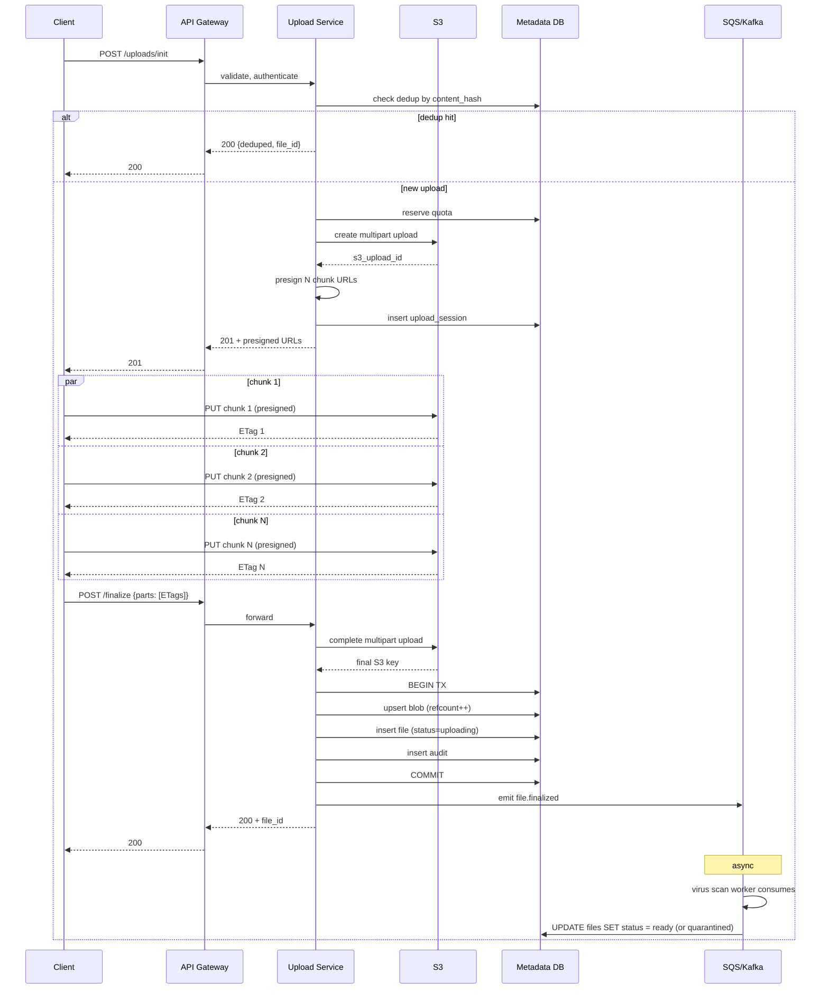
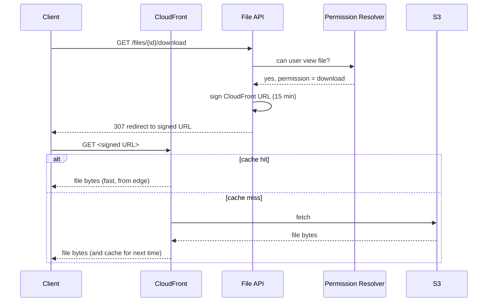
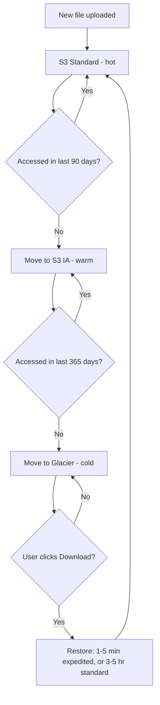

## Solution: File Upload & Share Service

### The short version

This looks like a thin HTTP wrapper around S3. It is not. The interesting design is everything around the bytes:

- **How does a 5 GB upload survive a bad network?** Chunked upload with presigned URLs. Each chunk uploads on its own. Failed chunks retry without restarting the whole file.
- **How do you store the same file once when 50 people upload it?** Content-addressed dedup. Hash the file. Two files with the same hash share one set of bytes.
- **How do you revoke one share link without breaking 999 others?** One row per link in a `share_links` table with a `revoked_at` column. Revoke is one UPDATE.
- **How does a file nobody has touched in two years stop costing money?** S3 lifecycle policy moves it to cheaper tiers (S3 IA after 90 days, Glacier after 365 days).

The data model fits on a napkin. Seven tables: `files`, `file_versions`, `blobs`, `shares`, `share_links`, `upload_sessions`, `audit`. Bytes live in S3, addressed by their content hash. Metadata is sharded by owner because almost every query is "show me my stuff."

Uploads go client-to-S3 directly via presigned URLs. Your app servers never touch the bytes. That one decision saves you an order of magnitude on bandwidth cost.

The scaling story is four stages:

- **Stage 1 (10 users):** one VM, local disk, Postgres.
- **Stage 2 (1k users):** bytes go to S3 via presigned URL.
- **Stage 3 (100k users):** chunked uploads, async virus scan, share link service, CDN, lifecycle to cold tier.
- **Stage 4 (1M users):** regional buckets, sharded metadata, multi-region.

At every stage, build only what just broke.

---

### 1. Clarifying questions, recap

The two most important questions:

- **What is the biggest file size?** Anything above ~100 MB forces chunked or presigned uploads.
- **Sync or share-only?** Sync (Dropbox desktop) is a different problem with delta sync, conflict resolution, and file watchers. Share-only (Google Drive web) is what this design solves.

Everything else (versioning, virus scan, GDPR, quotas) follows from those two answers.

---

### 2. Capacity, in plain numbers

| Scale | Uploads/sec | Downloads/sec | Storage/year | Egress peak |
|-------|-------------|----------------|---------------|--------------|
| 10k users (weekend) | ~0.08 sustained, ~0.25 peak | ~0.8 | ~13 TB | ~100 Mbps |
| 100M users (Dropbox-scale) | ~3,300 sustained, ~10k peak | ~33k sustained, ~100k peak | ~580 PB (after 30% dedup) | ~6.4 Tbps |

Two numbers matter more than throughput:

- **The system is read-heavy by request count, but write-heavy by bytes.** Uploads dominate ingress. CDN absorbs most of the download traffic.
- **Storage cost is the headline expense.** At PB scale, $0.023/GB/month for hot S3 turns into hundreds of millions per year. Lifecycle to cheaper tiers and dedup are survival, not optimization.

The metadata DB is small compared to the object store. 100B file rows at ~500 bytes is ~50 TB. Sharded Postgres handles it easily.

> Why presigned URLs and not upload through your server? Uploading a 5 GB file through your server means: 5 GB in to your server, then 5 GB out to S3. You doubled the bandwidth bill and burned your server's CPU on copying bytes. Presigned URL lets the client upload directly to S3 in one trip. Your server only handles a tiny "give me a URL" request.

---

### 3. The API

Five endpoints carry the whole product. Init an upload, upload chunks (to S3 directly), finalize, create a share link, redeem a share link. Everything else is reading data back.

```
POST /api/v1/uploads/init
Authorization: Bearer <token>

{
  "file_name": "vacation.mp4",
  "size": 1572864000,                 # 1.5 GB
  "mime_type": "video/mp4",
  "content_hash": "sha256:abc123...", # client computes this for dedup
  "parent_folder_id": "fld_xyz",
  "client_idempotency_key": "uuid"    # retry returns same session
}
```

Responses:

| Status | Meaning | Body |
|--------|---------|------|
| 201 Created | New upload session | `{"upload_id": "...", "chunk_size": 8388608, "presigned_urls": [{"part": 1, "url": "..."}, ...]}` |
| 200 OK | Dedup hit. File already exists. No upload needed. | `{"file_id": "...", "deduped": true}` |
| 400 | File too big or invalid | `{"error": "file_too_large", "max_bytes": 5368709120}` |
| 402 | Out of quota | `{"error": "quota_exceeded", "available_bytes": 12345}` |
| 409 | Name conflict at this path | `{"error": "name_conflict"}` |

The client then `PUT`s directly to the presigned S3 URLs. Your server is not in the path. S3 returns an ETag the client must remember.

```
POST /api/v1/uploads/{upload_id}/finalize

{
  "parts": [
    {"part": 1, "etag": "abc"},
    {"part": 2, "etag": "def"}
  ]
}
```

For share links:

```
POST /api/v1/files/{file_id}/share_links
{
  "permission": "download",          # "view" | "download" | "edit"
  "expires_at": "2026-08-01T00:00:00Z",
  "password": "optional",
  "require_account": false,
  "max_redemptions": null
}
```

Returns `{"token": "...", "url": "https://app.example.com/s/<token>"}`.

Redemption is `GET /api/v1/share/{token}` (with an optional password). Returns file metadata plus a short-lived signed download URL.

Direct download is `GET /api/v1/files/{file_id}/download`, which returns a 307 redirect to a signed CloudFront URL valid for 15 minutes.

**Three small but load-bearing choices:**

- **Idempotency on upload init is required.** Mobile clients retry on timeout. Without the key, retries create new sessions and you get half-uploaded orphans everywhere.
- **The dedup hint at init is what makes "I am re-uploading my photo library" instant.** Client computes SHA-256. Server checks if a blob with this hash already exists. If yes, return the existing file_id and skip the upload. The bytes never cross the network.
- **Finalize takes ETags because S3 multipart finalize needs them.** S3 stitches the chunks together based on the part list with ETags. The client tracks these. Your server forwards them.

---

### 4. The data model

Seven tables. The two most interesting:

```sql
-- Files (the user-facing entity).
CREATE TABLE files (
    file_id          UUID PRIMARY KEY,
    owner_id         BIGINT NOT NULL,
    parent_folder_id UUID,
    name             TEXT NOT NULL,
    size_bytes       BIGINT NOT NULL,
    content_hash     BYTEA NOT NULL,           -- SHA-256 of bytes
    current_version  INT NOT NULL DEFAULT 1,
    status           SMALLINT NOT NULL,        -- 1=uploading, 2=ready, 3=quarantined, 4=deleted
    storage_tier     SMALLINT NOT NULL,        -- 1=hot, 2=warm, 3=cold
    created_at       TIMESTAMPTZ NOT NULL DEFAULT NOW(),
    deleted_at       TIMESTAMPTZ
);
CREATE INDEX idx_files_owner  ON files (owner_id, parent_folder_id);
CREATE INDEX idx_files_hash   ON files (content_hash);            -- dedup lookups

-- The dedup table. One row per unique byte sequence.
CREATE TABLE blobs (
    content_hash     BYTEA PRIMARY KEY,
    size_bytes       BIGINT NOT NULL,
    storage_key      TEXT NOT NULL,            -- S3 key /raw/<hash>
    refcount         INT NOT NULL DEFAULT 1,   -- how many files point at this blob
    first_uploaded   TIMESTAMPTZ NOT NULL DEFAULT NOW(),
    storage_tier     SMALLINT NOT NULL DEFAULT 1
);
```

The other five (`file_versions`, `shares`, `share_links`, `upload_sessions`, `audit`) follow the same shape: an ID, a foreign reference, a few state columns, timestamps. `share_links` was shown in question.md Step 5.

**Four choices worth defending out loud:**

**Sharded by `owner_id`.** Almost every query is "list my files in folder X." Co-locating one user's files on one shard makes those queries single-shard. The exception is share lookups (you can be granted access to files owned by anyone). For that, use a separate global index on `shares.granted_to`.

**`content_hash` is a real indexed column.** It enables dedup at insert time. SHA-256 over a few PB of data has astronomically low collision probability. Treat collisions as impossible (and as a corruption signal if one ever appears).

**The `blobs` table is separate from `files`.** A blob is the actual bytes, addressed by hash. A file is a user-named pointer to a blob. Many files can point at one blob. `refcount` tracks how many files reference each blob. When it hits zero, the blob is eligible for deletion (with a grace period for safety).

**`upload_sessions` lives in Postgres, not Redis.** Sessions can live for hours and must survive any cache eviction. Volume is low (one row per in-flight upload).

---

### 5. Core algorithms

The chunked upload state machine is small:

```python
def init_upload(user_id, file_name, size, content_hash, idempotency_key):
    # Idempotency: same key returns same session.
    existing = db.find_session_by_idempotency(user_id, idempotency_key)
    if existing:
        return existing

    # Dedup hint: skip the upload entirely if we already have these bytes.
    if content_hash:
        blob = db.find_blob(content_hash)
        if blob and blob.size_bytes == size:
            file_id = create_file_pointing_at_blob(user_id, file_name, blob)
            return {"deduped": True, "file_id": file_id}

    # Quota check (atomic; see follow-up 2).
    if not reserve_quota(user_id, size):
        raise QuotaExceeded

    # Start S3 multipart upload.
    s3_upload_id = s3.create_multipart_upload(
        bucket="user-data",
        key=f"raw/pending/{uuid4()}"
    )
    chunk_size = 8 * 1024 * 1024
    total_chunks = ceil(size / chunk_size)

    # Generate one presigned URL per chunk.
    presigned_urls = [
        s3.presign_upload_part(s3_upload_id, part_number=i+1, expires_in=3600)
        for i in range(total_chunks)
    ]

    session = db.insert_session(
        user_id=user_id, expected_size=size, expected_hash=content_hash,
        total_chunks=total_chunks, s3_upload_id=s3_upload_id,
        expires_at=now() + 24h
    )
    return {"upload_id": session.id, "chunk_size": chunk_size, "presigned_urls": presigned_urls}


def finalize_upload(upload_id, parts):
    session = db.lock_session(upload_id)
    if session.status != ACTIVE:
        raise AlreadyFinalized
    if len(parts) != session.total_chunks:
        raise MissingChunks

    # Tell S3 to stitch the chunks together.
    result = s3.complete_multipart_upload(session.s3_upload_id, parts)

    # Create blob (or increment refcount if hash already exists).
    blob = db.upsert_blob(session.expected_hash, session.expected_size, result.key)

    # Create the file row pointing at the blob.
    file_id = db.insert_file(session.user_id, session.file_name, blob)

    db.mark_session_finalized(upload_id)
    publish_event("file.finalized", file_id)   # triggers virus scan
    return file_id
```

Share link resolution is the same shape, just simpler: look up the token, check `revoked_at` (410), check `expires_at` (410), check `max_redemptions` (410), verify password if set (401), rate-limit-check, increment redemptions, sign a 15-minute CloudFront URL, return.

The `cloudfront.sign` call produces a signed URL where the signature itself encodes "you may GET this S3 key until time T." CloudFront verifies the signature at request time and returns the file from edge cache or S3.

---

### 6. The architecture, drawn out

Here is the whole picture, small enough to fit one screen.

```
                  +------------------+
   Clients -----> |   CloudFront     |  edge cache for downloads.
   (web, mobile,  |   (CDN)          |  signed URLs for permission.
    desktop)      +---------+--------+
                            |
                            v   (uncached requests)
                  +------------------+
                  |   API Gateway    |  auth, rate limit, WAF
                  |   + WAF          |
                  +---------+--------+
                            |
           +----------------+----------------+
           |                |                |
           v                v                v
   +-------------+   +-------------+  +--------------+
   | Upload      |   | File API    |  | Share Link   |
   | Service     |   | (list,      |  | Resolver     |
   | (init,      |   |  metadata,  |  | (token ->    |
   |  finalize,  |   |  delete,    |  |  file +      |
   |  sessions)  |   |  download)  |  |  perms)      |
   +-----+-------+   +------+------+  +------+-------+
         |                  |                |
         |                  v                |
         |           +------------------+    |
         |           | Permission       |<---+
         |           | Resolver         |   cached "can user X
         |           | (cached)         |   access file Y" checks
         |           +------------------+
         |
         |   presigned PUTs              +-------------------------+
         +-------------------------------+    Object Store (S3)    |
                                         |                         |
         +-------------------------------+  /raw/<hash>            |
         |   signed GETs (CloudFront)    |  /chunks/<upload_id>/<n>|
         |                               |                         |
         v                               |  Lifecycle:             |
   +--------------+                      |   90d -> IA             |
   | Metadata DB  |                      |   365d -> Glacier       |
   | (Postgres,   |                      |                         |
   |  sharded by  |                      +-------------------------+
   |  owner_id)   |
   |              |
   | files,       |
   | blobs,       |
   | shares,      |
   | share_links, |
   | versions,    |
   | audit        |
   +------+-------+
          |
          |  CDC / outbox
          v
   +------------------+
   |   SQS / Kafka    |   topics: file.finalized,
   |                  |           file.deleted,
   |                  |           share.created
   +-----+------+-----+
         |      |
         v      v
   +---------+ +-----------------+
   | Virus   | | Lifecycle       |
   | Scan    | | Manager         |
   | Worker  | | (refcount GC,   |
   | (Clam   | |  tier transitions,|
   |  AV)    | |  abandoned uploads)|
   +---------+ +-----------------+
```

**Five things to notice while reading this:**

- **The Upload Service mints presigned URLs but never touches the bytes.** That single decision is what lets one small pod handle thousands of uploads per second. The bytes go client-to-S3.
- **CloudFront sits in front of S3 for downloads.** Signed URLs respect share-link permissions. Cache TTL is short (60 seconds typical) so revocations propagate fast. Without it, a viral file melts your S3 egress bill.
- **The Permission Resolver is its own service** because it is the hottest read path. "Can user X do Y on file Z?" combines owner check, direct share check, and folder share inheritance. Cache the result for 30 seconds per `(user, file)` pair. Most lookups never touch the DB.
- **Virus scan, lifecycle GC, and audit archival are all downstream of SQS/Kafka.** They are not in the write path. If the scan worker falls behind, uploads still succeed. Downloads of very recent uploads return 425 Too Early until the scan lands.
- **The metadata DB is sharded by `owner_id`.** Cross-shard share lookups go through a separate global index. Bytes are not the problem at scale. Rows are. And rows are split by who owns them.

---

### 7. An upload, drawn end to end

The chunked upload flow looks like this:



**The download flow** is simpler:



**Target latencies, for a sense of scale:**

- Upload init: P99 ~200 ms (dedup lookup is the slow part when cache is cold).
- Finalize: P99 ~500 ms (S3 multipart completion takes a moment).
- Permission resolution: P99 ~50 ms (cached).
- Download cache hit: usually under 30 ms (whatever CloudFront's edge latency is).

---

### 8. Storage tiers (saving money on cold files)

A file uploaded today is hot. A file uploaded two years ago is probably cold. Paying full price for both is wasteful.



The three tiers and what they cost:

| Tier | Cost per GB per month | Retrieval | Retrieval cost |
|------|------------------------|-----------|-----------------|
| **S3 Standard** (hot) | $0.023 | < 100 ms | free |
| **S3 IA** (warm) | $0.0125 | < 100 ms | $0.01/GB retrieved |
| **Glacier** (cold) | $0.0036 | 1-5 min fast, 3-5 hr standard | $0.03/GB + per-request fee |

The S3 lifecycle policy looks like this:

```
Rule: tier-down-by-age
  Apply to: bucket prefix /raw/
  Transition to S3 IA: 90 days after upload
  Transition to S3 Glacier: 365 days after upload
  Expiration: never (we keep files until user deletes)
```

> Why this matters. On 580 PB of cold storage at Glacier prices ($0.0036/GB/month), you pay about $25M/year. At Standard prices ($0.023/GB/month), the same data costs about $160M/year. The lifecycle policy is the difference. It is not a small optimization. It is the business model.

**Three gotchas to mention:**

- **Glacier retrieval latency surprises users.** Standard retrieval takes 3-5 hours. The user clicks Download and waits. Either use Glacier Instant Retrieval (3x cost, sub-second reads) or set explicit expectations: "Restoring. We will email you when ready."
- **Do not tier small files.** S3 IA has a 128 KB minimum object size charge. Tiering a 10 KB file actually costs more. Exclude small files from the lifecycle rule.
- **Cold tier deletes have penalties.** A file deleted in Glacier still incurs the 90-day minimum storage charge. Build this into your trash-bin retention. Soft-delete first. Hard-delete after the regret window.

---

### 9. Scaling journey: 10 to 1M users

The point is: build only what just broke. Name the pain. Add the fix. Do not pre-build.

#### Stage 1: 10 users (weekend project)

One small VM. Files saved to local disk under `/var/data/<user_id>/<file_id>`. Postgres on the same machine. Direct POST upload, files capped at 100 MB. Direct invite sharing only. No anonymous links. No virus scan, no versioning, no quota. About $20/month. Ships in a weekend.

This is enough because you have 10 users and 50 total files ever. Bandwidth is whatever the VM gives you. Nothing is big enough to fail mid-upload.

#### Stage 2: 1,000 users

Something breaks:

- Local disk fills up. One 50 GB user takes the VM into a degraded state.
- Backups are now your problem.
- A user's 2 GB upload drops at 1.8 GB. They have to start over. They complain on Twitter.

Fixes, in order:

- **Move bytes to S3 via presigned PUT URLs.** Your app server is no longer in the byte path.
- **Add anonymous share links.** `share_links` table with 192-bit tokens.
- **Add the view/download/edit permission scopes.**
- **Add per-user quota.** `users.quota_bytes` and `users.used_bytes`.
- **Add soft delete with a 30-day trash bin.** Support stops getting "I deleted by accident" tickets.

Still no chunked upload (presigned PUT handles up to S3's 5 GB single-PUT limit). No virus scan yet (acceptable for trusted early users). No CDN. One DB. Cost ~$100-300/month.

#### Stage 3: 100,000 users

Several things break at once:

- A power user uploads a 4 GB video on hotel WiFi. Fails at 80%. The whole upload restarts. They uninstall the app.
- A malware-laden PDF gets shared and downloaded. You get a security report.
- Storage cost is $3-5k/month and growing 30% per quarter. Most stored bytes are untouched after 30 days.
- `share_links` has 5M rows.
- S3 egress costs $2k/month because every share-link download streams full-cost from S3.

Fixes, in order:

- **Chunked upload via S3 multipart.** Init returns a list of presigned PUT URLs (one per chunk). Client uploads chunks in parallel and retries only failed chunks. Finalize completes the multipart. A flaky 4 GB upload now survives.
- **Virus scan pipeline.** SQS topic `file.finalized` triggers a Lambda invoking ClamAV. Result updates `files.status`. Files are downloadable in the 1-3 minute gap; when the scan flags them, status flips to quarantined and downloads return 451. Document the gap explicitly.
- **Split the Share Link Resolver into its own pod set.** Its own read replica and a small in-process LRU for the hottest tokens.
- **S3 lifecycle policy.** 90 days to IA, 365 to Glacier. Saves ~70% on cold-tier cost.
- **CloudFront in front of S3.** Signed URLs from share links route through it with a 60-second TTL so revocations propagate. Egress drops by an order of magnitude.
- **Two Postgres read replicas.** Dashboards read from replicas. Engine writes go to primary.
- **Atomic quota enforcement** with a reservation pattern (see follow-up 2).
- **Tier the audit log.** Hot 90 days in Postgres. Archive to S3 Parquet after.

Still single-region. The DB does not need sharding yet (100M rows at ~500 bytes is 50 GB, fits one big Postgres). Server-side encryption with S3-managed keys, no client-side yet. Cost ~$10-20k/month.

#### Stage 4: 1 million users (global)

New pains:

- EU users complain about upload latency from Berlin to us-east-1.
- A regulated healthcare customer demands data residency.
- A viral share link gets 1M downloads in 24 hours. CloudFront catches 99% but the 1% concentrates on one S3 prefix and triggers throttling.
- Metadata DB primary at 60% CPU at peak.
- A quota race lets three accounts overflow by 200 GB each.
- A 4-hour S3 outage takes everything dark.

Fixes:

- **Regional S3 buckets per region.** Files land in the user's home region. Lazy cross-region replication only on cross-region share access.
- **Shard metadata DB by `owner_id`.** Multi-region. Each region is primary for its own users. Global directory maps `file_id` to home region.
- **Share links are global.** The token's first few characters encode the home region of the file so any region routes correctly.
- **CloudFront with multiple origins per region.** Viral files get hash-prefix-sharded S3 keys so one prefix is never a bottleneck.
- **Per-user quota in Redis** with `INCRBY` reservations and periodic reconciliation against the DB. Resolves the overflow race.
- **Per-tenant KMS keys** for enterprise customers (customer-controlled kill switch).
- **Metadata replicas in two regions** for cross-region failover.

Even at 1M users you peak at ~10 uploads/sec and ~100 downloads/sec (most absorbed by CDN). The system is large in bytes and organizational complexity, not in QPS. The architecture is the same shape as Stage 3, multiplied across regions with isolation boundaries. Cost ~$200-500k/month, dominated by S3 storage and egress.

---

### 10. Reliability

**Interrupted upload resume.** Upload sessions live 24 hours in `upload_sessions`. Client calls `GET /uploads/{upload_id}` to ask "which chunks have you got?" Server queries S3 `ListParts` and returns the part numbers already uploaded. Client re-uploads only the missing parts. After 24 hours, the session expires and the abandoned S3 multipart is aborted by the Lifecycle Manager (S3 charges for in-flight parts until aborted).

**Orphan chunks.** Lifecycle Manager runs every 6 hours. For each session with `status=active AND expires_at < now()`, call `s3.abort_multipart_upload(s3_upload_id)` and mark the session abandoned. Safety net: a global S3 lifecycle rule aborts any multipart older than 7 days.

**Virus scan failures.** Three flavors:

- Scan worker dies mid-scan. SQS visibility timeout expires. Another worker picks up the message. Scan result is the same. Idempotent.
- Third-party scan API is down. Worker retries with backoff. If down over an hour, escalate to a human queue. Files remain `status=uploading`. Downloads return 425 Too Early.
- Scan finds a virus after the file has been downloaded. Flip `status=quarantined`. Set `revoked_at` on all share links pointing at the file. Audit log captures everything. Notify any authenticated downloaders.

**Metadata DB primary failure.** Standard Postgres failover. Promote a replica. Reads continue from other replicas during the 30-60 second promotion. In-flight upload sessions see a few errors and retry.

**S3 outage.** The hardest one. If the region's S3 is down, presigned PUTs return 5xx, signed GETs return 5xx, CloudFront serves whatever it has cached. Metadata operations still work. Honest answer: wait for S3 to recover. Multi-region replication helps for reads but is expensive and only justified for high-availability tiers.

---

### 11. Observability

| Metric | Why it matters |
|--------|----------------|
| `upload.init.rate` | Sudden drop signals auth or API issues. |
| `upload.success_rate` (finalize/init) | Headline UX SLO. If 60% of inits never finalize, something is broken. |
| `upload.duration` by file size bucket | Tells you "uploads are slow" from "uploads of 1 GB+ files are slow." |
| `download.cache_hit_rate` (CDN) | Should be > 95% in steady state. |
| `share_link.resolution.p99` | Hot path latency. |
| `share_link.brute_force_alerts` | Tokens with > 50 failed redemption attempts in an hour. |
| `quota.exceeded.rate` | Spikes signal a user or integration gone rogue. |
| `virus_scan.queue_depth` | If growing, scanner cannot keep up. Downloads of recent uploads risk exposure. |
| `virus_scan.positive_rate` | Sudden spike means a malware campaign. |
| `blob.refcount.zero.count` | Eligible-for-GC blobs. Should drain. |
| `storage.by_tier.bytes` | Hot/warm/cold breakdown. Cost forecasting input. |
| `egress.bytes_per_region` | Where the money goes. |

**Page on:** upload success rate under 90% for 5 min. Virus scan queue depth over 10k. CDN origin error rate over 1%.

**Ticket on:** per-user bandwidth anomaly. Quota race detected. Storage growth more than 2-sigma above forecast.

---

### 12. Follow-up answers

**1. Resumable upload across days.**

The client persists `upload_id` locally. On reopen, it calls `GET /uploads/{upload_id}`. Server queries S3 `ListParts`, returns the list of uploaded part numbers and the original chunk size. Client uploads only the missing parts and finalizes. If `upload_id` is past the 24-hour TTL, the client gets 410 Gone and must start over. Abandoned sessions get GC'd every 6 hours by the Lifecycle Manager calling `AbortMultipartUpload` on S3.

**2. Quota race.**

Common and real. Fix with an explicit reservation column:

```sql
UPDATE users
SET reserved_bytes = reserved_bytes + ?
WHERE user_id = ?
  AND used_bytes + reserved_bytes + ? <= quota_bytes
RETURNING reserved_bytes;
```

If this returns 0 rows, the upload is rejected. Reservation is held until finalize (moves to `used_bytes`) or session expiry (released). At higher scale, run the same logic in Redis with `INCRBY` and CAS, with periodic reconciliation back to the DB.

**3. Content-addressed dedup.**

A `blobs` table keyed by SHA-256. On finalize:

```sql
INSERT INTO blobs (content_hash, size_bytes, storage_key, refcount)
VALUES (?, ?, ?, 1)
ON CONFLICT (content_hash) DO UPDATE SET refcount = blobs.refcount + 1;
```

The S3 key is `/raw/<hash>`. If the blob exists, no new S3 object is written. The `files` row points at the blob.

Delete decrements the blob's refcount atomically. When refcount hits zero, schedule the blob's S3 object for deletion after a 24-hour grace period (in case a new file is created with the same hash).

Privacy: dedup can leak existence. If you upload a file and it dedups instantly, you have confirmed someone else has the same content. For sensitive use cases (legal, medical), disable cross-tenant dedup. Dedup only within a single account.

**4. Share link enumeration.**

192 bits of entropy makes direct brute force impossible. Side channels are the real concern:

- **Timing.** Token-not-found vs token-found-but-expired should take the same time. Use constant-time comparison and unified error paths.
- **Error responses.** Return the same generic 404 for "no such token" and "expired." Do not include `expired_at` in unauthenticated responses.
- **Predictable creation timestamps.** Pure-random tokens from `secrets.token_bytes` leak nothing. The token has no relationship to creation time.
- **Rate limiting.** Per-IP limits on `/share/*` thwart high-volume probing.
- **Web logs.** Tokens appear in access logs. Treat them as secrets. Scrub from logs or hash before logging.

**5. Large delete tombstone backlog.**

A 10 TB delete triggers 200k file row updates and 200k S3 DELETE requests. Synchronously: HTTP timeout, DB lock contention, S3 throttling, user clicks Delete again, double the load.

The fix: write a single `deletion_jobs` row `(user_id, target_folder_id, requested_at)` and return 202 Accepted with a job_id. A background worker processes the job in batches of 1000:

- Soft-delete in DB (status flip + `deleted_at`).
- Decrement blob refcounts.
- Enqueue S3 deletion (S3 bulk-delete handles 1000 objects per call).

UI shows "deletion in progress." Items disappear from listings immediately (filtered by status). After 30 days (trash retention), a sweeper hard-deletes the blobs whose refcount reached zero.

**6. Late-positive virus scan.**

Incident response, in order:

- Flip `status` to quarantined.
- `UPDATE share_links SET revoked_at = NOW() WHERE file_id = ?`.
- Invalidate CloudFront for the file's signed URL prefix.
- Query the `audit` table for `event_type = 'file.downloaded' AND file_id = ?` to identify downloaders (user_ids for authenticated, IPs for anonymous share-link).
- Notify authenticated downloaders in-app and by email: "A file you downloaded was later found to contain malware. We recommend you scan your system."
- Anonymous downloaders cannot be notified directly, but the share link itself now displays a warning.
- Notify the uploader: "Your file was flagged. If this was a mistake, request a rescan."

Pre-mitigation: keep the post-finalize, pre-scan window short. Faster scanning narrows the exposure.

**7. Edit conflict.**

Two users with Edit upload new versions within 10 seconds. Default: both succeed, both create new versions. `file_versions` has rows `version=2` (first to land) and `version=3` (second). `files.current_version` points to version 3. The losing user's version still exists in history.

Surface a conflict notification: "User B also uploaded a new version at the same time. Your version is current. Theirs is at /history/version/2."

For stronger guarantees, accept an optional `If-Match: <current_version>` header on upload. Mismatch returns 412 Precondition Failed and the client surfaces a conflict UI.

**8. Viral file.**

200 MB video, 1M downloads in 24 h, 99% CDN cache hit. The 1% miss is 10k requests to origin S3 over 24 h, about 0.1 req/sec on average. Fine for S3 overall. The concern is **prefix throttling**: S3 limits requests per prefix to 5500 GET/s. If all those requests hit one prefix at one moment, you get 503s.

Mitigations:

- **Pre-warm CDN edges** when a link is created with a known-popular file (push to all CloudFront edges immediately rather than waiting for first-miss).
- **Spread the prefix.** Store blobs at `/raw/<hash[0:2]>/<hash[2:4]>/<hash>` so popular files land on different prefixes naturally.
- **CloudFront origin shield.** A regional cache between edges and S3, collapsing many edge misses into one S3 fetch.
- **Multi-CDN** for enterprise tier (CloudFront plus Fastly plus Akamai) for resilience.

**9. GDPR delete.**

Multi-step process for a user with 12,000 files.

- `UPDATE users SET deletion_requested_at = NOW(), status = 'deleting'`. User is logged out and account frozen read-only.
- Enqueue a `deletion_jobs` row for background processing.
- Walk owned files: decrement each blob's refcount, update audit, revoke all share links the user created.
- Walk received shares: set `revoked_at` where the user is `granted_to`. (The user loses access. The file itself remains for the owner.)
- Walk audit log: replace `actor_id` with a hash. Drop PII from payloads.
- Delete the user row after the grace period (often 30 days).
- Email the deletion certificate.

The tricky part: files deduped with other users. Decrementing the refcount may leave the blob alive because other users still reference it. That is correct. The user's pointer is gone, even though the bytes might persist (referenced by someone else).

If the user demands the bytes be deleted regardless: disable dedup for that user retroactively. Copy the blob to a user-private location for any remaining references, then delete the original. Expensive. Only do on explicit request.

**10. Per-tenant cost attribution.**

Every billable action gets tagged with `tenant_id`:

- **Storage:** S3 inventory runs daily, lists all objects with size and tier. Each object's key embeds `tenant_id` (`/raw/<tenant>/<hash>`). Aggregate by tenant.
- **Egress:** CloudFront real-time logs include the request URL. URLs encode tenant_id. Daily job aggregates bytes-out per tenant.
- **API requests:** API Gateway access logs include the JWT's `tenant_id` claim. Aggregate per tenant per endpoint.
- **Virus scan API costs:** Scan worker records each scan in a `scan_invocations` table with `tenant_id`.

A nightly job rolls these into a `billing_lines` table:

```
tenant_id | period | storage_hot_gb | storage_warm_gb | storage_cold_gb |
          | egress_gb | api_requests | scan_calls
```

Invoice generation reads this table. Spot-check: the sum of per-tenant attributions should match your AWS bill within ~1%. Gaps are platform overhead, S3 inventory itself, etc.

---

### 13. Trade-offs worth saying out loud

**Single big PUT vs chunked.** Single PUT is simpler for files under 100 MB and works in every HTTP client. Chunked is necessary above 5 GB (S3's single-PUT limit) and strongly recommended above 100 MB for network resilience. Right answer: hybrid. Single PUT below a threshold, chunked above.

**Client-side encryption.** Optional but important for high-security customers. Encrypt with a key the server never sees. Tradeoffs: no dedup possible (ciphertext differs even for identical plaintext), no server-side preview (cannot render an encrypted PDF), key management burden is now the customer's. Implement as opt-in for enterprise tier.

**Dedup by content hash.** Saves ~30% on storage at consumer scale, less in business contexts. Adds complexity: refcount management, GC, blob lifecycle, privacy. Worth it at scale. Skip for the first 1000 users.

**Lifecycle to cold tier.** Saves 50-70% of storage cost on the cold tail. Costs: retrieval latency surprises users, retrieval fees on access, minimum-storage-duration penalties on early delete. Tune the transition age to your actual access pattern. Default 90 days is sometimes too aggressive (some files are bursty re-accessed in week 5).

**Postgres vs DynamoDB for metadata.** Postgres gives you joins, transactions, and a familiar query layer. DynamoDB gives you infinite horizontal scale and predictable latency. For metadata under 100M files, Postgres is simpler. Above that, sharding Postgres becomes annoying and DynamoDB is worth considering. Do not switch preemptively.

**Sync vs async virus scan.** Sync blocks the upload UX (a 2 GB file's scan takes minutes) but guarantees zero exposure. Async returns immediately and accepts a 1-3 minute exposure window. Almost everyone picks async. The exposure is small, the UX win is large.

---

### 14. Common mistakes

Most weak answers fall into one of these:

**Tunneling uploads through your app server.** The single biggest scaling mistake. Bandwidth cost is per-byte. Doubling traffic doubles your NIC bill. Presigned-direct-to-S3 is non-negotiable above ~100 concurrent uploads.

**Single POST for all uploads.** Works until the first 4 GB upload fails on hotel WiFi. Chunked is mandatory above ~100 MB.

**No quota enforcement at all.** "We will add it later" turns into "one user uploaded their Steam library and ate our budget." Quota at signup is easier than quota retrofitted.

**Forgetting to GC abandoned uploads.** S3 multipart uploads that never finalized continue to cost money. A nightly sweeper catches them. An S3 lifecycle rule that aborts multiparts older than 7 days is the safety net.

**Share links that are just file IDs in the URL.** `https://app.com/file/abc123` is not a share link. It is a permanent backdoor. Use an opaque high-entropy token with explicit expiry and revocation.

**No virus scan at all.** Fine for an internal tool. Indefensible for a public product. Even basic ClamAV catches most known malware.

**Hot path doing folder traversal for permissions.** "Is this file in any folder shared with me?" walked on every download is slow. Cache or materialize the access set per user.

**Skipping the `status` field.** Without an explicit upload/ready/quarantined/deleted state machine, you end up with weird edge cases (downloads of half-finalized files, deletes of in-flight uploads). The `files.status` smallint pays for itself in week 1.

**Mixing user files and system files in one bucket without prefixing.** Lifecycle rules apply per bucket or prefix. If you mix, you cannot tier user files independently of thumbnails or temp data. Pick a prefix scheme on day one.

**No audit log.** When the security report comes in ("user X claims their file was leaked"), the lack of "who accessed this and when" turns a 1-hour investigation into a 1-week investigation. Audit is cheap to build, painful to retrofit.

If you can hit 7 of these 10 and walk through the upload-protocol trade-off and the scaling journey in the same conversation, you are interviewing well above the bar.
